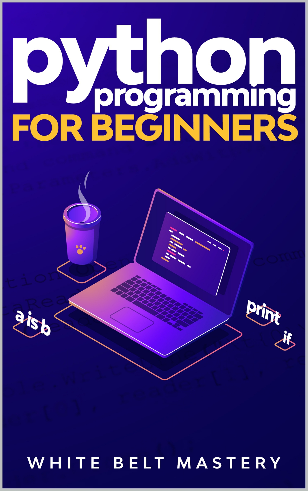

 
 

----

 
 
 
<h1> Python Programming For Beginners
 
 
Learn Python in a step by step approach, Complete practical crash course to learn Python coding
 
 
 
By Mastery, White Belt
 
 
 
</h1>  

 
 

> 
> <h3>Table of Content</h3>
> 

### [Chapter 1: Introduction to Python](#text00002.html#1)
- [1.1. What is python?](#text00002.html#1.1)
  - [1.1.1. Why we need it?](#text00002.html#1.1.1)
    - [1.1.1.1. Software](#text00002.html#1.1.1.1)
  - [1.2. Beginning with Python programming](#text00002.html#1.2)
    - [1.2.1. Complier](#text00002.html#1.2.1)
    - [1.2.2. Interpreter](#text00002.html#1.2.2)
    - [1.2.3. Python reserved words](#text00002.html#1.2.3)

### [Chapter 2 : Print](#text00002.html#2)
- [2.1. Integer](#text00002.html#2.3)
- [2.2. String](#text00002.html#2.2)
- [2.3. Float](#text00002.html#2.3)

### [Chapter 3: Variable](#text00003.html#3)
- [3.1. Rules for naming a variable](#text00003.html#3.1)
- [3.2. Storing string in a variable](#text00003.html#3.2)
  - [3.2.1. Concatenate](#text00003.html#3.2.1)
- [3.3. Storing float in a variable](#text00003.html#3.3)
  - [3.3.1. Adding value to the variable](#text00003.html#3.3.1)
- [3.4. Storing integer in a variable](#text00003.html#3.4)
  - [3.4.1. Overwrite](#text00003.html#3.4.1)
  - [3.4.2. Adding any number](#text00003.html#3.4.2)

### [Chapter 4: Math Expressions](#text00003.html#4)
- [4.1. Arithmetic operator](#text00003.html#4.1)
  - [4.1.1. Familiar Arithmetic operators](#text00003.html#4.1.1)
  - [4.1.2. Removing ambiguity](#text00003.html#4.1.2)
  - [4.1.3. Unfamiliar Arithmetic operator](#text00003.html#4.1.3)
    - [4.1.3.1. Floor division](#text00003.html#4.1.3.1)
    - [4.1.3.2. Modulus](#text00003.html#4.1.3.2)
    - [4.1.3.3. Exponentiation](#text00003.html#4.1.3.3)
- [4.2. Assignment operators](#text00003.html#4.2)
- [4.3. Bitwise Operators](#text00003.html#4.3)
- [4.4. Comparison operators](#text00003.html#4.4)
- [4.5. Logical operators](#text00003.html#4.5)
- [4.6. Identity Operator](#text00003.html#4.6)
- [4.7. Membership Operators](#text00003.html#4.7)

### [Chapter 5: User Input](#text00004.html#5)
- [5.1. User Input as a variable](#text00004.html#5.1)
- [5.2. Type casting](#text00004.html#5.2)
  - [5.2.1. String to integer](#text00004.html#5.2.1)
  - [5.2.2. Integer to string](#text00004.html#5.2.2)
  - [5.2.3. Integer to float](#text00004.html#5.2.3)

### [Chapter 6: Condition Statements](#text00005.html#6)
- [6.1. If statement](#text00005.html#6.1)
- [6.2. If-else statement](#text00005.html#6.2)
  - [6.2.1. Minimal line code](#text00006.html#6.2.1)
- [6.3. The elif Statement](#text00006.html#6.3)
- [6.4. Nested if else statement](#text00006.html#6.4)

### [Chapter 7: Comments](#text00007.html#7)
- [7.1. Types of comments](#text00007.html#7.1)
  - [7.1.1. Single Line Comment](#text00007.html#7.1.1)
  - [7.1.2. Multiple Line/Paragraph Comment](#text00007.html#7.1.2)

### [Chapter 8: Lists](#text00008.html#8)
- [8.1. Common List Operations](#text00008.html#8.1)
  - [8.1.1. Accessing value from a list](#text00008.html#8.1.1)
  - [8.1.2. Slicing the elements from list](#text00008.html#8.1.2)
  - [8.1.3. Adding](#text00008.html#8.1.3)
    - [8.1.3.1. Adding an item to list](#text00008.html#8.1.3.1)
    - [8.1.3.2. Adding multiple values to list](#text00008.html#8.1.3.2)
  - [8.1.4. Finding the index](#text00008.html#8.1.4)
  - [8.1.5. Deleting item of the list](#text00008.html#8.1.5)
  - [8.1.6. Popping elements](#text00008.html#8.1.6)
  - [8.1.7. Sorting the items](#text00008.html#8.1.7)

### [Chapter 9: TUPLE](#text00009.html#9)
- [9.1. Creating a tuple](#text00009.html#9.1)
  - [9.1.1. Accessing elements](#text00009.html#9.1.1)
  - [9.1.2. Slicing in tuple](#text00009.html#9.1.2)
  - [9.1.2. Different operations on tuple](#text00009.html#9.1.2)
- [9.2. Converting tuple into list](#text00009.html#9.2)

### [Chapter 10: Dictionary in Python](#text00010.html#10)
- [10.1. Data type of key and value](#text00010.html#10.1)
- [10.2. Construct a dictionary](#text00010.html#10.2)
- [10.3. Accessing information from Dictionary](#text00010.html#10.3)
- [10.4. Length of dictionary](#text00010.html#10.4)
- [10.5. Adding a new key to existing dictionary](#text00010.html#10.5)
- [10.6. Updating a key value](#text00010.html#10.6)
- [10.7. Removing information from Dictionary](#text00010.html#10.7)
- [10.8. Checking the key in the dictionary](#text00010.html#10.8)
- [10.9. Iterating over information Dictionary](#text00010.html#10.9)
  - [10.9.1. Accessing Keys of the dictionary](#text00010.html#10.9.1)
  - [10.9.2. Accessing Values of the dictionary](#text00010.html#10.9.2)
  - [10.9.3. Accessing pairs of the dictionary](#text00010.html#10.9.3)
- [10.10. Sorting the dictionary](#text00010.html#10.10)
- [10.11. What you can store in Dictionary](#text00010.html#10.11)
  - [10.11.1. List in Dictionary](#text00010.html#10.11.1)
    - [10.11.1.1. Using Subscript](#text00010.html#10.11.1.1)
    - [10.11.1.2. Adding list as value using append() method](#text00010.html#10.11.1.2)
    - [10.11.1.3. Using set default() method](#text00010.html#10.11.1.3)
    - [10.11.1.4. Using list comprehension](#text00010.html#10.11.1.4)
    - [10.11.1.5. Using defaultdict](#text00010.html#10.11.1.5)
    - [10.11.1.6. Using Json](#text00010.html#10.11.1.6)
    - [10.11.1.7. Accessing Values from the Dictionary of list](#text00010.html#10.11.1.7)
  - [10.11.2. Dictionary in a List](#text00010.html#10.11.2)
    - [10.11.2.1. Accessing information from dictionary in list](#text00010.html#10.11.2.1)
  - [10.11.3. Dictionary in a dictionary](#text00010.html#10.11.3)
    - [10.11.3.1. Accessing values of dictionary in dictionary](#text00010.html#10.11.3.1)

### [Chapter 11: Loops](#text00011.html#11)
- [11.1. For Loop](#text00011.html#11.1)
  - [11.1.1. Break](#text00011.html#11.1.1)
  - [11.1.2. Continue](#text00011.html#11.1.2)
  - [11.1.3. For loop on a variable](#text00011.html#11.1.3)
  - [11.1.4. For loop on a tuple](#text00011.html#11.1.4)
  - [11.1.5 For loop on User defined input](#text00011.html#11.1.5)
  - [11.1.6. Nested for loop](#text00011.html#11.1.6)
- [11.2. While loop](#text00011.html#11.2)
  - [11.2.1. The Break Statement](#text00011.html#11.2.1)
  - [11.2.2. The Continue Statement](#text00011.html#11.2.2)
  - [11.2.3. The Else Statement](#text00011.html#11.2.3)

### [Chapter 12: Changing Case](#text00012.html#12)
- [12.1. The function upper](#text00012.html#12.1)
- [12.2. The function lower](#text00012.html#12.2)
- [12.3. The function title](#text00012.html#12.3)

### [Chapter 13: Functions](#text00013.html#13)
- [13.1. Parameter less function](#text00013.html#13.1)
  - [13.1.1. User-defined functions](#text00013.html#13.1.1)
- [13.2. Parameterize function](#text00013.html#13.2)
  - [13.2.1. Passing information positional argument](#text00013.html#13.2.1)
  - [13.2.3. Args](#text00013.html#13.2.3)
  - [13.2.4. Default value parameter](#text00013.html#13.2.4)
  - [13.2.5. Passing information back from them](#text00013.html#13.2.5)
  - [13.2.6. Return multiple values](#text00013.html#13.2.6)
- [13.3. Using function as variables](#text00013.html#13.3)
  - [13.3.1. Local and global variables](#text00013.html#13.3.1)
    - [13.3.1.1. Local variable](#text00013.html#13.3.1.1)
    - [13.3.1.2. Global variable](#text00013.html#13.3.1.2)
  - [13.4. Function within function](#text00013.html#13.4)

### [Chapter 14: Classes](#text00014.html#14)
- [14.1. Introduction](#text00014.html#14.1)
- [14.2. Variable in the class](#text00014.html#14.2)
- [14.3. Objects](#text00014.html#14.3)
  - [14.3.1. Creating objects for class](#text00014.html#14.3.1)
  - [14.3.2. Multiple attributes](#text00014.html#14.3.2)
  - [14.3.3. Building functions within the classes](#text00014.html#14.3.3)
    - [14.3.3.1. Calling a function](#text00014.html#14.3.3.1)
  - [14.3.4. Accessing values from the instance](#text00014.html#14.3.4)
  - [14.3.5. Adding an attribute value to a class](#text00014.html#14.3.5)
  - [14.3.6. Deleting an attribute value of a class](#text00014.html#14.3.6)
  - [14.3.7. Checking an attribute value of a class](#text00014.html#14.3.7)
  - [14.3.8. Changing an attribute value of a class](#text00014.html#14.3.8)
  - [14.3.9. Default attributes](#text00014.html#14.3.9)
- [14.4. Class Inheritance](#text00014.html#14.4)
  - [14.4.1. Single Inheritance](#text00014.html#14.4.1)
  - [14.4.2. Multiple Inheritance](#text00014.html#14.4.2)
  - [14.4.3. Multilevel Inheritance](#text00014.html#14.4.3)
  - [14.4.4. Hierarchical Inheritance](#text00014.html#14.4.4)
  - [14.4.5. Hybrid Inheritance](#text00014.html#14.4.5)
- [14.5 Encapsulation](#text00014.html#14.5)
  - [14.5.1. Accessing private members](#text00014.html#14.5.1)
- [14.6. Polymorphism](#text00014.html#14.6)
  - [14.6.1. Polymorphism with functions and objects](#text00014.html#14.6.1)
  - [14.6.2. Polymorphism with Class Methods](#text00014.html#14.6.2)
  - [14.6.3. Polymorphism with Inheritance](#text00014.html#14.6.3)
    - [14.6.3.1. Method Overriding](#text00014.html#14.6.3.1)
- [14.7. Overloading Operators](#text00014.html#14.7)

### [Chapter 15: Data Files](#text00015.html#15)
- [15.1. Reading and Writing in an external file from Python code](#text00015.html#15.1)
  - [15.1.1. Writing to a text file](#text00015.html#15.1.1)
  - [15.1.2. Reading from the text file](#text00015.html#15.1.2)
  - [15.1.3. Writing in append mode](#text00015.html#15.1.3)
  - [15.1.4. w+ mode](#text00015.html#15.1.4)
  - [15.1.5. r+ mode](#text00015.html#15.1.5)
  - [15.1.6. a+ mode](#text00015.html#15.1.6)

 
 

---

 
 

