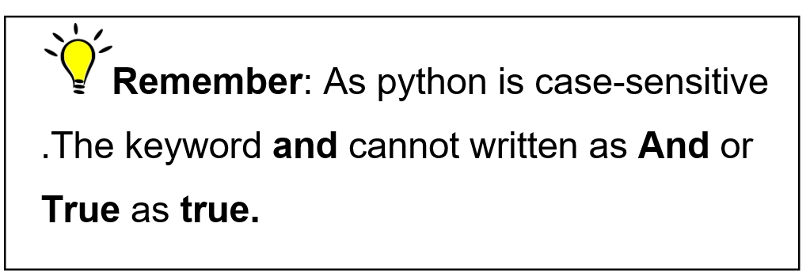
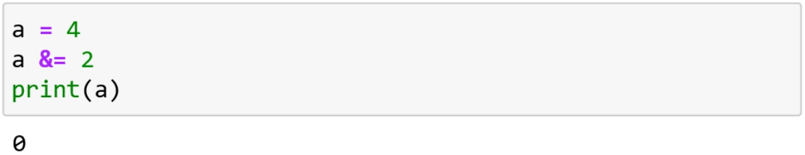
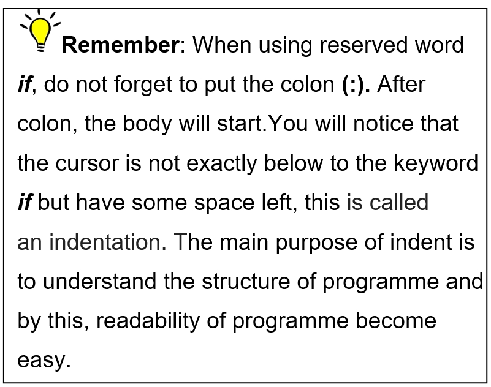
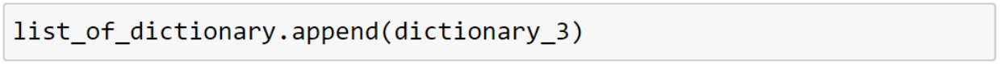
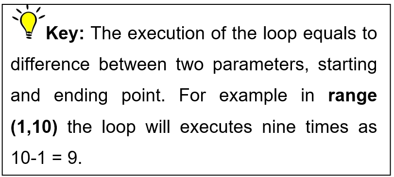
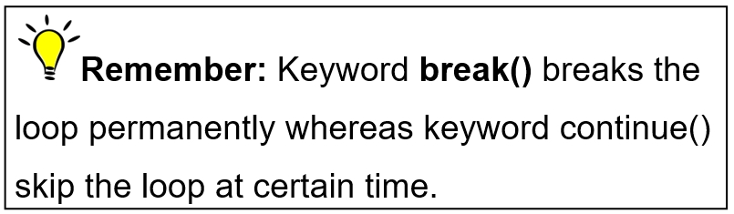
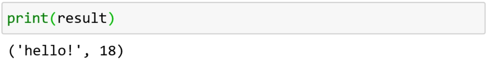
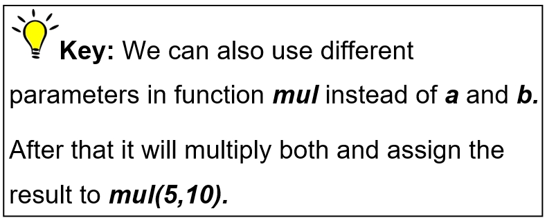
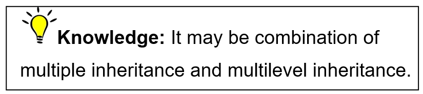
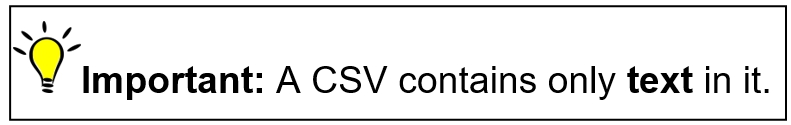

<svg xlink="http://www.w3.org/1999/xlink" xmlns="http://www.w3.org/2000/svg" height="100%" preserveaspectratio="xMidYMid meet" version="1.1" viewbox="0 0 1207 1920" width="100%">
<image height="1920" width="1207" href="Image00000.jpg"></image>
</svg>

Python Programming

For beginners

[Chapter 1: Introduction to Python](#text00002.html#a4MS){.class_s4UP}

[1.1 What is python?](#text00002.html#a4MT){.class_s4UD-0}

[1.1.1 Why we need it?](#text00002.html#a4MU){.class_s4UD-0}

[1.1.1.1 Software](#text00002.html#a4VC){.class_s4UD-0}

[1.2 Beginning with Python
programming](#text00002.html#a4MV){.class_s4UD-0}

[1.2.1 Complier](#text00002.html#a4MW){.class_s4UD-0}

[1.2.2 Interpreter](#text00002.html#a4MX){.class_s4UD-0}

[1.2.3 Python reserved words](#text00002.html#a4MY){.class_s4UD-0}

[Chapter 2 : Print](#text00002.html#a4MZ){.class_s4UP}

[2.1 Integer](#text00002.html#a4N0){.class_s4UD-0}

[2.2 String](#text00002.html#a4N1){.class_s4UD-0}

[2.3 Float](#text00002.html#a4N2){.class_s4UD-0}

[Chapter 3 : Variable](#text00003.html#a4N3){.class_s4UP}

[3.1 Rules for naming a variable](#text00003.html#a4N4){.class_s4UD-0}

[3.2 Storing string in a variable:](#text00003.html#a4N5){.class_s4UD-0}

[3.2.1 Concatenate](#text00003.html#a4N6){.class_s4UD-0}

[3.3 Storing float in a variable](#text00003.html#a4N8){.class_s4UD-0}

[3.3.1 Adding value to the
variable](#text00003.html#a4N9){.class_s4UD-0}

[3.4 Storing integer in a variable](#text00003.html#a4NA){.class_s4UD-0}

[3.4.1 Overwrite](#text00003.html#a4NB){.class_s4UD-0}

[3.4.2 Adding any number](#text00003.html#a4NC){.class_s4UD-0}

[Chapter 4 : Math Expressions](#text00003.html#a4ND){.class_s4UP}

[4.1 Arithmetic operator](#text00003.html#a4NE){.class_s4UD-0}

[4.1.1 Familiar Arithmetic
operators](#text00003.html#a4NF)

[4.1.2 Removing ambiguity](#text00003.html#a4NG){.class_s4UD-0}

[4.1.3 Unfamiliar Arithmetic
operator](#text00003.html#a4NH)

[4.1.3.1 Floor division](#text00003.html#a4V3){.class_s4UD-0}

[4.1.3.2 Modulus](#text00003.html#a4VW){.class_s4UD-0}

[4.1.3.3 Exponentiation](#text00003.html#a4VE){.class_s4UD-0}

[4.2 Assignment operators](#text00003.html#a4NJ){.class_s4UD-0}

[4.3 Bitwise Operators](#text00003.html#a4NK){.class_s4UD-0}

[4.4 Comparison operators](#text00003.html#a4NM){.class_s4UD-0}

[4.5 Logical operators](#text00003.html#a4NN){.class_s4UD-0}

[We have three logic operators as describes in the following
table:](#text00003.html#a4NP){.class_s4UD-0}

[4.6 Identity Operator](#text00003.html#a4NR){.class_s4UD-0}

[4.7 Membership Operators](#text00003.html#a4NS){.class_s4UD-0}

[Chapter 5 : User Input](#text00004.html#a4NT){.class_s4UP}

[5.1 User Input as a variable](#text00004.html#a4NU){.class_s4UD-0}

[5.2 Type casting](#text00004.html#a4NV){.class_s4UD-0}

[5.2.1 String to integer](#text00004.html#a4NW){.class_s4UD-0}

[5.2.2 Integer to string](#text00004.html#a4NX){.class_s4UD-0}

[5.2.3 Integer to float](#text00004.html#a4NY){.class_s4UD-0}

[Chapter 6 : Condition Statements](#text00005.html#a4NZ){.class_s4UP}

[6.1 If statement](#text00005.html#a4P0){.class_s4UD-0}

[6.2 If-else statement](#text00005.html#a4P1){.class_s4UD-0}

[6.2.1 Minimal line code](#text00006.html#a4P3){.class_s4UD-0}

[6.3 The elif Statement](#text00006.html#a4P4){.class_s4UD-0}

[6.4 Nested if else statement](#text00006.html#a4P5){.class_s4UD-0}

[Chapter 7 : Comments](#text00007.html#a4P6){.class_s4UP}

[7.1 Types of comments](#text00007.html#a4P7){.class_s4UD-0}

[7.1.1 Single Line Comment](#text00007.html#a4P8){.class_s4UD-0}

[7.1.2 Multiple Line/Paragraph
Comment](#text00007.html#a4P9){.class_s4UD-0}

[Chapter 8 : Lists](#text00008.html#a4PA){.class_s4UP}

[8.1 Common List Operations](#text00008.html#a4PB){.class_s4UD-0}

[8.1.1 Accessing value from a list](#text00008.html#a4PC){.class_s4UD-0}

[8.1.2 Slicing the elements from
list](#text00008.html#a4PD){.class_s4UD-0}

[8.1.3 Adding](#text00008.html#a4PE){.class_s4UD-0}

[8.1.3.1 Adding an item to list](#text00008.html#a4VA){.class_s4UD-0}

[8.1.3.2 Adding multiple values to
list](#text00008.html#a4VR){.class_s4UD-0}

[8.1.4 Finding the index](#text00008.html#a4PF){.class_s4UD-0}

[8.1.5 Deleting item of the list](#text00008.html#a4PG){.class_s4UD-0}

[8.1.6 Popping elements](#text00008.html#a4PH){.class_s4UD-0}

[8.1.7 Sorting the items](#text00008.html#a4PJ){.class_s4UD-0}

[Chapter 9 : TUPLE](#text00009.html#a4PK){.class_s4UP}

[9.1 Creating a tuple](#text00009.html#a4PM){.class_s4UD-0}

[9.1.1 Accessing elements](#text00009.html#a4PN){.class_s4UD-0}

[9.1.2 Slicing in tuple](#text00009.html#a4PP){.class_s4UD-0}

[9.1.2 Different operations on
tuple](#text00009.html#a4PR){.class_s4UD-0}

[9.2 Converting tuple into list](#text00009.html#a4PS){.class_s4UD-0}

[Chapter 10 : Dictionary in Python](#text00010.html#a4PT){.class_s4UP}

[10.1 Data type of key and value](#text00010.html#a4PU){.class_s4UD-0}

[10.2 Construct a dictionary](#text00010.html#a4PV){.class_s4UD-0}

[10.3 Accessing information from
Dictionary](#text00010.html#a4PW){.class_s4UD-0}

[10.4 Length of dictionary](#text00010.html#a4PX){.class_s4UD-0}

[10.5 Adding a new key to existing
dictionary](#text00010.html#a4PY){.class_s4UD-0}

[10.6 Updating a key value](#text00010.html#a4R0){.class_s4UD-0}

[10.7 Removing information from
Dictionary](#text00010.html#a4R2){.class_s4UD-0}

[10.8 Checking the key in the
dictionary](#text00010.html#a4R3){.class_s4UD-0}

[10.9 Iterating over information
Dictionary](#text00010.html#a4R4){.class_s4UD-0}

[10.9.1 Accessing Keys of the
dictionary](#text00010.html#a4R5){.class_s4UD-0}

[10.9.2 Accessing Values of the
dictionary](#text00010.html#a4R6){.class_s4UD-0}

[10.9.3 Accessing pairs of the
dictionary](#text00010.html#a4R7){.class_s4UD-0}

[10.10 Sorting the dictionary](#text00010.html#a4R8){.class_s4UD-0}

[10.11 What you can store in
Dictionary](#text00010.html#a4R9){.class_s4UD-0}

[10.11.1 List in Dictionary](#text00010.html#a4RA){.class_s4UD-0}

[10.11.1.1 Using Subscript](#text00010.html#a4VZ){.class_s4UD-0}

[10.11.1.2 Adding list as value using
append() method](#text00010.html#a4VJ)

[10.11.1.3 Using set default()
method](#text00010.html#a4VM)

[10.11.1.4 Using list
comprehension](#text00010.html#a4W0)

[10.11.1.5 Using
defaultdict](#text00010.html#a4VF)

[10.11.1.6 Using
Json](#text00010.html#a4UW)

[10.11.1.7 Accessing Values from the
Dictionary of list](#text00010.html#a4VY)

[10.11.2 Dictionary in a List](#text00010.html#a4RB){.class_s4UD-0}

[10.11.2.1 Accessing information from dictionary in
list](#text00010.html#a4V6){.class_s4UD-0}

[10.11.3 Dictionary in a
dictionary](#text00010.html#a4RC){.class_s4UD-0}

[10.11.3.1 Accessing values of dictionary in
dictionary](#text00010.html#a4V1){.class_s4UD-0}

[Chapter 11 : Loop](#text00011.html#a4RD){.class_s4UP}

[11.1 For Loop](#text00011.html#a4RE){.class_s4UD-0}

[11.1.1 Break](#text00011.html#a4RF){.class_s4UD-0}

[11.1.2 Continue](#text00011.html#a4RG){.class_s4UD-0}

[11.1.3 For loop on a variable](#text00011.html#a4RH){.class_s4UD-0}

[11.1.4 For loop on a tuple](#text00011.html#a4RJ){.class_s4UD-0}

[11.1.5 For loop on User defined
input](#text00011.html#a4RK){.class_s4UD-0}

[11.1.6 Nested for loop:](#text00011.html#a4RM){.class_s4UD-0}

[11.2 While loop](#text00011.html#a4RN){.class_s4UD-0}

[11.2.1 The Break Statement](#text00011.html#a4RP){.class_s4UD-0}

[11.2.2 The Continue Statement](#text00011.html#a4RR){.class_s4UD-0}

[11.2.3 The Else Statement](#text00011.html#a4RS){.class_s4UD-0}

[Chapter 12 : Changing Case](#text00012.html#a4RT){.class_s4UP}

[12.1 The function upper](#text00012.html#a4RU){.class_s4UD-0}

[12.2 The function lower](#text00012.html#a4RV){.class_s4UD-0}

[12.3 The function title](#text00012.html#a4RW){.class_s4UD-0}

[Chapter 13 : Functions](#text00013.html#a4RX){.class_s4UP}

[13.1 Parameter less function](#text00013.html#a4RY){.class_s4UD-0}

[13.1.1 User-defined functions](#text00013.html#a4RZ){.class_s4UD-0}

[13.2 Parameterise function](#text00013.html#a4S0){.class_s4UD-0}

[13.2.1 Passing information positional
argument](#text00013.html#a4S1){.class_s4UD-0}

[13.2.3 Args](#text00013.html#a4S2){.class_s4UD-0}

[13.2.4 Default value parameter](#text00013.html#a4S3){.class_s4UD-0}

[13.2.5 Passing information back from
them](#text00013.html#a4S4){.class_s4UD-0}

[13.2.6 Return multiple values](#text00013.html#a4S5){.class_s4UD-0}

[13.3 Using function as variables](#text00013.html#a4S6){.class_s4UD-0}

[13.3.1 Local and global variables](#text00013.html#a4S8){.class_s4UD-0}

[13.3.1.1 Local variable](#text00013.html#a4W1){.class_s4UD-0}

[13.3.1.2 Global variable](#text00013.html#a4VH){.class_s4UD-0}

[13.4 Function within function](#text00013.html#a4S9){.class_s4UD-0}

[Chapter 14 : Classes](#text00014.html#a4SA){.class_s4UP}

[14.1 Introduction](#text00014.html#a4SB){.class_s4UD-0}

[14.2 Variable in the class](#text00014.html#a4SC){.class_s4UD-0}

[14.3 Objects](#text00014.html#a4SD){.class_s4UD-0}

[14.3.1 Creating objects for class](#text00014.html#a4SF){.class_s4UD-0}

[14.3.2 Multiple attributes](#text00014.html#a4SH){.class_s4UD-0}

[14.3.3 Building functions within the
classes](#text00014.html#a4SK){.class_s4UD-0}

[14.3.3.1 Calling a function](#text00014.html#a4VT){.class_s4UD-0}

[14.3.4 Accessing values from the
instance](#text00014.html#a4SM){.class_s4UD-0}

[14.3.5 Adding an attribute value to a
class](#text00014.html#a4SN){.class_s4UD-0}

[14.3.6 Deleting an attribute value of a
class](#text00014.html#a4SP){.class_s4UD-0}

[14.3.7 Checking an attribute value of a
class](#text00014.html#a4SR){.class_s4UD-0}

[14.3.8 Changing an attribute value of a
class](#text00014.html#a4SS){.class_s4UD-0}

[14.3.9 Default attributes](#text00014.html#a4ST){.class_s4UD-0}

[14.4 Class Inheritance](#text00014.html#a4SU){.class_s4UD-0}

[14.4.1 Single Inheritance](#text00014.html#a4SV){.class_s4UD-0}

[14.4.2 Multiple Inheritance](#text00014.html#a4SW){.class_s4UD-0}

[14.4.3 Multilevel Inheritance](#text00014.html#a4SX){.class_s4UD-0}

[14.4.4 Hierarchical Inheritance](#text00014.html#a4SY){.class_s4UD-0}

[14.4.5 Hybrid Inheritance](#text00014.html#a4SZ){.class_s4UD-0}

[14.5 Encapsulation](#text00014.html#a4T0){.class_s4UD-0}

[14.5.1 Accessing private members](#text00014.html#a4T1){.class_s4UD-0}

[14.6 Polymorphism](#text00014.html#a4T2){.class_s4UD-0}

[14.6.1 Polymorphism with functions and
objects](#text00014.html#a4T3){.class_s4UD-0}

[14.6.2 Polymorphism with Class
Methods](#text00014.html#page_212){.class_s4UD-0}

[14.6.3 Polymorphism with
Inheritance](#text00014.html#a4T5){.class_s4UD-0}

[14.6.3.1 Method Overriding](#text00014.html#a4VK){.class_s4UD-0}

[14.7 Overloading Operators](#text00014.html#page_217){.class_s4UD-0}

[Chapter 15 : Data Files](#text00015.html#a4T7){.class_s4UP}

[15.1 Reading and Writing in external file from Python
code](#text00015.html#a4T8){.class_s4UD-0}

[15.1.1 Writing to text file](#text00015.html#a4T9){.class_s4UD-0}

[15.1.2 Reading from the text file](#text00015.html#a4TA){.class_s4UD-0}

[15.1.3 Writing in the append mode](#text00015.html#a4TB){.class_s4UD-0}

[15.1.4 w+ mode](#text00015.html#a4TC){.class_s4UD-0}

[15.1.5 r+ mode](#text00015.html#a4TE){.class_s4UD-0}

[15.1.6 a+ mode](#text00015.html#a4TF){.class_s4UD-0}

[Chapter 16 : Modules](#text00015.html#a4TG){.class_s4UP}

[16.1 Functions in module](#text00015.html#a4TH){.class_s4UD-0}

[16.1.1 Creating a module](#text00015.html#a4TJ){.class_s4UD-0}

[16.1.2 Use a module](#text00015.html#a4TK){.class_s4UD-0}

[16.2.1 Creating a module containing
dictionary](#text00015.html#a4V2){.class_s4UD-0}

[16.3 Classes in module](#text00015.html#a4TM){.class_s4UD-0}

[16.3.1 Creating a module](#text00015.html#a4TN){.class_s4UD-0}

[16.3.2 Use a module](#text00015.html#a4TP){.class_s4UD-0}

[16.4 Import from the Module](#text00015.html#a4TR){.class_s4UD-0}

[16.5 Built-in Modules](#text00015.html#a4TS){.class_s4UD-0}

[16.6 Built-in Function](#text00015.html#a4TU){.class_s4UD-0}

[Chapter 17 : CSV Files](#text00016.html#a4TV){.class_s4UP}

[17.1 Reading the CSV files](#text00016.html#a4TW){.class_s4UD-0}

[17.1.1 Picking information out of
them](#text00016.html#a4TX){.class_s4UD-0}

[17.2 Writing in the CSV files](#text00016.html#a4TY){.class_s4UD-0}

[Chapter 18 : JSON files](#text00017.html#a4TZ){.class_s4UP}

[18.1 Working with JSON](#text00017.html#a4U0){.class_s4UD-0}

[18.1.1 List to JSON file](#text00017.html#a4U1){.class_s4UD-0}

[18.1.3 Accessing the information from JSON
files](#text00017.html#a4U2){.class_s4UD-0}

[Chapter 19 : Exception](#text00018.html#a4U3){.class_s4UP}

[19.1 Handling errors](#text00018.html#a4U4){.class_s4UD-0}

[19.1.1 Try block](#text00018.html#a4U5){.class_s4UD-0}

[19.1.2 Except block](#text00018.html#a4U6){.class_s4UD-0}

[19.1.3 Else Block](#text00018.html#a4U7){.class_s4UD-0}

[19.1.4 Finally Block](#text00018.html#a4U8){.class_s4UD-0}

[19.2 Loop through JSON](#text00018.html#a4U9){.class_s4UD-0}

[19.3 Raise](#text00018.html#a4UA){.class_s4UD-0}

Chapter 1: Introduction to Python

1.1 What is python?

Python is extensively used general
purpose, high level popular programming language created by Guido van Rossum in 1991. As per Github's
octoverse, Python is the second most used
language by developers in 2019.

Python is one of the most popular languages in 21th century because it
is so productive compare to other programming languages. It is easy to
read, code or to understand because of its simple syntax.

1.1.1 Why we need it?

We need a programming language to write any kind of software. Without
software it is not possible to run hard components.

1.1.1.1 Software

Software is a program or set of programs written by using programming
languages.

-   Software is responsible for running hardware.
-   All operating systems are also software.
-   Operating system controls and runs all hardware.

{.class_s7P-1}

1.2 Beginning with Python programming

Before we start a Python Programming we must know what are basically
Complier and Interpreted

When we write a code we know that it is executes with the help of the
back-end system. This checking system is whether Interpreted or a
Complier.

{.class_s7Z-1}

1.2.1 Complier

-   It translates the whole programme given to it into machine code (1’s
    and 0’s).
-   It takes large amount of time to analyse the high level code but the
    overall execution time is completely faster.
-   As it requires more memory than interpreter because it generates
    intermediate object code which further requires linking.
-   It generates the error message only after scanning the whole
    programme so debugging is comparatively hard.
-   Programming language like C, C++, Swift, Erlang uses compilers.

1.2.2 Interpreter

-   

    

    It translates one by one line of the whole programme into
    machine code.
-   It takes less amount of time to analyse the high level code (given
    by programmer also called source code) but the overall execution
    time is slower.
-   As they are memory efficient because no intermediate object code is
    generated in it.
-   It continues translating the programme until the first error is met,
    in that case it stops. So debugging is easy as we can find the
    bug easily.
-   Programming language like Python ,
    Ruby, Perl, PHP use Interpreters.

1.2.3 Python reserved words

Python have some reserved words also called keywords. They are special words acts as a
programming instruction, defined with predefined meaning and syntax in
the language. We cannot use them for variable or function. If you use
any of them as a variable name it makes a syntax error so you should
kept this thing in your mind that error may be generated because you are
using one of these words.

  ------------------------- ------------------------- -----------------------------------------------------
  
   
   

                                                      
  and                       finally                   None
                                                      
  
                    
                    

  
   
   

                                                      
  as                        false                     not
                                                      
  
                    
                    

  
   
   

                                                      
  assert                    for                       or
                                                      
  
                    
                    

  
   
   

                                                      
  break                     from                      pass
                                                      
  
                    
                    

  
   
   

                                                      
  class                     global                    raise
                                                      
  
                    
                    

  
   
   

                                                      
  continue                  if                        return
                                                      
  
                    
                    

  
   
   

                                                      
  def                       import                    True
                                                      
  
                    
                    

  
   
   

                                                      
  del                       In                        try
                                                      
  
                    
                    

  
   
   

                                                      
  elif                      Is                        with
                                                      
  
                    
                    

  
   
   

                                                      
  else                      lambda                    while
                                                      
  
                    
                    

  
   
   

                                                      
  except                    nonlocal                  yield
                                                      
  
                    
                    

  ------------------------- ------------------------- -----------------------------------------------------

{.class_sBG-1}

Chapter 2 : Print

The print function in Python prints all the given statement inside the
parentheses to the output console window. These input statements can be
Integers, Strings or Float. This function is most widely used in the
programs.

2.1 Integer

Integer is a whole number. To print that, we do not use quotation  marks. We can write the code as
follows,{.class_sBU}

2.2 String

We can print any string value as following,

{.class_s7Z-1}

{.class_s7Z-1}

Here we print the sting without quotes,

{.class_s7Z-1}

{.class_s7Z-1}

{.class_s7Z-1}

As 123 is integer but here it is written
inside quotation (“”) so it is not integer anymore but become a string.

2.3 Float

The whole number with the decimal point called float value. Like in
Integer, quotation mark is not essential but quotation marks treated it
like string value.

{.class_s7Z-1}

{.class_s7Z-1}

We can see in the following block of code that there is space between
the outputs as print function have default separator space . Separator tells us how two values will
be separate.

{.class_s7Z-1}

{#page_14 .class_sCY} {.class_sD2}

{.class_sD7} Knowledge: You can change default separator by
any value you want like,

{.class_sDB-1}

Task: 1) Change default value of end to any other
value.

(Hint : To
see its effect use multiple print () functions)

2)  “\\n” is
Escape character .Explore more escape character to learn  more.

Chapter 3 : Variable

As the name implies, a variable is something
that can change/ Variable or not
consistent. It can change with the time.  In simplest terms, a
variable is just a box that you can putt stuff in, but see you can put
more stuff in the similar box or take some out.

A variable in python is a placeholder
that holds a value that may change. Variable can store all kind of stuff
whether it is a string, float or a number.

3.1 Rules for naming a variable

1\. Variable can't enclose in quotation marks like “number”=1.

2\. Variable can't have any spaces in it. If you want to use more than
one word as a variable, you can use underscore which helps us easy to
read like my\_lucky\_number=1.

3\. It can’t be python reserved name discussed in chapter 1.

4\. It can't be a number or begin with a number like 123=456.

{.class_s7Z-1}

But this does not make error because 1 comes later in the variable name
as follows

{.class_s7Z-1}

So Python variables can also change like this.

{.class_s7Z-1}

3.2 Storing string in a variable:

Whenever we store a value in a variable it store in the memory and
whenever we need it we call for the variable where it is store. For
example someone says,

“My name is Laura and I am in 6th grade”

You just memorized that a girl name Laura is in grade 6th but after 1 year, when she passed the exam
and moved to 7th Grade. If she wants you
to know her grade, she'll to tell you that she is now in 7th grade. After she tell you, you'll know that
Laura’s grade doesn't refer to the original value,"6th ", but now refers to a new value, “7th ”.

Let’s do an example. Here we store the Linna is variable Name and execute it.

{.class_s7Z-1}

Also, we can print a string with the variable like,

{.class_s7Z-1}

{.class_s7Z-1}

{.class_s7Z-1}

Task: Assign
a string to a variable. You can name the variable and the string as you
want. Using the variable, write a statement that displays the string on
the console.

The output shows that variable Name
store string value i-e Linna
{.class_sF3}

3.2.1 Concatenate

Concatenate means appending one string to another string. It is done by
using ‘+’ operator between them.

{.class_s7Z-1}

{.class_s7Z-1}

Here we can see that value 12 and 34 
is assign to the variables num1 and
num2 as follows,

{.class_s7Z-1}

We concatenate these variables to the new variable result. One thing to be noted that it would
not work, the result might be 1234
rather than 46 as Python can't sum
strings. We can see the output as follows,

{.class_s7Z-1}

Task: Try to
sum a string and the integer

(Hint: Assign
string and variable to separate variables add them)

{.class_sFT}

3.3 Storing float in a variable

We can store any float value in the variable. In the following, we
define a variable decimal and assign
float value 9.8 to it 

{.class_s7Z-1}

When we call variable decimal we get the
following output,

{.class_s7Z-1}

3.3.1 Adding value to the variable

We can use the existing variable and add values to it. Here we add
integer value 1 to the decimal . i-e 9.8 + 1 equals to 10.8,

{.class_sG9-1}

Similarly, we can also add float to the variable decimal as follows,

{.class_sG9-1}

3.4 Storing integer in a variable

In the following, integer value 1 is
assign to a variable x,

{.class_s7Z-1}

Whenever you have to access value 1 you pass variable to the print function as follows,

{.class_s7Z-1}

3.4.1 Overwrite

If we assign new value to the same variable it removes the previous
values and store new value. Here it prints 1.1 rather than 1 .

{.class_sGW-1}

Float value 1.1 is stored in x so data type of variable is float . We check it as follows,

{.class_sH1-0}

3.4.2 Adding any number

Here we assigned the integer value 55 to
the variable length,

{.class_sH7-0}

You ask python to increase the length by 45, the python refers to original value of
length, which is 55 and add 45 to it.

{.class_sHC-0}

Here is another example, as the integer value 190 assigned to the variable original\_value and integer value 10 assigned to another variable new\_value . Both variables added to another
variable result . The result now has a value of 200 .So when we print the variable result then
the output will be 200  . {.class_sHH}

Task: Assign
the integer value 5000 to the variable total . Then, assign another variable and name it
profit . In
profit, subtract integer value 497 from total and print variable
profit.

Chapter 4 : Math Expressions

We will cover all math expression supported by Python in this chapter.

Python language supports the following types of operators.

-   Arithmetic Operators
-   Comparison (Relational) Operators
-   Assignment Operators
-   Logical Operators
-   Bitwise Operators
-   Membership Operators
-   Identity Operators

We will look on all operators one by one.

4.1 Arithmetic operator

We will cover this topic in two main parts,

-   Familiar operators  
-   Unfamiliar operators

4.1.1 Familiar Arithmetic operators

We all are familiar with these basic arithmetic operators in maths like
addition (+), subtraction (-), multiplication (\*) and division (/).

{.class_s7Z-1}

{.class_sJP-0}

We can use these operators with variables or direct with the data type

i-e integer or float.

In the following, we assigned the value of 36 to variable var1 and 14 to
another variable var2,

{.class_s7Z-1}

By using ‘ + ’ operator
between them it will give us the integer value 50 as follows,

{.class_s7Z-1}

Here we assign values 1 and 2.5 to the variables named Integer and float . As these are two different data types
so it will give us the result in float.

{.class_s7Z-1}

{.class_s7Z-1}

Multiplication operator also works same as add operator. For example,

{.class_s7Z-1}

So last come division in python.

Here we have two variables var1 and
var2 .Both having integer value 100

{.class_s7Z-1}

Well, you might think that 100 is
divided by same number 100 ,so the
answer should equals to 1.But when we divide them it will give us the
result in data type float as follows,

{.class_sKN-0}

It is 1.0 which is floating point. It is
because python by default do floating point division.

Well, you see how simple is to use these operators.

Task: Do some work by using subtract operator.

4.1.2 Removing ambiguity

Till now, we looked simple arithmetic expressions in which there is one
operator at a time. What if there will more operators making the
expression more complex? Like,

Result = 2 + 3 \* 4 – 5

The order in which we do arithmetic will change the value of the result.

Like, if we first add 2 to 3 , multiply it with 4 and take away 5 from the answer we will get integer value of
15 .

Similarly, if we follow other way by first multiplication of 3 and 4 then
adding 2 and at last subtract value of
5 from it. Then the result will be
equals to 14 .

As python follows same rule as algebra i-e precedence rules but don’t worry, we do not
have to memorize it. We can eliminate this ambiguity by just using the
parentheses. Now we can write it as          

Result= 2 + (3 \* 4) - 5

First, it will solve the expression inside the parentheses and after
that it will solve the remaining expression .It gives us the integer
value 9.

Let’s look into another example,

Here we have variable total , As total
equals to 2 + ( 4 \* 5 ) \* 3 .Now it
will do multiplication first because of the parentheses but what after
that ? Now it adds 2 then multiply by 3 or first multiply it with 3 than
adds the integer 2 to it? As, both these cases will give us different
result. The solution of these types of problem is to use more parentheses like as follows,

{.class_sMA-1}

Now, it first solve inside first parentheses gives 20 
then multiply it with 3 gives 60 and then finally add 2 in it.

4.1.3 Unfamiliar Arithmetic operator

Here we have a list of other arithmetic operators that may be new to
you.

{.class_s7Z-1}

We will see all of them one by one.

4.1.3.1 Floor division

We see above that by dividing one integer to another integer will give
us the result in float data type. If we want our answer in integer data
type we will use // operator .This
division is called integer division. Recall the previous example,

{.class_s7Z-1}

{.class_s7Z-1}

For example,

{.class_s7Z-1}

As, 9/10 is equal to 0.9.but Look!

{.class_sN2-0}

It cuts off the decimal part which is .9
from the result and gives us only integer part of the result.

So sometimes it might not be useful because information will be lost.

4.1.3.2 Modulus

This operator  divides one number by another
number, but does not gives you the result of the division. It gives you
the remainder after dividing first number by the second number. First, we will declare two variables,  a  and  b . After that we
assigned them with integer values 10 and 5 as in the
following,

{.class_s7Z-1}

Here by dividing 10 by 5 , the result is 0 because there is no remainder left.

4.1.3.3 Exponentiation

There are two values in this operator. The
number to be multiplied by itself is called the base and the number
of times it is to be multiplied is the exponent . We
assigned them integer value 2
and 3
.It will give us the result by
calculating 2 by the power of 3 as follows,

{.class_s7Z-1}

4.2 Assignment operators

Here we have table of assignment operation,

{.class_sNP-0}

Looking the following example in which we assign a integer value of
5 to the variable a and add the value of 3 to it.

{.class_sNV-0}

The original value of a, is 5 which adds 3
to it and prints the result. It works same as below,

{.class_sP0-1}

Also, we can add some variable instead of using direct integer. Here we
declare new variable value\_to\_be\_add
.We assign it with integer value 3 . Now
we add new variable to the original variable a . We write it as follows,

{.class_s7Z-1}

Similarly, we can do other operations same as above.

{.class_sPB} Here we subtract integer value 3 from the original value. Similarly, in the
next block we multiply integer 3 with
original value 5 which gives us integer
value 15

Task: Do all the remaining assignment operators

4.3 Bitwise Operators

Here we have different types of Bitwise operators as describes in the
 following table,

{.class_sPK-0}

Now, we will see examples of Bitwise operators. In bitwise operator,
integer value changes to binary. After that it will perform operation
and convert the binary, back to integer.

Let suppose we declare a variable a and
assigned the value 4 to it.

a = 4

Now we perform bitwise AND operation as
follows,

                          {#page_35 .class_sPY}

As 4 in binary equals to 00000100 and 2
in binary is equals to 00000010 . Now it
will perform and operations like this.

00000010

00000100

\_\_\_\_\_\_\_\_\_\_\_

00000000

\_\_\_\_\_\_\_\_\_\_\_

Also we perform bitwise OR operation.

{.class_sJP-0}

As, it prints the above result after doing OR operation.

  {#page_36 .class_sRG}

Task: Perform EOR and NOT operation.

Now we declare a variable a. We assigned
the value of 60 to a. As in binary 60 equals to 00111100 .When we perform left binary shift
equal to 2, then it will become 11110000 which is 240 
in decimal.

{.class_s7Z-1}

Similarly, we can also perform binary right shift as follows,

{.class_s7Z-1}

4.4 Comparison operators

We have different types of comparison operators as describes in the
following table.

  ------------------------- -------------------------- -------------------------
  
   
    

                                                       
  Operator                  Description                Example
                                                       
  
                    
                     

  
   
    

                                                       
  ==                        Equal                      a==b
                                                       
  
                    
                     

  
   
    

                                                       
  !=                        Not equal to               a!=b
                                                       
  
                    
                     

  
   
    

                                                       
  &gt;                      Greater than               a&gt;b
                                                       
  
                    
                     

  
   
    

                                                       
  &lt;                      Less than                  a&lt;b
                                                       
  
                    
                     

  
   
    

                                                       
  &gt;=                     Greater than or equal to   a&gt;=b
                                                       
  
                    
                     

  
   
    

                                                       
  &lt;=                     Less than or equal to      a&lt;=b
                                                       
  
                    
                     

  ------------------------- -------------------------- -------------------------

We will see each of the operators. First have a look on equality  operator ==.This operator can be
used to compare a variable with a,

-   variable
-   math expression
-   string
-   number

{.class_sU2-1}

Next come, not equal operator. The not equal operator is opposite to equality
operator. Like equality operator it can compare variable with a
variable, a variable with any math expression, a variable with a string,
a variable with the number or a variable with the combination.

Also this operation is also sensitive so it is true that BLACK! = black

In the following example, we have assigned integer value 6 to the variable dice\_roll . Now if
statement will check the condition. As it is not equals to 6 satisfies the equation which prints the
message “Roll the dice again”.

{.class_sUA-0}

Here we have the remaining comparison operators, all the following
conditions are true

if 10 &gt; 5:

if  5 &lt; 10:

if 10 &gt;= 5:

if 10 &gt;= 10:

if 5 &lt;= 10:

if 10 &lt;= 10:

4.5 Logical operators

We have three logic operators as describes in the following table:

{.class_sUV-0}

{.class_sV0-1}

As or operator returns the True when one of the statement is true. Here
we assigned integer 6 to the variable
x . It checks the given conditions. As,
6 is greater than 0 but is not smaller than 5  so
it returns True because one of the
condition is True. {.class_sV5}

Now see what and operator do. As it
returns the True when, both of the
statements are true. Now we assigned different integer to the variable
x . It also checks the statements. As, 
3 is greater than 0 and  less than 5 so it returns True because both condition are true.

{.class_s7Z-1}

Not operator will reserve the result and
prints True when result is false and
prints False when the result is true.
For example,

{.class_s7Z-1}

The above code checks the first condition and satisfied the condition.
Similarly, it will check second condition which also satisfied.  As
4 is greater than 0 and less than 5. The result of inner parentheses is True but, not
operator reversed the result and turns it to False .

Task: Apply not operator with or
operator and note the result

4.6 Identity Operator

Here we have two types of Identity operators as describes in the  following table,

  ------------------------- ----------------------------------------------------------- -------------------------
  
   
                                     

                                                                                        
  Operator                  Description                                                 Example
                                                                                        
  
                    
                                                      

  
   
                                     

                                                                                        
  is                        Returns True only when both variable are same objects       a is b
                                                                                        
  
                    
                                                      

  
   
                                     

                                                                                        
  is not                    Returns True only when both variable are not same objects   a is not b
                                                                                        
  
                    
                                                      

  ------------------------- ----------------------------------------------------------- -------------------------

First we will discuss is operator. Let’s
suppose we have two list a and b . Both list stored same items i-e red and green
.

{.class_sWS-0}

Now we check is operator as follows,

{.class_sN2-0}

It returns False because a is not the same object as b, even both these list having same items.

Now we declare variable c . The variable
c is equal to the list .Now c also starts pointing to the list a .

{.class_s7Z-1}

Now we apply is operator,

{.class_s7Z-1}

It returns True because c is same object
as a .

Now you might think that is operator do
same as == operator. So what’s the
difference between them?

Well, to demonstrate the difference between them we simply apply == instead of is operator. We will get the result True as follows,

{.class_s7Z-1}

It returns True because both having same
variable store in them.

Now again consider above lists a and
b .We will see that what is not operator do,

{.class_sH7-0}

{.class_sGW-1}

First we print,

{.class_sN2-0}

It returns True because a and b are
not same objects. Although they have same items stored in them i-e red and green

{.class_sXW-0}

Similarly, it returns False because
a and c
are not same objects.

At last we see the difference between !=
operator and is not operator. As it
returns False by applying != operator .

{.class_sY2-1}

4.7 Membership Operators

Look at the following table which consists of two types of membership
operators, 

  ------------------------- ----------------------------------------------------------------------------------- -------------------------
  
   
                                                             

                                                                                                                
  Operator                  Description                                                                         Example
                                                                                                                
  
                    
                                                                              

  
   
                                                             

                                                                                                                
  in                        Returns True if a sequence with the specified values is present in the object       a in b
                                                                                                                
  
                    
                                                                              

  
   
                                                             

                                                                                                                
  not in                    Returns True if a sequence with the specified values is present in not the object   a not in b
                                                                                                                
  
                    
                                                                              

  ------------------------- ----------------------------------------------------------------------------------- -------------------------

The membership operators will return True,  if the item present in the list
otherwise it returns False . Now we have
a list of names of students who passed the exam.

{.class_s7Z-1}

Now we have to check whether John is in
the list. To check we code as follows,

{.class_sGW-1}

As member Sarah is in the list. So when
we check by using in operator then, it
returns True .

{.class_sZJ-1}

We can use other membership operator not
in . As not in will returns True only when the item is not in the list.
Like, John is the student who is not
included in the list. So by checking this we will get True .

{.class_s7Z-1}

Finally, we checked the item Sarah . As
it is in the list so not in operator
will return False
.{.class_sZV}

Chapter 5 : User Input

Whenever we want to take input from the user/keyboard we use keyword
input(). Input has an optional
parameter, which is prompt string.

5.1 User Input as a variable

When the following block executes, it ask you for the input. For
example,

{.class_sN2-0}

Suppose user enters Jerry . Now we can
print the variable to check what stores inside it.

{.class_sZJ-1}

It stores the name Jerry in the variable
Name.

Now you can write any name you want. As Jerry is the string you can
check it by following command.

{.class_s7Z-1}

Okay, what if you give a number to the input. For example, here we have
a variable Yours\_favorite\_number which
is user define. When the block executes the box appears, as follows

{.class_s10N-0}

Suppose we entered the integer value 6.
We can check this variable by the following,

{.class_s7Z-1}

Great! Let’s check the data type of this
variable,{.class_s10Y}

Are you confused ?As you entered integer but it showing the string data
type .You can change its data type by type casting

{.class_s7Z-1}

5.2 Type casting

If we really want to store a number in data type integer, to compare it with the other integers
or we want to perform different operations like we want to add it by
other integer.

Here we give integer value of 99 to the
variable data and check the type

{.class_sRG}

5.2.1 String to integer

We can change data type of string into integer
by int()

{.class_s11H}

Task: Create
a user define variable number
. Enter integer value 55.

Check the data type which is string. Convert the data type to integer.

5.2.2 Integer to string  

Similarly, we can also change back to string
data type by using str() . The following output shows the data type of
variable Str\_to\_int , {.class_s11Y}

5.2.3 Integer to float

At last we convert integer to float by
using float()
              {.class_s125}

Task: Define
variable x . Assign the integer value 65 to it. Now convert the
data type to float.

Chapter 6 : Condition Statements

Conditional Statement is one of the most important concepts in Python.
It checks that whether the given statements need to be executed or not.

It works by checking the condition for that certain statement, if the
condition is true, then the set of code inside the body of statement
will be executed.

There are following types of conditional statements in python:

-   if
-   if-else
-   elif
-   Nested if / Nested if-else

We will discuss one by one each of its types.

6.1 If statement

In the programming languages, i f statement  is one
of the most commonly used conditional statement .I f statement is
used for decision making. It will run through its body only when the
statement is true.

Syntax: First, we use key word if then write an expression, which we want to
check. End the line with colon (:) as
follows

if expression:

Statement

{.class_s7Z-1}

Let’s do an example. Here we define variables a, b and assign integer values 10 and 20 .
Then we use if statement. We write the
condition inside parenthesis and here we check the condition by using an
operator i-e &lt; as follows,

{.class_sDB-1}

As the value we assigned to variable a
is10 which is less than the value which
we assigned to the variable b i-e 20 .

So, the condition a&lt;b  becomes true, result in the
execution of the print statement written inside the body.

{.class_s7Z-1}

Here, the condition of if statement is
true as before. So it prints the code which is in the body of if
statement. When the text is intended, means it is the part of if body

{.class_s7Z-1}

we get the following output,

{.class_sKN-0}

In the above example, as the condition returns true, it prints all the
statements inside the block one by one. But look, last print statement is not inside the body so how
it prints? Well, after executing all the statement in the body the block
will end .After that the interpreter comes to the last line and execute
it.

{.class_s7Z-1}

Look to the following example. Here the integer value 100 assigned to variable num1 and integer value 200 assigned to variable num2 .As the condition of if statement returns false so the body will
not executed.

{.class_s7Z-1}

Again, what if something is present outside of the body? It will print
regardless that the condition is satisfy or not as follows

{.class_s7Z-1}

The print statement executed which is written outside the body of if statement.

6.2 If-else statement

The if-else is usually used when we have to check one statement on the
basis of other statement.

It means that if the condition of one statement will not satisfy then
 there is another statement
which will satisfy for the same condition.

For example, if we are defining two variables number 1, number 2 and assigned two different
values to them. We can check the condition number 1 is greater than number 2 by using
operator. If the condition satisfy than print “number 1 is greater than number 2” and if this
condition is not satisfied then print the following message

“number 2 is greater than number 1”

Which, we can write in else block.

Let’s do an example related to if-else condition. In the following code,
we have variable Name , which takes
input from user as follows,

{.class_sH7-0}

We put the condition that if the string value equal to Ainne, then execute if block which print “Welcome!”.

{.class_s7Z-1}

Otherwise, print the statement “Get away from my computer”.

{.class_s7Z-1}

Recalling the previous example, in which we assigned two different
values for both variables num1 and num2 and use the if statement to check the
condition as follows,

{.class_s7Z-1}

Now if we assigned values 4 and 5 to num1 and
num2 then it prints the statement as
follows,

{.class_s7Z-1}

Great!

{.class_sRG}

6.2.1 Minimal line code

For the same example discussed above, we can rewrite the code as
follows,

{.class_s7Z-1}

Now when this block executed it ask for input value. Let suppose we
entered integer value 4 and 3 so we will get the following output.

{.class_s7Z-1}

Great! It gives us correct output

But, what happened if we assigned same values for both of the variables?

The if-else condition does not work when
we have similar input values. For example, if we entered integer value
8 for num1 and also integer value 8 for num 2 ,

{.class_s7Z-1}

Oops! It is not correct answer. We can correct this type of problems in
the following method.

6.3 The elif Statement

The python we use short form of else if or elseif as elif. We use " elif
" statement, when we have to print out the
third condition or when the other defined conditions get wrong or
incorrect as described in previous topic. Look at the following block of
code, in which we add another block i-e elif,

{.class_sKN-0}

Now if we entered same integer value
8 for both
variables num1 and num2

If statement checks for condition num1 &lt; num2  which
is  False  in this case. Then it checks elif statement
num1 &gt; num2 which is also incorrect in this case. Then the flow
of program control goes to the else condition. It
checks whether x==y which is true so it block will be executed and prints
the statement. "Both the numbers are having equal value".

So the output we get, is as follows,

{.class_sRG}

Task: Create
a user define variable total.
If  total  has the
value less than or equal to 50 print “Fail”. If  total  has the
value less than or equal to 70 print  “Satisfactory”. Otherwise print
“Well done”

6.4 Nested if else statement

When we write, if else statement inside the
body of another “if” or “else” then this is called  nested if else .

Let’s do an example. Here we have a block of
code in which, we defined a variables country , and
product\_price . Both variables take input from user.

Then, we created elif statement.
Inside if block we have nested elif statement and
inside elif block we see another if else statement as
follows ,

{.class_s10N-0}

When we run the code, we get the following block. Let’s suppose user
writes US ,

{.class_s7Z-1}

When user enters the input, he gets another block as follows,

{.class_s7Z-1}

The condition of if statement returns True , i-e “US” == “US”, which allows the
execution of inner block. As user enters the cost of products equal to
100 .The
if Statement
checks for condition products\_price&lt;=50 which is  False  in this case.
Then it checks elif statement, products\_price&lt;=100 which is true so
block will be executed and prints the statement, " Shipping Cost is \$25
”.

{.class_s7Z-1}

If another user, type Canada for
variable Country and 458 for product\_price then, if Statement checks for condition Country = “US” which
is  False  in this case. Then it checks elif statement
Country = “Uk ”
which is also incorrect in this case. Then, the flow of program control
goes to the else condition and prints the statement. "Sorry! We
deliver our products only in US and Uk"

It gives the output as follows,

{.class_sJP-0}

Task : Create
two user defined variables nationality  and age . If the variable  nationality  is
"UK" and variable  age  is less than or equals 18 print “Sorry. You can’t
apply”. If it’s less than or equals to 45 then print “You can work 40
hours a week” otherwise, print “You can only work 18 hours a
week”

Chapter 7 : Comments

Comment is basically line of codes that python ignores. Comment is only
for human not for the machines. We write comment, so other programmer
can easily understand the programme. Also comment can figure out your
code, when you come back to it a month or a year later.

We write comments between the programme, but it is not readable by the
interpreter.

7.1 Types of comments

The following are the types of comment.

7.1.1 Single Line Comment

A single line can be commented by using \# symbol. In the following code, first we
define two variables m1 and m2 and assigned them integer values 10 and 2. We
add and subtract both variables and comment both print statements, as
follows

{.class_s7Z-1}

7.1.2 Multiple Line/Paragraph Comment

Multiples line can be commented by using triple quote (‘‘‘ ’’’).

Recalling the above example, now we comment multiple lines instead of
single line comment as follows,

{.class_sGW-1}

Interpreter can’t read these comment lines, so doesn’t make any error.

Task: Code a
1-line comment. Then write a line of live code that assigns integer
value 54 to a variable number.

Chapter 8 : Lists

Let review the basic concept from chapter variable . You see that if we assign integer
value of 5 to any variable. And again
assign value of 10 to the same variable
the previous value is over write.

Just think, if we want to create hundred values and assign them to the
different variables then it seems so difficult to remember these
variables.

But, what if we assign all values to the same variable?

In python, list is a data structure which is changeable, mutable (i-e
can be updated) but ordered sequence of elements.

We can put as much elements as we want. Each element of list is called
an item .

Syntax:

List having values in square bracket \[
\] separated by comma (,)

list\_name=\[“first\_value”,
“second\_value”\]

We can store string, Integer or float in the list as following,

{.class_s7Z-1}

{.class_s7Z-1}

Also we can store different data types in one list. For example,

{.class_s7Z-1}

{.class_s7Z-1}

Rules for naming the List is same as naming variable .We can give any
name by using letters, numbers, and underscores(to avoid spaces). As
first character of name cannot be a number.

8.1 Common List Operations

We can do these operations in the list.

-   Access value
-   Slicing the elements from list
-   Adding new value
-   Find the index of a value in list
-   Deleting and removing the elements from list
-   Popping elements from the list

We will see each operation one by one.

8.1.1 Accessing value from a list

We can access any item by its index number. Each item in the list has
its own index number.

Suppose, we have the following list

{.class_s19F} Let’s try to access first element in
the list

{.class_s7Z-1}

What’s wrong? We try to access first element but it gives us second
element.

The reason is that indexing by default starts from 0. It means that element having fifth position
in the list must have an index of 4.So for the above example to access
first element we pass index 0

{.class_s7Z-1}

{.class_s7Z-1}

Checking length of a list

We can check members in a group by function len() as follows,

{.class_s7Z-1}

Great, len() function will give us value
of 5 as we have five members in the list
named a\_list .

8.1.2 Slicing the elements from list

Let’s see a new list of countries,

{.class_s7Z-1}

Now this time we want to access first three elements of the list at the
same time. To do this we specify the range of the index.

Syntax : List name then in square we put
colon between two indexes.

list\_name\[starting\_index:ending\_index\]

{.class_s7Z-1}

Now one thing to be noted that if we give range from 0 to 3 then
the member China is not in the output
console because it does not include the last element. If we want to
access the member China we have to give
the end limit of 4.

{.class_s7Z-1}

Now, if the first index of slicing is first element of the list we can
omit the index. For example,

{.class_sH7-0}

It gives same result as countries
\[0:3\].

Similarly, if we want to slice till the last element we can surely omit
the second index. Here we want to slice the values from index 2 to the end. So we can write as follows,

{.class_sKN-0}

It gives same result as countries
\[2:5\]

8.1.3 Adding

Let’s think you make a list having multiple items inside it. If you
forgot to add any item in the list or want to add new item in the
original list then you can easily add.

8.1.3.1 Adding an item to list

It adds only one element to the existing list .

At the end /tail of list

Once again looking the previous example, where we have list of countries
as follows,

{.class_s7Z-1}

If we want to add new country to the same list countries we use the
function of append(). This function will
take the value and add to the last of the original list. For example,

Syntax: First write list name then dot
(.) and then function append()

list\_name.append(value\_to\_be\_added)

To add the country Oman in the list we
write as follows

{.class_s7Z-1}

Now, if we want to check element in the list countries we will get
following content,

{.class_s7Z-1}

Here new member Oman added in the end of
the list

{.class_s7Z-1}

Add at the given index of list

Instead of adding element to the last we can append it where we want to.
For example, we have a list of even numbers in the following,

{.class_s7Z-1}

We use insert() function to add the
element. This function asks what to add? And where to insert the new
element ?

{.class_s7Z-1}

The first value of 3 shows the index position where we want to insert a value
of 6 .Now lets check the list,

{.class_sH7-0}

Great! It adds the new integer 6 to
index 3 of the original list. As,
integer 8 now having ­index value 4.

8.1.3.2 Adding multiple values to list

We see that the function append() and
exert() add single value to the list but
if we want to add multiples values to the list what we can do?

Well, for adding multiple values we use a function of extend(). This function add more than one
value to the last of original list. For example, in the following we
have list of fruits,

{.class_s7Z-1}

We are adding list of fruits to original list fruits as following,

{.class_s7Z-1}

The list Fruits gives us the following
output,

{.class_s7Z-1}

{.class_s7Z-1}

We can use alternative way of adding the elements in the list as
following,

{.class_s7Z-1}

Here we add a list of new Fruits to the original list without using a
function extend().

{.class_s7Z-1}

Now if we want to see that how many times the item is in the list we use
the function count(). This function
return the occurrences of value in the list for example we have list of
random numbers.

{.class_s7Z-1}

To check many time the value of 6 occur
in the list we write as follows,

{.class_sWS-0}

It shows that value of 6 is present 3
times in the list. Also, we can check for the integer 8.
              {.class_s1D8}

Yes it occurs two times in the list. Similarly, if no value is present
in the list it will give us 0 .

{.class_sWS-0}

8.1.4 Finding the index

We can get index value of any member in the list by using the function
index().

This function returns the index value for that item. For example, we
have following list of different data
types,{.class_s1DK}

Now we can check index value of the item 22 by writing the following command,

{.class_sWS-0}

It shows that member 22 having index
value 0 . Let’s check the index value of
item 3

{.class_s7Z-1}

As the member 3 occurs two time in the
list i-e At index 1 and at index 4. But function index only return first index
value which is 1 .

Similarly, if no value exists in the list then it will give value error
that item is not in the list.

{.class_s7Z-1}

Now if we want to clear members from the list we use function clear(). This function removes all the members
permanent. Here we have a list all
having 8 members

{.class_sH7-0}

We run function clear() on the list.
{.class_s1E9}

All the member remove and we have now empty list,

{.class_sN2-0}

Here you see list name colors having
three color names,

{.class_s1EJ-1}

We copy list colors to another list
named as colors2

{.class_sN2-0}

And color 2 copies all the members of
list colors

{.class_s7Z-1}

Now, we copy again colors to a list
named as colors3

{.class_s7Z-1}

Look, color3 having same members as
colors

{.class_s7Z-1}

So what’s the difference?

As the function copy() copy all the
members of list by value and other copy members by reference. Let
explore more.

As colors3 also point out the same list
colors.

Let’s append new item to the list color

{.class_sH1-0}

Now check the members in the list colors3 . You see we append in the list colors and new changes also reflect in list
colors3.

{.class_s1FE-0}

But not reflect in the list colors2 .As the function copy(), don’t share the reference,

{.class_sZJ-1}

We can also join any two list by using +
operator .Here we have two list a and
b .

{.class_sNV-0}

We merge both list members into one list c

{.class_sN2-0}

8.1.5 Deleting item of the list

We can remove item from the list by using keyword del short for delete

Syntax:

We start syntax with del, then space and
then write list name with the index of item in square bracket we want to
delete.

del list\[0\]

We can also remove by specifying its value rather than index number.

Syntax:

We start with list name then put a dot then key word remove () and then the value we want to remove
enclosed in parenthesis.

list\_name.remove(value)

Note one thing, as we deleted item of index zero .Python adjust index
number and now integer 17 is on index
0.

{.class_s7Z-1}

8.1.6 Popping elements

We see different methods for removing item from the list. But they
remove permanently .We cannot access them anymore .But by using the
function pop() we can remove the items
but we store them to the different list.

Here we have list com of different car
companies,

{.class_s1GG} We can write as following,                         

{.class_s7Z-1}

{.class_s7Z-1}

Now the list has four members left. Now, the last element in the list is
Audi . Now if we run the above cell once
again, it popped out last element. Look!

{.class_s7Z-1}

Similarly, if one item is left in the list and then again we execute,
the list become empty as in the following block,

{.class_s7Z-1}

What happen now if we want to run the function pop() ?As we are left with an empty list. We
don’t have any item to take out so this will make an error.

{.class_s7Z-1}

8.1.7 Sorting the items

Here again we have list of different car companies,

{.class_s7Z-1}

As the elements are randomly placed in the list.

So function sort()   can be used in the list to sort
alphabetically.

{.class_sZJ-1}

{.class_s7Z-1}

We can also sort in descending order by passing reverse equals to True as in the following,

{.class_s7Z-1}

The function reverse() reverse the value
in the list . Here sorting does not matters. It just reversed the given
order. Again, looking to the same list of car companies,

{.class_s7Z-1}

As BMW having index value 0, Lexus
having index value 1 and Kia having index value of 4.

{.class_s7Z-1}

Now Kia become first element in the
list, BMW having index value of 4. The position of element Toyota does not change because it is middle
element in the list

Task:

-   In the following list, insert a string after "orange           fruits = \["apple", "orange",
    "tangerine", "banana"\]

<!-- -->

-   Copy the second through last elements from the list fruits and  assign the slice to the
    list x .
-   Sort the list in ascending order.
-   Pop the last element from the list x.
-   Print the remaining list.

Chapter 9 : TUPLE

In python, tuples are like list holdings multiple elements in a single
variable except that they are immutable i.e.
(data cannot be change or update) .

{.class_sJP-0}

We cannot add, delete or change values after the creation of tuple
instance.

Syntax: First write tuple name, then
write values between parenthesis separated by comma,

tuple\_name=(value\_1,value\_2,value\_3)

        {#page_80
.class_sRG}

9.1 Creating a tuple

Let suppose, we create a list of intelligent students who got good
grades in Wechsler Intelligence Scale for
Children (WISC).Suppose we limit the list to top five students.

Harry, Olivia, Noah ,Leo and Ava

We are so confident that these were the top
five students in “2019”.Their order won’t change and we will never need
to replace any of them with any other student. So we make a tuple
named Top\_five as follows,

 {.class_sRG}

Also, if we don’t use parentheses it will also store in the form of
 tuple,

{.class_sJP-0}

9.1.1 Accessing elements

We can access elements in tuple same as list. Indexing starts from 0 and always end one less than the total
elements in the list.

Looking to the above example, we can access the first element by passing
index 0,

{.class_sJP-0}

And last element by passing index value of 4,

{.class_s1KR-1}

Also these items have negative index. These negative indexing starts
from minus (-) 1 .The -1 is the index of
the last item in the tuple. For example, in the tuple top\_five we have five members. They all have
positive as well as negative index value as follows,

{.class_sJP-0}

The item at index 0 can also be executed
by passing index value minus five as in the following,

{.class_sJP-0}

9.1.2 Slicing in tuple

Slicing in tuple works same as works in the list. If we want to see the
first three students from a tuple we can write as follows,

{.class_s1M5-0}

Similarly, like list we can also place different data types in the same
tuple. For example, {.class_s1MA}

We named tuple atuple in which we stored
data type integer, string and float . We write sting values in the quotation
marks.

9.1.2 Different operations on tuple

We can concatenate two or more tuples by using + operator. For example, we want join two
tuples t1 and t2 into single tuple t then we write as
follows,

{.class_sJP-0}

See the value of both tuples move to a single tuple t.

We can also find the maximum and minimum values by functions max() and min() as follows,

{.class_s1MP-0}

As here 6 and 1 are the maximum and minimum values of tuple
t

We can also iterate a loop in the tuple to print each member in the
tuple.

Here we have tuple x in which integer
values are stored,

{.class_sJP-0}

We iterate it by using for loop as
follows,

{.class_sJP-0}

We can check any item existing in tuple as,

{.class_s1N6} Because integer value 4 is not in the tuple so it returns False.

Now if we want repetition of the result we multiple the tuple name with
the number. Here we have string value in a tuple named x.

{.class_sJP-0}

If we want the output to repeat four times, we simply multiply tuple by
4 using \*  operator.

{.class_sJP-0}

We can also find the length of a tuple, like the length of a list. We
use the function len() as follows,

{.class_sJP-0}

It shows atuple have five elements in
it.

We can also see occurrence of any item in a tuple by function count(). Suppose we have tuple of tossing a
coin having random heads and tails represented by H and T.

{.class_s1NS-1}

Now if we want to count the occurrence of heads in a tuple, then we can
write as follows

{.class_s1NY} Also we can see the occurrence of tails
in the list,

{.class_sJP-0}

We conclude that head occurs more than the tail.

In list we can add, modify, remove,
delete, or pop but in tuple,
 we can't do these operations.

As tuples, are immutable . If we try to
delete last item from the tuple outcomes we get the following error,

{.class_sJP-0}

However to do these operation you have to define the tuple all over
again. Or we can do it by the following way.

9.2 Converting tuple into list

First you have to change data type tuple into list by using function
list(),

{.class_sJP-0}

As we see that it converted into list now we can do operation are
applicable which we discussed in the previous chapter list .

Now if we want to add a new value 4, we
can do it by using function append(),

{.class_sJP-0}

Now we have to convert this list back to the tuple. We will do this by
using function tuple()  as follows,

{.class_sJP-0}

Task: Concatenate the second element of tuple  x  with the third
element of tuple  y . In the concatenation include a comma and space in
the middle. Assign the concatenated string to a variable.

x=(“yellow ”,  “blue ”,  “ golden ”,  “ silver ”,  “ red ”)

y=( “ car ”,  “ bike ”,  “ shirt ”,  “ ball ”,  “ sheet ”)

Chapter 10 : Dictionary in Python

Dictionary means containing a lot of
words. As words in a dictionary gives it’s meaning or equivalent word
(maybe in another language).

Dictionary is a data structure in python. The dictionary may contain
zero or multiple elements and those elements are not single value but in
pairs which are defined as key and value . Dictionary can holds multiple values
in variable.

Syntax: First we write the name of
dictionary (Rule of naming a dictionary is same as rule for naming a
variable). In dictionary, we use curly brackets { }. Inside curly bracket, we use pair element
which are known as key and value separated by colon as follows,

dict\_name = { Key : value }

If dictionary having multiple pairs then each pair is separated by comma
as follows,

dict\_name = { Key : value, Key : value Key : value }

10.1 Data type of key and value

The major two elements of a dictionary are keys and values . We might think that what type of data
we can store in these elements of dictionary. Data type of key may be string,
integer, float and whereas the data type of value may be string,
integer, float or a list or tuple or can be another dictionary.

10.2 Construct a dictionary

Let’s start by creating an empty dictionary named my\_dict as follows,

{.class_s7Z-1}

Now make this dictionary useful by defining the keys and their values.

Here we define the string Name as a
key then we use colon. The value of the dictionary is also of data type
string John as follows,

{.class_s7Z-1}

We can define more than one pairs in dictionary as in the following
block of code,

{.class_s7Z-1}

Here the data type of the value 30 is integer.

{.class_s7Z-1}

Have a look on another given example. Here first we define an empty
dictionary i-e squares. Then we define
for loop in which it returns the value by multiplying the number itself
i-e x\*x . We get the  following output,

{.class_s7Z-1}

Task: Define a dictionary with two items. The keys are "Population" and
"Year". The values are numbers. Then print the dictionary.

10.3 Accessing information from Dictionary

We created dictionary in the previous topic. Now if we want to print all
keys and values of the dictionary then we can write as follows,

{.class_s7Z-1}

We can access the value by providing the key to the dictionary name. To
do this we use the square bracket \[ \].
If we want to get John as the output
then, we pass the key i-e Name as in the
following line,

{.class_s7Z-1}

Or if we want to access the value of Age we can write as follows,

{.class_s7Z-1}

Task:  Create a
dictionary and name it as “weather”. In the dictionary weather ,the
keys are the
names of days and values are Sunny for keys “Mon” and “Wed”, Cloudy for keys
“Tues” ,“Thur” and “Fri” and Rainy for keys “Sat” and “Sun”. Target the
fourth element, and assign its value to the variable Target. At last,
print the variable.

{.class_s7Z-1}

In the following block, we pass the non existing key Gender which creates an error

{.class_s7Z-1}

10.4 Length of dictionary

The pairs in the dictionary, tells about the length of the dictionary.
We can find length of dictionary easily by using built-in len() . In the following, we find the length
of dictionary my\_dict

{.class_sH7-0}

As it consists of two pairs so length equals to 2.

10.5 Adding a new key to existing dictionary

We can easily add a new key to the existing dictionary. When we are
assigning a value to the key which does not exists, Python creates the
key and assigns the value to the key and if key is already present the
value is overwritten. To add key we must follow the following syntax

Syntax: First we write the name of a
dictionary in which we want to add. In square brackets \[ \] we write the name of the key then, write
equals sign followed by the value .

dictionary\_name \[ key \] = value

Here we have a dictionary named child.
Name, Grade and Section are the keys of the dictionary and John, fifth and Purple are the values of the dictionary as below , {.class_s1T8}

Notice that there is no key name as Father
Name . But we want to add this key to increase the information.  

We can write as follows,

{.class_s7Z-1}

Now the key FatherName added to the
dictionary child. We can verify it as
follows,

{.class_s7Z-1}

Amazing, we did it.

{.class_sFT}

10.6 Updating a key value

Similarly, we can also Up-date any value of key. To update the value we
follow the same syntax discussed in the previous topic

dictionary\_name \[ key \] = value

Now if we do this for the existing keys then the values of keys are
updated. For example, John passed the
exams and promoted to next grade. So we can easily update the value of
key Grade as follows,

{.class_s7Z-1}

Let’s verify it by printing the dictionary child as follows,

{.class_s7Z-1}

Note that the value for the key Grade
has change.

{.class_sFT}

10.7 Removing information from Dictionary

We created dictionaries, we also learn how to add elements in the
existing dictionary. What if we want to remove some element from the
dictionary permanently ?

We can easily remove any key by using keyword del. We pass the dictionary name along with
the key. It can delete the key with its value.

Syntax:

del( dictionary\_name \[ key \] )

Recalling the previous example again, in which we created a dictionary
child having key Name, Grade and Section . Now we want to remove the key Grade from the dictionary child so write as
follows,

{.class_s7Z-1}

Now when we print child it gives us the following output,

{.class_s7Z-1}

Note that the key Grade with its value
Sixth removed from the dictionary.

10.8 Checking the key in the dictionary

To check the specific key in the dictionary we can pass the key, the
output will be True or False .

True tells us that the key exists in the dictionary and False tells us
that key is not a part of that dictionary.

Syntax:

Key in dictionary\_name

Again in the dictionary child if we want to check for the key Name , we write the following,

{.class_s7Z-1}

As we deleted the key Grade in previous topic, if we check for Grade it must returns False as follows,

{.class_s7Z-1}

We can also check the key by using for loop. First we created for loop.
Inside for loop we define if-else
statement . If the given key found then it print the statement
“Key found” and the loop breaks.

We check the key Name in the dictionary

{.class_s7Z-1}

As the key Name exists so, it returns Key
found.

10.9 Iterating over information Dictionary

Iteration is the repetition of a process in order to generate a sequence
of outcomes.

It means to excess every element in the dictionary. Python provides
three methods over dictionary which are

-   Values
-   Keys
-   

    

    Key value pairs

We need for loop or while loop for iteration. We will see all the
methods one by one.

10.9.1 Accessing Keys of the dictionary

-   For accessing all keys present in the
    dictionary we can use the concept of loop. Here we use for loop. We
    use the function .key

{.class_s1VN-0}

Task: Create a
dictionary consists of at least five items. The keys of dictionary are
the names of students and values of dictionary are the percentage of
student marks. Create a loop through a dictionary's keys. If a key's
value is greater than or equal to 70, display "Yes. You can apply for
admission" and break the loop.

10.9.2 Accessing Values of the dictionary

-   For accessing all values in the dictionary
    we again use for loop. The we use the function of .values
    as follows,

{.class_s1VY-0}

It shows all the values of the keys.

10.9.3 Accessing pairs of the dictionary

-   Now if we want complete elements of the
    dictionary i-e key with the values then we use for loop. For accessing all elements we use important
    function .items. In the following,
    we access pairs of child class.

{.class_s1W6-1}

Great! It shows all the pairs in different tuples.

{.class_s1WB-0}

Task : Create a
dictionary and named it as trip. The keys are Canada, United State,
Pakistan, United Kingdom and Armenia, Set the values as any city of
these countries. Create for Loop through the keys in a dictionary to
test if any of the keys is equal to "United Kingdom". If so, delete that
item and break the loop.

( Hint:
You loop through keys in a dictionary in the
same way as you loop through values, by substituting keys.)

10.10 Sorting the dictionary

We have the following dictionary information having different values of keys
and values. The keys contain names of persons and values of dictionary
contain ages of persons.

{.class_s7Z-1}

Now we can sort out the dictionary keys alphabetically by using method
sort().

{.class_s7Z-1}

10.11 What you can store in Dictionary

Any data structure can store as value in dictionary. For example

Dictionary can contain,

-   List
-   Tuple
-   Any type primitive or user defined
-   Another dictionary as its value
-   Or combination of these

10.11.1 List in Dictionary

Till now, we have seen that the dictionary consists of keys and value,
Also, learn that how to create these keys and values, how we can add
more to the existing dictionary and how we can access them.

Dictionary may contain list of variable. We have a lot of ways to create
a dictionary consists of lists. In this topic we will discuss different
methods

10.11.1.1 Using Subscript

In this method, first we create an empty dictionary Children as the following,

{.class_s7Z-1}

Now we want to store the information of more than one child, which we do
by using lists. We can add lists as values to the above dictionary as follows,

{.class_s7Z-1}

Here the Name will be Key of dictionary
and \[ ‘Sarah’ , ‘Alex’ \] will be the
values of the dictionary.

Note that, we start with the name similar to the name of empty
dictionary i-e children

{.class_s1XM-0}

Similarly, we add another Key Age  to the same dictionary children as
follows,

{.class_sH7-0}

Now, if we print the dictionary children it gives us the following
output,

{.class_s7Z-1}

Great!

Or we can define a dictionary of list as follows,

{.class_s7Z-1}

When we print this, it gives us the following output,

{.class_s7Z-1}

Note that the output is same.

{.class_sJP-0}

10.11.1.2 Adding list as value using append() method

Again, we create empty dictionary children,

{.class_s7Z-1}

In the following, we added list as the value of the dictionary,

{.class_s7Z-1}

Now, we create new list Names\_of
children as follows,

{.class_s7Z-1}

We can add this as the nested value of the dictionary using append() method as follows,

{.class_s7Z-1}

If we print the dictionary children then, it will give us the following
output,

{.class_sWS-0}

10.11.1.3 Using set default() method

In this method we iterate the list. In every iteration, we keep
appending the elements till given range.

We can do this by using setdefault()
 method.

First we created an empty dictionary. Then we created a list having
elements i-e 1, 2 and 3. We iterate the elements in the list by
using for loop as follows,

{.class_s7Z-1}

When we print the dictionary, it will give us the following output,

{.class_s7Z-1}

Note in each iteration, the new value of the list is appending.

10.11.1.4 Using list comprehension

Here we create a dictionary of list, using list compression. We named it
as range as follows,

{.class_s7Z-1}

If we print the dictionary range then,
we get the output as follows,

{.class_sMA-1}

10.11.1.5 Using defaultdict

First we import the defaultdict from
collection as follows,

{.class_s7Z-1}

We created the list item containing three tuples i-e

(‘ First ’ , 1), (‘ Second ’ , 1) and
(‘ Third ’ , 3)

{.class_s7Z-1}

{.class_s7Z-1}

We get the following output of the
dictionary,{.class_s207}

Now look at the following block, the list item contains three tuples.
The first and third tuple containing the same string value for the first
element

i-e First as in the following block,

{.class_s7Z-1}

{.class_s20G}

10.11.1.6 Using Json

First we import json . Then we create a
list containing three tuples. Also we created empty dictionary. We use
method dumps() as follows,

{.class_sKN-0}

We will get the output as follows,

{.class_s7Z-1}

In chapter 19, we will discuss JSON in detail.

Task: In the
following you have a dictionary containing list. Test whether "red" is
in the list within the dictionary.

Sample = { "colors" : \[ "green" ,"blue"
,"purple" \] }

10.11.1.7 Accessing Values from the Dictionary of list

We created dictionaries having list in it. In this topic, we will learn
that how we can extract information from list inside dictionary easily.

Syntax:  We access by giving the name of the
dictionary then key and then corresponding index. We use Index to access
in the list

dictionary\_name \[key\] \[index\]

Here we have dictionary children containing lists in it,

{.class_s7Z-1}

To get the age at index 1 we can write as follows,

{.class_s7Z-1}

As we see that to access the value of a dictionary we provide key Age inside square bracket, in this case the
value is a list, so an extra pair of square brackets is used to access
the list element.

Similarly, we can also access Name by using following
command{.class_s21G}

{.class_s7Z-1}

10.11.2 Dictionary in a List

We created list in a dictionary. In this topic we will see that how we
can create dictionary in a list.

{.class_s7Z-1}

All the members of list will be dictionaries. Let’s do an example,

First we created an empty list and named it as list\_of\_dictionary ,

{.class_s7Z-1}

Here we have three dictionaries i-e
dictionary\_1, dictionary\_2 and dictionary\_3 . Each dictionary has three keys
i-e Name, Gender and Age as following,

{.class_s7Z-1}

Similarly,

{.class_s7Z-1}

Now we have to add these three dictionaries in the list by using append method as follows,

{.class_sWS-0}

Also, we append second dictionary dictionary\_2  to list as

{.class_s7Z-1}

Similarly, appending dictionary\_3

{.class_s7Z-1}

Now we can verify it by checking the list as follows,

{.class_s7Z-1}

Awesome! list\_of\_dictionaries having
three dictionaries as the members of it.

We can also access the dictionaries in list by using for loop . We can apply for loop as follows,

{.class_s7Z-1}

{.class_s20G}

10.11.2.1 Accessing information from dictionary in list

We created list of dictionaries. Now we can retrieve the information
from it easily.

{.class_s7Z-1}

Recalling the previous example, in which we created a list list\_of\_dictionary . This list contains
three dictionaries as its member.

Syntax: We access by giving the name of
the list then index and then corresponding key .We use Index to access
in the list.

list\_name \[index\] \[key\] ­­

Now if we want to access the Gender of
second member of the list we can write as follows,

{.class_sMA-1}

Similarly, we can get the value of key Age 
of third member by the following command,

{.class_s23F-0}

Great!

Task: Create
three dictionaries model\_1
model\_2 and model\_3.

The key Model of dictionaries
having values i-e iphone 4, iphone 4S and iphone 5
and the values of Key Year of these
dictionaries are 2010, 2011 and 2012.

Append these dictionaries to an empty
list models. Get the value of third
Model and assigned to a variable.

10.11.3 Dictionary in a dictionary

In this section, we will create a dictionary which holds another
dictionary or dictionaries.

{.class_s7Z-1}

Syntax : We follow the following syntax,

dictionary\_name = {key:{Values}}

Let’s do an example of nested dictionary. Here we have a dictionary
Person , having keys i-e Name and friends . The key friends having values in the form of
dictionary

{.class_sKN-0}

{.class_s7Z-1}

10.11.3.1 Accessing values of dictionary in dictionary

We can easily access the value for the element in the nested dictionary.

Syntax : To access the value of a
dictionary we provide key name inside square bracket, in this case the
value is a dictionary so, we use extra pair of square brackets to access
the further key.

dictionary\_name \[key\]\[key\]\[key\]

Now, we want to get the information about the age of Annie which is the value of key friends then we write as the follows ,

{.class_s7Z-1}

{.class_s7Z-1}

Similarly, if we want to access the Class of Alex then, we write the
following line

{.class_sZJ-1}

Task: Code a list containing two dictionaries. Each dictionary has two
key-value pairs. All keys and values are numbers. Get any value out of
dictionary and assign it to a variable. Also print that variable.

Chapter 11 : Loop

In general, statements are executed sequentially, first statement
executed then second and so on. Now if we want to perform a task
multiple times we write it multiple times. There may be a situation when
you need to execute a block of code several number of times. For
example, if you want to execute your name for fifty times then you have
to write the statement print(name) fifty
times which will definitely take a lot of your time and lines for code.

{.class_s24X-1}

As your task will be completed by using this method but it is not the
efficient way of doing this.

Now, let’s suppose we have a list of different number and we have to
check whether the input value is present in the list or not. In the
following we define a variable Number\_to\_check and assign the integer value
7 . Also we have a list Number\_list having 5 elements in it,

{.class_s255-1}

As there are 5 elements in the list so we have to check it for each
element one by one as follows,

{.class_s25A-0}

As the input 7 is already in the list named Number \_
list . So this will give us the output
“Yes it is in the list”

{.class_s25A-0}

11.1 For Loop

For loop in python is a concise approach. It reduces load of code. The
loop iterate over a given sequence which can be a set, list, tuple or dictionary.

Syntax : We use keyword for(), then create a variable then
sequence(i-e list) and put colon (:) to
make a body of loop or intended block.

for a in list:

print(list) \# body of for loop

Here, the variable a will takes value of
item inside the sequence, in 
every iteration.

We can do previous example using for
loop and the function range(). As
we have to execute the name for fifty times So, we can write as follows,

{.class_s25W} It will print the sting John fifty times.

{.class_s260-0}

As range give values from 0 we can also
generate numbers. If we want to prints till 10th number, we do as follows,

{.class_s265-0}

We give range of 11 so the loop will iterate eleven times starting
creating values from 0 . In first
iteration the range will create 0 which
will initialize to the variable a . The
print statement prints 0.Then in second
iteration, function range() create 1 
assign to variable a and prints the
value. Similarly, it will prints the values until the iteration get
completed. Now if we want to print only values from 1 to 5 we can give
the starting and ending point in the range function. We can write as
follows,

{.class_s255-1}

The loop will execute five times so it prints the values from 1 to 5 .

{.class_s25A-0}

We can also give optional third parameter to the function range() known as step. By default its value is
1 . In the following, we give the value
to third parameter equals to 2 . It
means that the difference between the two consecutive numbers in the
output will equals to 2. Look!

{.class_s26J-1}

First it prints the value 1 , then takes
2 steps and prints the value 3 . Again,
it takes two steps and prints 5 and so
on.

Similarly, we can also print the counting in the reverse order starting
the value of range from 10 to 1 and giving step function with negative
value as follows,

{.class_s25A-0}

We can perform above task related to checking
the number in the list by for
loop . In the following, we have a variable Number\_to\_check and list Number\_list,

{.class_s1MP-0}

We apply for loop as follows,

{.class_s270-0}

{.class_sJP-0}

This code pulls up each element in the list Number\_list ,one by one. Note that, we
created a variable x in which current
elements in the list will assigned with each iteration. It then checks
this value against the value of the variable Number\_to\_check .

Here we want to check the number 7 which
we assigned to the variable name Number\_to\_check.

The for loop starts with the first
element in the list Number\_list . It
asks, Is this first element 2 in the
Number\_list  , equal to the number we are
checking for? If No, then the loops moves to second number,6. Again it is not equals to 7 . Then loop moves to third, fourth and so on
until we found the number equals to 7 .
Here fifth number having index\_value 4
satisfy the equation. So it displays the message "Yes it is in the
list.”

11.1.1 Break

If we want loop to find any specific value in the list having large
number of items but we also want to terminate our loop when it finds the
target value in the list because, after that there is no purpose of
continuing the loop. To terminate the loop python provides the keyword
break().

For example, we have another list named int having different integer values in it as
follows,

{.class_sJP-0}

Again, we are looking for number 7
assign to the variable Number\_to\_check
. We can write it as follows,

{.class_s27K-0}

Here the number 7 have index value of
3 .So by using break , the loop will be terminated as it
encounters 7.

{.class_sJP-0}

Here is another example of keyword break(). We want to print the number, which
are not divisible by two. So we put a condition that if it’s remainder
equals to zero than break the loop,

{.class_s27W-0}

Here we have list having different integer values. When it comes to the
integer value 60 (which is divisible by
2) then, it will break for loop and
don’t print any further value whether it satisfy the condition or not.

11.1.2 Continue

If we want to stops only the current iteration but don’t want our loop
to be terminated or exit, we use keyword continue().

In the following, we have a list colors,

{.class_s1MP-0}

Suppose, we don’t want color black to
print. So we use continue() to block the
iteration for index value 1.

{.class_s1KR-1}

As the loop don’t exists but print all values except item black .

Now we see the same example as we discussed in previous topic break(). Now we use keyword continue() instead of break(). Iteration in which the condition is
satisfy will be skipped as follows,{.class_s28D}

Here, for loop not printed the value 60
but after that the loop will continue.

{.class_sJP-0}

Looking to another example. Now we assign the city names to a list named
cities as follows,

{.class_s28P-0}

We know that we can print each element of the list by using for loop .

{.class_s27K-0}

11.1.3 For loop on a variable

Now if we implement the loop on a variable having string value then it
prints the character of the string. In the following, we assign string
Chicago to the variable city ,

{.class_s1KR-1}

We apply the for loop as follows,

{.class_s28P-0}

As there is only one value so for loop will assigns first character
C to the variable a and print it. Then assigns second character
h of string to the variable a and print it also and so on.

11.1.4 For loop on a tuple

We can also apply for loop on a tuple.
We have a tuple name city having two
values in it as follows,

{.class_s1MP-0}

Now we implement for loop to print the values of the tuple,

{.class_s29E-1}

Note that, we get elements of the tuple not characters of elements.

{.class_s1NS-1}

Task: Loop through the tuple named vehical
having following elements.

car, bike, cycle

If one of the elements has the same value as bike, display "yes"

11.1.5 For loop on User defined input

In this topic, we see that how can we programme to display a
multiplication table by using the input from user. We stored the input
value in a variable table\_number . Now
by running this block of code we get,

{.class_s1NS-1}

{.class_sJP-0}

Now, input take value from user and convert it into data type integer.
Then it evaluates the expression inside for loop for ten times as range
is from 1 to 10.

We enter the number 4 .Now 4 is assigned to the variable table\_number. Then 4 is multiplied with the values creating by
function range() which are from 1 to 10 .In
this way we get the following multiplication table,

{.class_sPY}

11.1.6 Nested for loop:

The loop within the loop is called nested
loop . It means that inner loop is in the body of outer loop.
There is no restriction of defining the inner loops i-e the nesting
level can be defined at n times.

The iteration starts from the outer loop which
activates the inner loop. The inner loop executes to completion. After
completion, again second iteration of the outer  loop  triggers the
inner  loop . This process repeats until the range of
outer  loop  finishes. For example, we have the following
block,

{.class_s2AG-1}

When we execute the above block, then the function range will create
number 0 which store in the variable
a .Then it prints the print() statement “ Inner loop begins” .After that the pointer
will move to the second for() loop which
is in the body of first for() loop so
whatever is the part of second loop will also execute .

As there is string value in second for()
loop which means it prints the character of the string one by one. It
comes back to the first loop when whole inner body executed. In second
iteration, the function range() will
create value of 1 and assign to the
variable a. Then prints the print() statement .Again it start the
execution of second loop. It prints the variable a and character of string. The process repeats
again. The output is,

{.class_s2AP-1}

Task:

1) Write a
programme to display multiple tables (i-e from 2 to 5) at the same time
by using nested for() loop

Hint : Range of
the outer for() will be 2 and input\_value+1 i-e
range(2,input\_value)\
2) Run an inner
loop inside an outer loop. If the inner list contains an element with
the value of 1, display "ok".

Hint: Remember
to indent correctly.

11.2 While loop

This is another type of loop. The while loop works same as for loop . The only difference between them is
that the while loop allow user to terminate the loop by setting the
value of a flag. Flag is just the variable

Here we have example,

{.class_sJP-0}

First we declare a variable a and set
integer value of 0 to it.

We set the condition of a while loop that if the value of a is less than or equals to zero than print
the following message

“This is while loop printing”

As value of a satisfied the condition so
it prints the message infinite time 

Here we have similar example which we covered in the topic for loop. This will print the number from
0 to 5
.We can write the while loop as follows:

{.class_sJP-0}

Again, we declare a variable a and
assign integer value 0 to it.

Now when loop begins it will prints the print statement as well as it
increment the value of variable a by
1 . After that, the second iteration
started in which the value of variable a
is updated to 2 . Again it will check
the condition. As 2 is also less than
5, which satisfied the condition and
print the statement. After printing it, values updated to 3 and so on.

Now, when value of a becomes 6 , the while loop will check the  condition. As condition is not
satisfied so loop will terminate.

Now the above code gives the output as follows,

{.class_s2BK-1}

{.class_sJP-0}

Task: Set the
condition, as long as  x  doesn't equal 99, display  x , then increment it
by 1 using the concise way to increment.

11.2.1 The Break Statement

In break statement, the loop will stop even if the condition of while
loop is True

In the following block, we have an example of break statement in while
loop

{.class_s1MP-0}

When we execute the code, it gives us the following output,

{.class_s28P-0}

It exits the loop, when i equals to
integer value 3.

Task : Code
a  while loop that loops through the following list.

basic=\[“wood” , “cement” , “brick”, “window” \]

When an element in the list is  False , break the
loop.

11.2.2 The Continue Statement

In while loop, the continue statement can stop the specific iteration,
and again continue with next iterations.

Recalling the previous example, here we use keyword continue() instead
of break()

{.class_sJP-0}

Now it gives us the following output,

{.class_s270-0}

11.2.3 The Else Statement

Let’s have a look to the given example. Now if we want a loop to print
the names of our favourite food. As the favourite foods vary from person
to person so it should be user defined input.

 {.class_s2CS}

By running the above we will get user defined input box in which user
can write the names of his favourite food.

For example, user writes his first favourite food as Spaghetti Bolognese . 
Again it starts the execution of loop for the second time. Then user
enters his second favourite food i-e Thai green
curry

{.class_sG9-1}

As, it evaluates the expression until value of a becomes 11
which means it evaluates loop ten times. What if the user has only 2
favourite foods? or the user have a list of his favourite foods which
may be greater than 10. So in these types of cases we set a flag.

In the following code, first we set a flag equals to True. Then, we create empty list named it as
favourite\_foods . Then we use while loop. The loop will
generate user defined input in each execution. Also we use if statement i nside the while loop . If user gives input equals to
full stop (.), then flag will set to False which means the loop will terminates.
Otherwise, it will add another input to the list favourite foods

{.class_s2D3-1}

Now again user gives names of two favourite foods i-e Spaghetti Bolognese and Thai green curry

Now user have only two favourite foods then he can terminate the  while loop by giving input as full
stop (.) as follows,

{.class_sJP-0}

By pressing enter the loop terminates. Now, we can check the items of
list favourite\_foods as follows,

 {.class_s2DE}

In this loop users can give as many inputs as he wants. The loop will
terminate when user wants to end.

Chapter 12 : Changing Case

Python is case sensitive which means that if we take input from user and
we don’t define the user to use capital letter or small letter. For
example,

If the person is applying to some driving job and he has to answer the
following question,

{.class_sJP-0}

Here the user type yes, as yes is not to equals to YES in python so, it
will not print “Congratulations!”

If we want to change the case of string data we can use the following
built\_in functions:

-   upper()
-   lower()
-   title()

12.1 The function upper

In the following, we set a condition that if variable Question equals to yes than it must print “Congratulation!”. Here
we use function upper(). It basically
returns the uppercased string from the given string. And if there is no
lowercased character it will reture the original.
{.class_s2E6}

Again, the user gives the input yes ,
the upper fuction will convert into YES
.So YES equals to YES staisfy the condition will print  “Congratulations!”.

12.2 The function lower

Similarly, we can use lower() function.
Here we assigned CHAIR to the variable
noun . We convert it as follows,

{.class_s27W-0}

12.3 The function title

This function will convert first letter of each word to upper case and
remaining to the lower case. Here we want to change first alphabet of
each word to upper case so we simply use function title(). 

{.class_sJP-0}

Great! We did it.

Task: Here we have a list names. Use this to
complete task.

names = \[“anna”, “elsa”, “trump”\]

Run  for  loop that
converts first letter of all the elements in the list to capital and
displays each converted string.

Chapter 13 : Functions

In python, the function is the way to achieve two things: Modularity and
Reusability. Let’s get familiar with these two:

1)Modularity : It means that we are
breaking our programme into smaller and modular chunks. As our programme
is not always simple but grows larger and larger, the function makes it
organized and practicable.

2)Reusability: As word says it can be
use again and again. So if we write multiple lines of code, we can give
these lines a name and use these lines by just calling the name of
function rather than writing the whole block of code again.

{.class_s2F4-0}

Syntax: We use the keyword def (for define) after that we will use
function name with two parentheses () .
We can also place input parameters or arguments within these parentheses
or can also define parameters inside these parentheses followed by colon
(:)

def function\_name():

{.class_s2FA-1}

Here we define two variables x and y. We assign the value 5 to the variable x and 10 to
the variable y . Also we have another
variable c which add the values from
x and y
and store it as follows,

{.class_s1NS-1}

We get the integer value 15 as an
output. In the following topic, we will discuss that how we can do this
by using functions.

13.1 Parameter less function

Function with no parameters within the parentheses of function
definition.

13.1.1 User-defined functions

The function in which variables take the value from the user is called
User-defined functions.

Here, we again define two variables x
and y  . Both variables take input from
the user and convert the string data type to the integer data type.

And at last print() function will add
these two variables and print their value.

{.class_s270-0}

{.class_sJP-0}

Suppose, we assigned the values 5 and
10 to the variables x and y then
it will print 15 .

Now if we want again to do this task we have to write it all over again.

We can do it again thousands times easily just by turning this code into
function.

Here we defines the function named add .

{.class_sJP-0}

By executing this block no operation will be performed. Function  will not executes itself but remain
in silent mode and didn’t do anything until the function is called.

{.class_sJP-0}

For example, we have print() statement
before and after the function.

{.class_s2GC} By executing the following block we get
output i-e hye and bye .

But it didn’t execute the function. It will execute only when it is
called.\
 

{.class_s2GH-0}

That’s how we call a function.

{.class_s2GP-0}

{.class_sJP-0}

After enter the first value. It asks user for second input and it will
give the output after adding these two numbers.

13.2 Parameterise function

Function with parameters within the parentheses of function definition.

13.2.1 Passing information positional argument

We learned that, how to make a function and code it. Suppose you made a
function to subtract two values named the function as subtract. So whenever you call it by writing a
subtract()  it will execute the function
robotically.

Now again look at this,

subtract()

Here we don’t want these parentheses to be empty. We can put some
information inside it. So whenever it executes, use these information
.For example, we can write it as

subtract(10,5)

Now function will take these two values and subtract them. These values
are called arguments . The arguments
inside parentheses and separated by comma.

{.class_sJP-0}

Syntax: First we have to write variables
inside the function definition. These variables inside parentheses
separated by comma (,) .We called these
variables as parameters.

def function\_name(parameter\_1, parameter\_2
):

For example,

{.class_s2HG} In the function subtract () a and b are the parameters.

Here we call the function by passing the values 10 and 5  .And it will give the value of
5 after subtracting them

{.class_sJP-0}

Note that the value 5 will assigned to
the variable a and 10 to the variable b .

{.class_s1NS-1}

Now if we give arguments 1.5 and 5 then the result will be,

{.class_s28P-0}

As value 1.5 is assigned to a and 5 to
b . As it subtract 5 from 1.5 i-e
1.5-5=-3.5

As, it display float value with the negative sign.

Here is another example,

{.class_s270-0}

Now we call the function by passing the string.

{.class_s1KR-1}

{.class_s2JB} {.class_sD7} Remember: If we pass argument greater or less
then the parameter, we will get an error. So the number of argument must
be equal to the number the parameters.

We call a function by passing the arguments to the function. They
matched according to their position in the function call. In the
following, we have a function fullname
having three parameters: first, Middle
and last,

{.class_s1NS-1}

Here string Mohammad assigned to the
first , Hamza assigned to middle and Iqbal assigned to the last.

{.class_sJP-0}

13.2.2 Passing information keyword argument

Another way of calling the function is by passing the argument as well
as the parameter. By this method, position does not matter anymore but
value (argument) will assigned to the matching variable in the function
parameter.

{.class_sJP-0}

Let’s discuss the above example again, in which function fullname having three parameters: first, Middle and last . If we disturb the sequence, we will get
different name. For example, if we pass middle name first and last name
in the middle we will get, {.class_s2JZ}

Now we will call the function again by passing the argument attach with
the parameter. For example, {.class_s2K4}

Note that there is no sequence in the arguments but we get the output
orderly .Each value is assigned to their parameter by matching the
keyword attached to it.

Middle value is assigned to the middle parameter although we pass this
argument first but sequence does not matter anymore. Similarly, first
value assigned to first parameter and
value last to last parameter.

Now if we don’t want to give all the keyword argument but only few one
then we can write that parameter in the last. The Keyword argument always follows the positional
argument. It can be written as follows,

{.class_s270-0}

Now, if we pass the last keyword argument first, we will get an error as
follows,

{.class_s270-0}

Also, if we do not know that how many arguments can a function take or
how many arguments can a user pass? Then we will use args

13.2.3 Args

By this method, we can call a function by passing a various number of
arguments. It is used to pass a non-keyword, variable-length argument
list.

It uses the symbol (\*)  . Using this, the variable becomes
iterable.

For example, if the user wants to pass more than one argument in the
given parameter then it use \* with the
parameter. This parameter can store a lot of values inside it. As we
read it before that a variable containing more values is known as tuple. So, when we get this parameter we see
values store in the tuple.

We can write it as follows:

def fun(\*parameter)

As this is known as optional number depends upon the user.

Here we have example of ordering pizza. As the function pizza\_order have three main parameters i-e
size flavour and toppings .

{.class_sRG}

Now the restaurateur will take the order from customer by passing the
arguments to the function like the following,

{.class_sJP-0}

Now it prints the above message as an output. But, if the customer wants
more than one topping?

We use \* operation with the parameter
topping.  Now \*toppings become the
parameter deals with the arbitrary arguments. It can  written as,

{.class_s1KR-1}

Now we can pass more than one arguments for the parameter toppings as,

{.class_s28P-0}

In output, note that all values in the last variable are in the form of
tuple.

{.class_s1NS-1}

13.2.4 Default value parameter

We see that we call the parameterised function by passing the arguments.

If a user does not provide any arguments then type error will occur. To
avoid any non deterministic behaviour python allows us to set default
values in it. For example, we can set some default values as follows,

{.class_s2MS-1}

As parameter x having default value of
2 and y
having value of 3 .Now we call it
without passing the arguments so the output will be,

{.class_s2MX-0}

As the function uses it default values and print something. If the user
just passes the argument y then we will
get,

{.class_s2MS-1}

As the user do not pass x so the
function use default value of x but
update the value of y with 7 so it prints 9.

Looking again to the previous example of the function fullname . This function takes three arguments
and assigned to their respective parameters. Let’s suppose a person have
no middle name. Now we can set default value of the middle name. So if
the user doesn’t enters its middle name the default value will print.

{.class_sJP-0}

{.class_sJP-0}

Here we put default value of space in argument middle. So when user
don’t have middle name the function will use space bar.

Now user calls the function by passing its name consist of first name
and last name as follows:

{.class_s1NS-1}

As it use the default value i-e space instead of making an error.

13.2.5 Passing information back from them

When we call a function then function will perform the task given to it.
The function receives values, processes it and prints it.

For example, we have a function add .Now
we call this function by passing the arguments and the function prints
integer 18 by processing it as follows,

{.class_sJP-0}

Now, we want to do some operations with the result of the function but
unfortunately, we cannot do it because the result still present inside
the body of the function. As, the value of c print on screen but it is not possible for
us to use it

Now to take out this value we use keyword return(). These returned values can be assign,
reuse and modify then.

We write return inside the body of function. We can code it as follows,

{.class_s270-0}

Now this returned the value inside the variable c to the variable result which is outside the
body.

-   First we call the function by passing arguments.
-   The values are assigned to the variable x and y .
-   The result of adding these values is assigned to the variable c  .
-   Keyword return will give value of c
    to the variable result outside the
    function body.

{.class_s2P6-0}

We will re-utilize this value anytime. For example,

{.class_sJP-0}

We multiplied result with 2 then we get
integer value 36 .i-e as result having
value of 36 .

13.2.6 Return multiple values

We can also return more than one value at a time. It can be

-   String
-   Float
-   Integer
-   Any user defined input.

For example,

{.class_sJP-0}

As it return string value hello as well
as the variable c. Now let’s see what we
have in the result.

{.class_sJP-0}

First it prints the string value after that it prints the value of the
variable c .

Now see another example. Here we have a function intro having two parameters h1 and h2
.Here h1 means the number of houses in
California and h2 refers to the number
of houses in New York.

{.class_sJP-0}

Here keyword return() returns multiple
values

-   First it returns the string “hello!”. After that, it takes the input
    from user and at last it return message.
-   Now we call the function by passing arguments.

Remember that the number of arguments must be equal to the

number of parameters.

Let’s suppose the person having 2 houses in California and 1 in New
 York then user can call
function as:

{.class_sJP-0}

Next, Python display a box, which represent user defined value so it
needs the input from user to print full message. Here user enters the
name John . Now it prints the following
output.

{.class_sJP-0}

{.class_sJP-0}

Here the print statement having string value the end never executes.

{.class_sJP-0}

Return must be the last line of execution in the function.

If we want to print this message we can take this statement out of the
body by removing the indentation.

The statement return \[expression\] exits a function, optionally passing
back an expression to the caller. A return statement with no arguments
is the same as return None.

13.3 Using function as variables

Basically, the main purpose of function is that it can be use as the
variables. This is done by calling the function in the expression.

Here we have two different functions mul
and div. These functions having
parameters a and b .We can assign different values to the
argument of two functions.

{.class_sJP-0}

Now, we call these functions inside the new variable c . It will perform addition and assign the
result to the variable c.

{.class_sJP-0}

-   First, the function div call and
    assign arguments 6 and 3 to parameters a and b .
-   Now it divides a by b and returns the result to div(6,3)
-   Similarly, second function called by passing the arguments 5 and 10
    to the variable a and b .
-   Now values of a and b will updated from 6 and 3 to
    5 and 10

{.class_s2SF-0}

Now both values will add and gives us the following output,

{.class_sJP-0}

{.class_sRG}

13.3.1 Local and global variables

Let’s discuss two types of variable used in the functions.

13.3.1.1 Local variable

Local variables are the variables, which defines inside the body of the
function.

The scope is only inside the function as it means that they are
recognized locally. They are not accessible outside the function.

We have a function yesterday in the
following code,

{.class_sJP-0}

Look there is a variable weather inside
the function body. So it is local variable .String Sunny is stored in this local variable. When
we call the function yesterday we get
the following output,

{.class_s1MP-0}

As we studied that local variable are not able to access from outside
the body. So, if want to access the local variable weather it will produce an error.

{.class_s2T9-1}

It says that the variable weather is not
defined.

13.3.1.2 Global variable

Global variables are the variables,
which defines outside the body of the function.

Global scope is like global fame as these can be accessed and modify
from inside as well outside the function.

Again, we have the function today . Now
we have a variable weather2 in which
string Rainy is stored. The variable
weather2 is outside the function so it
is global variable. Inside the function there is print statement, which
prints the value of a global variable successfully.

{.class_s1MP-0}

If we call the function today , it will
print the following message,

{.class_sJP-0}

Now as weather2 is global variable so it
should be accessible from outside the body of function like,

{.class_s2TW} Great! it prints the string value
stored in it.

13.4 Function within function

Till now we have learnt how to make the function. Now we can also call
the function within the other function.

-   Suppose we have a function name commission\_calculator in which we set
    different conditions. We have given parameter sales to the function commission\_calculator .
-   We use if statement for
    decision making. It will run throughout the body and check
    the condition. It returns when the condition is true.
-   Another function is salary\_calculator. This function has two
    parameters i-e basic and sales .
-   Inside the function we have a variable grossSalary which adds two parameters i-e
    basic and sales (from the first function commission\_calculator) . It can code as
    follows,

{.class_s2AG-1}

Now we have to call the main function salary\_calculator by passing the arguments.
Here the data type of both arguments will be integer. We call the
function by passing the values 500 as
basic and 55 as sales

{.class_s2UB-0}

-   First, by calling the function it assigned the values of arguments
    in their parameter.
-   The integer 500 assigned to
    parameter basic and integer 55
    assigned to parameter sales . Sales
    called in the function commission\_calcutor.
-   Now commission\_calculator check
    all condition. As, sales is not greater than 100 so it check next condition. The next
    condition says that the sale must be greater than 50 as sales equals to 55 which is greater than 50 so condition is true.
-   Then, it returned the value by multiplying sales with 50 i-e 50\*50 equals to 2750
-   The variable grossSalary adds basic
    and sales i-e 500+2750 equals to 3250.
-   Then print the following output,

“Your gross salary is 3250”

Task: Code a
function full\_name having two parameters (first\_name and last\_name).
Concatenate first\_name and last\_name
and assigns the result to a variable
x, and passes
the result back to the calling code.

Chapter 14 : Classes

14.1 Introduction

As Python is an object oriented programming language. It means all the
code in python is implemented using special construct called class .

The first concept of object oriented programming language is classes.

A class is defined as a model, blueprint(map) of anything or it is also
defined as something that can be followed to create objects and
instances.

In Python, classes are template.
Template means that we can create similar things by using that template.
For example, when someone conduct a survey of the questionnaire sort, he
hands you a survey form having some listed questions in it.  Surveyor asked Surveye, to answer all the
questions written in the form. Why doesn’t the
surveyor gives you a blank sheet and asked to write your thoughts on
that specific topic? As the survey team wants only specific
information about that subject from you. The form is just like a
template that makes things easier for both surveyor and the surveyee. It
organized information so that the result is easily concluded from that
specific set of information.

The advantage of using classes is to keep related things together.

{.class_s2V5-1}

Syntax : Python use keyword class to define a class. And write name of
class with parenthesis and colon (:)

class Survey() :

\#body of class

After colon body of a class starts. Now we might think that what class
holds inside its body? So a class can hold two things:

-   A class may hold attributes
-   A class may hold behaviours

In programming, attributes means variables and behaviours means functions .

We will discuss both variable and function within the class one by one

Looking to the example of class. Let’s talk about some real example such
as car. We all are familiar with common attributes of a car such as
color of a car, size of a car, model of a car or setting capacity of a
car. Similarly, we also notice some behaviours of a car which includes
movement of a car, acceleration of a car, deceleration of a car or
steering speed of a car. These are called functions of class car.

Here we write a class named Car ,

class Car()  :

\#body of class

\#attributes and behaviours

{.class_s7Z-1}

Here the car company can store information of different cars but all the
information is to be structured in the same way.

14.2 Variable in the class

In class first we have to define the attributes/variables. Those
attributes must be in object of that specific class.

Syntax:

For that we make a function by using,

-   keyword def .
-   After that we type underscore two time (\_\_)
-   Then type keyword init
-   Again, type two times underscore (\_\_)
-   Opening the parentheses, then write keyword self as first parameter
-   After that we can write attributes of that class
-   End the line with closing parentheses and colon (:)

For example,

{.class_s2WD-0}

{.class_sJP-0}

Here we have a class Car(). Now we have
to define the attribute of class Car i-e
color.

After that we must have a variable having same value as attributes

{.class_s7Z-1}

Note that second line is intended because of colon in the end of first
line which means second line is in the body of a class.

Inside the function body, we write variables. Here we declare a variable
self.car\_color in which we save the
value of the attribute color .

{.class_s7Z-1}

Note that third line in the above code is more intended than second
line.

{.class_s7Z-1}

We can also defined attributes of a class before as the following

class Car() :

\#class attributes

type= “Toyota ”

def\_\_init\_\_(self,attribute):

\#instance attributes                

self.attribute=attribute

14.3 Objects

Almost everything in Python is an object with its properties and
methods.

Objects are instances of classes. All objects follow the specific class.

We defined the class above named it as Car(). By defining it, means we only defined
the description of object.

{.class_s7Z-1}

Object are made following its class, means that object belongs to a
class. The instances must have been following the requirements set by
the class.

{.class_s7Z-1}

Syntax:

First we write name of object, then assignment operator (=) , then name of a class and parenthesis
().

object1 = Class()

Similarly, for creating object 2 we can
write the following,

object2 = Class()

{.class_s2Y0}

14.3.1 Creating objects for class

We defined a class car() above .Now we
have to create objects for that class.

In the following line, we create first object car1 .

{.class_s7Z-1}

Here we assigned the string “black” to the class attribute color.

{.class_s7Z-1}

Similarly, we create second object car2
as follows,

{.class_s7Z-1}

Now we don’t need to tell Python that where this string red to be stored because at this stage the
class Car has only one attribute i-e
color.

{.class_sRG}

14.3.2 Multiple attributes

Now if we don’t have a simple class but a little more complex as it has
more than one attribute. Re-calling the previous example in which we
created the class Car() having only one
attribute i-e color . Now adding more
attributes like make and model of a car to it.

{.class_s7Z-1}

We can code this as follows,

{.class_s7Z-1}

Again, we declare three different variable which having same values as
attributes of the class. All these starts with first parameter i-e self followed by a dot (. ) as follows,

{.class_s7Z-1}

{.class_s7Z-1}

Now, Class Car having three different
attributes i-e color, make and model . It means each object of instance must
have values for these three attributes:  color,
make and model.

{.class_s7Z-1}

Now, we can get a better idea by looking to the following diagram,

{.class_s7Z-1}

The class Car() have three instances i-e
Car 1 ,Car 2 and Car 3 . These instances are fulfilling the
properties of a class car . In the
instance we provide all the mandatory properties (in the
initialization).

{.class_s7Z-1}

Now we code to create instance Car\_1
having string values “Yellow”, “Ford” and “Mustang” in it. We can write
it as follows, {.class_s2ZN}

Now new instance must have unique name not similar to the first instance
i-e Car\_1

Here we have instance Car\_2 holding
string values in it.

{.class_s7Z-1}

Similarly, another instance Car\_3
having different string values as,

{.class_s7Z-1}

Note that in each instance, there's a value that matches up with the

attribute, in the class definition above.

Instance Car\_1 first create copy of the
class. After that it matches its values with the attributes of a class.
As the string value Yellow matches up
with class attribute color , Ford matches up with attribute make and Mustang matches up with attribute model .

The instance Car\_2  creates new copy of a class. The
string value Red

matches up with class attribute color ,
Toyota matches up with

attribute make and Camry matches up with attribute model

Similarly, instance Car\_3 also works
same as instances Car\_1 and

Car\_2.

{.class_s30C}

14.3.3 Building functions within the classes 

Recalling the previous example, we have a class name Car. This class has three attributes: color, make and model . Each instance of the class Car contains values that match these
attributes. Let’s add one more attribute to the class to make little
more complex.

{.class_s7Z-1}

Also, we have other variable having same value of attribute i-e price.

Now here we will discuss about building a function within the class. The
function will able to return full description of that instance. For
example, to get the information of instances of Car, w e write the function as follows,

{.class_s7Z-1}

14.3.3.1 Calling a function

Now we check it by calling the function. First write instance name
followed by a dot (.) then write the
function name with parenthesis ()

instance\_name.function\_name()

For instance Car\_1, the function shows
the following output,

{.class_sMA-1}

Also, we can also define more function to this class

All the attributes and behaviours are available for each instance. We
also can check it. For example, again calling the function description\_of\_car for the instance Car\_2

{.class_s10N-0}

As it don’t over write the value of instance Car\_1 but having individual copies of the
function description\_of\_car for
instance Car\_2.

{.class_sJP-0}

We use first parameter i-e self to
access any attributes of a class

{.class_s31E-0}

Now we build another function budget() .
In this function we set a condition that if the price of car is less
than or equal to 36000 then it shows the output “ Great! This car price is in your budget.”

We write the following code inside class Car()

{.class_s7Z-1}

As the values of instance Car\_1 are as
follows,

{.class_s7Z-1}

Now we call a function budget(),

{.class_s7Z-1}

As it shows the output because \$35630 is less than \$36000

Task : Build
a class named it as employee, having five attributes  Name, Age, Gender, Id and
Department. Also build a function inside a class name it as role of
employee.(Hint: for building a function revise the chapter )

14.3.4 Accessing values from the instance

Till now we created three instances Car\_1,
Car\_2, Car\_3 of a class Car .

The instances had three values in them. These values matched with the

attributes of a class i-e color of a car ,make of a car and model of a
car.

Now if we want to get information from instances we can get it easily.

Syntax:

-   First write name of unique identifier of the instance. For the above
    example the identifier of instances are Car\_1, Car\_2 and Car\_3
-   Then write dot (. )
-   At last write name of attribute which we want to display.

indentifier.attribute

If we want to get color of Car\_1 we write the following code:

{.class_sN2-0}

Now, if we want to know about the make
of Car\_2 we write,

{.class_sZJ-1}

Similarly, we write the following code to get information about model of Car\_3 we write the code as follows,

{.class_s32S-0}

Great! We got the information out of instances.

14.3.5 Adding an attribute value to a class

As we have a class car() having
attributes color, make, model and price . Also we have three instances Car\_1 ,Car\_2
and Car\_3 . Now we want to add a new
attribute GPS\_Navigation\_System to the
instance Car\_1. We can add it by using
function setattr()

In this function, first we pass instance name then name of the attribute
and at last, value of that attribute. We can write it as follows,

{.class_sWS-0}

{.class_s7Z-1}

Now, we access that attribute with the function getattr(). In this  function first we pass the instance
name than the name of attribute as in the following code,

{.class_s7Z-1}

{.class_s7Z-1}

The value of the attribute is only added to the instance Car\_1. If we want to get this attribute for
other instance like Car\_2 and Car\_3 it will shows us an error.

{.class_s7Z-1}

14.3.6 Deleting an attribute value of a class

We can also delete any specific attribute from the instance by using
function delattr() . First we have to
pass instance name and then the attribute name which we have to delete.
Now we want to delete the attribute price from instance Car\_1. We can
write the code as follows,

{.class_s7Z-1}

It removes the attribute price from instance Car\_1 but still it is present in other
instances Car\_2 and Car\_3

14.3.7 Checking an attribute value of a class

To check the attribute weather it is present in the instance or not, we
simply use the function hasattr() . This
function also needs the instance name and the attribute name which have
to be check. Now we want to see that the attribute GPS\_Naviagtion\_System is present in the
instance Car\_1 so we write the
following code,

{.class_sMA-1}

It returns True . As the instance Car\_2 doesn’t has this attribute so when we
check for Car\_2 it would returns False.

{.class_s7Z-1}

14.3.8 Changing an attribute value of a class

First write name of the instance followed by dot(.). Then write the
attribute which we want to update. And then assign new value to it by
writing new value after assignment operator,

instance\_name.attribute=new\_value

Again recalling the previous example, we defined a class Car() having three instances Car\_1, Car\_2 and Car\_3.

Also, we know that we can easily get all the information out of these
instances .Here we get the value for attribute color of instance Car\_1 by writing the following code,
{.class_s346}

Now we want to change the color for instance Car\_1 from Yellow to Black we can write it as follows

{.class_s7Z-1}

We can verify it by calling the attribute through instance. As,

{.class_s7Z-1}

Great! Value updated.

14.3.9 Default attributes

We can also set a default attribute in the class. Default attribute is
the one which don’t pass in the constructor. For example in the class
Car we set default variable battery.
Here is the code,

{.class_s7Z-1}

Note that attribute battery is not
coming through the construction init
like other attributes color ,make and
model

Now we build a function battery  related to this attribute in the
following block,

{.class_sZJ-1}

Now if we call this function for instance Car\_1 the output will be,

{.class_s7Z-1}

Similarly, the output will be same for other instances Car\_2 and Car\_3. We can check it as follows,

{.class_sWS-0}

{.class_sN2-0}

Now if we want to change the values of the battery for each car we can
update the values.

­We can change the attribute value by two ways

-   

    

    By direct hitting the value
-   Via a function(get set)

First we do the hitting the value
method. Like for instance Car\_1 the
battery should be of 440 amp so we can
amend it as follows,

{.class_s7Z-1}

Now for instance Car\_2 we changed the
value of battery from 300 amp to 770 amp

{.class_s7Z-1}

Similarly, for instance Car\_3 we change
the value of battery to 410 amp as
follows,

{.class_s7Z-1}

Now all the values of attribute battery
are updated. We can check it for instance Car\_1 as follows,

{.class_s23F-0}

For Car\_2,

{.class_sZJ-1}

Similarly for Car\_3 we will get,

{.class_sGW-1}

In this method we are hitting the attribute battery directly by
instances Car\_1, Car\_2 and Car\_3 which is not an appropriate method.

We can do this by defining a function inside the class Car .

Here we build a new function having parameter self . In this function, we are setting size
so we added new parameter new\_size. The
function set\_battery\_size() can be
written as follows,

{.class_sZJ-1}

Also we want to get new battery size. For that we build another function
get\_battery\_size().

{.class_sKN-0}

As in the above function we don’t need any argument so we only have one
parameter self in it.

Let’s think that we have the battery\_size equals to 300 amp for all three instances Car\_1,Car\_2 and Car\_3.

Now we update this value by using the function set\_battery\_size() . Note, that this function has a parameter
new\_size, so we call this function by
passing the argument.

{.class_s7Z-1}

Similarly, we update values of attribute battery of remaining instances Car\_2 and Car\_3 by the following code,

{.class_s7Z-1}

Check the updated values by calling the function get\_battery\_size ()

First, we will check the value of instance Car\_1(),

{.class_s7Z-1}

Now checking the value of attribute battery for instance Car\_2,

{.class_s36Z-1}

Similarly for instance Car\_3 we write
as follows,

{.class_s374-0}

Great! Now we get all updated values

Task:

Make a class of student having
attributes first\_name, last\_name,
percentage and grade . Inside a
class build a function promoted
 . In
function set a condition if grades are equal or greater than 70
percentage then output message would be (f “{self.first\_Name}
{self.last\_name} is promoted to {self.grade})

Hint The
variable self.grade must be equal to grade incremented by 1 i-e 
self.grade=grade+1

14.4 Class Inheritance

We can create more classes by using original class instead of starting
from scratch, by using the concept of Inheritance. Inheritance is a
method of creating new classes by using the details of existing class
without changing it.

Now here we have two types of classes,

-   Original class: The original or
    existing class is called base class.
-   New class: The class which inherits
    the property of the base class is called derived class.

{.class_s7Z-1}

We have following types of Inheritance:

-   Single Inheritance
-   Multiple Inheritance
-   

    

    Multi level Inheritance
-   Hierarchical Inheritance
-   Hybrid Inheritance

We will discuss each one by one.

14.4.1 Single Inheritance

Single Inheritance means that a derived
class inherits the method and attributes from single base class.

Syntax: First, we have to write the base
class and after that we define derived class. We use keyword class to
define both classes,

class Base\_Class:

body of base class

class Dervied\_Class(Base\_Class):

body of derived class

In the following diagram, Classes are represented as boxes. The
inheritance relationship is represented by an arrow from base class
pointing to the derived class,

{.class_s38B-1}

Let’s do an example of Inheritance. Recalling the above example of class
Car (). Here we have super class Vehicle() and a sub class Car() .

First, we define the super class Vehical() as
follows,{.class_s38H}

In the super class Vehicle(), we
instantiate a constructor with make and
color .

After super class, we define the sub class Car(). In the parentheses we put the name of
the parent class i-e Vehicle.

We write the code for sub class as follows,

{.class_sNV-0}

Here, we call the constructor from the sub
class Car using super(). Also we created a  get\_description  method which is returning  self.model from sub
class. Also this method is returning self.make, self.color  from the super class Vehicle().

{.class_s7Z-1}

Now, we define instance c for sub
class Car(). As the string values matches with the attribute of
class, {.class_s390}

Here the string value Ford assigned
to make, Mustang assigned to model and
Yellow assigned
to color.

Note that above block have two print
statements. In the first print statement we call the method get\_description from
the sub class Car(). And in the second print statement we call the
method get\_make from the super class()

14.4.2 Multiple Inheritance

In Inheritance we see that a derived class inherits the method and attributes from base class.
If the derived class inherits the property from multiple base classes
then it is known as multiple inheritance.

This method allows us to use the properties from multiple base classes
in a derived or child class.

Syntax:

class Base\_Class\_1:

body of base class

class Base\_Class\_2:

body of base class

class Dervied\_Class(Base\_Class\_1,Base\_Class\_2):

body of derived class

In the following diagram, the inheritance relationship is represented by
an arrow from two base classes pointing to the same derived class.

{.class_s39N-1}

Recalling the above example, where we have a
super class Vehicle() having a
sub class Car(). Now we do the same
example with the concept of multiple inheritance. Here we have super
class having attribute make as follows,

{.class_sNV-0}

Now we add another super class Cost()
having attribute cost, as in the
following,

{.class_sWS-0}

So here we have sub class Car . It works
similar to the inheritance example discussed previous. We have created a  get\_description method which is returning  self.model from sub
class. Also this method is returning self.make and
self.cost from
the super classes Vehicle() and Cost()

{.class_s3A2-0}

Note that,

-   We want to inherit the properties of both super classes Vehicle and Cost . So, we have to write the name of
    super class inside the parenthesis of sub class.
-   We call the attribute in the constructor of sub class Car by using another method i-e the name
    of super class,

Vehicle.\_\_init\_\_(self,make)

Cost.\_\_init\_\_(self,cost)

Now we define instances c of sub class
Car  as follows,

{.class_sN2-0}

The values match with the attributes. Here string value Ford matches with self.make, Mustang matches with self.model and \$35630 matches with the attribute cost.

14.4.3 Multilevel Inheritance

In multilevel inheritance, we have one base class, one derived class and
sub derived class which means that the feature of base class and derived
class is further inherited by another derived class.

Snytax:

class Base\_Class:

body of base class

class Derived\_Class(Base\_Class):

body of derived class

class Dervied\_Class\_2(Derived\_Class):

body of derived class

In the following diagram, Classes are represented as boxes. The
inheritance relationship is represented by an arrow from the base class
pointing to the derived class. And another, derived class is inherited
from derived class. 

{.class_s3AY-1}

This type of Inheritance works same as relationship between child and
grandfather. Let’s do an example. We can write the following code to
define a base class named Grandfather()

{.class_s7Z-1}

Also we derived a class from a base class named Father().

{.class_s7Z-1}

{.class_s7Z-1}

Now we define another class which is further derived from class Father()

{.class_s7Z-1}

Now we define instances s for the class
Son(). First we are assigning string
values Graham and John to the variables grandfathername and fathername . Then we are calling method parent
from the derived class Son().

{.class_s7Z-1}

By running above code we get the following output,

{.class_s7Z-1}

Task: Define a
class student() with one attribute major and one method.
The method displays the attribute. Code an instance of the class and
call the method.

14.4.4 Hierarchical Inheritance

This type of Inheritance is achieved when we have only one base class
and we created multiple derived classes using that single base. The
feature of base class is inherited by multiple derived classes.

Syntax:

class Base\_Class:

body of base class

class Derived\_Class\_1(Base\_Class):

body of derived class

class Dervied\_Class\_2(Base\_Class):

body of derived class

In the following diagram, Classes are represented as boxes. The
inheritance relationship is represented by an arrow from the base class
pointing to two different derived classes.

{.class_s3C8} Recalling the above example, Now we
have a base class named Father(). Inside
it we assign a keyword None to it. Also
we have a method def father inside the
body of a class as following, {.class_s3CC}

Now we have a derived class named Son\_1(). In this class, we have a method
parent(). Inside the function parent() we also write print statement ­which
returning value of self.fathername.

{.class_sNV-0}

We have another derived class Son\_2 of
the base class as follows,

{.class_s3CN-0}

Now we define two instances, s1 for the
derived class Son\_1 and s2 for derived class Son\_2 . We also assigned string value Ben to the variable fathername.

{.class_s1EJ-1}

Note that we assigned values for both instances s1 and s2.

We get the following output by calling the method parent() from the derived class Son\_1 and Son\_2.

{.class_sKN-0}

Let’s do another example. We have a super class named as Pologon (). As polygon has common features
width and height so, we define the both variable and initialize them
with keyword None in class.

In the super class we also define a function set\_values and use the method to set the
values of both variables. Also this method will take two arguments i-e
length and width.

def set\_values (self ,length ,width)

We cannot inherit the private members of super class to sub class. As
both the variables \_\_length and \_\_width are private members of class Polygon . This is called encapsulation. We
will study it in detail in the next section

{.class_s7Z-1}

So to access private members we use get() method. We can write it as the following
code,                     

{.class_s7Z-1}

Also, we have sub classes Rectangle and
Triangle . So they can inherit some
properties from super class Polygon.

Now, we define a sub class Rectangle
which is having a function area(). As
rectangle area is obtain by multiplying its length and its width. We
write it as follows,

{.class_s7Z-1}

{.class_s7Z-1}

{.class_s7Z-1}

Also we define another sub class Triangle having a function area() and we know that triangle area is
obtain by its multiplying length with its width and dividing the product
with 2. We defined it the class as
follows,

{.class_s1XM-0}

{.class_s7Z-1}

Now we define the instance Rec of the
subclass Rectangle()

and instance Tri of subclass Triangle().

So, we call the function by passing two arguments i-e width and length
as follows,

{.class_s7Z-1}

So these integer values 3 and 5 are assigned to the width and height of rectangle. So, it returns the
product to 15 to the area .

Also, we pass same value for triangle. The integer 3 and 5 again
assigned to width and height of triangle . It returns the value by multiplying
3 and 5
and dividing the answer by 2 which gives
us 7.5

Note that we don’t define the function set\_value inside the sub class Rectangle and Triangle  but as they are inheriting from the
Polygon class. So it can also use the
members of the Polygon.

14.4.5 Hybrid Inheritance

Hybrid Inheritance consists of multiple types of inheritances.

{.class_s7Z-1}

Syntax:

class Base\_Class:

body of base class

class Derived\_Class\_1(Base\_Class):

body of derived class

class Dervied\_Class\_2(Base\_Class):

body of derived class

class Derived\_Class\_3(Derived\_Class\_1,Derived\_Class\_2)

body of derived class

In the following diagram, Classes are represented as boxes. The  inheritance relationship is
represented by an arrow from the base class pointing to the two
different derived classes. And another, derived class is inherited from
these two derived classes.

{.class_sJP-0}

So in the following block we have a base class named it as Base .

{.class_sWS-0}

Now we have a derived class inherited from Base class named as Intermediate\_1,

{.class_sN2-0}

Also another class Intermediate\_2
inherited from class Base,

{.class_sN2-0}

Here, we see the multiple inheritance, a new class named derived inherited from the two classes i-e Intermediate\_1 and Intermediate\_2 as follows,

{.class_sNV-0}

Now we created a new instance obj for
class Derived .

{.class_s7Z-1}

Also when we call functions from the classes we will get the following
 outputs,

{.class_s7Z-1}

Task :
Make a super class Person() and sub
class Empolyee (). The super class Person should have attributes in the
constructor person\_name and person\_age. The sub class Employee also
have new attribute ID.

14.5 Encapsulation

As the word says, it encloses something in it like a capsule. When we
make any sub class then it can easily access every variable or method of
super class. So if we want to keep it private?

For keeping them private we use the concept of encapsulation.

{.class_s7Z-1}

We will see how to make

-   Private variable
-   Private method

To make a variable private we use two underscore before the variable
name. In the following, we have a class name Car . Here the attribute self.\_\_engine is the private attribute
because we use underscore with it.

{.class_s7Z-1}

Now we define instance Car\_1 of class
Car().

{.class_sH7-0}

Now we call the method get\_description
from the class Car. This method
returning the attribute self.make and
self.car from the class and prints the
statement as follows,

{.class_sN2-0}

We know that engine is the private attribute of the class Car . It means that we can’t access it. If we
try we get an error like the following

{.class_sWS-0}

Now we see that how we can make a method private. For that we again use
two underscores (\_\_) before the method
name.

Again looking above example,

{.class_sH7-0}

Here we define a method def\_\_engine
(self) which is private because of using underscores with it.

Now we define instance Car\_1 of class
Car()

{.class_sGW-1}

Again calling the method get\_description from the class Car . This method returning the attribute
self.make and self.car from the  class and prints the statement as
follows

{.class_s3CN-0}

Now if we call method \_\_engine from
the class Car(). Then we can’t able to
access and following error will generates,

{.class_s3H2-1}

14.5.1 Accessing private members

Now if we want to access these private attribute or private method we
can easily do. Recalling the above examples. We merged two above codes
of private variable and private member.

Now this block of code consist of private attribute self.\_\_engine\_name as well as private
method def\_\_ engine,

{.class_sP0-1}

First define instance Car\_1 for class
Car() as follows

{.class_s3HD-1}

Now first we access private attribute as follows,

{.class_sH1-0}

Now access private method as follows,

{.class_s1EJ-1}

Note that we use one underscore (\_)
before private attributename and private method name.

Great! We get all the private value.

14.6 Polymorphism

Polymorphism is a very important concept in programming. It is a Greek
word. As Poly means many and morphism means forms so polymorphism means
many forms. In python it means that we use same function name but the
functions uses different signatures for different types.

Information : Its also allows us to use
similar names of method in derived class as used in base class

The following methods are used for polymorphism:

-   Polymorphism with functions and objects
-   Polymorphism with Class Methods
-   Polymorphism with Inheritance

We will see all these methods one by one.

14.6.1 Polymorphism with functions and objects

In this method of polymorphism, we can create a function that is able to
take any kind of object.

Let’s do an example related to Polymorphism using functions and objects.
Here we a class Car(). In Car() we have three method defined company() , model() and color() as follows

{.class_s7Z-1}

Also we have another class Bike().  This class also have three methods
having the same name as class Car() i-e
company(), model() and color() as follows,

{.class_sN2-0}

Now we created a function called func()
which will take an object named as obj. Now we call the methods company(), model() and color() each of which is defined in the above
two classes i-e Car() and Bike() {.class_s3JF}

In the following block, we created instances car and bike
of the classes Car() and Bike()

{.class_s1FE-0}

Here we call both instances i-e car and
bike which gives us the following
output,

{.class_sZJ-1}

14.6.2 Polymorphism with Class Methods

In this method we will see that how python can use our different defined
class types in similar way. In this method, first we create for loop that iterates though a tuple of
objects. After that, we will call that method. As we assume that all
these methods actually exists in each of the defined class.

Let’s do an example,

Here we have class Female() having
attributes name and age. Also we have three methods in it named as
info, welcome and goodbye

{.class_s3JZ-0}

We defined another class Male() having
attributes name and age . Also the methods use in this class
having same names as in class Female()

{.class_s23F-0}

First we created instances f1 and m1 of classes Female() and Male(). Now we call the above two classes by
passing values of attributes. Here string values Maria and 22
assigned to attribute name and age of class Female(). Similarly, Adrian and 18
assigned to attributes name and age of class  Male()

{.class_sN2-0}

Now we created for loop which will
iterates through the tuple of instances i-e f1 and m1 .
When for loop iterates it calls the methods of these classes i-e info, welcome and goodbye

This loop executed for both classes Female() and Male(). When we run the program, we get the
following output

{.class_sGW-1}

It refers to the use of a single type entity (method, operator or
object) to represent different types in different scenarios.

14.6.3 Polymorphism with Inheritance

In this method, we use methods name for derived class same as used for
base class. Till now we learnt that the derived class inherited all the
methods and attributes from the parent class. But here we see that we
can also modify those methods.

14.6.3.1 Method Overriding

It means that if we want to redefine certain attribute or method in the
child class specifically to fit the child class.

Let do an example of this method of inheritance. Here we have a derived
class Bird(). In this class we have
methods intro() and flight() as follows,

{.class_s7Z-1}

Now we have derived class Crow having
only one method as follows,

{.class_sH7-0}

Following we have another derived class Emu also having only one method.

{.class_sGW-1}

Now we have defined instances of base class and derived classes.
Instance obj\_bird for class Bird(), obj\_cro for class Crow() and obj\_emu for class Emu().

We can write the following code,

{.class_sNV-0}

In this block of code we call different methods which will give us the
following outputs,

{.class_sN2-0}

-   As obj\_bird is the instance of
    Bird() so in first two lines when we
    call method intro and flight of base class Bird then, it prints the
    respective statements.
-   Note when we call the method intro
    of the derived classes Crow() (in
    line 3) and Emu() ( in line 5) ,they
    used the methods from base class Bird() and prints the statement as

There are many types of birds.

-   But when we call the method flight()
    of derived classes Crow() (in
    line 4) and Emu() ( in line 6) then
    they override the print message.
-   The both classes prints their own print statement defined in the
    method flight()  rather than printing the
    statement defined in the method of base class.

14.7 Overloading Operators

In python, we have a lot of overloading operators. Let do an example,

Here we have a class named it as Vector() as follows,

{.class_s23F-0}

Note that we use \_\_add\_\_ method in
the class to add vectors

In the following block we pass the values representing the dimension of
vectors and get the following output,

{.class_s7Z-1}

Similarly, we have other overload operations in the following table,

{.class_s7Z-1}

Similarly, we have comparison and unary operators as follows,

{.class_s3N3-0}

{.class_s3N7-0}

In python we also have some overload
method i-e

\_\_init\_\_ ( self \[,args...\] )

This is a constructor (with any optional arguments)\
\_\_del\_\_( self )

This is destructor able to deletes an object

\_\_repr\_\_( self )

This able to evaluates string representation

\_\_str\_\_( self )

This able to print string representation

\_\_cmp\_\_ ( self, x )

This is used for object comparison.

Chapter 15 : Data Files

Till now, we covered all major topics of Python. We created variable,
list, dictionaries, define the classes, work on loops etc.

But all the values generated during programming or execution of programs
will disappeared after the program close. All these values, variables
not stored permanently.

{.class_s7Z-1}

Can we write all the values generated through code to the data file? So
when our program closes we just go to that data file to read the text.
In this chapter we see how to do this all.

We can read the data from the files and can also write data in the
files.

15.1 Reading and Writing in external file from Python code

In python the file operation takes place in these following steps

-   Open the file
-   Read or write in the file
-   Close the file

We can read and write files by using a function  with
open().

Syntax:  

with open(“file\_name.txt”, “mode”)as file:

This function needs the following two parameters,

-   File name

The name of file which we want to access.

-   Mode

In this parameter python decide that whether we have to read the data
from file file\_name.txt or have to
write the data to the file file\_name.txt . There are three basic modes,

-   Read
-   Write
-   Append

Note that the comma(,) followed by
parameter mode

The as in the syntax is a keyword
returns a handler to the file. Python needs a handle in order to get
into the file. In this case, I've given it a handle named file. The line ends with the colon (:)

{.class_s7Z-1}

15.1.1 Writing to text file

We have to write the writing mode as w

Syntax:

with open(“my\_file.txt”, “w”)as file:

file.write(“This is my file”)

Here we pass the file named my\_file.txt
. The line 2 starts with the name of file handle we specified in line 1,
then a dot(.) followed by keyword write(). Inside the parenthesis we write
string which we want to store in the file.

{.class_s7Z-1}

{.class_s7Z-1}

First this writing mode will create a file and named it as new\_file.txt and write Hello! Data Files. in the file.

Also we can use this mode by storing a string in a variable. First we
store string in the variable intro as
follows,

{.class_sH7-0}

Then we pass the variable intro in the
method write,  as following,

{.class_s7Z-1}

15.1.2 Reading from the text file

The reading mode is represented by r .

Syntax: We pass two parameters in the
function with open(). The line 2 starts
with the name of a variable, then name of file handle file , then a dot(.) followed by keyword read().

with open(“file\_name.txt”, “r”)as file:

content =file.read()

The function read() will read all the
data from the file named my\_file.txt
and saved to the variable content,  
then we print the variable content which
shows all the data of the file.

{.class_s7Z-1}

{.class_sH7-0}

Now we read the data from the file new\_file.txt created above. This shows the
text inside that file.

15.1.3 Writing in the append mode

Append mode is represented by “a”.

Syntax:

with open(“file\_name.txt, “a”)as file:

file.write(“This text is written is append mode”)

When we use the mode write “w” the
function with open opens the file and
write the text. When we get out of the body of function with open(), then the file will automatically
close. Now if we have to write more text to same file then the previous
text will disappeared and replaced by new text.

If we want previous as well new text in that file, then we will use
append mode. As append mode allows us to write further.

{.class_sWS-0}

Here we don’t want to remove the previous text and want to write more
text to same file new\_file.txt. Now we
see that the new text don’t over write the previous text “Hello! Data
Files.” but we further add the text “Now
I am writing this text in append mode”.

{.class_s7Z-1}

We see that the text added to the file
new\_file.txt

We have further modes:

-   

    

    w+
-   r+
-   a+

15.1.4 w+ mode

The w+ mode also allows us both to read the file as well as write the
data in the file.

If the file not exists then w+ mode first create a file of that name
then write the data to it.

Here we just created a new file named it as new\_file\_1. First the file will create and
the text “In this mode we can read and read the text” added to that
file, works same as w mode.

{.class_s7Z-1}

Note that, we print the function file.read() but nothing print. The reason is
that the call file.read() will try to
read from the end of the file and returns the empty string.

So we use the method seek(). This method
sets the current position of the pointer at the offset. As we pass zero
so it sets to index zero. We can write as follows,

{.class_sN2-0}

Great! We printed the text in the file

{.class_sRG}

15.1.5 r+ mode

The r+ mode allows us both to read the file and write in the file.

In mode works for the existing files.

{.class_s7Z-1}

{.class_sXW-0}

Here we also use the method seek() to
set the current position of the pointer at zero index.

{#page_229 .class_s3TS}               In this mode we can read and write the
text.

15.1.6 a+ mode

This mode opens a file for both appending and reading. The file pointer
is at the end of the file if the file exists. The file opens in the
append mode.

{.class_s7Z-1}

In this mode, text is not over write but
further added to the file like appending mode a

{.class_s7Z-1}

We have other modes in the following table

  -------------------------- -------------------------------------------------------------------------------------------------
  
   

                             
  Modes                      Description
                             
  
                     

  
   

                             
  x                          Opens a file for exclusive creation. If the file already exists then this mode create an error.
                             
  
                     

  
   

                             
  t                          Opens a file in text mode
                             
  
                     

  
   

                             
  b                          Opens the file in binary mode
                             
  
                     

  
   

                             
  rb                         Use for reading a binary file.
                             
  
                     

  
   

                             
  rb+                        For reading or writing a binary file
                             
  
                     

  
   

                             
  wb                         Opens a file for writing only in binary format. Overwrites the file if the file exists.
                             
  
                     

  
   

                             
  wb+                        For writing a binary file
                             
  
                     

  
   

                             
  ab+                        Opens a file for both appending and reading in binary format.
                             
  
                     

  -------------------------- -------------------------------------------------------------------------------------------------

Task: Write a programme using all modes given in the above table one by
one.        

Chapter 16 : Modules

In this chapter we will discuss that what actually modules are? Why we
need it? Imagine that we have a file having a lot of variables, classes
and function. This all will create a mess and we as a programmer get
confused, so we stored these functions in a separate file called Module.

Module is same as code library. It helps us to logically organise our
Python code. With the help of module,

-   We group related code to module which make easier to understand
    and use.
-   We write a function once and call it from other programs.
-   We can use code written by other coders by writing their modules.

Syntax: We can give any name to the file
we like. When we save the file we use extension .py with the name of the file.

my\_file.py

16.1 Functions in module

In this section, we will discuss that how to create a module consist of
functions and how we can use that module.

16.1.1 Creating a module

To create a module we just use extension .py . Let’s do an example.

In the following block of code we defined a function greeting

{.class_sGW-1}

We saved this text file and named it as  greet.py

Let’s create another module.

{.class_s3WN-1}

Here we defined four basic math operations. We save this text file named
it operations.py

{.class_s7Z-1}

16.1.2 Use a module

Now we can use the module we created above by using keyword import .

First we open another code file then load the module by using the
following syntax,

load.file\_name.py

First we write load then a dot (.)
followed by file name. Here we load the module named greet.py as follows,

{.class_s7Z-1}

By running the above line, all the code loaded in the block as follows,

{.class_s7Z-1}

{.class_s7Z-1}

Now we import the module which we loaded, by using the keyword import  

{.class_s7Z-1}

We called the greeting function by passing the string Ainne

{.class_s7Z-1}

In the following, we load the module named operations.py which we created above,
{.class_s3XN}

In the following block we import this module,

{.class_sXW-0}

{.class_s7Z-1}

Now we can call any function in the module. In this module we have four
functions i-e add(), sub(), mul() and
div().

In the following block we call the function add by passing the integer values 2 and 3, which
gives us output by adding both values.

{.class_sKN-0}

Now we call function div() by passing
integer values 4 and 5 .This function will give us the output by
dividing them i-e as 4 dividing by 5 equals to 0.8

{.class_s23F-0}

{.class_s3Y9-1}

16.2 Variables in module

The module can contain variables of all type for example,

-   Array
-   Object
-   Dictionaries

16.2.1 Creating a module containing dictionary

Here we have a dictionary, named it info\_of\_person .

{.class_s23F-0}

We create a module by saving this text file and we named the file as
person1.py.  

16.2.2 Importing a module

Here we import module person1 which we
created above.

{.class_s23F-0}

Now we can access any value of the dictionary info\_of\_person by passing the name of the
key. In the following block of code, we pass the key Name and we get its string value Hafsa as an output,

{.class_s23F-0}

Also, we can get the string Canada by
passing the key Country,

{.class_s23F-0}

16.3 Classes in module

In this, we will see that how we can import a class from another file.

16.3.1 Creating a module

Here we have a class House() having a
method description() as following,

{.class_sZJ-1}

Now we save this text file and named it as estimate.py

16.3.2 Use a module

We import the module estimate as
follows,

{.class_s3ZH-1}

Now, we define instance h of the class
House() by passing the values of
arguments i-e price and country

{.class_sDB-1}

Now we call the method description() of
the class House() for instance h as follows,

{.class_s3CN-0}

Great! We get the output by calling the class from other code file.

16.4 Import from the Module

Let’s imagine that we have a module consists of a lot of classes,
function, dictionaries and variables, but we just want to import any
specific class from that module. In python we can choose to import only
parts from a module, by using the keyword from.

Recalling the previous example, related module estimate .
Here we can add another class Bed() as
follows,

{.class_s402-1}

And save this file named it as price.py
. Now we have to import Bed() from the module. So, we can write the
following,

{.class_s407-0}

Here we define instance b for class
Bed() by passing the value \$1000

{.class_s40C-1}

Now we call the method description() as
follows,

{.class_s40H-1}

In this way we can import anything from module

16.5 Built-in Modules

There are several build-in modules, which we can use whenever we want.
For example in the following code we import build-in function platform

{.class_sH1-0}

Now we have to specify that what we want to find out. If we want to know
in which system we are running this code then we write as follows,

{.class_s23F-0}

Similarly, we can find the version of the python we are using, like the
following,

{.class_sP0-1}

It shows that we have python version 3.7.6

{.class_sFT}

16.6 Built-in Function

We have a lot of build in functions in python. In the following example,
we used build-in function dir().

{.class_s41A-1}

This will display all the function and variable names present in a
module i-e math

Task: Use the
build-in module math. From this module you have to print the value
of pi.

Chapter 17 : CSV Files

Like in the previous chapter, where we write the data through python
code in the text file, we can also write data in CSV files.

CSV stands for comma separated values.
It means that separator of each value is comma. We write comma after
writing the first value then write the second value put a comma then
write third value and so on.

{.class_s7Z-1}

CSV files are basically simplified version of the spreadsheet or
database.

Here is the excel file, 

  -------------------------- -------------------------- -------------------------------------------------------------------------------------
  
   
   

                                                        
  Year                       Club                       Winner
                                                        
  
                     
                     

  
   
   

                                                        
  2015                       Barcelona                  [Lionel Messi](https://www.topendsports.com/sport/soccer/profiles/messi-lionel.htm)
                                                        
  
                     
                     

  
   
   

                                                        
  2016                       Real Madrid                Cristiano Ronaldo
                                                        
  
                     
                     

  
   
   

                                                        
  2017                       Real Madrid                Cristiano Ronaldo
                                                        
  
                     
                     

  
   
   

                                                        
  2018                       Real Madrid                LokaModric
                                                        
  
                     
                     

  
   
   

                                                        
  2019                       Barcelona                  [Lionel Messi](https://www.topendsports.com/sport/soccer/profiles/messi-lionel.htm)
                                                        
  
                     
                     

  -------------------------- -------------------------- -------------------------------------------------------------------------------------

Now we can import above excel file as a CSV file. So the CSV file looks
like as follows,

Year, Club, Winner

2015, Barcelona, [Lionel
Messi](https://www.topendsports.com/sport/soccer/profiles/messi-lionel.htm)

2016, Real Madrid, Cristiano Ronaldo

2017, Real Madrid, Cristiano Ronaldo

2018, Real Madrid, Loka Modric

2019, Barcelona, [Lionel
Messi](https://www.topendsports.com/sport/soccer/profiles/messi-lionel.htm)

{.class_s7Z-1}

We can do the following three things in CSV files as we did in text
files

-   Read
-   Write
-   Append

17.1 Reading the CSV files

If a CSV file exists we can read the data from it easily.

Syntax: First we import csv, then open the file using function with open(). Also, we have to assign a file
handle i-e file . With the help of this
file handle, python will access the data of the CSV file. In line 3 we
define a variable which equals to the function  csv.reader.

import csv

with open(file\_name.csv)as file:

variable = csv.reader(file)

Note that we pass the file handle file
as an argument.

{.class_s7Z-1}

We use the following syntax to make the data useable.

with open(“my\_file”) as file:

content = csv.reader(file)

content\_of\_competetion=\[\]

foreach\_line in content:

content\_of\_competetion+=each\_line

print(content\_of\_competetion)

We use for loop to extract all data
lines in the form of list.

Here we created empty list content\_of\_competition  . We are appending each line which
is coming from CSV file content in the
list content\_of\_competition

Let’s do an example. We write the following data into text file and
named it as competition.csv

{.class_s7Z-1}

We first import csv as follows,

{.class_s3ZH-1}

Now we open csv file competition.csv by
using a function with open. Python will
access the data of the CSV file with the help of file handle i-e file . We define a variable content which equals to the function csv.reader() . Now with the help of for loop, we extracted data and print it.

{.class_sZJ-1}

We run the above block of code which gives us the following output,

{.class_s36Z-1}

{.class_s7Z-1}

Note that the output data is in the form of multiple lists. So we merge
all of data into single list by defining the empty list i-e competition as following,

{.class_sN2-0}

By running this, we will get the output as follows

{.class_sDB-1}

Great!

{.class_s7Z-1}

Task:

Open any CSV file from your desktop to 
read . If there
is no any file then first create csv file. Use spreadsheet software such
as Microsoft Excel installed on your computer. Type some data in the
cells and print them by using programme.

Hint:

-   When you are ready to save your file, go to: File &gt; Save As. In
    the file name field, use the drop-down menu to select "CSV -
    comma delimited.

<!-- -->

-   Before you start you must have to import csv and well as
    import pandas.
-   You must have to pass the name of the file with its path i-e

                          data =pandas.csv(r”
file\_path / file\_name”)

17.1.1 Picking information out of them

Python is able to pick some specific value from the given list.
Recalling the above example in which we have a list competition. Now if we pass any index the
python displays the value of that index. For example, by passing the index 3 in the list competition gives the value 2015

{.class_s7Z-1}

Similarly, by passing the index 10 in
the competition give value Real Madrid

{.class_s23F-0}

{.class_s7Z-1}

We can also get the index number of any value in the list competition as
follows,

{.class_sN2-0}

{.class_s7Z-1}

Let’s do something useful by using the concept of index.

{.class_s7Z-1}

We give the input as the string value Barcelona .

{.class_sH7-0}

-   First, we defined the user input and stored it to the variable club .
-   Then the index value of string i-e Barcelona stored in the variable index\_number\_of\_club.
-   We know that the name of player is stored next to the club name so
    we add 1 to the index of club name
    i-e Index\_number\_of\_club.
-   Now the python looks the value against the index\_number\_of\_winner in the list
    competition and stored the name in the variable winner.

At last, we print this line of code, which gives us the following
output,

{.class_s7Z-1}

We can modify the above code so that the user can get name of winner by entering the Year . We can do this just by changing the
increment value. i-e 2 .We can write the
code as following,

{.class_s7Z-1}

By entering the string value 2017 we get
the following output

{.class_s47N-1}

Task: Here
you have the student list with the positions they achieved,

\[ ‘ Harry ’ , ‘  first ’ , ‘ Peter ’ , ‘ second ’ , ‘ Hanna ’ , ‘ third
’\]

Write a programme that find the first name of the student by giving
input as the positions. (Hint: You have to decrease the index value by 1
to get the name of the student)

17.2 Writing in the CSV files

We can load data to any csv file by defining the name of that csv file.

{.class_sJP-0}

Syntax:

The syntax is almost same as for reading a CSV file. Just we pass
parameter w (in quotation marks) for
writing data in it. Also we have to define a file handle. We call the
function writer in the csv module.

The parameter newline (used in the
syntax) having the value None by
default. It generates empty line between two rows. We can remove that
line.

newline = “”

For technical reasons, we can't write data directly to the CSV file. So
we defined a variable, and give any legal name to it. Then, the variable
connected by a dot to the keyword writerow . Each row is loaded into the handler
as a list.

import csv

with open(“my\_file”, “w”, newline= “”) as file:

variable\_name=csv.writer(file, delimiter= “,”)

variable\_name.writerow(\[“Year”, “champion”, “top score”\]

variable\_name.writerow(\[“Year 1”, “champion 1”, “top score 1”\])

variable\_name.writerow(\[“Year 2”, “champion 2”, “top score 2”\])

variable\_name.writerow(\[“Year 3”, “champion 3”, “top score 3”\])

{.class_s7Z-1}

Let’s do an example. We want to create a list of FIFA World Cup Records.

-   First the file com.csv is created as
    the file of this name doesnot exists 
-   We name the variable data\_handler
-   Then we writes five rows using the function  writerow()

{.class_s48V} ­­

{.class_s7Z-1}

We can check the loaded data by opening the file competitions.csv

{.class_sZJ-1}

{.class_s497} {.class_s49B}

17.3 Appending to CSV files

We can append more data to existing file without removing the previous
data.

{.class_s49H-1}

Syntax : We can use a, for appending data into file.

import csv

with open(“my\_file”, “a”, newline= “”) as file:

variable\_name=csv.writer(file, delimiter= “,”)

variable\_name.writerow(\[“Year 4”, “champion 4”, “top score 4”\])

variable\_name.writerow(\[“Year 5”, “champion 5”, “top score 5”\])

Let’s do an example. Recalling the previous example in which we created
the file competitions.csv . Now we can
append more data to that file by the following way,

{.class_sH7-0}

{.class_sN2-0}

Great! The new rows appended in the same file.

Task: Suppose
you have any CSV file in your desktop. Through python programming append
more rows in the CSV file. Go to your file and verify by checking new
rows which appears in your CSV file

Chapter 18 : JSON files

In chapter 17, we deal CSV files. In this chapter, we will see another
file format Json.

Json stands for JavaScript Object
Notation . As name says that it is something related to
JavaScript but python programmers can also use this.

Recalling some concept from chapter 15, where we discussed about writing
the data in the text file as follows,

{.class_s7Z-1}

We can read the data from the file text.txt as following,

{.class_s7Z-1}

Now, we want to add a list rather than a string so, we first define a
list number and then we write in the
text file using function with open() as
follows,

{.class_s7Z-1}

But it will create the following error.

TypeError: write() argument must be str, not
list

We can't save a Python list in a text file. You can only save a text
string in it. To save a list in a text file, we can use CSV file, but
best way is to use JSON file.

18.1 Working with JSON

JSON file has functions same as CSV files. We can do the following in
JSON file,

-   Read the file
-   Write in the file
-   Append in the file

Syntax: First we have to import module
json. Then with the help of function with
open we open a file.

At last, we write a module name json.
Then, comes a dot followed by the function dump . This function will takes two arguments
i-e the list name and the file handle

import json

list\_name = \["m1", "m2", "m3"\]

with open("my\_file.json", "w") as file:

json.dump(list\_name, file)

{.class_sRG}

                           print(json.dumps(object))

We can convert the following types of Python objects

-   dict
-   list
-   tuple
-   string
-   int
-   float
-   True
-   False
-   None

When we convert python objects, we get the following json equivalent,

  -------------------------- -------------------------------------------------------
  
   

                             
  Python                     Json
                             
  
                     

  
   

                             
  dict                       Object
                             
  
                     

  
   

                             
  list                       Array
                             
  
                     

  
   

                             
  tuple                      Array
                             
  
                     

  
   

                             
  string                     String
                             
  
                     

  
   

                             
  int                        Number
                             
  
                     

  
   

                             
  float                      Number
                             
  
                     

  
   

                             
  True                       true
                             
  
                     

  
   

                             
  False                      false
                             
  
                     

  
   

                             
  None                       null
                             
  
                     

  -------------------------- -------------------------------------------------------

For example, the following give us the output null.

print(json.dumps(None))

18.1.1 List to JSON file

Let’s see how we can write data in it. First we import json,

{.class_s7Z-1}

Here we have a list Gases containing
three items as follows,

{.class_s1FE-0}

First the file gases.json ­created, in
which the list Gases load.

If we open a file gases.json we see the
following output,

{.class_sXW-0}

We can also save a dictionary in the file

18.1.2 Dictionary to JSON file

Here we have a dictionary Grades. In the
following dictionary, subject names are the keys and marks are the values  of dictionary.

{.class_s3ZH-1}

Now we save the dictionary in the same way as follows,

{.class_sMA-1}

{.class_s7Z-1}

In dictionary, this parameter will sort the result alphabetically by
keys

Task

-   Create a dictionary person . Write
    minimum three names as keys and
    ages as  values of the dictionary
-   Write the dictionary to a JSON file.
-   Save the Python program to the Desktop and run it.

18.1.3 Accessing the information from JSON files

We can retrieve a Python list or dictionary from a JSON file. When we save the list or dictionary
into JSON file we can read it easily.

Syntax: We again use the function with open and pass the file name as an
argument. Then we call the function load() of the json module.

with open("my\_file.json") as f:

my\_file = json.load(f)

Recall the previous topic, in which first the file gases.json created. And then, the list Gases was loaded. Now if we want to retrieve
information from the JSON file we write as follows,

{.class_sN2-0}

Now when we print gases it will give us
the following output,

{.class_s7Z-1}

We also created a dictionary grades.jason. Now we retrieve the data of
grades.jason as follows,

{.class_s7Z-1}

By running this we get the following output.

{.class_sMA-1}

Task:

1)  
Create a list of different countries name and
assigned to the variable  list
. Save it in a JSON file. Then open the file
and read it.

2)  
Open and read a JSON file containing any
dictionary. Assign one of the values of the list to a variable. The key
is a string .

(Hint: Don't indent the line that assigns the dictionary value)

Chapter 19 : Exception

Syntax errors occur when compiler or
interpreter caught errors during compile or interpret

Exceptions are run time errors. It means
that nothing wrong in program but from the user side.

For example, developer writes a code which needs user defined input.
Assume that the code is perfectly correct but, the user gives wrong
input, which crash the whole code.

As a developer, we must keep in mind that if this scenario happens, what
we must do something to protect the whole code.

Python manage the errors that arises during program execution by using
special objects known as Exceptions

{.class_s7Z-1}

19.1 Handling errors

Errors/ Exception can be handle two keywords try and except

19.1.1 Try block

Programmers write main code in the try block.

19.1.2 Except block

Python executes the except block if things went wrong.

Syntax:

try:

\#body of try block

except:

\#body of except block

{.class_s4H9-1}

Let’s suppose we have a following code, in which the python program asks
about the file name from the user which will assign to variable filename. The with
open function will open the file and function read will read the content and display it

{.class_s4HE-0}

To read the file, user must enter the file name.

{.class_sNV-0}

The file myfile does not exists so it
make the following error,

FileNotFoundError: \[Errno 2\] No such file or directory: 'myfile.txt'

If you code an exception, then this gives the user a clearer error
message and also keeps the program from shutting down.

So, we can write it as the following block,

{.class_sN2-0}

As the try  block says that take file from user
then open it, after opening the file read the content in the file and
also display it

The except block begins with the keyword
except, followed by the keyword FileNotFoundError and a colon . When the except block run, the print
statement inside its body will executed.

Now if we enter again the non-existing file i-e myfile then python display the following
message,

{.class_s7Z-1}

Now, in the following example the python again need input from the user.
First this code will display Enter
numerator . After taking the value of numerator it asks for the
denominator

Note that we converted both input values to integer by using int, as the type of input value is always
string.

The exception block will print the reason of an error.

{.class_sGW-1}

Suppose if user enters the value 4 for
the numerator and 2 for denominator than
output will be,

{.class_sGW-1}

Similarly, if user enters values 2 and
10 then the output will be as follows,

{.class_sDB-1}

Great!

But, what happened when user enters the value zero for denominator?

{.class_sNV-0}

It gives a clear message that error occurs due to the value zero for
denominator and kept the whole program from dying.

19.1.3 Else Block

The function of keyword else is to
define a block. This block will be executed if no error occurs.

Syntax:

try:

\#body of try block

except  :

\#body of except block

else:

\#body of else block

{.class_s4K1-1}

Nothing wrong with the try block so else statement also executed. But if
the error errors it will not run the else block as follows

{.class_s7Z-1}

19.1.4 Finally Block

The keyword finally will also create a
block. This block will be executed regardless the error occur or not by
try block

Syntax:              

try:

\#body of try block

except :

\#body of except block

finally:

\#body of finally block

Like, here we are trying to open a file that is not writable,

{.class_s7Z-1}

19.2 Loop through JSON

If the user put wrong input then the programme will show error message.
As, the programme should give another try to the user that he can enter
another input. Recalling the previous example, in which user enter wrong
value for the denominator. Now, he can enter another value for the
denominator. For that we can use the while
loop as follows,

Hint: The loop while True will keep repeating the statement
until there is a break  statement

{.class_s7Z-1}

As long as the user enters wrong value there is no break statement. Now,
if user enters the value zero again for the denominator then the python
will ask again for new values as following,

{.class_s7Z-1}

{.class_s7Z-1}

Task:

1)  
Write a code to open the file from your
desktop, read and display the content of the file with the help of
try-except block. Do this task using while loop to give
the user another chance

( Hint:  End while
loop with break statement)

2)  
Write the code beginning with the  while  statement.
Try block will asks values of a
and b
from user. The if statement in try
block will tests whether  a  divided by  b
 has a remainder of 0 . If so, display a
message “No reminder”. Also make up the message for exception

( Hint: Focus on the
indentation level.)

19.3 Raise

The keyword raise is used to throw an
exception. For example, we as a programmer can raise an exception if
certain condition happened.

We have to define that what kind of error to raise

{.class_s7Z-1}

Similarly, to raise TypeError we can
write as follows,

{.class_s4MK-0}

