[]{#text00000.html}

<div>

```{=html}
<svg xmlns:xlink="http://www.w3.org/1999/xlink" xmlns="http://www.w3.org/2000/svg" height="100%" preserveaspectratio="xMidYMid meet" version="1.1" viewbox="0 0 1207 1920" width="100%">
```
`<image height="1920" width="1207" xlink:href="Image00000.jpg">`{=html}`</image>`{=html}
```{=html}
</svg>
```

</div>

[]{#text00001.html}

::: {#text00001.html#page_1 .class_sF}
Python Programming
:::

::: class_sH
For beginners
:::

::: {#text00001.html#Table_of_Contents .class_sK}
[Chapter 1: Introduction to Python](#text00002.html#a4MS){.class_s4UP}
:::

::: class_sN
[1.1 What is python?](#text00002.html#a4MT){.class_s4UD-0}
:::

::: class_sR
[1.1.1 Why we need it?](#text00002.html#a4MU){.class_s4UD-0}
:::

::: class_sT
[1.1.1.1 Software](#text00002.html#a4VC){.class_s4UD-0}
:::

::: class_sN
[1.2 Beginning with Python
programming](#text00002.html#a4MV){.class_s4UD-0}
:::

::: class_sR
[1.2.1 Complier](#text00002.html#a4MW){.class_s4UD-0}
:::

::: class_sR
[1.2.2 Interpreter](#text00002.html#a4MX){.class_s4UD-0}
:::

::: class_sR
[1.2.3 Python reserved words](#text00002.html#a4MY){.class_s4UD-0}
:::

::: class_sZ
[Chapter 2 : Print](#text00002.html#a4MZ){.class_s4UP}
:::

::: class_sN
[2.1 Integer](#text00002.html#a4N0){.class_s4UD-0}
:::

::: class_sN
[2.2 String](#text00002.html#a4N1){.class_s4UD-0}
:::

::: class_sN
[2.3 Float](#text00002.html#a4N2){.class_s4UD-0}
:::

::: class_sZ
[Chapter 3 : Variable](#text00003.html#a4N3){.class_s4UP}
:::

::: class_sN
[3.1 Rules for naming a variable](#text00003.html#a4N4){.class_s4UD-0}
:::

::: class_sN
[3.2 Storing string in a variable:](#text00003.html#a4N5){.class_s4UD-0}
:::

::: class_sR
[3.2.1 Concatenate](#text00003.html#a4N6){.class_s4UD-0}
:::

::: class_s18
[3.3 Storing float in a variable](#text00003.html#a4N8){.class_s4UD-0}
:::

::: class_sR
[3.3.1 Adding value to the
variable](#text00003.html#a4N9){.class_s4UD-0}
:::

::: class_sN
[3.4 Storing integer in a variable](#text00003.html#a4NA){.class_s4UD-0}
:::

::: class_sR
[3.4.1 Overwrite](#text00003.html#a4NB){.class_s4UD-0}
:::

::: class_sR
[3.4.2 Adding any number](#text00003.html#a4NC){.class_s4UD-0}
:::

::: class_sZ
[Chapter 4 : Math Expressions](#text00003.html#a4ND){.class_s4UP}
:::

::: {#text00001.html#page_2 .class_sN}
[4.1 Arithmetic operator](#text00003.html#a4NE){.class_s4UD-0}
:::

::: class_sR
[[4.1.1 Familiar Arithmetic
operators]{.class_s4UD-1}](#text00003.html#a4NF)
:::

::: class_sR
[4.1.2 Removing ambiguity](#text00003.html#a4NG){.class_s4UD-0}
:::

::: class_sR
[[4.1.3 Unfamiliar Arithmetic
operator]{.class_s4UD-1}](#text00003.html#a4NH)
:::

::: class_sT
[4.1.3.1 Floor division](#text00003.html#a4V3){.class_s4UD-0}
:::

::: class_sT
[4.1.3.2 Modulus](#text00003.html#a4VW){.class_s4UD-0}
:::

::: class_sT
[4.1.3.3 Exponentiation](#text00003.html#a4VE){.class_s4UD-0}
:::

::: class_sN
[4.2 Assignment operators](#text00003.html#a4NJ){.class_s4UD-0}
:::

::: class_sN
[4.3 Bitwise Operators](#text00003.html#a4NK){.class_s4UD-0}
:::

::: class_sN
[4.4 Comparison operators](#text00003.html#a4NM){.class_s4UD-0}
:::

::: class_sN
[4.5 Logical operators](#text00003.html#a4NN){.class_s4UD-0}
:::

::: class_sN
[We have three logic operators as describes in the following
table:](#text00003.html#a4NP){.class_s4UD-0}
:::

::: class_sN
[4.6 Identity Operator](#text00003.html#a4NR){.class_s4UD-0}
:::

::: class_sN
[4.7 Membership Operators](#text00003.html#a4NS){.class_s4UD-0}
:::

::: class_sZ
[Chapter 5 : User Input](#text00004.html#a4NT){.class_s4UP}
:::

::: class_sN
[5.1 User Input as a variable](#text00004.html#a4NU){.class_s4UD-0}
:::

::: class_sN
[5.2 Type casting](#text00004.html#a4NV){.class_s4UD-0}
:::

::: class_sR
[5.2.1 String to integer](#text00004.html#a4NW){.class_s4UD-0}
:::

::: class_sR
[5.2.2 Integer to string](#text00004.html#a4NX){.class_s4UD-0}
:::

::: class_sR
[5.2.3 Integer to float](#text00004.html#a4NY){.class_s4UD-0}
:::

::: class_sZ
[Chapter 6 : Condition Statements](#text00005.html#a4NZ){.class_s4UP}
:::

::: class_sN
[6.1 If statement](#text00005.html#a4P0){.class_s4UD-0}
:::

::: class_sN
[6.2 If-else statement](#text00005.html#a4P1){.class_s4UD-0}
:::

::: class_s26
[6.2.1 Minimal line code](#text00006.html#a4P3){.class_s4UD-0}
:::

::: class_sN
[6.3 The elif Statement](#text00006.html#a4P4){.class_s4UD-0}
:::

::: class_sN
[6.4 Nested if else statement](#text00006.html#a4P5){.class_s4UD-0}
:::

::: class_sZ
[Chapter 7 : Comments](#text00007.html#a4P6){.class_s4UP}
:::

::: class_sN
[7.1 Types of comments](#text00007.html#a4P7){.class_s4UD-0}
:::

::: class_sR
[7.1.1 Single Line Comment](#text00007.html#a4P8){.class_s4UD-0}
:::

::: {#text00001.html#page_3 .class_sR}
[7.1.2 Multiple Line/Paragraph
Comment](#text00007.html#a4P9){.class_s4UD-0}
:::

::: class_sZ
[Chapter 8 : Lists](#text00008.html#a4PA){.class_s4UP}
:::

::: class_sN
[8.1 Common List Operations](#text00008.html#a4PB){.class_s4UD-0}
:::

::: class_sR
[8.1.1 Accessing value from a list](#text00008.html#a4PC){.class_s4UD-0}
:::

::: class_sR
[8.1.2 Slicing the elements from
list](#text00008.html#a4PD){.class_s4UD-0}
:::

::: class_sR
[8.1.3 Adding](#text00008.html#a4PE){.class_s4UD-0}
:::

::: class_sT
[8.1.3.1 Adding an item to list](#text00008.html#a4VA){.class_s4UD-0}
:::

::: class_sT
[8.1.3.2 Adding multiple values to
list](#text00008.html#a4VR){.class_s4UD-0}
:::

::: class_sR
[8.1.4 Finding the index](#text00008.html#a4PF){.class_s4UD-0}
:::

::: class_sR
[8.1.5 Deleting item of the list](#text00008.html#a4PG){.class_s4UD-0}
:::

::: class_sR
[8.1.6 Popping elements](#text00008.html#a4PH){.class_s4UD-0}
:::

::: class_sR
[8.1.7 Sorting the items](#text00008.html#a4PJ){.class_s4UD-0}
:::

::: class_sZ
[Chapter 9 : TUPLE](#text00009.html#a4PK){.class_s4UP}
:::

::: class_sN
[9.1 Creating a tuple](#text00009.html#a4PM){.class_s4UD-0}
:::

::: class_sR
[9.1.1 Accessing elements](#text00009.html#a4PN){.class_s4UD-0}
:::

::: class_sR
[9.1.2 Slicing in tuple](#text00009.html#a4PP){.class_s4UD-0}
:::

::: class_sR
[9.1.2 Different operations on
tuple](#text00009.html#a4PR){.class_s4UD-0}
:::

::: class_sN
[9.2 Converting tuple into list](#text00009.html#a4PS){.class_s4UD-0}
:::

::: class_sZ
[Chapter 10 : Dictionary in Python](#text00010.html#a4PT){.class_s4UP}
:::

::: class_sN
[10.1 Data type of key and value](#text00010.html#a4PU){.class_s4UD-0}
:::

::: class_sN
[10.2 Construct a dictionary](#text00010.html#a4PV){.class_s4UD-0}
:::

::: class_sN
[10.3 Accessing information from
Dictionary](#text00010.html#a4PW){.class_s4UD-0}
:::

::: class_sN
[10.4 Length of dictionary](#text00010.html#a4PX){.class_s4UD-0}
:::

::: class_sN
[10.5 Adding a new key to existing
dictionary](#text00010.html#a4PY){.class_s4UD-0}
:::

::: class_s18
[10.6 Updating a key value](#text00010.html#a4R0){.class_s4UD-0}
:::

::: class_s18
[10.7 Removing information from
Dictionary](#text00010.html#a4R2){.class_s4UD-0}
:::

::: class_sN
[10.8 Checking the key in the
dictionary](#text00010.html#a4R3){.class_s4UD-0}
:::

::: class_sN
[10.9 Iterating over information
Dictionary](#text00010.html#a4R4){.class_s4UD-0}
:::

::: class_sR
[10.9.1 Accessing Keys of the
dictionary](#text00010.html#a4R5){.class_s4UD-0}
:::

::: {#text00001.html#page_4 .class_sR}
[10.9.2 Accessing Values of the
dictionary](#text00010.html#a4R6){.class_s4UD-0}
:::

::: class_sR
[10.9.3 Accessing pairs of the
dictionary](#text00010.html#a4R7){.class_s4UD-0}
:::

::: class_sN
[10.10 Sorting the dictionary](#text00010.html#a4R8){.class_s4UD-0}
:::

::: class_sN
[10.11 What you can store in
Dictionary](#text00010.html#a4R9){.class_s4UD-0}
:::

::: class_sR
[10.11.1 List in Dictionary](#text00010.html#a4RA){.class_s4UD-0}
:::

::: class_sT
[10.11.1.1 Using Subscript](#text00010.html#a4VZ){.class_s4UD-0}
:::

::: class_sT
[[10.11.1.2 Adding list as value using append()
method]{.class_s4UD-1}](#text00010.html#a4VJ)
:::

::: class_sT
[[10.11.1.3 Using set default()
method]{.class_s4UD-1}](#text00010.html#a4VM)
:::

::: class_sT
[[10.11.1.4 Using list
comprehension]{.class_s4UD-1}](#text00010.html#a4W0)
:::

::: class_sT
[[10.11.1.5 Using defaultdict]{.class_s4UD-1}](#text00010.html#a4VF)
:::

::: class_s3M
[[10.11.1.6 Using Json]{.class_s4UD-1}](#text00010.html#a4UW)
:::

::: class_sT
[[10.11.1.7 Accessing Values from the Dictionary of
list]{.class_s4UD-1}](#text00010.html#a4VY)
:::

::: class_sR
[10.11.2 Dictionary in a List](#text00010.html#a4RB){.class_s4UD-0}
:::

::: class_s3M
[10.11.2.1 Accessing information from dictionary in
list](#text00010.html#a4V6){.class_s4UD-0}
:::

::: class_sR
[10.11.3 Dictionary in a
dictionary](#text00010.html#a4RC){.class_s4UD-0}
:::

::: class_sT
[10.11.3.1 Accessing values of dictionary in
dictionary](#text00010.html#a4V1){.class_s4UD-0}
:::

::: class_sZ
[Chapter 11 : Loop](#text00011.html#a4RD){.class_s4UP}
:::

::: class_sN
[11.1 For Loop](#text00011.html#a4RE){.class_s4UD-0}
:::

::: class_sR
[11.1.1 Break](#text00011.html#a4RF){.class_s4UD-0}
:::

::: class_sR
[11.1.2 Continue](#text00011.html#a4RG){.class_s4UD-0}
:::

::: class_sR
[11.1.3 For loop on a variable](#text00011.html#a4RH){.class_s4UD-0}
:::

::: class_sR
[11.1.4 For loop on a tuple](#text00011.html#a4RJ){.class_s4UD-0}
:::

::: class_sR
[11.1.5 For loop on User defined
input](#text00011.html#a4RK){.class_s4UD-0}
:::

::: class_sR
[11.1.6 Nested for loop:](#text00011.html#a4RM){.class_s4UD-0}
:::

::: class_sN
[11.2 While loop](#text00011.html#a4RN){.class_s4UD-0}
:::

::: class_sR
[11.2.1 The Break Statement](#text00011.html#a4RP){.class_s4UD-0}
:::

::: class_sR
[11.2.2 The Continue Statement](#text00011.html#a4RR){.class_s4UD-0}
:::

::: class_sR
[11.2.3 The Else Statement](#text00011.html#a4RS){.class_s4UD-0}
:::

::: class_sZ
[Chapter 12 : Changing Case](#text00012.html#a4RT){.class_s4UP}
:::

::: {#text00001.html#page_5 .class_sN}
[12.1 The function upper](#text00012.html#a4RU){.class_s4UD-0}
:::

::: class_sN
[12.2 The function lower](#text00012.html#a4RV){.class_s4UD-0}
:::

::: class_sN
[12.3 The function title](#text00012.html#a4RW){.class_s4UD-0}
:::

::: class_sZ
[Chapter 13 : Functions](#text00013.html#a4RX){.class_s4UP}
:::

::: class_sN
[13.1 Parameter less function](#text00013.html#a4RY){.class_s4UD-0}
:::

::: class_sR
[13.1.1 User-defined functions](#text00013.html#a4RZ){.class_s4UD-0}
:::

::: class_sN
[13.2 Parameterise function](#text00013.html#a4S0){.class_s4UD-0}
:::

::: class_sR
[13.2.1 Passing information positional
argument](#text00013.html#a4S1){.class_s4UD-0}
:::

::: class_sR
[13.2.3 Args](#text00013.html#a4S2){.class_s4UD-0}
:::

::: class_sR
[13.2.4 Default value parameter](#text00013.html#a4S3){.class_s4UD-0}
:::

::: class_sR
[13.2.5 Passing information back from
them](#text00013.html#a4S4){.class_s4UD-0}
:::

::: class_sR
[13.2.6 Return multiple values](#text00013.html#a4S5){.class_s4UD-0}
:::

::: class_sN
[13.3 Using function as variables](#text00013.html#a4S6){.class_s4UD-0}
:::

::: class_s26
[13.3.1 Local and global variables](#text00013.html#a4S8){.class_s4UD-0}
:::

::: class_sT
[13.3.1.1 Local variable](#text00013.html#a4W1){.class_s4UD-0}
:::

::: class_sT
[13.3.1.2 Global variable](#text00013.html#a4VH){.class_s4UD-0}
:::

::: class_sN
[13.4 Function within function](#text00013.html#a4S9){.class_s4UD-0}
:::

::: class_sZ
[Chapter 14 : Classes](#text00014.html#a4SA){.class_s4UP}
:::

::: class_sN
[14.1 Introduction](#text00014.html#a4SB){.class_s4UD-0}
:::

::: class_sN
[14.2 Variable in the class](#text00014.html#a4SC){.class_s4UD-0}
:::

::: class_sN
[14.3 Objects](#text00014.html#a4SD){.class_s4UD-0}
:::

::: class_s26
[14.3.1 Creating objects for class](#text00014.html#a4SF){.class_s4UD-0}
:::

::: class_s26
[14.3.2 Multiple attributes](#text00014.html#a4SH){.class_s4UD-0}
:::

::: class_s26
[14.3.3 Building functions within the
classes](#text00014.html#a4SK){.class_s4UD-0}
:::

::: class_sT
[14.3.3.1 Calling a function](#text00014.html#a4VT){.class_s4UD-0}
:::

::: class_sR
[14.3.4 Accessing values from the
instance](#text00014.html#a4SM){.class_s4UD-0}
:::

::: class_sR
[14.3.5 Adding an attribute value to a
class](#text00014.html#a4SN){.class_s4UD-0}
:::

::: class_sR
[14.3.6 Deleting an attribute value of a
class](#text00014.html#a4SP){.class_s4UD-0}
:::

::: class_sR
[14.3.7 Checking an attribute value of a
class](#text00014.html#a4SR){.class_s4UD-0}
:::

::: {#text00001.html#page_6 .class_sR}
[14.3.8 Changing an attribute value of a
class](#text00014.html#a4SS){.class_s4UD-0}
:::

::: class_sR
[14.3.9 Default attributes](#text00014.html#a4ST){.class_s4UD-0}
:::

::: class_sN
[14.4 Class Inheritance](#text00014.html#a4SU){.class_s4UD-0}
:::

::: class_sR
[14.4.1 Single Inheritance](#text00014.html#a4SV){.class_s4UD-0}
:::

::: class_sR
[14.4.2 Multiple Inheritance](#text00014.html#a4SW){.class_s4UD-0}
:::

::: class_sR
[14.4.3 Multilevel Inheritance](#text00014.html#a4SX){.class_s4UD-0}
:::

::: class_sR
[14.4.4 Hierarchical Inheritance](#text00014.html#a4SY){.class_s4UD-0}
:::

::: class_sR
[14.4.5 Hybrid Inheritance](#text00014.html#a4SZ){.class_s4UD-0}
:::

::: class_sN
[14.5 Encapsulation](#text00014.html#a4T0){.class_s4UD-0}
:::

::: class_sR
[14.5.1 Accessing private members](#text00014.html#a4T1){.class_s4UD-0}
:::

::: class_sN
[14.6 Polymorphism](#text00014.html#a4T2){.class_s4UD-0}
:::

::: class_sR
[14.6.1 Polymorphism with functions and
objects](#text00014.html#a4T3){.class_s4UD-0}
:::

::: class_sR
[14.6.2 Polymorphism with Class
Methods](#text00014.html#page_212){.class_s4UD-0}
:::

::: class_sR
[14.6.3 Polymorphism with
Inheritance](#text00014.html#a4T5){.class_s4UD-0}
:::

::: class_sT
[14.6.3.1 Method Overriding](#text00014.html#a4VK){.class_s4UD-0}
:::

::: class_sN
[14.7 Overloading Operators](#text00014.html#page_217){.class_s4UD-0}
:::

::: class_sZ
[Chapter 15 : Data Files](#text00015.html#a4T7){.class_s4UP}
:::

::: class_sN
[15.1 Reading and Writing in external file from Python
code](#text00015.html#a4T8){.class_s4UD-0}
:::

::: class_sR
[15.1.1 Writing to text file](#text00015.html#a4T9){.class_s4UD-0}
:::

::: class_sR
[15.1.2 Reading from the text file](#text00015.html#a4TA){.class_s4UD-0}
:::

::: class_sR
[15.1.3 Writing in the append mode](#text00015.html#a4TB){.class_s4UD-0}
:::

::: class_sR
[15.1.4 w+ mode](#text00015.html#a4TC){.class_s4UD-0}
:::

::: class_s26
[15.1.5 r+ mode](#text00015.html#a4TE){.class_s4UD-0}
:::

::: class_sR
[15.1.6 a+ mode](#text00015.html#a4TF){.class_s4UD-0}
:::

::: class_sZ
[Chapter 16 : Modules](#text00015.html#a4TG){.class_s4UP}
:::

::: class_sN
[16.1 Functions in module](#text00015.html#a4TH){.class_s4UD-0}
:::

::: class_sR
[16.1.1 Creating a module](#text00015.html#a4TJ){.class_s4UD-0}
:::

::: class_sR
[16.1.2 Use a module](#text00015.html#a4TK){.class_s4UD-0}
:::

::: class_sT
[16.2.1 Creating a module containing
dictionary](#text00015.html#a4V2){.class_s4UD-0}
:::

::: {#text00001.html#page_7 .class_sN}
[16.3 Classes in module](#text00015.html#a4TM){.class_s4UD-0}
:::

::: class_sR
[16.3.1 Creating a module](#text00015.html#a4TN){.class_s4UD-0}
:::

::: class_sR
[16.3.2 Use a module](#text00015.html#a4TP){.class_s4UD-0}
:::

::: class_sN
[16.4 Import from the Module](#text00015.html#a4TR){.class_s4UD-0}
:::

::: class_sN
[16.5 Built-in Modules](#text00015.html#a4TS){.class_s4UD-0}
:::

::: class_s18
[16.6 Built-in Function](#text00015.html#a4TU){.class_s4UD-0}
:::

::: class_sZ
[Chapter 17 : CSV Files](#text00016.html#a4TV){.class_s4UP}
:::

::: class_sN
[17.1 Reading the CSV files](#text00016.html#a4TW){.class_s4UD-0}
:::

::: class_sR
[17.1.1 Picking information out of
them](#text00016.html#a4TX){.class_s4UD-0}
:::

::: class_sN
[17.2 Writing in the CSV files](#text00016.html#a4TY){.class_s4UD-0}
:::

::: class_sZ
[Chapter 18 : JSON files](#text00017.html#a4TZ){.class_s4UP}
:::

::: class_sN
[18.1 Working with JSON](#text00017.html#a4U0){.class_s4UD-0}
:::

::: class_sR
[18.1.1 List to JSON file](#text00017.html#a4U1){.class_s4UD-0}
:::

::: class_sR
[18.1.3 Accessing the information from JSON
files](#text00017.html#a4U2){.class_s4UD-0}
:::

::: class_sZ
[Chapter 19 : Exception](#text00018.html#a4U3){.class_s4UP}
:::

::: class_sN
[19.1 Handling errors](#text00018.html#a4U4){.class_s4UD-0}
:::

::: class_sR
[19.1.1 Try block](#text00018.html#a4U5){.class_s4UD-0}
:::

::: class_sR
[19.1.2 Except block](#text00018.html#a4U6){.class_s4UD-0}
:::

::: class_sR
[19.1.3 Else Block](#text00018.html#a4U7){.class_s4UD-0}
:::

::: class_sR
[19.1.4 Finally Block](#text00018.html#a4U8){.class_s4UD-0}
:::

::: class_sN
[19.2 Loop through JSON](#text00018.html#a4U9){.class_s4UD-0}
:::

::: class_sN
[19.3 Raise](#text00018.html#a4UA){.class_s4UD-0}
:::

[]{#text00002.html}

::: {#text00002.html#a4MS .heading_s6X}
Chapter 1: Introduction to Python
:::

::: {#text00002.html#a4MT .heading_s6Z}
1.1 What is python?
:::

::: class_s72
Python is [extensively]{.class_s4UF} used general purpose, high level
popular programming language created by [Guido van Rossum]{.class_s4V5}
in 1991. As per Github\'s octoverse, [Python is the second most used
language by developers in 2019.]{.class_s4UY}
:::

<div>

Python is one of the most popular languages in 21th century because it
is so productive compare to other programming languages. It is easy to
read, code or to understand because of its simple syntax.

</div>

::: {#text00002.html#a4MU .heading_s77}
1.1.1 Why we need it?
:::

::: class_s79
We need a programming language to write any kind of software. Without
software it is not possible to run hard components.
:::

::: {#text00002.html#a4VC .heading_s7B}
1.1.1.1 Software
:::

::: class_s79
Software is a program or set of programs written by using programming
languages.
:::

-   Software is responsible for running hardware.
-   All operating systems are also software.
-   Operating system controls and runs all hardware.

::: class_s7P-0
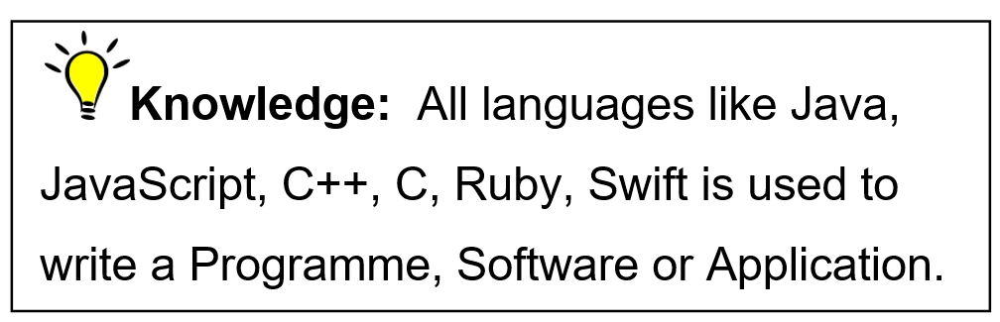{.class_s7P-1}
:::

::: {#text00002.html#a4MV .heading_s7S}
1.2 Beginning with Python programming
:::

::: class_s79
Before we start a Python Programming we must know what are basically
[Complier and Interpreted]{.class_s4UE}
:::

::: class_s7V
When we write a code we know that it is executes with the help of the
back-end system. This checking system is whether Interpreted or a
Complier.
:::

::: class_s7Z-0
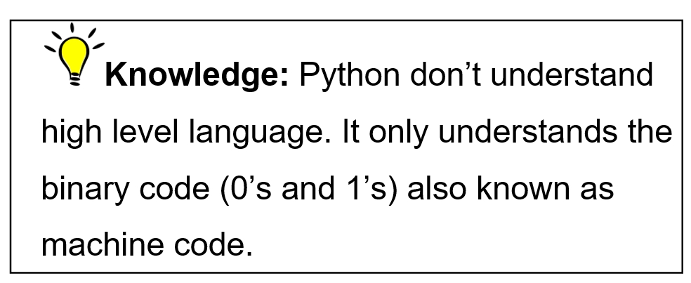{.class_s7Z-1}
:::

::: {#text00002.html#a4MW .heading_s81}
1.2.1 Complier
:::

-   It translates the whole programme given to it into machine code (1's
    and 0's).
-   It takes large amount of time to analyse the high level code but the
    overall execution time is completely faster.
-   As it requires more memory than interpreter because it generates
    intermediate object code which further requires linking.
-   It generates the error message only after scanning the whole
    programme so debugging is comparatively hard.
-   Programming language like C, C++, Swift, Erlang uses compilers.

::: {#text00002.html#a4MX .heading_s81}
1.2.2 Interpreter
:::

-   [It translates one by one line of the whole programme into machine
    code.]{#text00002.html#page_10}
-   It takes less amount of time to analyse the high level code (given
    by programmer also called source code) but the overall execution
    time is slower.
-   As they are memory efficient because no intermediate object code is
    generated in it.
-   It continues translating the programme until the first error is met,
    in that case it stops. So debugging is easy as we can find the bug
    easily.
-   Programming language like [Python]{.class_s4UE} , Ruby, Perl, PHP
    use Interpreters.

::: {#text00002.html#a4MY .heading_s8K}
1.2.3 Python reserved words
:::

::: class_s8N
Python have some reserved words also called [keywords.]{.class_s4UE}
They are special words acts as a programming instruction, defined with
predefined meaning and syntax in the language. We cannot use them for
variable or function. If you use any of them as a variable name it makes
a syntax error so you should kept this thing in your mind that error may
be generated because you are using one of these words.
:::

+---------------+---------------+------------------------------------------+
| ::: class_s8R | ::: class_s8V | ::: class_s8Z                            |
| and           | finally       | None                                     |
| :::           | :::           | :::                                      |
+---------------+---------------+------------------------------------------+
| ::: class_s8R | ::: class_s8V | ::: class_s8Z                            |
| as            | false         | not                                      |
| :::           | :::           | :::                                      |
+---------------+---------------+------------------------------------------+
| ::: class_s8R | ::: class_s8V | ::: class_s9F                            |
| assert        | for           | or                                       |
| :::           | :::           | :::                                      |
+---------------+---------------+------------------------------------------+
| ::: class_s8R | ::: class_s8V | ::: class_s8Z                            |
| break         | from          | pass                                     |
| :::           | :::           | :::                                      |
+---------------+---------------+------------------------------------------+
| ::: class_s8R | ::: class_s8V | ::: class_s8Z                            |
| class         | global        | raise                                    |
| :::           | :::           | :::                                      |
+---------------+---------------+------------------------------------------+
| ::: class_s8R | ::: class_s8V | ::: class_s8Z                            |
| continue      | if            | return                                   |
| :::           | :::           | :::                                      |
+---------------+---------------+------------------------------------------+
| ::: class_s8R | ::: class_s8V | ::: {#text00002.html#page_11 .class_s8Z} |
| def           | import        | True                                     |
| :::           | :::           | :::                                      |
+---------------+---------------+------------------------------------------+
| ::: class_s8R | ::: class_s8V | ::: class_s8Z                            |
| del           | In            | try                                      |
| :::           | :::           | :::                                      |
+---------------+---------------+------------------------------------------+
| ::: class_s8R | ::: class_s8V | ::: class_s8Z                            |
| elif          | Is            | with                                     |
| :::           | :::           | :::                                      |
+---------------+---------------+------------------------------------------+
| ::: class_s8R | ::: class_s8V | ::: class_s8Z                            |
| else          | lambda        | while                                    |
| :::           | :::           | :::                                      |
+---------------+---------------+------------------------------------------+
| ::: class_s8R | ::: class_s8V | ::: class_s8Z                            |
| except        | nonlocal      | yield                                    |
| :::           | :::           | :::                                      |
+---------------+---------------+------------------------------------------+

::: class_sBG-0
{.class_sBG-1}
:::

::: {#text00002.html#a4MZ .heading_sBJ}
Chapter 2 : Print
:::

::: class_s79
The print function in Python prints all the given statement inside the
parentheses to the output console window. These input statements can be
Integers, Strings or Float. This function is most widely used in the
programs.
:::

::: {#text00002.html#a4N0 .heading_sBN}
2.1 Integer
:::

::: class_s79
Integer is a whole number. To print that, we do not use quotation
[]{#text00002.html#page_12} marks. We can write the code as
follows,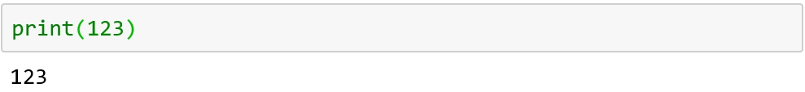{.class_sBU}
:::

::: {#text00002.html#a4N1 .heading_sBN}
2.2 String
:::

::: class_s79
We can print any string value as following,
:::

::: class_s7Z-0
{.class_s7Z-1}
:::

::: class_s7Z-0
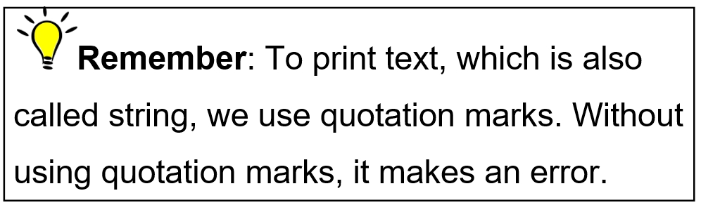{.class_s7Z-1}
:::

::: class_s7V
Here we print the sting without quotes,
:::

::: class_s7Z-0
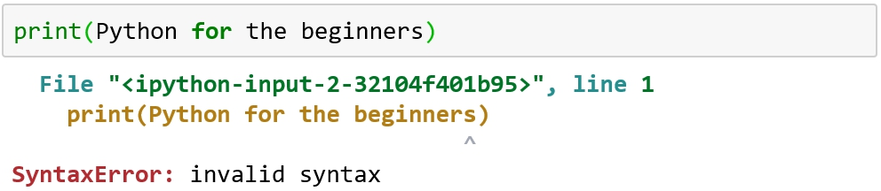{.class_s7Z-1}
:::

::: class_s7Z-0
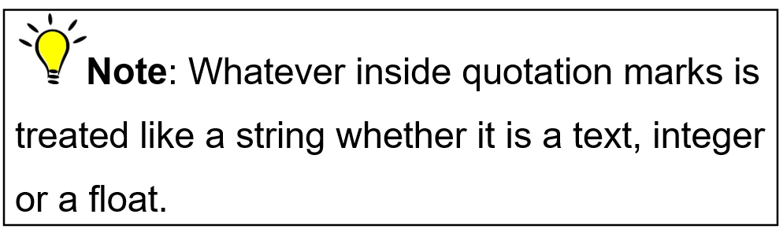{.class_s7Z-1}
:::

::: {#text00002.html#page_13 .class_s7Z-0}
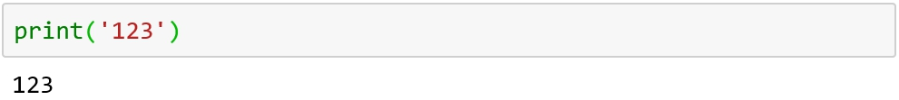{.class_s7Z-1}
:::

::: class_s7V
As [123]{.class_s4UE} is integer but here it is written inside quotation
("") so it is not integer anymore but become a string.
:::

::: {#text00002.html#a4N2 .heading_sBN}
2.3 Float
:::

::: class_s79
The whole number with the decimal point called float value. Like in
Integer, quotation mark is not essential but quotation marks treated it
like string value.
:::

::: class_s7Z-0
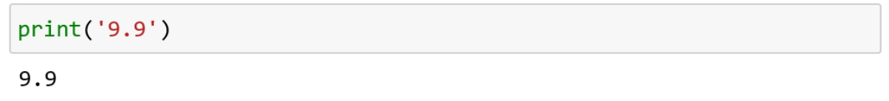{.class_s7Z-1}
:::

::: class_s7Z-0
{.class_s7Z-1}
:::

::: class_s7V
We can see in the following block of code that there is space between
the outputs as print function have default separator
[space]{.class_s4UE} . Separator tells us how two values will be
separate.
:::

::: class_s7Z-0
{.class_s7Z-1}
:::

::: class_s7V
{#page_14 .class_sCY}
{.class_sD2}
:::

::: class_s7V
{.class_sD7} [Knowledge:]{.class_s4UE} You can
change default separator by any value you want like,
:::

::: class_sDB-0
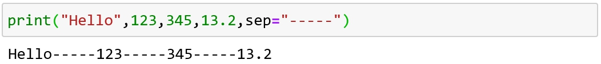{.class_sDB-1}
:::

::: class_sDD
[Task: 1)]{.class_s4UV-0} [Change default value of end to any other
value.]{.class_s4US}
:::

::: class_s7J
[(Hint]{.class_s4UV-0} [: To see its effect use multiple print ()
functions)]{.class_s4US}
:::

::: class_sDG
[2)  "\\n"]{.class_s4UV-0} [is Escape character .Explore more escape
character to learn []{#text00002.html#page_15} more.]{.class_s4US}
:::

[]{#text00003.html}

::: {#text00003.html#a4N3 .heading_sDR}
Chapter 3 : Variable
:::

::: class_sDT
[As the name implies, a variable is something that can
change/]{.class_s4UY} Variable or [not consistent. It can change with
the time. ]{.class_s4UF} In simplest terms, a variable is just a box
that you can putt stuff in, but see you can put more stuff in the
similar box or take some out.
:::

::: class_s7V
A variable in python is a [placeholder]{.class_s4UE} that holds a value
that may change. Variable can store all kind of stuff whether it is a
string, float or a number.
:::

::: {#text00003.html#a4N4 .heading_sBN}
3.1 Rules for naming a variable
:::

::: class_s79
1\. Variable can\'t enclose in quotation marks like "number"=1.
:::

::: class_s7V
2\. Variable can\'t have any spaces in it. If you want to use more than
one word as a variable, you can use underscore which helps us easy to
read like [my_lucky_number=1.]{.class_s4UE}
:::

::: class_s7V
3\. It can't be python reserved name discussed in chapter 1.
:::

::: class_s7V
4\. It can\'t be a number or begin with a number like 123=456.
:::

::: {#text00003.html#page_17 .class_s7Z-0}
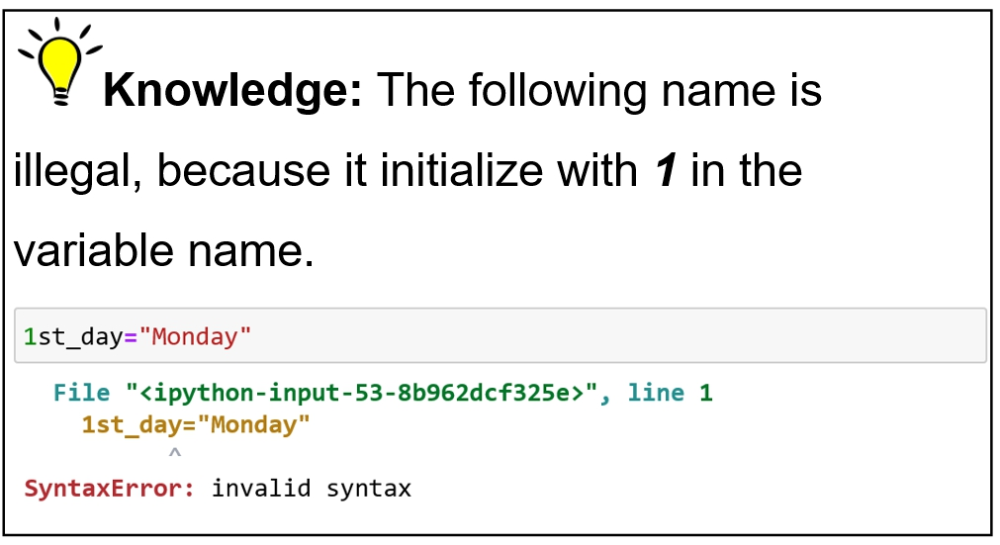{.class_s7Z-1}
:::

::: class_s7V
But this does not make error because 1 comes later in the variable name
as follows
:::

::: class_s7Z-0
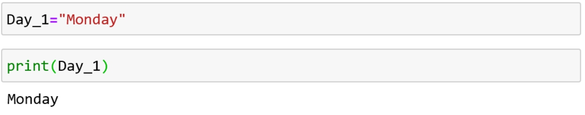{.class_s7Z-1}
:::

::: class_s7V
So Python variables can also change like this.
:::

::: class_s7Z-0
{.class_s7Z-1}
:::

::: {#text00003.html#a4N5 .heading_sBN}
3.2 Storing string in a variable:
:::

::: class_s79
Whenever we store a value in a variable it store in the memory and
whenever we need it we call for the variable where it is store. For
example someone says,
:::

::: class_s7V
"My name is Laura and I am in 6[th]{.class_s4UJ} grade"
:::

::: class_s7V
You just memorized that a girl name [Laura]{.class_s4UE} is in grade
6[th]{.class_s4UJ} but after 1 year, when she passed the exam and moved
to 7[th]{.class_s4UJ} Grade. If she wants you to know her grade, she\'ll
to tell you that she is now in 7[th]{.class_s4UJ} grade. After she tell
you, you\'ll know that Laura's grade doesn\'t refer to the original
value,\"6[th]{.class_s4UJ} \", but now refers to a new value,
"7[th]{.class_s4UJ} ".
:::

::: class_s7V
Let's do an example. Here we store the [Linna]{.class_s4UC} is variable
[Name]{.class_s4UC} and execute it[.]{.class_s4V5}
:::

::: class_s7Z-0
{.class_s7Z-1}
:::

::: class_s7V
Also, we can print a string with the variable like,
:::

::: class_s7Z-0
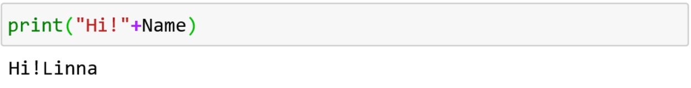{.class_s7Z-1}
:::

::: class_s7Z-0
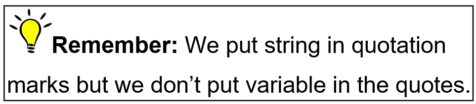{.class_s7Z-1}
:::

::: {#text00003.html#page_19 .class_s7Z-0}
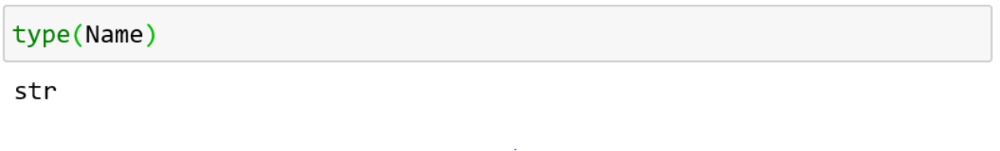{.class_s7Z-1}
:::

::: class_sEY
[Task:]{.class_s4UV-0} [Assign a string to a variable. You can name the
variable and the string as you want. Using the variable, write a
statement that displays the string on the console.]{.class_s4UX}
:::

::: class_s7V
The output shows that variable [Name]{.class_s4UC} store string value
i-e [Linna]{.class_s4UC} {.class_sF3}
:::

::: {#text00003.html#a4N6 .heading_s81}
3.2.1 Concatenate
:::

::: class_s79
Concatenate means appending one string to another string. It is done by
using '[+']{.class_s4UE} operator between them.
:::

::: class_s7Z-0
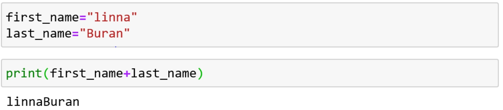{.class_s7Z-1}
:::

::: class_s7Z-0
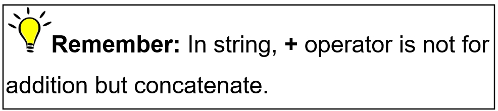{.class_s7Z-1}
:::

::: class_s7V
Here we can see that value [12]{.class_s4UC} and [34]{.class_s4UC}
[]{#text00003.html#page_20} is assign to the variables
[num1]{.class_s4UC} and [num2]{.class_s4UC} as follows,
:::

::: class_s7Z-0
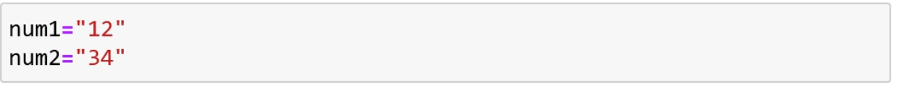{.class_s7Z-1}
:::

::: class_s7V
We concatenate these variables to the new variable
[result.]{.class_s4UC} One thing to be noted that it would not work, the
result might be [1234]{.class_s4UC} rather than [46]{.class_s4UC} as
Python can\'t sum strings. We can see the output as follows,
:::

::: class_s7Z-0
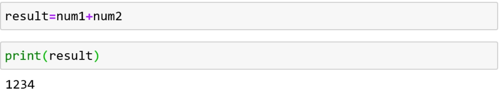{.class_s7Z-1}
:::

::: class_s7V
[Task:]{.class_s4UV-0} [Try to sum a string and the
integer]{.class_s4US}
:::

::: class_s7V
[(Hint:]{.class_s4UV-0} [Assign string and variable to separate
variables add them)]{.class_s4US}
:::

::: {#text00003.html#toc14_ .heading_sFT}
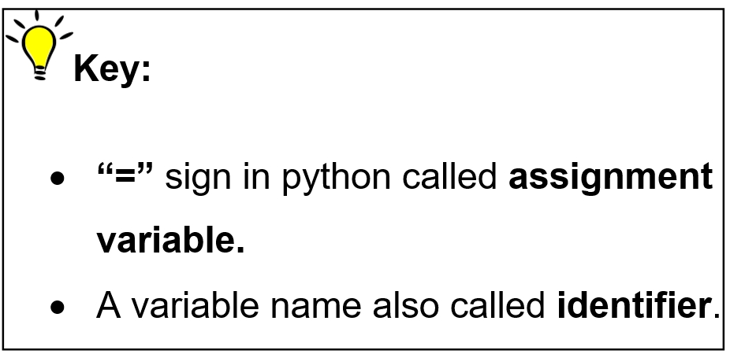{.class_sFT}
:::

::: {#text00003.html#a4N8 .heading_sFV}
3.3 Storing float in a variable
:::

::: {#text00003.html#page_21 .class_s79}
We can store any float value in the variable. In the following, we
define a variable [decimal]{.class_s4UC} and assign float value
[9.8]{.class_s4UC} to it 
:::

::: class_s7Z-0
{.class_s7Z-1}
:::

::: class_s7V
When we call variable [decimal]{.class_s4UC} we get the following
output,
:::

::: class_s7Z-0
{.class_s7Z-1}
:::

::: {#text00003.html#a4N9 .heading_s81}
3.3.1 Adding value to the variable
:::

::: class_s79
We can use the existing variable and add values to it. Here we add
integer value [1]{.class_s4UC} to the [decimal]{.class_s4UC} . i-e 9.8 +
1 equals to 10.8,
:::

::: class_sG9-0
{.class_sG9-1}
:::

::: class_s7V
Similarly, we can also add float to the variable [decimal]{.class_s4UC}
as follows,
:::

::: class_sG9-0
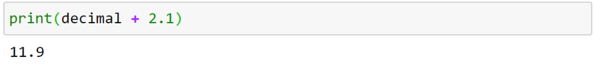{.class_sG9-1}
:::

::: {#text00003.html#a4NA .heading_sBN}
3.4 Storing integer in a variable
:::

::: class_s79
In the following, integer value [1]{.class_s4UC} is assign to a variable
[x,]{.class_s4UC}
:::

::: class_s7Z-0
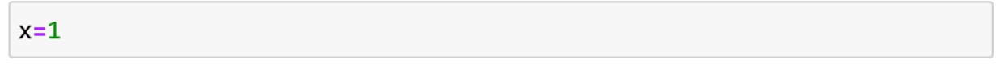{.class_s7Z-1}
:::

::: class_s7V
Whenever you have to access value 1 you pass variable to the
[print]{.class_s4UE} function as follows,
:::

::: class_s7Z-0
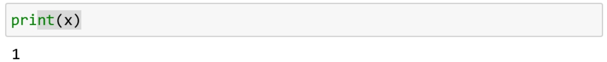{.class_s7Z-1}
:::

::: {#text00003.html#a4NB .heading_s81}
3.4.1 Overwrite
:::

::: class_s79
If we assign new value to the same variable it removes the previous
values and store new value. Here it prints [1.1]{.class_s4UC} rather
than [1]{.class_s4UC} .
:::

::: class_sGW-0
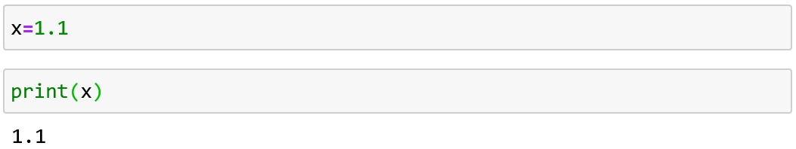{.class_sGW-1}
:::

::: class_s7V
Float value 1.1 is stored in x so data type of variable is
[float]{.class_s4UC} . We check it as follows,
:::

::: class_sH1-1
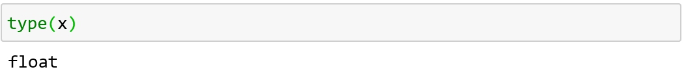{.class_sH1-0}
:::

::: {#text00003.html#a4NC .heading_s81}
3.4.2 Adding any number
:::

::: class_sDT
Here we assigned the integer value [55]{.class_s4UC} to the variable
[length,]{.class_s4UC}
:::

::: class_sH7-1
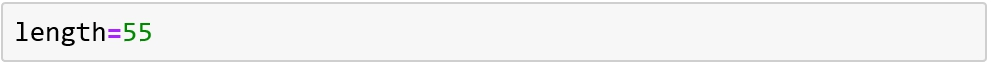{.class_sH7-0}
:::

::: class_s7V
You ask python to increase the length by [45,]{.class_s4UC} the python
refers to original value of length, which is [55]{.class_s4UC} and add
[45]{.class_s4UC} to it.
:::

::: class_sHC-1
{.class_sHC-0}
:::

::: class_s7V
Here is another example, as the integer value [190]{.class_s4UC}
assigned to the variable [original_value]{.class_s4UC} and integer value
[10]{.class_s4UC} assigned to another variable [new_value]{.class_s4UC}
. Both variables added to another variable [result]{.class_s4UC} . The
[result]{.class_s4UC} now has a value of [200]{.class_s4UC} .So when we
print the variable result then the output will be [200]{.class_s4UC}
[]{#text00003.html#page_23} . 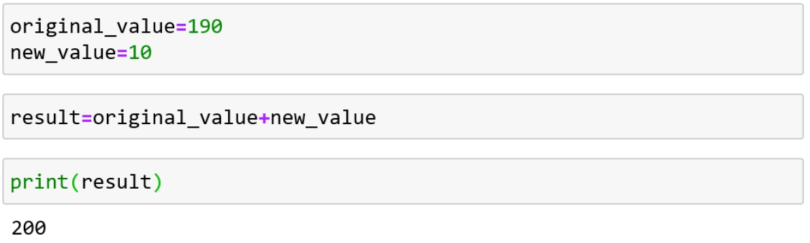{.class_sHH}
:::

::: class_sEY
[Task:]{.class_s4UV-0} [Assign the integer value 5000 to the
variable]{.class_s4US} [total]{.class_s4UT} [.]{.class_s4VP} [Then,
assign another variable and name it]{.class_s4US} [profit]{.class_s4UT}
[. In profit, subtract integer value 497 from total and print
variable]{.class_s4US} [profit.]{.class_s4UT}
:::

::: {#text00003.html#a4ND .heading_sHM}
Chapter 4 : Math Expressions
:::

::: class_sDT
We will cover all math expression supported by Python in this chapter.
:::

::: {#text00003.html#page_24 .class_sHR}
Python language supports the following types of operators.
:::

-   [Arithmetic Operators]{.class_s4UR}
-   [Comparison (Relational) Operators]{.class_s4UR}
-   [Assignment Operators]{.class_s4UR}
-   [Logical Operators]{.class_s4UR}
-   [Bitwise Operators]{.class_s4UR}
-   [Membership Operators]{.class_s4UR}
-   [Identity Operators]{.class_s4UR}

::: class_sJ4
We will look on all operators one by one.
:::

::: {#text00003.html#a4NE .heading_sJ6}
4.1 Arithmetic operator
:::

::: class_s79
We will cover this topic in two main parts,
:::

-   Familiar operators  
-   Unfamiliar operators

::: {#text00003.html#a4NF .heading_s81}
4.1.1 Familiar Arithmetic operators
:::

::: class_s79
We all are familiar with these basic arithmetic operators in maths like
addition (+), subtraction (-), multiplication (\*) and division (/).
:::

::: class_s7Z-0
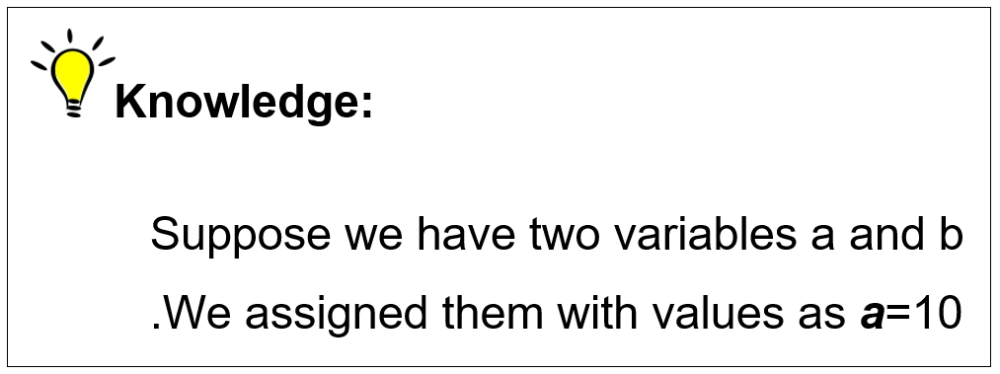{.class_s7Z-1}
:::

::: class_sJJ
:::

::: {#text00003.html#page_25 .class_sJP-1}
{.class_sJP-0}
:::

::: class_s7V
We can use these operators with variables or direct with the data type
:::

::: class_s7V
i-e integer or float.
:::

::: class_s7V
In the following, we assigned the value of [36]{.class_s4UC} to variable
[var1]{.class_s4UC} and [14]{.class_s4UC} to another variable
[var2,]{.class_s4UC}
:::

::: {#text00003.html#page_26 .class_s7Z-0}
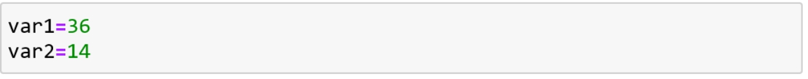{.class_s7Z-1}
:::

::: class_s7V
By using [']{.class_s4V5} [+]{.class_s4UC} [']{.class_s4V5} operator
between them it will give us the integer value [50]{.class_s4UC} as
follows,
:::

::: class_s7Z-0
{.class_s7Z-1}
:::

::: class_s7V
Here we assign values [1]{.class_s4UC} and [2.5]{.class_s4UC} to the
variables named [Integer]{.class_s4UC} and [float]{.class_s4UC} . As
these are two different data types so it will give us the result in
float.
:::

::: class_s7Z-0
{.class_s7Z-1}
:::

::: class_s7Z-0
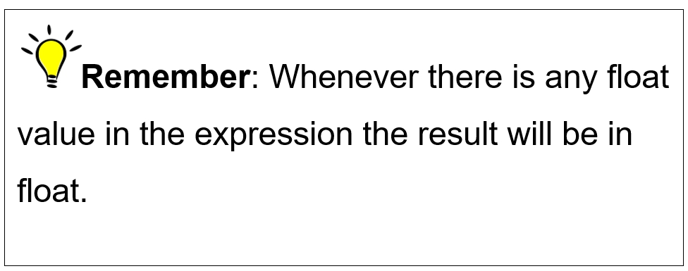{.class_s7Z-1}
:::

::: class_s7V
Multiplication operator also works same as [add]{.class_s4UC} operator.
For example,
:::

::: {#text00003.html#page_27 .class_s7Z-0}
{.class_s7Z-1}
:::

::: class_s7V
So last come division in python.
:::

::: class_s7V
Here we have two variables [var1]{.class_s4UC} and [var2]{.class_s4UC}
.Both having integer value [100]{.class_s4UC}
:::

::: class_s7Z-0
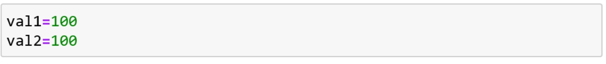{.class_s7Z-1}
:::

::: class_s7V
Well, you might think that [100]{.class_s4UC} is divided by same number
[100]{.class_s4UC} ,so the answer should equals to 1.But when we divide
them it will give us the result in data type float as follows,
:::

::: class_sKN-1
{.class_sKN-0}
:::

::: class_s7V
It is [1.0]{.class_s4UC} which is floating point. It is because python
by default do floating point division.
:::

::: class_s7V
Well, you see how simple is to use these operators.
:::

::: class_sKT
Task: Do some work by using subtract operator.
:::

::: {#text00003.html#a4NG .heading_s81}
4.1.2 Removing ambiguity
:::

::: class_s79
Till now, we looked simple arithmetic expressions in which there is one
operator at a time. What if there will more operators making the
expression more complex? Like,
:::

::: {#text00003.html#page_28 .class_sKX}
[Result = 2 + 3 \* 4 -- 5]{.class_s4UE}
:::

::: class_s7V
The order in which we do arithmetic will change the value of the result.
:::

::: class_s7V
Like, if we first add [2]{.class_s4UE} to [3]{.class_s4UE} , multiply it
with [4]{.class_s4UE} and take away [5]{.class_s4UE} from the answer we
will get integer value of [15]{.class_s4UE} .
:::

::: class_s7V
Similarly, if we follow other way by first multiplication of
[3]{.class_s4UE} and [4]{.class_s4UE} then adding [2]{.class_s4UE} and
at last subtract value of [5]{.class_s4UE} from it. Then the result will
be equals to [14]{.class_s4UE} .
:::

::: class_s7V
As python follows same rule as algebra i-e [precedence
rules]{.class_s4V5} but don't worry, we do not have to memorize it. We
can eliminate this ambiguity by just using the parentheses. Now we can
write it as          
:::

::: class_sM3
Result= 2 + (3 \* 4) - 5
:::

::: class_s7V
First, it will solve the expression inside the parentheses and after
that it will solve the remaining expression .It gives us the integer
value 9.
:::

::: class_s7V
Let's look into another example,
:::

::: class_s7V
Here we have variable [total]{.class_s4UC} , As total equals to [2 + ( 4
\* 5 ) \* 3]{.class_s4UE} .Now it will do multiplication first because
of the parentheses but what after that ? Now it adds 2 then multiply by
3 or first multiply it with 3 than adds the integer 2 to it? As, both
these cases will give us different result. The solution of these types
of problem is to [use more parentheses]{.class_s4UE} like as follows,
:::

::: class_sMA-0
{.class_sMA-1}
:::

::: class_s7V
Now, it first solve inside first parentheses gives [20]{.class_s4UC}
[]{#text00003.html#page_29} then multiply it with [3]{.class_s4UC} gives
[60]{.class_s4UC} and then finally add [2]{.class_s4UC} in it.
:::

::: {#text00003.html#a4NH .heading_s81}
4.1.3 Unfamiliar Arithmetic operator
:::

::: class_s79
Here we have a list of other arithmetic operators that may be new to
you.
:::

::: class_s7Z-0
{.class_s7Z-1}
:::

::: class_s7V
We will see all of them one by one.
:::

::: {#text00003.html#a4V3 .heading_s7B}
4.1.3.1 Floor division
:::

::: class_s79
We see above that by dividing one integer to another integer will give
us the result in float data type. If we want our answer in integer data
type we will use [//]{.class_s4UC} operator .This division is called
integer division. Recall the previous example,
:::

::: {#text00003.html#page_30 .class_s7Z-0}
{.class_s7Z-1}
:::

::: class_s7Z-0
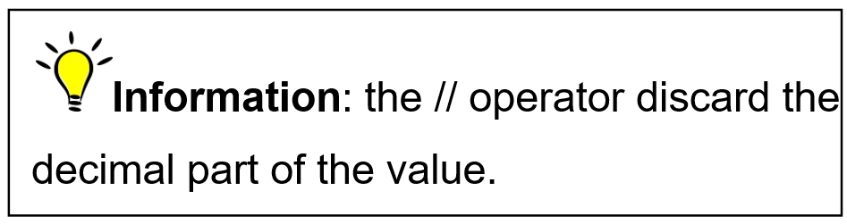{.class_s7Z-1}
:::

::: class_s7V
For example,
:::

::: class_s7Z-0
{.class_s7Z-1}
:::

::: class_s7V
As, 9/10 is equal to 0.9.but Look!
:::

::: class_sN2-1
{.class_sN2-0}
:::

::: class_s7V
It cuts off the decimal part which is [.9]{.class_s4UC} from the result
and gives us only integer part of the result.
:::

::: class_s7V
So sometimes it might not be useful because information will be lost.
:::

::: {#text00003.html#a4VW .heading_s7B}
4.1.3.2 Modulus
:::

::: class_s79
[This operator]{.class_s4UY} []{#text00003.html#page_31} divides one
number by another number, but does not gives you the result of the
division. It gives you the remainder after dividing first number by the
second number. [First, we will declare two variables, ]{.class_s4UY}
[a]{.class_s4UZ} [ and ]{.class_s4UY} [b]{.class_s4UZ} [. After that we
assigned them with integer values]{.class_s4UY} [10]{.class_s4UZ}
[and]{.class_s4UY} [5]{.class_s4UZ} [as in the following,]{.class_s4UY}
:::

::: class_s7Z-0
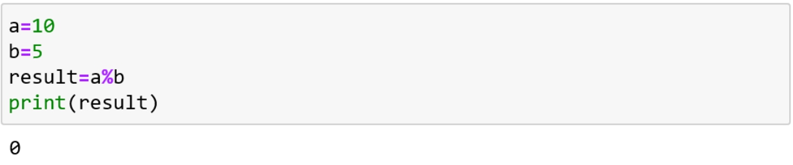{.class_s7Z-1}
:::

::: class_s7V
Here by dividing [10]{.class_s4UC} by [5]{.class_s4UC} , the result is
[0]{.class_s4UC} because there is no remainder left.
:::

::: {#text00003.html#a4VE .heading_s7B}
4.1.3.3 Exponentiation
:::

::: class_s79
There are two values in this operator. T[he number to be multiplied by
itself is called the]{.class_s4UF} [base]{.class_s4UH} [and the number
of times it is to be multiplied is the]{.class_s4UF}
[exponent]{.class_s4UH} [. We assigned them integer value]{.class_s4UF}
[2]{.class_s4UH} [and]{.class_s4UF} [3]{.class_s4UH} [.It will give us
the result by calculating]{.class_s4UF} [2]{.class_s4UH} [by the power
of]{.class_s4UF} [3]{.class_s4UH} [as follows,]{.class_s4UF}
:::

::: class_s7Z-0
{.class_s7Z-1}
:::

::: {#text00003.html#a4NJ .heading_sBN}
4.2 Assignment operators
:::

::: class_sNJ
Here we have table of assignment operation,
:::

::: {#text00003.html#page_32 .class_sNP-1}
{.class_sNP-0}
:::

::: class_s7V
Looking the following example in which we assign a integer value of
[5]{.class_s4UC} to the variable [a]{.class_s4UC} and add the value of
[3]{.class_s4UC} to it.
:::

::: class_sNV-1
{.class_sNV-0}
:::

::: class_s7V
The original value of [a,]{.class_s4UC} is [5]{.class_s4UC} which adds
[3]{.class_s4UC} to it and prints the result. It works same as below,
:::

::: {#text00003.html#page_33 .class_sP0-0}
{.class_sP0-1}
:::

::: class_sP2
Also, we can add some variable instead of using direct integer. Here we
declare new variable [value_to_be_add]{.class_s4UC} .We assign it with
integer value [3]{.class_s4UC} . Now we add new variable to the original
variable [a]{.class_s4UC} . We write it as follows,
:::

::: class_s7Z-0
{.class_s7Z-1}
:::

::: class_s7V
Similarly, we can do other operations same as above.
:::

::: class_s7V
{.class_sPB} Here we subtract integer value
[3]{.class_s4UC} from the original value. Similarly, in the next block
we multiply integer [3]{.class_s4UC} with original value
[5]{.class_s4UC} which gives us integer value [15]{.class_s4UC}
:::

::: class_sPD
Task: Do all the remaining assignment operators
:::

::: {#text00003.html#a4NK .heading_sBN}
4.3 Bitwise Operators
:::

::: class_sZ
Here we have different types of Bitwise operators as describes in the
[]{#text00003.html#page_34} following table,
:::

::: class_sPK-1
{.class_sPK-0}
:::

::: class_sPN
Now, we will see examples of Bitwise operators. In bitwise operator,
integer value changes to binary. After that it will perform operation
and convert the binary, back to integer.
:::

::: class_s79
Let suppose we declare a variable [a]{.class_s4UC} and assigned the
value [4]{.class_s4UC} to it.
:::

::: class_sPS
a = 4
:::

::: class_s79
Now we perform bitwise [AND]{.class_s4UE} operation as follows,
:::

::: class_s79
                          {#page_35 .class_sPY}
:::

::: class_sPN
As [4]{.class_s4UE} in binary equals to [00000100]{.class_s4UE} and
[2]{.class_s4UC} in binary is equals to [00000010]{.class_s4UE} . Now it
will perform [and]{.class_s4UE} operations like this.
:::

::: class_sR1
[00000010]{.class_s4V5}
:::

::: class_sR3
00000100
:::

::: class_sR3
\_\_\_\_\_\_\_\_\_\_\_
:::

::: class_sR3
00000000
:::

::: class_sR3
\_\_\_\_\_\_\_\_\_\_\_
:::

::: class_sPN
Also we perform bitwise [OR]{.class_s4UE} operation.
:::

::: class_sJP-1
{.class_sJP-0}
:::

::: class_s79
As, it prints the above result after doing [OR]{.class_s4V5} operation.
:::

::: class_s79
  {#page_36 .class_sRG}
:::

::: class_sPN
[Task: Perform]{.class_s4US} [EOR]{.class_s4UT} [and]{.class_s4US}
[NOT]{.class_s4UT} [operation.]{.class_s4US}
:::

::: class_s7V
Now we declare a variable [a.]{.class_s4UC} We assigned the value of
[60]{.class_s4UC} to [a.]{.class_s4UC} As in binary 60 equals to
[00111100]{.class_s4UE} .When we perform left binary shift equal to
[2,]{.class_s4UC} then it will become [11110000]{.class_s4UE} which is
[240]{.class_s4UC} []{#text00003.html#page_37} in decimal.
:::

::: class_s7Z-0
{.class_s7Z-1}
:::

::: class_s7V
Similarly, we can also perform binary right shift as follows,
:::

::: class_s7Z-0
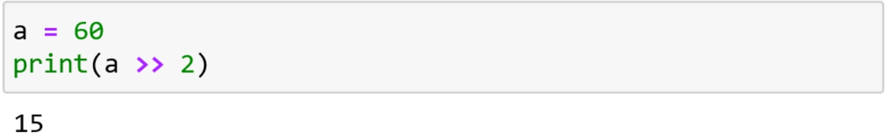{.class_s7Z-1}
:::

::: {#text00003.html#a4NM .heading_sBN}
4.4 Comparison operators
:::

::: class_s79
We have different types of comparison operators as describes in the
following table.
:::

+---------------+--------------------------+---------------+
| ::: class_sRX | ::: class_sS1            | ::: class_sS5 |
| Operator      | Description              | Example       |
| :::           | :::                      | :::           |
+---------------+--------------------------+---------------+
| ::: class_sSA | ::: class_sSD            | ::: class_sSG |
| ==            | Equal                    | a==b          |
| :::           | :::                      | :::           |
+---------------+--------------------------+---------------+
| ::: class_sSA | ::: class_sSD            | ::: class_sSG |
| !=            | Not equal to             | a!=b          |
| :::           | :::                      | :::           |
+---------------+--------------------------+---------------+
| ::: class_sSA | ::: class_sSD            | ::: class_sSG |
| \>            | Greater than             | a\>b          |
| :::           | :::                      | :::           |
+---------------+--------------------------+---------------+
| ::: class_sSA | ::: class_sSD            | ::: class_sSG |
| \<            | Less than                | a\<b          |
| :::           | :::                      | :::           |
+---------------+--------------------------+---------------+
| ::: class_sSA | ::: class_sSD            | ::: class_sSG |
| \>=           | Greater than or equal to | a\>=b         |
| :::           | :::                      | :::           |
+---------------+--------------------------+---------------+
| ::: class_sSA | ::: class_sSD            | ::: class_sSG |
| \<=           | Less than or equal to    | a\<=b         |
| :::           | :::                      | :::           |
+---------------+--------------------------+---------------+

::: class_sDT
We will see each of the operators. First have a look on equality
[]{#text00003.html#page_38} operator ==.This operator can be used to
compare a variable with a,
:::

-   variable
-   math expression
-   string
-   number

::: class_sU2-0
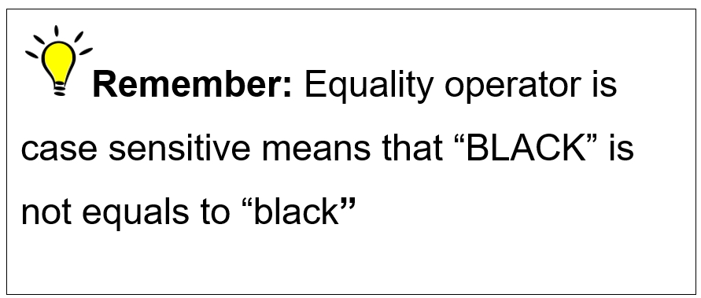{.class_sU2-1}
:::

::: class_sU4
Next come, [not equal]{.class_s4UE} operator. The [not
equal]{.class_s4UE} operator is opposite to equality operator. Like
equality operator it can compare variable with a variable, a variable
with any math expression, a variable with a string, a variable with the
number or a variable with the combination.
:::

::: class_sU4
Also this operation is also sensitive so it is true that [BLACK! =
black]{.class_s4UE}
:::

::: class_sU4
In the following example, we have assigned integer value
[6]{.class_s4UC} to the variable [dice_roll]{.class_s4UC} . Now [if
statement]{.class_s4UC} will check the condition. As it is not equals to
[6]{.class_s4UC} satisfies the equation which prints the message "Roll
the dice again".
:::

::: {#text00003.html#page_39 .class_sUA-1}
{.class_sUA-0}
:::

::: class_sUC
Here we have the remaining comparison operators, all the following
conditions are true
:::

::: class_sUE
if 10 \> 5:
:::

::: class_sUE
if  5 \< 10:
:::

::: class_sUE
if 10 \>= 5:
:::

::: class_sUE
if 10 \>= 10:
:::

::: class_sUE
if 5 \<= 10:
:::

::: class_sUE
if 10 \<= 10:
:::

::: {#text00003.html#a4NN .heading_sBN}
4.5 Logical operators
:::

::: class_sUR
::: {#text00003.html#a4NP}
We have three logic operators as describes in the following table:
:::
:::

::: {#text00003.html#page_40 .class_sUV-1}
{.class_sUV-0}
:::

::: class_sJJ
:::

::: class_sV0-0
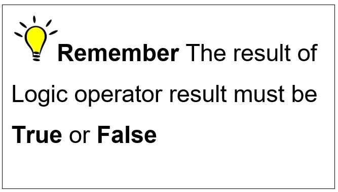{.class_sV0-1}
:::

::: class_s7V
As [or]{.class_s4UC} operator returns the [True]{.class_s4UE} when one
of the statement is true. Here we assigned integer [6]{.class_s4UE} to
the variable [x]{.class_s4UC} . It checks the given conditions. As,
[6]{.class_s4UE} is greater than [0]{.class_s4UE} but is not smaller
than [5]{.class_s4UE} []{#text00003.html#page_41} so it returns
[True]{.class_s4UE} because one of the condition is True.
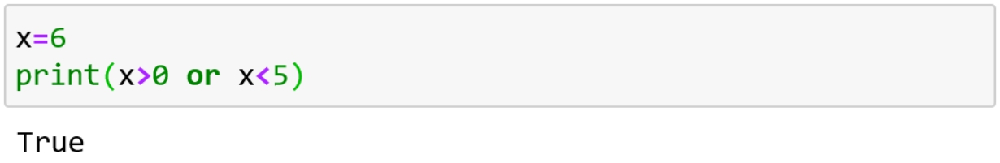{.class_sV5}
:::

::: class_s7V
Now see what [and]{.class_s4UC} operator do. As it returns the
[True]{.class_s4UE} when, both of the statements are true. Now we
assigned different integer to the variable [x]{.class_s4UC} . It also
checks the statements. As,  [3]{.class_s4UC} is greater than
[0]{.class_s4UC} and  less than [5]{.class_s4UC} so it returns
[True]{.class_s4UC} because both condition are true.
:::

::: class_s7Z-0
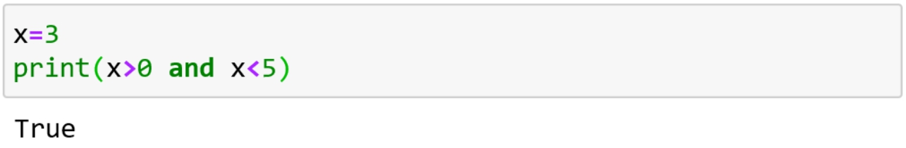{.class_s7Z-1}
:::

::: class_s7V
[Not]{.class_s4UE} operator will reserve the result and prints
[True]{.class_s4UE} when result is false and prints [False]{.class_s4UE}
when the result is true. For example,
:::

::: class_s7Z-0
{.class_s7Z-1}
:::

::: class_s7V
The above code checks the first condition and satisfied the condition.
Similarly, it will check second condition which also satisfied.  As
[4]{.class_s4UC} is greater than [0]{.class_s4UC} and less than
[5.]{.class_s4UC} The result of inner parentheses is [True]{.class_s4UE}
but, [not]{.class_s4UE} operator reversed the result and turns it to
[False]{.class_s4UE} .
:::

::: class_s7V
[Task: Apply]{.class_s4US} [not operator]{.class_s4UV-0}
[with]{.class_s4US} [or operator]{.class_s4UV-0} [and note the
result]{.class_s4US}
:::

::: {#text00003.html#a4NR .heading_sBN}
4.6 Identity Operator
:::

::: class_sVJ
Here we have two types of Identity operators as describes in the
[]{#text00003.html#page_42} following table,
:::

+---------------+------------------------------------+---------------+
| ::: class_sVM | ::: class_sVS                      | ::: class_sVW |
| Operator      | Description                        | Example       |
| :::           | :::                                | :::           |
+---------------+------------------------------------+---------------+
| ::: class_sW1 | ::: class_sW4                      | ::: class_sW7 |
| is            | Returns True only when both        | a is b        |
| :::           | variable are same objects          | :::           |
|               | :::                                |               |
+---------------+------------------------------------+---------------+
| ::: class_sW1 | ::: class_sW4                      | ::: class_sW7 |
| is not        | Returns True only when both        | a is not b    |
| :::           | variable are not same objects      | :::           |
|               | :::                                |               |
+---------------+------------------------------------+---------------+

::: class_sWM
First we will discuss [is]{.class_s4UE} operator. Let's suppose we have
two list [a]{.class_s4UC} and [b]{.class_s4UC} . Both list stored same
items i-e [red]{.class_s4UC} and [green]{.class_s4UC} .
:::

::: class_sWS-1
{.class_sWS-0}
:::

::: class_s7V
Now we check [is]{.class_s4UC} operator as follows,
:::

::: class_sN2-1
{.class_sN2-0}
:::

::: class_s7V
It returns [False]{.class_s4UE} because [a]{.class_s4UC} is not the same
object as [b,]{.class_s4UC} even both these list having same items.
:::

::: class_s7V
Now we declare variable [c]{.class_s4UC} . The variable [c]{.class_s4UC}
is equal to the list .Now [c]{.class_s4UC} also starts pointing to the
list [a]{.class_s4UC} .
:::

::: {#text00003.html#page_43 .class_s7Z-0}
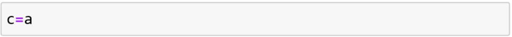{.class_s7Z-1}
:::

::: class_s7V
Now we apply [is]{.class_s4UE} operator,
:::

::: class_s7Z-0
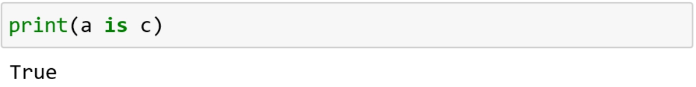{.class_s7Z-1}
:::

::: class_s7V
It returns [True]{.class_s4UE} because c is same object as
[a]{.class_s4UC} .
:::

::: class_s7V
Now you might think that [is operator]{.class_s4UE} do same as
[==]{.class_s4UE} operator. So what's the difference between them?
:::

::: class_s7V
Well, to demonstrate the difference between them we simply apply
[==]{.class_s4UE} instead of [is]{.class_s4UE} operator. We will get the
result [True]{.class_s4UE} as follows,
:::

::: class_s7Z-0
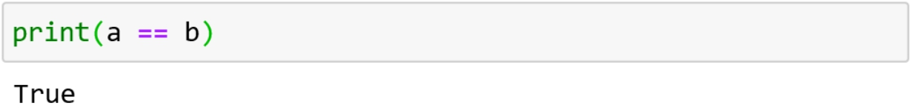{.class_s7Z-1}
:::

::: class_s7V
It returns [True]{.class_s4UE} because both having same variable store
in them.
:::

::: class_s7V
Now again consider above lists [a]{.class_s4UC} and [b]{.class_s4UC} .We
will see that what [is not operator]{.class_s4UC} do,
:::

::: class_sH7-1
{.class_sH7-0}
:::

::: class_sGW-0
{.class_sGW-1}
:::

::: class_s7V
First we print,
:::

::: {#text00003.html#page_44 .class_sN2-1}
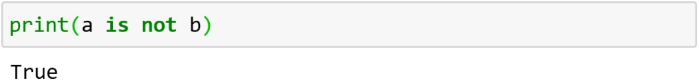{.class_sN2-0}
:::

::: class_s7V
It returns [True]{.class_s4UE} because [a]{.class_s4UC} and
[b]{.class_s4UC} are not same objects. Although they have same items
stored in them i-e [red]{.class_s4UC} and [green]{.class_s4UC}
:::

::: class_sXW-1
{.class_sXW-0}
:::

::: class_s7V
Similarly, it returns [False]{.class_s4UE} because [a]{.class_s4UC} and
[c]{.class_s4UC} are not same objects.
:::

::: class_s7V
At last we see the difference between [!=]{.class_s4UE} operator and [is
not]{.class_s4UE} operator. As it returns [False]{.class_s4UE} by
applying [!=]{.class_s4UE} operator .
:::

::: class_sY2-0
{.class_sY2-1}
:::

::: {#text00003.html#a4NS .heading_sBN}
4.7 Membership Operators
:::

::: class_sVJ
Look at the following table which consists of two types of membership
operators, 
:::

+---------------+------------------------------------+---------------+
| ::: class_sY6 | ::: class_sYA                      | ::: class_sYE |
| Operator      | Description                        | Example       |
| :::           | :::                                | :::           |
+---------------+------------------------------------+---------------+
| ::: class_sYK | ::: class_sYP                      | ::: class_sYT |
| in            | Returns True if a sequence with    | a in b        |
| :::           | the specified values is present in | :::           |
|               | the object                         |               |
|               | :::                                |               |
+---------------+------------------------------------+---------------+
| ::: class_sYX | ::: class_sYP                      | ::: class_sYT |
| not in        | Returns True if a sequence with    | a not in b    |
| :::           | the specified values is present in | :::           |
|               | not the object                     |               |
|               | :::                                |               |
+---------------+------------------------------------+---------------+

::: class_sWM
The membership operators will return [True,]{.class_s4UE}
[]{#text00003.html#page_45} if the item present in the list otherwise it
returns [False]{.class_s4UE} . Now we have a list of names of students
who passed the exam.
:::

::: class_s7Z-0
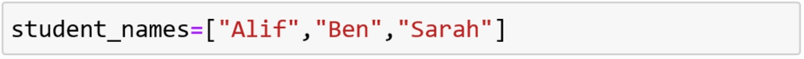{.class_s7Z-1}
:::

::: class_s7V
Now we have to check whether [John]{.class_s4UC} is in the list. To
check we code as follows,
:::

::: class_sGW-0
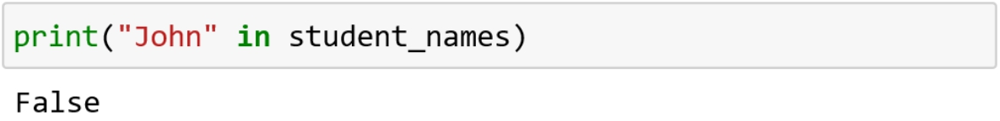{.class_sGW-1}
:::

::: class_s7V
As member [Sarah]{.class_s4UC} is in the list. So when we check by using
[in]{.class_s4UC} operator then, it returns [True]{.class_s4UE} .
:::

::: class_sZJ-0
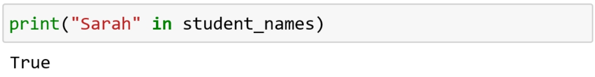{.class_sZJ-1}
:::

::: class_s7V
We can use other membership operator [not in]{.class_s4UE} . As [not
in]{.class_s4UE} will returns [True]{.class_s4UE} only when the item is
not in the list. Like, [John]{.class_s4UC} is the student who is not
included in the list. So by checking this we will get
[True]{.class_s4UE} .
:::

::: class_s7Z-0
{.class_s7Z-1}
:::

::: class_s7V
Finally, we checked the item [Sarah]{.class_s4UC} . As it is in the list
so [not in]{.class_s4UE} operator will return [False]{.class_s4UE}
.{.class_sZV}
:::

[]{#text00004.html}

::: {#text00004.html#a4NT .heading_sDR}
Chapter 5 : User Input
:::

::: class_s79
Whenever we want to take input from the user/keyboard we use keyword
[input().]{.class_s4UC} Input has an optional parameter, which is prompt
string.
:::

::: {#text00004.html#a4NU .heading_sBN}
5.1 User Input as a variable
:::

::: class_s79
When the following block executes, it ask you for the input. For
example,
:::

::: class_sN2-1
{.class_sN2-0}
:::

::: class_s7V
Suppose user enters [Jerry]{.class_s4UC} . Now we can print the variable
to check what stores inside it.
:::

::: class_sZJ-0
{.class_sZJ-1}
:::

::: class_s7V
It stores the name [Jerry]{.class_s4UC} in the variable
[Name.]{.class_s4UC}
:::

::: class_s7V
Now you can write any name you want. As Jerry is the string you can
check it by following command.
:::

::: class_s7Z-0
{.class_s7Z-1}
:::

::: class_s7V
Okay, what if you give a number to the input. For example, here we have
a variable [Yours_favorite_number]{.class_s4UC} which is user define.
When the block executes the box appears, as follows
:::

::: {#text00004.html#page_47 .class_s10N-1}
{.class_s10N-0}
:::

::: class_s7V
Suppose we entered the integer value [6.]{.class_s4UC} We can check this
variable by the following,
:::

::: class_s7Z-0
{.class_s7Z-1}
:::

::: class_s7V
Great! Let's check the data type of this
variable,{.class_s10Y}
:::

::: class_s7V
Are you confused ?As you entered integer but it showing the string data
type .You can change its data type by type casting
:::

::: class_s7Z-0
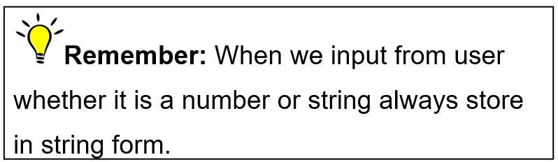{.class_s7Z-1}
:::

::: {#text00004.html#a4NV .heading_sBN}
5.2 Type casting
:::

::: class_s79
If we really want to store a number in data type [integer,]{.class_s4UE}
to compare it with the other integers or we want to perform different
operations like we want to add it by other integer.
:::

::: class_s7V
Here we give integer value of [99]{.class_s4UC} to the variable
[data]{.class_s4UC} and check the type
:::

::: class_s7V
::: {#text00004.html#page_48}
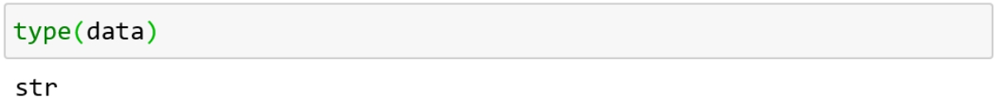{.class_sRG}
:::
:::

::: {#text00004.html#a4NW .heading_s11B}
5.2.1 String to integer
:::

::: class_s79
[We can change data type of string into integer by]{.class_s4UY}
[int()]{.class_s4UZ}
:::

::: class_s79
{.class_s11H}
:::

::: class_s79
[Task:]{.class_s4UV-0} [Create a user define variable]{.class_s4US}
[number]{.class_s4UT} [. Enter integer value 55.]{.class_s4US}
:::

::: class_s79
::: class_s11P
Check the data type which is string. Convert the data type to integer.
:::
:::

::: {#text00004.html#a4NX .heading_s11T}
5.2.2 Integer to string  
:::

::: class_s79
[Similarly, we can also change back to string data type by
using]{.class_s4UY} [str()]{.class_s4VG} [. The following output shows
the data type of variable]{.class_s4UY} [Str_to_int]{.class_s4UZ}
[,]{.class_s4UY} {.class_s11Y}
:::

::: {#text00004.html#a4NY .heading_s11T}
5.2.3 Integer to float
:::

::: class_s79
[At last we convert integer to float by using]{.class_s4UY}
[float()]{.class_s4UZ}               {.class_s125}
:::

::: class_sDT
[Task:]{.class_s4UV-0} [Define variable]{.class_s4US} [x]{.class_s4UT}
[. Assign the integer value 65 to it. Now convert the data type to
float.]{.class_s4US}
:::

[]{#text00005.html}

::: {#text00005.html#a4NZ .heading_sDR}
Chapter 6 : Condition Statements
:::

::: class_sDT
Conditional Statement is one of the most important concepts in Python.
It checks that whether the given statements need to be executed or not.
:::

::: class_s7V
It works by checking the condition for that certain statement, if the
condition is true, then the set of code inside the body of statement
will be executed.
:::

::: class_s12J
There are following types of conditional statements in python:
:::

-   if
-   if-else
-   elif
-   Nested if / Nested if-else

::: class_sU4
We will discuss one by one each of its types.
:::

::: {#text00005.html#a4P0 .heading_sBN}
6.1 If statement
:::

::: class_s79
In the programming languages, [i]{.class_s4UC}
[f statement]{.class_s4UH} [ is one of the most commonly
used conditional statement .I]{.class_s4UF} f statement is used for
decision making. It will run through its body only when the statement is
true.
:::

::: class_s7V
[Syntax:]{.class_s4UE} First, we use key word [if]{.class_s4UC} then
write an expression, which we want to check. End the line with colon
[(:)]{.class_s4UE} as follows
:::

::: class_s12X
if expression:
:::

::: class_s12Z
Statement
:::

::: {#text00005.html#page_50 .class_s7Z-0}
{.class_s7Z-1}
:::

::: class_s7V
Let's do an example. Here we define variables [a, b]{.class_s4UC} and
assign integer values [10]{.class_s4UC} and [20]{.class_s4UC} . Then we
use [if]{.class_s4UC} statement. We write the condition inside
parenthesis and here we check the condition by using an operator i-e
[\<]{.class_s4UE} as follows,
:::

::: class_sDB-0
{.class_sDB-1}
:::

::: class_s7V
As the value we assigned to variable [a]{.class_s4UC}
is[10]{.class_s4UC} which is less than the value which we assigned to
the variable [b]{.class_s4UC} i-e [20]{.class_s4UC} .
:::

::: class_s7V
So, the condition [a\<b]{.class_s4UC} []{#text00005.html#page_51}
becomes true, result in the execution of the print statement written
inside the body.
:::

::: class_s7Z-0
{.class_s7Z-1}
:::

::: class_s7V
Here, the condition of [if]{.class_s4UE} statement is true as before. So
it prints the code which is in the body of if statement. When the text
is intended, means it is the part of [if]{.class_s4UC} body
:::

::: class_s7Z-0
{.class_s7Z-1}
:::

::: class_s7V
we get the following output,
:::

::: class_sKN-1
{.class_sKN-0}
:::

::: class_s7V
In the above example, as the condition returns true, it prints all the
statements inside the block one by one. But look, last
[print]{.class_s4UE} statement is not inside the body so how it prints?
Well, after executing all the statement in the body the block will end
.After that the interpreter comes to the last line and execute it.
:::

::: {#text00005.html#page_52 .class_s7Z-0}
{.class_s7Z-1}
:::

::: class_s7V
Look to the following example. Here the integer value [100]{.class_s4UC}
assigned to variable [num1]{.class_s4UC} and integer value
[200]{.class_s4UC} assigned to variable [num2]{.class_s4UC} .As the
condition of [if]{.class_s4UC} statement returns false so the body will
not executed.
:::

::: class_s7Z-0
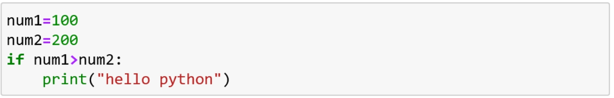{.class_s7Z-1}
:::

::: class_s7V
Again, what if something is present outside of the body? It will print
regardless that the condition is satisfy or not as follows
:::

::: class_s7Z-0
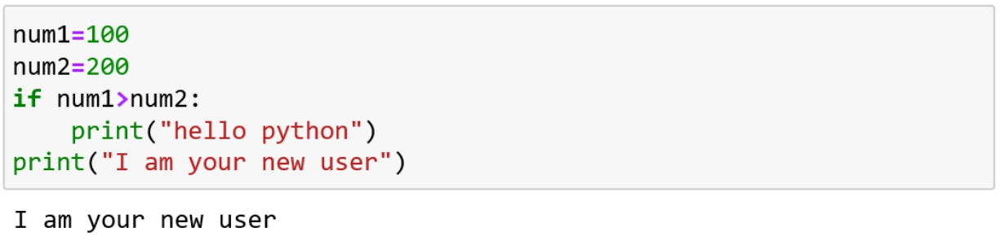{.class_s7Z-1}
:::

::: class_s7V
The print statement executed which is written outside the body of
[if]{.class_s4UC} statement.
:::

::: {#text00005.html#a4P1 .heading_sBN}
6.2 If-else statement
:::

::: class_s79
The if-else is usually used when we have to check one statement on the
basis of other statement.
:::

::: class_s7V
It means that if the condition of one statement will not satisfy then
[]{#text00005.html#page_53} there is another statement which will
satisfy for the same condition.
:::

::: class_s7V
For example, if we are defining two variables [number 1, number
2]{.class_s4UE} and assigned two different values to them. We can check
the condition [number 1 is greater than number 2]{.class_s4V5} by using
operator. If the condition satisfy than print "[number 1 is greater than
number 2"]{.class_s4V5} and if this condition is not satisfied then
print the following message
:::

::: class_s146
"[number 2 is greater than number 1"]{.class_s4V5}
:::

::: class_s148
Which, we can write in else block.
:::

::: class_s7V
Let's do an example related to if-else condition. In the following code,
we have variable [Name]{.class_s4UC} , which takes input from user as
follows,
:::

::: class_sH7-1
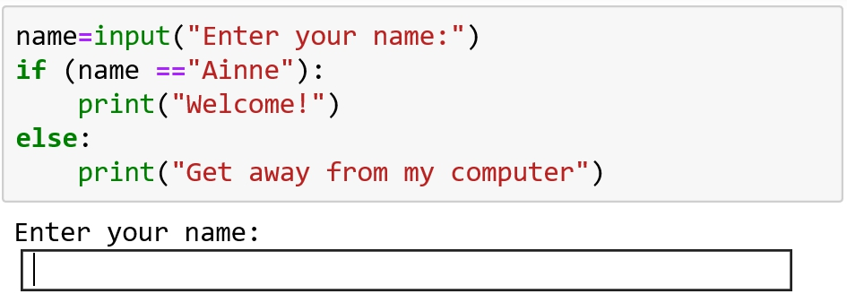{.class_sH7-0}
:::

::: class_sEY
We put the condition that if the string value equal to
[Ainne,]{.class_s4UC} then execute [if block]{.class_s4UE} which print
"Welcome!".
:::

::: class_s7Z-0
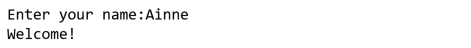{.class_s7Z-1}
:::

::: class_s7V
Otherwise, print the statement "Get away from my computer".
:::

::: {#text00005.html#page_54 .class_s7Z-0}
{.class_s7Z-1}
:::

::: class_s7V
Recalling the previous example, in which we assigned two different
values for both variables [num1]{.class_s4UC} and [num2]{.class_s4UC}
and use the if statement to check the condition as follows,
:::

::: class_s7Z-0
{.class_s7Z-1}
:::

::: class_s7V
Now if we assigned values [4]{.class_s4UC} and [5]{.class_s4UC} to
[num1]{.class_s4UC} and [num2]{.class_s4UC} then it prints the statement
as follows,
:::

::: class_s7Z-0
{.class_s7Z-1}
:::

::: class_s14Y
Great!
:::

[]{#text00006.html}

::: heading_s158
::: {#text00006.html#toc40_}
{.class_sRG}
:::
:::

::: {#text00006.html#a4P3 .heading_s11T}
6.2.1 Minimal line code
:::

::: class_s15B
For the same example discussed above, we can rewrite the code as
follows,
:::

::: class_s7Z-0
{.class_s7Z-1}
:::

::: class_s12J
Now when this block executed it ask for input value. Let suppose we
entered integer value 4 and 3 so we will get the following output.
:::

::: class_s7Z-0
{.class_s7Z-1}
:::

::: class_s12J
Great! It gives us correct output
:::

::: {#text00006.html#page_56 .class_s15N}
But, what happened if we assigned same values for both of the variables?
:::

::: class_s7V
The [if-else condition]{.class_s4UE} does not work when we have similar
input values. For example, if we entered integer value [8]{.class_s4UC}
for [num1]{.class_s4UC} and also integer value [8]{.class_s4UC} for [num
2]{.class_s4UC} ,
:::

::: class_s7Z-0
{.class_s7Z-1}
:::

::: class_s7V
Oops! It is not correct answer. We can correct this type of problems in
the following method.
:::

::: {#text00006.html#a4P4 .heading_sBN}
6.3 The elif Statement
:::

::: class_s79
The python we use short form of else if or elseif as elif. [We use
\"]{.class_s4UF} [elif]{.class_s4UG} [\" statement, when we have to
print out the third condition or when the other defined conditions get
wrong or incorrect as described in previous topic. Look at the following
block of code, in which we add another block i-e]{.class_s4UF}
[elif,]{.class_s4UH}
:::

::: class_sKN-1
{.class_sKN-0}
:::

::: class_sEY
[Now if we entered same integer value]{.class_s4UF} [8]{.class_s4UH}
[for both variables]{.class_s4UF} [num1]{.class_s4UH} [and]{.class_s4UF}
[num2]{.class_s4UH}
:::

::: class_s7V
[If statement]{.class_s4UG} [checks for condition]{.class_s4UF} [num1 \<
num2]{.class_s4UH} []{#text00006.html#page_57} [which is ]{.class_s4UF}
[False]{.class_s4UG} [ in this case. Then it checks]{.class_s4UF}
[elif]{.class_s4UH} [statement]{.class_s4UF} [num1 \> num2]{.class_s4UH}
[which is also incorrect in this case. Then the flow of program control
goes to the]{.class_s4UF} [else]{.class_s4UH} [condition. It checks
whether]{.class_s4UF} [x==y]{.class_s4UH} [which is true so it block
will be executed and prints the statement. \"Both the numbers are having
equal value\".]{.class_s4UF}
:::

::: class_s15B
So the output we get, is as follows,
:::

::: class_s7V
{.class_sRG}
:::

::: class_s79
[Task:]{.class_s4UV-0} [Create a user define variable]{.class_s4US}
[total.]{.class_s4UV-0} [If ]{.class_s4US} [total]{.class_s4UV-0} [ has
the value less than or equal to 50 print "Fail". If ]{.class_s4US}
[total]{.class_s4UV-0} [ has the value less than or equal to 70 print 
"Satisfactory". Otherwise print "Well done"]{.class_s4US}
:::

::: {#text00006.html#a4P5 .heading_sBN}
6.4 Nested if else statement
:::

::: class_s79
[When we write, if else statement inside the body of another "if" or
"else" then this is called ]{.class_s4UF} [nested if else]{.class_s4UG}
[.]{.class_s4UF}
:::

::: class_s7V
[Let's do an example. Here we have a block of code in which, we defined
a variables]{.class_s4UF} [country]{.class_s4UH} [, and]{.class_s4UF}
[product_price]{.class_s4UH} [. Both variables take input from
user.]{.class_s4VB}
:::

::: class_s148
[Then, we created]{.class_s4UF} [elif]{.class_s4UG} [statement. Inside
if block we have nested]{.class_s4UF} [elif]{.class_s4UG} [statement and
inside]{.class_s4UF} [elif]{.class_s4UG} [block we see
another]{.class_s4UF} [if else]{.class_s4UG} [statement as follows
,]{.class_s4UF}
:::

::: {#text00006.html#page_58 .class_s10N-1}
{.class_s10N-0}
:::

::: class_s7V
When we run the code, we get the following block. Let's suppose user
writes [US ,]{.class_s4UC}
:::

::: class_s7Z-0
{.class_s7Z-1}
:::

::: class_s7V
When user enters the input, he gets another block as follows,
:::

::: class_s7Z-0
{.class_s7Z-1}
:::

::: class_s7V
The condition of if statement returns [True]{.class_s4UE} , i-e "US" ==
"US", which allows the execution of inner block. As user enters the cost
of products equal to [100]{.class_s4UC} .[The]{.class_s4UF}
[if]{.class_s4UH} [Statement checks for condition]{.class_s4UF}
[products_price\<=50]{.class_s4UH} [which is ]{.class_s4UF}
[False]{.class_s4UG} [ in this case. Then it checks]{.class_s4UF}
[elif]{.class_s4UG} [statement,]{.class_s4UF}
[products_price\<=100]{.class_s4UH} [which]{.class_s4UF} [is true so
block will be executed and prints the statement, \" Shipping Cost is
\$25 ".]{.class_s4UF}
:::

::: {#text00006.html#page_59 .class_s7Z-0}
{.class_s7Z-1}
:::

::: class_s7V
[If another user, type]{.class_s4UF} [Canada]{.class_s4UH} [for
variable]{.class_s4UF} [Country]{.class_s4UH} [and]{.class_s4UF}
[458]{.class_s4UH} [for]{.class_s4UF} [product_price]{.class_s4UH}
[then,]{.class_s4UF} [if]{.class_s4UG} [Statement checks for
condition]{.class_s4UF} [Country = "US"]{.class_s4UH} [which
is ]{.class_s4UF} [False]{.class_s4UG} [ in this case. Then it
checks]{.class_s4UF} [elif]{.class_s4UG} [statement]{.class_s4UF}
[Country = "Uk]{.class_s4UH} [" which is also incorrect in this case.
Then, the flow of program control goes to the]{.class_s4UF}
[else]{.class_s4UG} [condition and prints the statement. \"Sorry! We
deliver our products only in US and Uk\"]{.class_s4UF}
:::

::: class_s170
[It gives the output as follows,]{.class_s4UF}
:::

::: class_sJP-1
{.class_sJP-0}
:::

::: class_s175
[Task]{.class_s4UV-0} [: Create two user defined variables]{.class_s4US}
[nationality]{.class_s4UT} [ and]{.class_s4US} [age]{.class_s4UT} [. If
the variable ]{.class_s4US} [nationality]{.class_s4UV-0} [ is \"UK\" and
variable ]{.class_s4US} [age]{.class_s4UV-0} [ is less than or equals 18
print "Sorry. You can't apply". If it's less than or equals to 45 then
print "You can work 40 hours a week" otherwise, print "You can only work
18 hours a week"]{.class_s4US}
:::

[]{#text00007.html}

::: {#text00007.html#a4P6 .heading_sDR}
Chapter 7 : Comments
:::

::: class_s79
Comment is basically line of codes that python ignores. Comment is only
for human not for the machines. We write comment, so other programmer
can easily understand the programme. Also comment can figure out your
code, when you come back to it a month or a year later.
:::

::: class_s7V
We write comments between the programme, but it is not readable by the
interpreter.
:::

::: {#text00007.html#a4P7 .heading_sBN}
7.1 Types of comments
:::

::: class_s79
The following are the types of comment.
:::

::: {#text00007.html#a4P8 .heading_s81}
7.1.1 Single Line Comment
:::

::: class_s17J
A single line can be commented by using [\#]{.class_s4UE} symbol. In the
following code, first we define two variables [m1]{.class_s4UC} and
[m2]{.class_s4UC} and assigned them integer values [10]{.class_s4UC} and
[2.]{.class_s4UC} We add and subtract both variables and comment both
print statements, as follows
:::

::: class_s7Z-0
{.class_s7Z-1}
:::

::: {#text00007.html#a4P9 .heading_s81}
7.1.2 Multiple Line/Paragraph Comment
:::

::: class_s79
Multiples line can be commented by using triple quote [('''
''').]{.class_s4UE}
:::

::: class_s7V
Recalling the above example, now we comment multiple lines instead of
single line comment as follows,
:::

::: {#text00007.html#page_61 .class_sGW-0}
{.class_sGW-1}
:::

::: class_s7V
Interpreter can't read these comment lines, so doesn't make any error.
:::

::: class_s175
[Task:]{.class_s4UV-0} [Code a 1-line comment. Then write a line of live
code that assigns integer value]{.class_s4UX} [54]{.class_s4UT} [to a
variable]{.class_s4UX} [number.]{.class_s4UT}
:::

[]{#text00008.html}

::: {#text00008.html#a4PA .heading_sDR}
Chapter 8 : Lists
:::

::: class_s79
Let review the basic concept from chapter [variable]{.class_s4UE} . You
see that if we assign integer value of [5]{.class_s4UE} to any variable.
And again assign value of [10]{.class_s4UE} to the same variable the
previous value is over write.
:::

::: class_s7V
Just think, if we want to create hundred values and assign them to the
different variables then it seems so difficult to remember these
variables.
:::

::: class_s7V
But, what if we assign all values to the same variable?
:::

::: class_s7V
In python, list is a data structure which is changeable, mutable (i-e
can be updated) but ordered sequence of elements.
:::

::: class_s7V
We can put as much elements as we want. Each element of list is called
an [item]{.class_s4UE} .
:::

::: class_s18A
Syntax:
:::

::: class_s7V
List having values in square bracket [\[ \]]{.class_s4UE} separated by
comma [(,)]{.class_s4UE}
:::

::: class_s18D
[list_name=\["first_value", "second_value"\]]{.class_s4V5}
:::

::: class_s7V
We can store string, Integer or float in the list as following,
:::

::: class_s7Z-0
{.class_s7Z-1}
:::

::: {#text00008.html#page_63 .class_s7Z-0}
{.class_s7Z-1}
:::

::: class_s7V
Also we can store different data types in one list. For example,
:::

::: class_s7Z-0
{.class_s7Z-1}
:::

::: class_s7Z-0
{.class_s7Z-1}
:::

::: class_s7V
Rules for naming the List is same as naming variable .We can give any
name by using letters, numbers, and underscores(to avoid spaces). As
first character of name cannot be a number.
:::

::: {#text00008.html#a4PB .heading_sBN}
8.1 Common List Operations
:::

::: class_s79
We can do these operations in the list.
:::

-   Access value
-   Slicing the elements from list
-   Adding new value
-   Find the index of a value in list
-   Deleting and removing the elements from list
-   Popping elements from the list

::: class_s7V
We will see each operation one by one.
:::

::: {#text00008.html#a4PC .heading_s81}
8.1.1 Accessing value from a list
:::

::: class_s79
We can access any item by its index number. Each item in the list has
its own index number.
:::

::: class_s7V
Suppose, we have the following list
:::

::: class_s7V
{.class_s19F} Let's try to access first element in
the list
:::

::: class_s7Z-0
{.class_s7Z-1}
:::

::: class_s7V
What's wrong? We try to access first element but it gives us second
element.
:::

::: class_s7V
The reason is that indexing by default starts from [0.]{.class_s4UE} It
means that element having fifth position in the list must have an index
of 4.So for the above example to access first element we pass index 0
:::

::: class_s7Z-0
{.class_s7Z-1}
:::

::: class_s7Z-0
{.class_s7Z-1}
:::

::: class_s18A
Checking length of a list
:::

::: class_s7V
We can check members in a group by function [len()]{.class_s4UC} as
follows,
:::

::: {#text00008.html#page_65 .class_s7Z-0}
{.class_s7Z-1}
:::

::: class_s7V
Great, [len()]{.class_s4UC} function will give us value of
[5]{.class_s4UC} as we have five members in the list named
[a_list]{.class_s4UC} [.]{.class_s4V5}
:::

::: {#text00008.html#a4PD .heading_s81}
8.1.2 Slicing the elements from list
:::

::: class_s79
Let's see a new list of [countries,]{.class_s4UC}
:::

::: class_s7Z-0
{.class_s7Z-1}
:::

::: class_s7V
Now this time we want to access first three elements of the list at the
same time. To do this we specify the range of the index.
:::

::: class_s7V
[Syntax]{.class_s4UE} : List name then in square we put colon between
two indexes.
:::

::: class_s1A9
list_name\[starting_index:ending_index\]
:::

::: class_s7Z-0
{.class_s7Z-1}
:::

::: class_s7V
Now one thing to be noted that if we give range from [0]{.class_s4UC} to
[3]{.class_s4UC} then the member [China]{.class_s4UC} is not in the
output console because it does not include the last element. If we want
to access the member [China]{.class_s4UC} we have to give the end limit
of 4.
:::

::: {#text00008.html#page_66 .class_s7Z-0}
{.class_s7Z-1}
:::

::: class_s7V
Now, if the first index of slicing is first element of the list we can
omit the index. For example,
:::

::: class_sH7-1
{.class_sH7-0}
:::

::: class_s7V
It gives same result as [countries \[0:3\].]{.class_s4UE}
:::

::: class_s7V
Similarly, if we want to slice till the last element we can surely omit
the second index. Here we want to slice the values from index
[2]{.class_s4UC} to the end. So we can write as follows,
:::

::: class_sKN-1
{.class_sKN-0}
:::

::: class_s7V
It gives same result as [countries \[2:5\]]{.class_s4UE}
:::

::: {#text00008.html#a4PE .heading_s81}
8.1.3 Adding
:::

::: class_s79
Let's think you make a list having multiple items inside it. If you
forgot to add any item in the list or want to add new item in the
original list then you can easily add.
:::

::: {#text00008.html#a4VA .heading_s7B}
8.1.3.1 Adding an item to list
:::

::: class_s79
It adds only one element to the existing list[]{#text00008.html#page_67}
.
:::

::: class_s1B0
At the end /tail of list
:::

::: class_s7V
Once again looking the previous example, where we have list of countries
as follows,
:::

::: class_s7Z-0
{.class_s7Z-1}
:::

::: class_s7V
If we want to add new country to the same list countries we use the
function of [append().]{.class_s4UC} This function will take the value
and add to the last of the original list. For example,
:::

::: class_s7V
[Syntax:]{.class_s4UE} First write list name then dot [(.)]{.class_s4UE}
and then function [append()]{.class_s4UC}
:::

::: class_s1B8
[list_name.append(value_to_be_added)]{.class_s4V5}
:::

::: class_s7V
To add the country [Oman]{.class_s4UC} in the list we write as follows
:::

::: class_s7Z-0
{.class_s7Z-1}
:::

::: class_s7V
Now, if we want to check element in the list countries we will get
following content,
:::

::: class_s7Z-0
{.class_s7Z-1}
:::

::: class_s7V
Here new member [Oman]{.class_s4V5} added in the end of the list
:::

::: class_s7Z-0
{.class_s7Z-1}
:::

::: {#text00008.html#page_68 .class_s18A}
Add at the given index of list
:::

::: class_s7V
Instead of adding element to the last we can append it where we want to.
For example, we have a list of even numbers in the following,
:::

::: class_s7Z-0
{.class_s7Z-1}
:::

::: class_s7V
We use [insert()]{.class_s4UC} function to add the element. This
function asks what to add? And where to insert the new element ?
:::

::: class_s7Z-0
{.class_s7Z-1}
:::

::: class_s7V
The first value of [3]{.class_s4UC} shows the [index
position]{.class_s4UE} where we want to insert a value of
[6]{.class_s4UC} .Now lets check the list,
:::

::: class_sH7-1
{.class_sH7-0}
:::

::: class_s7V
Great! It adds the new integer [6]{.class_s4UC} to index
[3]{.class_s4UE} of the original list. As, integer [8]{.class_s4UC} now
having ­index value [4.]{.class_s4UE}
:::

::: {#text00008.html#a4VR .heading_s7B}
8.1.3.2 Adding multiple values to list
:::

::: class_s79
We see that the function [append()]{.class_s4UC} and
[exert()]{.class_s4UC} add single value to the list but if we want to
add multiples values to the list what we can do?
:::

::: class_s7V
Well, for adding multiple values we use a function of
[extend().]{.class_s4UC} This function add more than one value to the
last of original list. For example, in the following we have list of
fruits,
:::

::: class_s7Z-0
{.class_s7Z-1}
:::

::: {#text00008.html#page_69 .class_s7V}
We are adding list of fruits to original list fruits as following,
:::

::: class_s7Z-0
{.class_s7Z-1}
:::

::: class_s7V
The list [Fruits]{.class_s4UC} gives us the following output,
:::

::: class_s7Z-0
{.class_s7Z-1}
:::

::: class_s7Z-0
{.class_s7Z-1}
:::

::: class_s7V
We can use alternative way of adding the elements in the list as
following,
:::

::: class_s7Z-0
{.class_s7Z-1}
:::

::: class_s7V
Here we add a list of new Fruits to the original list without using a
function [extend().]{.class_s4UC}
:::

::: class_s7Z-0
{.class_s7Z-1}
:::

::: class_s7V
Now if we want to see that how many times the item is in the list we use
the function [count().]{.class_s4UC} This function return the
occurrences of value in the list for example we have list of random
numbers.
:::

::: {#text00008.html#page_70 .class_s7Z-0}
{.class_s7Z-1}
:::

::: class_s7V
To check many time the value of [6]{.class_s4UC} occur in the list we
write as follows,
:::

::: class_sWS-1
{.class_sWS-0}
:::

::: class_s7V
It shows that value of [6]{.class_s4UC} is present 3 times in the list.
Also, we can check for the integer [8.]{.class_s4UC}
              {.class_s1D8}
:::

::: class_s7V
Yes it occurs two times in the list. Similarly, if no value is present
in the list it will give us [0]{.class_s4UE} .
:::

::: class_sWS-1
{.class_sWS-0}
:::

::: {#text00008.html#a4PF .heading_s81}
8.1.4 Finding the index
:::

::: class_s79
We can get index value of any member in the list by using the function
[index().]{.class_s4UC}
:::

::: class_s7V
This function returns the index value for that item. For example, we
have following list of different data
types,{.class_s1DK}
:::

::: class_s7V
Now we can check index value of the item [22]{.class_s4UC} by writing
the following command,
:::

::: {#text00008.html#page_71 .class_sWS-1}
{.class_sWS-0}
:::

::: class_s7V
It shows that member [22]{.class_s4UC} having index value
[0]{.class_s4UC} . Let's check the index value of item [3]{.class_s4UC}
:::

::: class_s7Z-0
{.class_s7Z-1}
:::

::: class_s7V
As the member [3]{.class_s4UC} occurs two time in the list i-e At index
[1]{.class_s4UE} and at index 4[.]{.class_s4UE} But function index only
return first index value which is [1]{.class_s4UE} .
:::

::: class_s7V
Similarly, if no value exists in the list then it will give value error
that item is not in the list.
:::

::: class_s7Z-0
{.class_s7Z-1}
:::

::: class_s7V
Now if we want to clear members from the list we use function
[clear().]{.class_s4UC} This function removes all the members permanent.
Here we have a list [all]{.class_s4UC} having 8 members
:::

::: {#text00008.html#page_72 .class_sH7-1}
{.class_sH7-0}
:::

::: class_s7V
We run function [clear()]{.class_s4UC} on the list.
{.class_s1E9}
:::

::: class_s7V
All the member remove and we have now empty list,
:::

::: class_sN2-1
{.class_sN2-0}
:::

::: class_s7V
Here you see list name [colors]{.class_s4UC} having three color names,
:::

::: class_s1EJ-0
{.class_s1EJ-1}
:::

::: class_s7V
We copy list [colors]{.class_s4UC} to another list named as
[colors2]{.class_s4UC}
:::

::: class_sN2-1
{.class_sN2-0}
:::

::: class_s7V
And [color 2]{.class_s4UC} copies all the members of list colors
:::

::: class_s7Z-0
{.class_s7Z-1}
:::

::: class_s7V
Now, we copy again [colors]{.class_s4UC} to a list named as
[colors3]{.class_s4UC}
:::

::: class_s7Z-0
{.class_s7Z-1}
:::

::: class_s7V
Look, [color3]{.class_s4UC} having same members as [colors]{.class_s4UC}
:::

::: class_s7Z-0
{.class_s7Z-1}
:::

::: {#text00008.html#page_73 .class_s7V}
So what's the difference?
:::

::: class_s7V
As the function [copy()]{.class_s4UC} copy all the members of list by
value and other copy members by reference. Let explore more.
:::

::: class_s7V
As c[olors3]{.class_s4UC} also point out the same list
[colors.]{.class_s4UC}
:::

::: class_s7V
Let's append new item to the list [color]{.class_s4UC}
:::

::: class_sH1-1
{.class_sH1-0}
:::

::: class_s7V
Now check the members in the list [colors3]{.class_s4UC} . You see we
append in the list [colors]{.class_s4UC} and new changes also reflect in
list [colors3.]{.class_s4UC}
:::

::: class_s1FE-1
{.class_s1FE-0}
:::

::: class_s7V
But not reflect in the list colors2 .As the function
[copy(),]{.class_s4UC} don't share the reference,
:::

::: class_sZJ-0
{.class_sZJ-1}
:::

::: class_s7V
We can also join any two list by using [+]{.class_s4UE} operator .Here
we have two list [a]{.class_s4UC} and [b]{.class_s4UC} .
:::

::: class_sNV-1
{.class_sNV-0}
:::

::: class_s7V
We merge both list members into one list [c]{.class_s4UC}
:::

::: {#text00008.html#page_74 .class_sN2-1}
{.class_sN2-0}
:::

::: {#text00008.html#a4PG .heading_s81}
8.1.5 Deleting item of the list
:::

::: class_s79
We can remove item from the list by using keyword [del]{.class_s4UC}
short for delete
:::

::: class_s18A
Syntax:
:::

::: class_s7V
We start syntax with [del,]{.class_s4UE} then space and then write list
name with the index of item in square bracket we want to delete.
:::

::: class_s1G0
[del list\[0\]]{.class_s4V5}
:::

::: class_s7V
We can also remove by specifying its value rather than index number.
:::

::: class_s18A
Syntax:
:::

::: class_s7V
We start with list name then put a dot then key word [remove
()]{.class_s4UE} and then the value we want to remove enclosed in
parenthesis.
:::

::: class_s12Z
list_name.remove(value)
:::

::: class_s7V
Note one thing, as we deleted item of index zero .Python adjust index
number and now integer [17]{.class_s4UC} is on index [0.]{.class_s4UC}
:::

::: class_s7Z-0
{.class_s7Z-1}
:::

::: {#text00008.html#a4PH .heading_s81}
8.1.6 Popping elements
:::

::: {#text00008.html#page_75 .class_s17J}
We see different methods for removing item from the list. But they
remove permanently .We cannot access them anymore .But by using the
function [pop()]{.class_s4UC} we can remove the items but we store them
to the different list.
:::

::: class_s7V
Here we have list [com]{.class_s4UC} of different car companies,
:::

::: class_s7V
{.class_s1GG} We can write as
following,[                         ]{.class_s4UE}
:::

::: class_s7Z-0
{.class_s7Z-1}
:::

::: class_s7Z-0
{.class_s7Z-1}
:::

::: class_s1GS
Now the list has four members left. Now, the last element in the list is
[Audi]{.class_s4UC} . Now if we run the above cell once again, it popped
out last element. Look!
:::

::: class_s7Z-0
{.class_s7Z-1}
:::

::: {#text00008.html#page_76 .class_s7V}
Similarly, if one item is left in the list and then again we execute,
the list become empty as in the following block,
:::

::: class_s7Z-0
{.class_s7Z-1}
:::

::: class_s7V
What happen now if we want to run the function [pop()]{.class_s4UC} ?As
we are left with an empty list. We don't have any item to take out so
this will make an error.
:::

::: class_s7Z-0
{.class_s7Z-1}
:::

::: {#text00008.html#a4PJ .heading_s81}
8.1.7 Sorting the items
:::

::: class_s79
Here again we have list of different car companies,
:::

::: class_s7Z-0
{.class_s7Z-1}
:::

::: class_s7V
As the elements are randomly placed in the list.
:::

::: class_s7V
So function [sort()]{.class_s4UE}  []{#text00008.html#page_77} can be
used in the list to sort alphabetically.
:::

::: class_sZJ-0
{.class_sZJ-1}
:::

::: class_s7Z-0
{.class_s7Z-1}
:::

::: class_s7V
We can also sort in descending order by passing reverse equals to
[True]{.class_s4UE} as in the following,
:::

::: class_s7Z-0
{.class_s7Z-1}
:::

::: class_s7V
The function [reverse()]{.class_s4UC} reverse the value in the list .
Here sorting does not matters. It just reversed the given order. Again,
looking to the same list of car companies,
:::

::: {#text00008.html#page_78 .class_s7Z-0}
{.class_s7Z-1}
:::

::: class_s7V
As [BMW]{.class_s4UC} having index value [0,]{.class_s4UC}
[Lexus]{.class_s4UC} having index value [1]{.class_s4UC} and
[Kia]{.class_s4UC} having index value of [4.]{.class_s4UC}
:::

::: class_s7Z-0
{.class_s7Z-1}
:::

::: class_s7V
Now [Kia]{.class_s4UC} become first element in the list,
[BMW]{.class_s4UC} having index value of [4.]{.class_s4UC} The position
of element [Toyota]{.class_s4UC} does not change because it is middle
element in the list
:::

::: class_s1HZ
Task:
:::

-   In the following list, insert a string after
    \"orange[           fruits = \[\"apple\", \"orange\", \"tangerine\",
    \"banana\"\]]{.class_s4UV-1}

```{=html}
<!-- -->
```
-   Copy the second through last elements from the list [fruits
    and]{.class_s4UV-1}  assign the slice to the list [x]{.class_s4UV-1}
    .
-   Sort the list in ascending order.
-   Pop the last element from the list x.
-   Print the remaining list.

[]{#text00009.html}

::: {#text00009.html#a4PK .heading_sDR}
Chapter 9 : TUPLE
:::

::: class_s79
In python, tuples are like list holdings multiple elements in a single
variable except that they are immutable [i.e. (data cannot be change or
update)]{.class_s4UY} .
:::

::: class_sJP-1
{.class_sJP-0}
:::

::: class_s79
We cannot add, delete or change values after the creation of tuple
instance.
:::

::: class_s79
[Syntax:]{.class_s4UE} First write tuple name, then write values between
parenthesis separated by comma,
:::

::: class_s1JU
[tuple_name=(value_1,value_2,value_3)]{.class_s4V5}
:::

::: class_s79
[       ]{.class_s4UE} {#page_80 .class_sRG}
:::

::: {#text00009.html#a4PM .heading_s1K0}
9.1 Creating a tuple
:::

::: class_s79
Let suppose, we create a list of intelligent students who got good
grades in [Wechsler Intelligence Scale for Children]{.class_s4UE}
(WISC).Suppose we limit the list to top five students.
:::

::: class_s1K3
[Harry, Olivia, Noah ,Leo and Ava]{.class_s4V5}
:::

::: class_s79
[We are so confident that these were the top five students in
"2019".Their order won't change and we will never need to replace any of
them with any other student. So we make a tuple named]{.class_s4UF}
[Top_five]{.class_s4UH} [as follows,]{.class_s4UF}
:::

::: class_s79
 {.class_sRG}
:::

::: class_s79
Also, if we don't use parentheses it will also store in the form of
[]{#text00009.html#page_81} tuple,
:::

::: class_sJP-1
{.class_sJP-0}
:::

::: {#text00009.html#a4PN .heading_s11T}
9.1.1 Accessing elements
:::

::: class_s79
We can access elements in tuple same as list. Indexing starts from
[0]{.class_s4UE} and always end one less than the total elements in the
list.
:::

::: class_s79
Looking to the above example, we can access the first element by passing
index [0,]{.class_s4UE}
:::

::: class_sJP-1
{.class_sJP-0}
:::

::: class_s79
And last element by passing index value of [4,]{.class_s4UE}
:::

::: class_s1KR-0
{.class_s1KR-1}
:::

::: class_sPN
Also these items have negative index. These negative indexing starts
from minus (-) 1 .The [-1]{.class_s4UE} is the index of the last item in
the tuple. For example, in the tuple [top_five]{.class_s4UC} we have
five members. They all have positive as well as negative index value as
follows,
:::

::: class_sJP-1
{.class_sJP-0}
:::

::: class_s79
The item at index [0]{.class_s4UE} can also be executed by passing index
value minus five as in the following,
:::

::: class_sJP-1
{.class_sJP-0}
:::

::: {#text00009.html#a4PP .heading_s11T}
9.1.2 Slicing in tuple
:::

::: class_s79
Slicing in tuple works same as works in the list. If we want to see the
first three students from a tuple we can write as follows,
:::

::: class_s1M5-1
{.class_s1M5-0}
:::

::: class_s79
Similarly, like list we can also place different data types in the same
tuple. For example, {.class_s1MA}
:::

::: class_s79
We named tuple [atuple]{.class_s4UC} in which we stored data type
[integer, string]{.class_s4UC} and [float]{.class_s4UC} . We write sting
values in the quotation marks.
:::

::: {#text00009.html#a4PR .heading_s11T}
9.1.2 Different operations on tuple
:::

::: class_s79
We can concatenate two or more tuples by using [+]{.class_s4UE}
operator. For example, we want join two tuples [t1]{.class_s4UC} and
[t2]{.class_s4UC} into single tuple t then we write as follows,
:::

::: class_sJP-1
{.class_sJP-0}
:::

::: class_s79
See the value of both tuples move to a single tuple [t.]{.class_s4UC}
:::

::: class_s79
We can also find the maximum and minimum values by functions
[max()]{.class_s4UC} and [min()]{.class_s4UC} as follows,
:::

::: {#text00009.html#page_83 .class_s1MP-1}
{.class_s1MP-0}
:::

::: class_sPN
As here [6]{.class_s4UC} and [1]{.class_s4UC} are the maximum and
minimum values of tuple [t]{.class_s4UC}
:::

::: class_s79
We can also iterate a loop in the tuple to print each member in the
tuple.
:::

::: class_s79
Here we have tuple [x]{.class_s4UC} in which integer values are stored,
:::

::: class_sJP-1
{.class_sJP-0}
:::

::: class_s79
We iterate it by using [for loop]{.class_s4UC} as follows,
:::

::: class_sJP-1
{.class_sJP-0}
:::

::: class_s79
We can check any item existing in tuple as,
:::

::: class_s79
{.class_s1N6} Because integer value
[4]{.class_s4UC} is not in the tuple so it returns [False.]{.class_s4UC}
:::

::: class_s79
Now if we want repetition of the result we multiple the tuple name with
the number. Here we have string value in a tuple named [x.]{.class_s4UC}
:::

::: class_sJP-1
{.class_sJP-0}
:::

::: class_s79
If we want the output to repeat four times, we simply multiply tuple by
4 using [\*]{.class_s4UE} []{#text00009.html#page_84} operator.
:::

::: class_sJP-1
{.class_sJP-0}
:::

::: class_sPN
We can also find the length of a tuple, like the length of a list. We
use the function [len()]{.class_s4UC} as follows,
:::

::: class_sJP-1
{.class_sJP-0}
:::

::: class_s79
It shows [atuple]{.class_s4UC} have five elements in it.
:::

::: class_s79
We can also see occurrence of any item in a tuple by function
[count().]{.class_s4UC} Suppose we have tuple of tossing a coin having
random heads and tails represented by [H]{.class_s4UC} and
[T.]{.class_s4UC}
:::

::: class_s1NS-0
{.class_s1NS-1}
:::

::: class_s79
Now if we want to count the occurrence of heads in a tuple, then we can
write as follows
:::

::: class_s79
{.class_s1NY} Also we can see the occurrence of
tails in the list,
:::

::: class_sJP-1
{.class_sJP-0}
:::

::: class_s79
We conclude that head occurs more than the tail.
:::

::: class_sPN
In list we can [add, modify, remove, delete,]{.class_s4UE} or
[pop]{.class_s4UE} but in tuple, []{#text00009.html#page_85} we can\'t
do these operations.
:::

::: class_s79
As tuples, are [immutable]{.class_s4UE} . If we try to delete last item
from the tuple outcomes we get the following error,
:::

::: class_sJP-1
{.class_sJP-0}
:::

::: class_s79
However to do these operation you have to define the tuple all over
again. Or we can do it by the following way.
:::

::: {#text00009.html#a4PS .heading_sFV}
9.2 Converting tuple into list
:::

::: class_s79
First you have to change data type tuple into list by using function
[list(),]{.class_s4UC}
:::

::: class_sJP-1
{.class_sJP-0}
:::

::: class_s79
As we see that it converted into list now we can do operation are
applicable which we discussed in the previous chapter
[list]{.class_s4UE} .
:::

::: class_s79
Now if we want to add a new value [4,]{.class_s4UE} we can do it by
using function [append(),]{.class_s4UC}
:::

::: class_sJP-1
{.class_sJP-0}
:::

::: class_s1PM
Now we have to convert this list back to the tuple. We will do this by
using function [tuple()]{.class_s4UC} []{#text00009.html#page_86} as
follows,
:::

::: class_sJP-1
{.class_sJP-0}
:::

::: class_s7V
[Task:]{.class_s4UV-0} [Concatenate the second element of
tuple ]{.class_s4UX} [x]{.class_s4UV-0} [ with the third element of
tuple ]{.class_s4UX} [y]{.class_s4UV-0} [. In the concatenation include
a comma and space in the middle. Assign the concatenated string to a
variable.]{.class_s4UX}
:::

::: class_s1PU
x=("yellow ",  "blue ",  " golden ",  " silver ",  " red ")
:::

::: class_s1PU
y=( " car ",  " bike ",  " shirt ",  " ball ",  " sheet ")
:::

[]{#text00010.html}

::: {#text00010.html#a4PT .heading_sDR}
Chapter 10 : Dictionary in Python
:::

::: class_sDT
[Dictionary]{.class_s4UE} means containing a lot of words. As words in a
dictionary gives it's meaning or equivalent word (maybe in another
language).
:::

::: class_s7V
Dictionary is a data structure in python. The dictionary may contain
zero or multiple elements and those elements are not single value but in
pairs which are defined as [key]{.class_s4UE} and [value]{.class_s4UE} .
Dictionary can holds multiple values in variable.
:::

::: class_s7V
[Syntax:]{.class_s4UE} First we write the name of dictionary (Rule of
naming a dictionary is same as rule for naming a variable). In
dictionary, we use curly brackets [{ }.]{.class_s4UE} Inside curly
bracket, we use pair element which are known as [key]{.class_s4UE} and
[value]{.class_s4UE} separated by colon as follows,
:::

::: class_s1R6
dict_name = { Key : value }
:::

::: class_s7V
If dictionary having multiple pairs then each pair is separated by comma
as follows,
:::

::: class_s1R6
dict_name = { Key : value, Key : value Key : value }
:::

::: {#text00010.html#a4PU .heading_s1RA}
10.1 Data type of key and value
:::

::: class_s79
The major two elements of a dictionary are [keys]{.class_s4UE} and
[values]{.class_s4UE} . We might think that what type of data we can
store in these elements of dictionary. Data type of [key]{.class_s4UE}
may be [string, integer, float]{.class_s4UE} and whereas the data type
of [value]{.class_s4UE} may be [string, integer, float]{.class_s4UE} or
a [list]{.class_s4UE} or [tuple]{.class_s4UE} or can be another
dictionary.
:::

::: {#text00010.html#a4PV .heading_sBN}
10.2 Construct a dictionary
:::

::: class_s79
Let's start by creating an empty dictionary named [my_dict]{.class_s4UC}
as follows,
:::

::: class_s7Z-0
{.class_s7Z-1}
:::

::: class_s7V
Now make this dictionary useful by defining the keys and their values.
:::

::: class_s7V
Here we define the string [Name]{.class_s4UC} as a [key]{.class_s4UE}
then we use colon. The [value]{.class_s4UE} of the dictionary is also of
data type string [John]{.class_s4UC} as follows,
:::

::: class_s7Z-0
{.class_s7Z-1}
:::

::: class_s7V
We can define more than one pairs in dictionary as in the following
block of code,
:::

::: class_s7Z-0
{.class_s7Z-1}
:::

::: class_s7V
Here the data type of the [value]{.class_s4UE} [30]{.class_s4UC} is
integer.
:::

::: class_s7Z-0
{.class_s7Z-1}
:::

::: class_s7V
Have a look on another given example. Here first we define an empty
dictionary i-e [squares.]{.class_s4UC} Then we define for loop in which
it returns the value by multiplying the number itself i-e
[x\*x]{.class_s4UC} . We get the []{#text00010.html#page_89} following
output,
:::

::: class_s7Z-0
{.class_s7Z-1}
:::

::: class_s1S3
Task: Define a dictionary with two items. The keys are \"Population\"
and \"Year\". The values are numbers. Then print the dictionary.
:::

::: {#text00010.html#a4PW .heading_sBN}
10.3 Accessing information from Dictionary
:::

::: class_s79
We created dictionary in the previous topic. Now if we want to print all
keys and values of the dictionary then we can write as follows,
:::

::: class_s7Z-0
{.class_s7Z-1}
:::

::: class_s7V
We can access the value by providing the key to the dictionary name. To
do this we use the square bracket [\[ \].]{.class_s4UE} If we want to
get [John]{.class_s4UC} as the output then, we pass the key i-e
[Name]{.class_s4UC} as in the following line,
:::

::: class_s7Z-0
{.class_s7Z-1}
:::

::: class_s7V
Or if we want to access the value of Age we can write as follows,
:::

::: class_s7Z-0
{.class_s7Z-1}
:::

::: class_sEY
[Task:]{.class_s4UM} []{#text00010.html#page_90} [Create a dictionary
and name it as "weather". In the dictionary]{.class_s4V4}
[weather]{.class_s4VX} [,the]{.class_s4V4} [keys]{.class_s4UM} [are the
names of days and]{.class_s4V4} [values]{.class_s4UM} [are Sunny for
keys "Mon" and "Wed", Cloudy for keys "Tues" ,"Thur" and "Fri" and Rainy
for keys "Sat" and "Sun". Target the fourth element, and assign its
value to the variable Target. At last, print the variable.]{.class_s4V4}
:::

::: class_s7Z-0
{.class_s7Z-1}
:::

::: class_s7V
In the following block, we pass the non existing key
[Gender]{.class_s4UC} which creates an error
:::

::: {#text00010.html#page_91 .class_s7Z-0}
{.class_s7Z-1}
:::

::: {#text00010.html#a4PX .heading_s1RA}
10.4 Length of dictionary
:::

::: class_s79
The pairs in the dictionary, tells about the length of the dictionary.
We can find length of dictionary easily by using built-in
[len()]{.class_s4UC} . In the following, we find the length of
dictionary [my_dict]{.class_s4UC}
:::

::: class_sH7-1
{.class_sH7-0}
:::

::: class_s7V
As it consists of two pairs so length equals to 2.
:::

::: {#text00010.html#a4PY .heading_sBN}
10.5 Adding a new key to existing dictionary
:::

::: class_s79
We can easily add a new key to the existing dictionary. When we are
assigning a value to the key which does not exists, Python creates the
key and assigns the value to the key and if key is already present the
value is overwritten. To add key we must follow the following syntax
:::

::: class_s7V
[Syntax:]{.class_s4UE} First we write the name of a dictionary in which
we want to add. In square brackets [\[ \]]{.class_s4UE} we write the
name of the key then, write equals sign followed by the
value[]{#text00010.html#page_92} .
:::

::: class_s1T3
dictionary_name \[ key \] = value
:::

::: class_s7V
Here we have a dictionary named [child.]{.class_s4UC} [Name,
Grade]{.class_s4UC} and [Section]{.class_s4UC} are the
[keys]{.class_s4UE} of the dictionary and [John, fifth]{.class_s4UC} and
[Purple]{.class_s4UC} are the [values]{.class_s4UE} of the dictionary as
below [,]{.class_s4V5} {.class_s1T8}
:::

::: class_s7V
Notice that there is no key name as [Father Name]{.class_s4UE} . But we
want to add this key to increase the information.  
:::

::: class_s7V
We can write as follows,
:::

::: class_s7Z-0
{.class_s7Z-1}
:::

::: class_s7V
Now the key [FatherName]{.class_s4UC} added to the dictionary
[child.]{.class_s4UC} We can verify it as follows,
:::

::: class_s7Z-0
{.class_s7Z-1}
:::

::: class_s7V
Amazing, we did it.
:::

::: {#text00010.html#toc70_ .heading_sFT}
{.class_sFT}
:::

::: {#text00010.html#a4R0 .heading_sFV}
10.6 Updating a key value
:::

::: class_s79
Similarly, we can also Up-date any value of key. To update the value we
follow the same syntax discussed in the previous topic
:::

::: {#text00010.html#page_93 .class_s1R6}
dictionary_name \[ key \] = value
:::

::: class_s7V
Now if we do this for the existing keys then the values of keys are
updated. For example, [John]{.class_s4UE} passed the exams and promoted
to next grade. So we can easily update the value of key
[Grade]{.class_s4UC} as follows,
:::

::: class_s7Z-0
{.class_s7Z-1}
:::

::: class_s7V
Let's verify it by printing the dictionary child as follows,
:::

::: class_s7Z-0
{.class_s7Z-1}
:::

::: class_s7V
Note that the value for the key [Grade]{.class_s4UC} has change.
:::

::: {#text00010.html#toc72_ .heading_sFT}
{.class_sFT}
:::

::: {#text00010.html#a4R2 .heading_sFV}
10.7 Removing information from Dictionary
:::

::: class_s79
We created dictionaries, we also learn how to add elements in the
existing dictionary. What if we want to remove some element from the
dictionary permanently ?
:::

::: class_s7V
We can easily remove any key by using keyword [del.]{.class_s4UE} We
pass the dictionary name along with the key. It can delete the key with
its value.
:::

::: {#text00010.html#page_94 .class_s18A}
Syntax:
:::

::: class_s1R6
del( dictionary_name \[ key \] )
:::

::: class_s7V
Recalling the previous example again, in which we created a dictionary
child having key [Name, Grade]{.class_s4UC} and [Section]{.class_s4UC} .
Now we want to remove the key [Grade]{.class_s4UC} from the dictionary
child so write as follows,
:::

::: class_s7Z-0
{.class_s7Z-1}
:::

::: class_s7V
Now when we print child it gives us the following output,
:::

::: class_s7Z-0
{.class_s7Z-1}
:::

::: class_s7V
Note that the key [Grade]{.class_s4UC} with its value
[Sixth]{.class_s4UC} removed from the dictionary.
:::

::: {#text00010.html#a4R3 .heading_sBN}
10.8 Checking the key in the dictionary
:::

::: class_s79
To check the specific key in the dictionary we can pass the key, the
output will be [True]{.class_s4UE} or [False]{.class_s4UE} .
:::

::: class_s7V
True tells us that the key exists in the dictionary and False tells us
that key is not a part of that dictionary.
:::

::: class_s18A
Syntax:
:::

::: class_s1R6
Key in dictionary_name
:::

::: class_s7V
Again in the dictionary child if we want to check for the key
[Name]{.class_s4UC} , we write the following,
:::

::: {#text00010.html#page_95 .class_s7Z-0}
{.class_s7Z-1}
:::

::: class_s7V
As we deleted the key Grade in previous topic, if we check for
[Grade]{.class_s4UC} it must returns [False]{.class_s4UE} as follows,
:::

::: class_s7Z-0
{.class_s7Z-1}
:::

::: class_s7V
We can also check the key by using for loop. First we created for loop.
Inside for loop we define [if-else statement]{.class_s4UE} . If the
given key found then it print the statement "Key found" and the loop
breaks.
:::

::: class_s7V
We check the key Name in the dictionary
:::

::: class_s7Z-0
{.class_s7Z-1}
:::

::: class_s7V
As the key Name exists so, it returns [Key found.]{.class_s4UE}
:::

::: {#text00010.html#a4R4 .heading_sBN}
10.9 Iterating over information Dictionary
:::

::: class_s79
Iteration is the repetition of a process in order to generate a sequence
of outcomes.
:::

::: class_s7V
It means to excess every element in the dictionary. Python provides
three methods over dictionary which are
:::

-   Values
-   Keys
-   [Key value pairs]{#text00010.html#page_96}

::: class_sU4
We need for loop or while loop for iteration. We will see all the
methods one by one.
:::

::: {#text00010.html#a4R5 .heading_s81}
10.9.1 Accessing Keys of the dictionary
:::

-   [For accessing all keys present in the dictionary we can use the
    concept of loop. Here we use for loop. We use the
    function]{.class_s4UK} .key

::: class_s1VN-1
{.class_s1VN-0}
:::

::: class_s7V
[Task:]{.class_s4UM} [Create a dictionary consists of at least five
items. The keys of dictionary are the names of students and values of
dictionary are the percentage of student marks. Create a loop through a
dictionary\'s keys. If a key\'s value is greater than or equal to 70,
display \"Yes. You can apply for admission\" and break the
loop.]{.class_s4UN}
:::

::: {#text00010.html#a4R6 .heading_s1VS}
10.9.2 Accessing Values of the dictionary
:::

-   [For accessing all values in the dictionary we again use for loop.
    The we use the function of]{.class_s4UK} .values [as
    follows,]{.class_s4UK}

::: class_s1VY-1
{.class_s1VY-0}
:::

::: class_sU4
It shows all the values of the keys.
:::

::: {#text00010.html#a4R7 .heading_s81}
10.9.3 Accessing pairs of the dictionary
:::

-   [Now if we want complete elements of the dictionary i-e key with the
    values then we use]{.class_s4UK} for loop[. For accessing all
    elements we use important function]{.class_s4UK} .items. [In the
    following, we access pairs of child class.]{.class_s4UK}

::: class_s1W6-0
{.class_s1W6-1}
:::

::: class_sU4
Great! It shows all the pairs in different tuples.
:::

::: class_s1WB-1
{.class_s1WB-0}
:::

::: class_s7V
[Task]{.class_s4UM} [: Create a dictionary and named it as trip. The
keys are Canada, United State, Pakistan, United Kingdom and Armenia, Set
the values as any city of these countries. Create for Loop through the
keys in a dictionary to test if any of the keys is equal to \"United
Kingdom\". If so, delete that item and break the loop.]{.class_s4UN}
:::

::: class_s7V
[(]{.class_s4UN} [Hint:]{.class_s4UM} [You loop through keys in a
dictionary in the same way as you loop through values, by
substituting keys.)]{.class_s4UN}
:::

::: {#text00010.html#a4R8 .heading_s1WF}
10.10 Sorting the dictionary
:::

::: class_sZ
We have the following dictionary [information]{.class_s4UC} having
different values of keys and values. The keys contain names of persons
and values of dictionary contain ages of persons.
:::

::: {#text00010.html#page_98 .class_s7Z-0}
{.class_s7Z-1}
:::

::: class_s7V
Now we can sort out the dictionary keys alphabetically by using method
[sort().]{.class_s4UC}
:::

::: class_s7Z-0
{.class_s7Z-1}
:::

::: {#text00010.html#a4R9 .heading_sBN}
10.11 What you can store in Dictionary
:::

::: class_s1WU
Any data structure can store as value in dictionary. For example
:::

::: class_s7V
Dictionary can contain,
:::

-   [List]{.class_s4UK}
-   [Tuple]{.class_s4UK}
-   [Any type primitive or user defined]{.class_s4UK}
-   [Another dictionary as its value]{.class_s4UK}
-   [Or combination of these]{.class_s4UK}

::: {#text00010.html#a4RA .heading_s1X3}
10.11.1 List in Dictionary
:::

::: class_s1WU
Till now, we have seen that the dictionary consists of keys and value,
Also, learn that how to create these keys and values, how we can add
more to the existing dictionary and how we can access them.
:::

::: {#text00010.html#page_99 .class_s7V}
Dictionary may contain list of variable. We have a lot of ways to create
a dictionary consists of lists. In this topic we will discuss different
methods
:::

::: {#text00010.html#a4VZ .heading_s7B}
10.11.1.1 Using Subscript
:::

::: class_s79
In this method, first we create an empty dictionary
[Children]{.class_s4UC} as the following,
:::

::: class_s7Z-0
{.class_s7Z-1}
:::

::: class_s7V
Now we want to store the information of more than one child, which we do
by using lists. We can add lists as [values]{.class_s4UE} to the above
dictionary as follows,
:::

::: class_s7Z-0
{.class_s7Z-1}
:::

::: class_s7V
Here the [Name]{.class_s4UC} will be Key of dictionary and [\[ 'Sarah' ,
'Alex' \]]{.class_s4UC} will be the values of the dictionary.
:::

::: class_s7V
Note that, we start with the name similar to the name of empty
dictionary i-e [children]{.class_s4UE}
:::

::: class_s1XM-1
{.class_s1XM-0}
:::

::: class_s7V
Similarly, we add another Key [Age]{.class_s4UC}
[]{#text00010.html#page_100} to the same dictionary children as follows,
:::

::: class_sH7-1
{.class_sH7-0}
:::

::: class_s7V
Now, if we print the dictionary children it gives us the following
output,
:::

::: class_s7Z-0
{.class_s7Z-1}
:::

::: class_s7V
Great!
:::

::: class_s7V
Or we can define a dictionary of list as follows,
:::

::: class_s7Z-0
{.class_s7Z-1}
:::

::: class_s7V
When we print this, it gives us the following output,
:::

::: class_s7Z-0
{.class_s7Z-1}
:::

::: class_s1Y7
Note that the output is same.
:::

::: {#text00010.html#page_101 .class_sJP-1}
{.class_sJP-0}
:::

::: {#text00010.html#a4VJ .heading_s7B}
10.11.1.2 Adding list as value using append() method
:::

::: class_s79
Again, we create empty dictionary [children,]{.class_s4UC}
:::

::: class_s7Z-0
{.class_s7Z-1}
:::

::: class_s7V
In the following, we added list as the value of the dictionary,
:::

::: class_s7Z-0
{.class_s7Z-1}
:::

::: class_s7V
Now, we create new list [Names_of children]{.class_s4UC} as follows,
:::

::: {#text00010.html#page_102 .class_s7Z-0}
{.class_s7Z-1}
:::

::: class_s7V
We can add this as the nested value of the dictionary using
[append()]{.class_s4UC} method as follows,
:::

::: class_s7Z-0
{.class_s7Z-1}
:::

::: class_s7V
If we print the dictionary children then, it will give us the following
output,
:::

::: class_sWS-1
{.class_sWS-0}
:::

::: {#text00010.html#a4VM .heading_s1Z1}
10.11.1.3 Using set default() method
:::

::: class_s79
In this method we iterate the list. In every iteration, we keep
appending the elements till given range.
:::

::: class_s7V
We can do this by using [setdefault()]{.class_s4UC}  method.
:::

::: class_s7V
First we created an empty dictionary. Then we created a list having
elements i-e [1, 2]{.class_s4UC} and [3.]{.class_s4UC} We iterate the
elements in the list by using [for loop]{.class_s4UE} as follows,
:::

::: class_s7Z-0
{.class_s7Z-1}
:::

::: class_s7V
When we print the dictionary, it will give us the following output,
:::

::: {#text00010.html#page_103 .class_s7Z-0}
{.class_s7Z-1}
:::

::: class_s7V
Note in each iteration, the new value of the list is appending.
:::

::: {#text00010.html#a4W0 .heading_s1Z1}
10.11.1.4 Using list comprehension
:::

::: class_s79
Here we create a dictionary of list, using list compression. We named it
as [range]{.class_s4UC} as follows,
:::

::: class_s7Z-0
{.class_s7Z-1}
:::

::: class_s7V
If we print the dictionary [range]{.class_s4UC} then, we get the output
as follows,
:::

::: class_sMA-0
{.class_sMA-1}
:::

::: {#text00010.html#a4VF .heading_s1Z1}
10.11.1.5 Using defaultdict
:::

::: class_s79
First we import the [defaultdict]{.class_s4UE} from collection as
follows,
:::

::: class_s7Z-0
{.class_s7Z-1}
:::

::: class_s7V
We created the list item containing three tuples i-e
:::

::: class_s7V
[(' First ' , 1), (' Second ' , 1)]{.class_s4UC} and [(' Third ' ,
3)]{.class_s4UC}
:::

::: {#text00010.html#page_104 .class_s7Z-0}
{.class_s7Z-1}
:::

::: class_s7Z-0
{.class_s7Z-1}
:::

::: class_s7V
We get the following output of the
dictionary,{.class_s207}
:::

::: class_s7V
Now look at the following block, the list item contains three tuples.
The first and third tuple containing the same string value for the first
element
:::

::: class_s7V
i-e [First]{.class_s4UC} as in the following block,
:::

::: class_s7Z-0
{.class_s7Z-1}
:::

::: {#text00010.html#page_105 .heading_s20G}
{.class_s20G}
:::

::: {#text00010.html#a4UW .heading_s20J}
10.11.1.6 Using Json
:::

::: class_s79
First we import [json]{.class_s4UE} . Then we create a list containing
three tuples. Also we created empty dictionary. We use method
[dumps()]{.class_s4UC} as follows,
:::

::: class_sKN-1
{.class_sKN-0}
:::

::: class_s7V
We will get the output as follows,
:::

::: class_s7Z-0
{.class_s7Z-1}
:::

::: class_s7V
In chapter 19, we will discuss JSON in detail.
:::

::: class_s7V
[Task:]{.class_s4UM} [In the following you have a dictionary containing
list. Test whether \"red\" is in the list within the
dictionary.]{.class_s4UN}
:::

::: class_s79
[Sample = { \"colors\" : \[ \"green\" ,\"blue\" ,\"purple\" \]
}]{.class_s4UN}
:::

::: {#text00010.html#a4VY .heading_s7B}
10.11.1.7 Accessing Values from the Dictionary of list
:::

::: class_s79
We created dictionaries having list in it. In this topic, we will learn
that how we can extract information from list inside dictionary easily.
:::

::: class_s7V
[Syntax:]{.class_s4UE} []{#text00010.html#page_106} We access by giving
the name of the dictionary then key and then corresponding index. We use
Index to access in the list
:::

::: class_s1R6
dictionary_name \[key\] \[index\]
:::

::: class_s7V
Here we have dictionary children containing lists in it,
:::

::: class_s7Z-0
{.class_s7Z-1}
:::

::: class_s7V
To get the age at index 1 we can write as follows,
:::

::: class_s7Z-0
{.class_s7Z-1}
:::

::: class_s7V
As we see that to access the value of a dictionary we provide key
[Age]{.class_s4UC} inside square bracket, in this case the value is a
list, so an extra pair of square brackets is used to access the list
element.
:::

::: class_s7V
Similarly, we can also access Name by using following
command{.class_s21G}
:::

::: class_s7Z-0
{.class_s7Z-1}
:::

::: {#text00010.html#a4RB .heading_s81}
10.11.2 Dictionary in a List
:::

::: class_s79
We created list in a dictionary. In this topic we will see that how we
can create dictionary in a list.
:::

::: {#text00010.html#page_107 .class_s7Z-0}
{.class_s7Z-1}
:::

::: class_s7V
All the members of list will be dictionaries. Let's do an example,
:::

::: class_s7V
First we created an empty list and named it as
[list_of_dictionary]{.class_s4UC} ,
:::

::: class_s7Z-0
{.class_s7Z-1}
:::

::: class_s7V
Here we have three dictionaries i-[e dictionary_1,
dictionary_2]{.class_s4UC} and [dictionary_3]{.class_s4UC} . Each
dictionary has three keys i-e [Name, Gender]{.class_s4UC} and
[Age]{.class_s4UC} as following,
:::

::: class_s7Z-0
{.class_s7Z-1}
:::

::: class_s7V
Similarly,
:::

::: class_s7Z-0
{.class_s7Z-1}
:::

::: class_s7V
Now we have to add these three dictionaries in the list by using
[append]{.class_s4UC} method as follows,
:::

::: class_sWS-1
{.class_sWS-0}
:::

::: class_s7V
Also, we append second dictionary [dictionary_2]{.class_s4UC}
[]{#text00010.html#page_108} to list as
:::

::: class_s7Z-0
{.class_s7Z-1}
:::

::: class_s7V
Similarly, appending [dictionary_3]{.class_s4UC}
:::

::: class_s7Z-0
{.class_s7Z-1}
:::

::: class_s7V
Now we can verify it by checking the list as follows,
:::

::: class_s7Z-0
{.class_s7Z-1}
:::

::: class_s7V
Awesome! [list_of_dictionaries]{.class_s4UC} having three dictionaries
as the members of it.
:::

::: class_s7V
We can also access the dictionaries in list by using [for
loop]{.class_s4UE} . We can apply [for loop]{.class_s4UE} as follows,
:::

::: class_s7Z-0
{.class_s7Z-1}
:::

::: heading_s20G
{.class_s20G}
:::

::: {#text00010.html#a4V6 .heading_s22Z}
10.11.2.1 Accessing information from dictionary in list
:::

::: class_s79
We created list of dictionaries. Now we can retrieve the information
from it easily.
:::

::: class_s7Z-0
{.class_s7Z-1}
:::

::: class_s7V
Recalling the previous example, in which we created a list
[list_of_dictionary]{.class_s4UC} . This list contains three
dictionaries as its member.
:::

::: class_s7V
[Syntax:]{.class_s4UE} We access by giving the name of the list then
index and then corresponding key .We use Index to access in the list.
:::

::: class_sKX
[list_name \[index\] \[key\] ­­]{.class_s4V5}
:::

::: class_s7V
Now if we want to access the [Gender]{.class_s4UC} of second member of
the list we can write as follows,
:::

::: class_sMA-0
{.class_sMA-1}
:::

::: class_s7V
Similarly, we can get the value of key [Age]{.class_s4UC}
[]{#text00010.html#page_110} of third member by the following command,
:::

::: class_s23F-1
{.class_s23F-0}
:::

::: class_s7V
Great!
:::

::: class_s7V
[Task:]{.class_s4UM} [Create three dictionaries]{.class_s4V4} [model_1
model_2]{.class_s4UM} [and]{.class_s4V4} [model_3.]{.class_s4UM}
:::

::: class_s7V
[The key]{.class_s4V4} [Model]{.class_s4UM} [of dictionaries
having]{.class_s4V4} [values i-e]{.class_s4V4} [iphone 4, iphone
4S]{.class_s4UM} [and]{.class_s4V4} [iphone 5]{.class_s4UM} [and the
values of Key]{.class_s4V4} [Year]{.class_s4UM} [of these dictionaries
are]{.class_s4V4} [2010, 2011]{.class_s4UM} [and]{.class_s4V4}
[2012.]{.class_s4UM}
:::

::: class_s148
[Append these dictionaries to an empty list]{.class_s4UN} [models. Get
the value of third Model and assigned to a variable.]{.class_s4UN}
:::

::: {#text00010.html#a4RC .heading_s81}
10.11.3 Dictionary in a dictionary
:::

::: class_s79
In this section, we will create a dictionary which holds another
dictionary or dictionaries.
:::

::: class_s7Z-0
{.class_s7Z-1}
:::

::: class_s7V
[Syntax]{.class_s4UE} : We follow the following syntax,
:::

::: class_s1R6
dictionary_name = {key:{Values}}
:::

::: {#text00010.html#page_111 .class_s7V}
Let's do an example of nested dictionary. Here we have a dictionary
[Person]{.class_s4UC} , having keys i-e [Name]{.class_s4UC} and
[friends]{.class_s4UC} . The key [friends]{.class_s4UC} having values in
the form of dictionary
:::

::: class_sKN-1
{.class_sKN-0}
:::

::: class_s7Z-0
{.class_s7Z-1}
:::

::: {#text00010.html#a4V1 .heading_s7B}
10.11.3.1 Accessing values of dictionary in dictionary
:::

::: class_s79
We can easily access the value for the element in the nested dictionary.
:::

::: class_s7V
[Syntax]{.class_s4UE} : To access the value of a dictionary we provide
key name inside square bracket, in this case the value is a dictionary
so, we use extra pair of square brackets to access the further key.
:::

::: {#text00010.html#page_112 .class_s1R6}
dictionary_name \[key\]\[key\]\[key\]
:::

::: class_s7V
Now, we want to get the information about the age of
[Annie]{.class_s4UC} which is the value of key [friends]{.class_s4UC}
then we write as the follows ,
:::

::: class_s7Z-0
{.class_s7Z-1}
:::

::: class_s7Z-0
{.class_s7Z-1}
:::

::: class_s7V
Similarly, if we want to access the Class of Alex then, we write the
following line
:::

::: class_sZJ-0
{.class_sZJ-1}
:::

::: class_s24J
Task: Code a list containing two dictionaries. Each dictionary has two
key-value pairs. All keys and values are numbers. Get any value out of
dictionary and assign it to a variable. Also print that variable.
:::

[]{#text00011.html}

::: {#text00011.html#a4RD .heading_sDR}
Chapter 11 : Loop
:::

::: class_sJ4
In general, statements are executed sequentially, first statement
executed then second and so on. Now if we want to perform a task
multiple times we write it multiple times. There may be a situation when
you need to execute a block of code several number of times. For
example, if you want to execute your name for fifty times then you have
to write the statement [print(name)]{.class_s4UE} fifty times which will
definitely take a lot of your time and lines for code.
:::

::: class_s24X-0
{.class_s24X-1}
:::

::: class_s24Z
As your task will be completed by using this method but it is not the
efficient way of doing this.
:::

::: class_s251
Now, let's suppose we have a list of different number and we have to
check whether the input value is present in the list or not. In the
following we define a variable [Number_to_check]{.class_s4UC} and assign
the integer value [7]{.class_s4UC} . Also we have a list
[Number_list]{.class_s4UC} having 5 elements in it,
:::

::: class_s255-0
{.class_s255-1}
:::

::: class_s251
As there are 5 elements in the list so we have to check it for each
element one by one as follows,
:::

::: {#text00011.html#page_114 .class_s25A-1}
{.class_s25A-0}
:::

::: class_s25C
As the input 7 is already in the list named [Number]{.class_s4UC}
[\_]{.class_s4UE} [list]{.class_s4UC} . So this will give us the output
"Yes it is in the list"
:::

::: class_s25A-1
{.class_s25A-0}
:::

::: {#text00011.html#a4RE .heading_sJ6}
11.1 For Loop
:::

::: class_s79
For loop in python is a concise approach. It reduces load of code. The
loop iterate over a given sequence which can be a [set, list,
tuple]{.class_s4V5} or [dictionary.]{.class_s4V5}
:::

::: class_s79
[Syntax]{.class_s4UE} : We use keyword [for(),]{.class_s4UE} then create
a variable then sequence(i-e list) and put colon [(:)]{.class_s4UE} to
make a body of loop or intended block.
:::

::: class_s25M
for a in list:
:::

::: class_sPS
print(list) \# body of for loop
:::

::: class_sJ4
Here, the variable [a]{.class_s4UC} will takes value of item inside the
sequence, in []{#text00011.html#page_115} every iteration.
:::

::: class_s251
We can do previous example using [for loop]{.class_s4UE} and the
function [range().]{.class_s4UE} As we have to execute the name for
fifty times So, we can write as follows,
:::

::: class_s251
{.class_s25W} It will print the sting
[John]{.class_s4UC} fifty times.
:::

::: class_s260-1
{.class_s260-0}
:::

::: class_s251
As range give values from [0]{.class_s4UE} we can also generate numbers.
If we want to prints till 10[th]{.class_s4UJ} number, we do as follows,
:::

::: class_s265-1
{.class_s265-0}
:::

::: class_s251
We give range of 11 so the loop will iterate eleven times starting
creating values from [0]{.class_s4UE} . In first iteration the range
will create [0]{.class_s4UE} which will initialize to the variable
[a]{.class_s4UC} . The [print statement]{.class_s4UE} prints 0.Then in
second iteration, function [range()]{.class_s4UC} create
[1]{.class_s4UE} []{#text00011.html#page_116} assign to variable
[a]{.class_s4UC} and prints the value. Similarly, it will prints the
values until the iteration get completed. Now if we want to print only
values from 1 to 5 we can give the starting and ending point in the
range function. We can write as follows,
:::

::: class_s255-0
{.class_s255-1}
:::

::: class_s251
The loop will execute five times so it prints the values from
[1]{.class_s4UC} to [5]{.class_s4UC} .
:::

::: class_s25A-1
{.class_s25A-0}
:::

::: class_s25C
We can also give optional third parameter to the function
[range()]{.class_s4UE} known as step. By default its value is
[1]{.class_s4UE} . In the following, we give the value to third
parameter equals to [2]{.class_s4UC} . It means that the difference
between the two consecutive numbers in the output will equals to 2.
Look!
:::

::: {#text00011.html#page_117 .class_s26J-0}
{.class_s26J-1}
:::

::: class_s25C
First it prints the value [1]{.class_s4UC} , then takes 2 steps and
prints the value [3]{.class_s4UC} . Again, it takes two steps and prints
[5]{.class_s4UC} and so on.
:::

::: class_s25C
Similarly, we can also print the counting in the reverse order starting
the value of range from 10 to 1 and giving step function with negative
value as follows,
:::

::: class_s25A-1
{.class_s25A-0}
:::

::: class_sPN
We can perform above task related to [checking the number]{.class_s4UE}
in the list by [for loop]{.class_s4UE} . In the following, we have a
variable [Number_to_check]{.class_s4UC} and list
[Number_list,]{.class_s4UC}
:::

::: class_s1MP-1
{.class_s1MP-0}
:::

::: class_s79
We apply [for loop]{.class_s4UC} as follows,
:::

::: class_s270-1
{.class_s270-0}
:::

::: class_s272
:::

::: {#text00011.html#page_118 .class_sJP-1}
{.class_sJP-0}
:::

::: class_s79
This code pulls up each element in the list [Number_list]{.class_s4UC}
,one by one. Note that, we created a variable [x]{.class_s4UC} in which
current elements in the list will assigned with each iteration. It then
checks this value against the value of the variable
[Number_to_check]{.class_s4UC} .
:::

::: class_s79
Here we want to check the number [7]{.class_s4UC} which we assigned to
the variable name [Number_to_check.]{.class_s4UC}
:::

::: class_s79
The [for loop]{.class_s4UE} starts with the first element in the list
[Number_list]{.class_s4UC} . It asks, Is this first element
[2]{.class_s4UC} in the [Number_list]{.class_s4UC}
[]{#text00011.html#page_119} , equal to the number we are checking for?
If No, then the loops moves to second number,[6.]{.class_s4UC} Again it
is not equals to [7]{.class_s4UC} . Then loop moves to third, fourth and
so on until we found the number equals to [7]{.class_s4UC} . Here fifth
number having index_value [4]{.class_s4UC} satisfy the equation. So it
displays the message \"Yes it is in the list."
:::

::: {#text00011.html#a4RF .heading_s11B}
11.1.1 Break
:::

::: class_s79
If we want loop to find any specific value in the list having large
number of items but we also want to terminate our loop when it finds the
target value in the list because, after that there is no purpose of
continuing the loop. To terminate the loop python provides the keyword
[break().]{.class_s4UC}
:::

::: class_s79
For example, we have another list named [int]{.class_s4UC} having
different integer values in it as follows,
:::

::: class_sJP-1
{.class_sJP-0}
:::

::: class_s79
Again, we are looking for number [7]{.class_s4UC} assign to the variable
[Number_to_check]{.class_s4UC} . We can write it as follows,
:::

::: class_s27K-1
{.class_s27K-0}
:::

::: class_s79
Here the number [7]{.class_s4UC} have index value of [3]{.class_s4UE}
.So by using [break]{.class_s4UC} , the loop will be terminated as it
encounters 7.
:::

::: {#text00011.html#page_120 .class_sJP-1}
{.class_sJP-0}
:::

::: class_s79
Here is another example of keyword [break().]{.class_s4UE} We want to
print the number, which are not divisible by two. So we put a condition
that if it's remainder equals to zero than break the loop,
:::

::: class_s27W-1
{.class_s27W-0}
:::

::: class_s79
Here we have list having different integer values. When it comes to the
integer value [60]{.class_s4UC} (which is divisible by 2) then, it will
break [for loop]{.class_s4UE} and don't print any further value whether
it satisfy the condition or not.
:::

::: {#text00011.html#a4RG .heading_s11B}
11.1.2 Continue
:::

::: class_s79
If we want to stops only the current iteration but don't want our loop
to be terminated or exit, we use keyword [continue().]{.class_s4UC}
:::

::: class_s79
In the following, we have a list [colors,]{.class_s4UE}
:::

::: class_s1MP-1
{.class_s1MP-0}
:::

::: class_s79
Suppose, we don't want color [black]{.class_s4UC} to print. So we use
[continue()]{.class_s4UC} to block the iteration for index value 1.
:::

::: {#text00011.html#page_121 .class_s1KR-0}
{.class_s1KR-1}
:::

::: class_s79
As the loop don't exists but print all values except item
[black]{.class_s4UC} .
:::

::: class_s79
Now we see the same example as we discussed in previous topic
[break().]{.class_s4UE} Now we use keyword [continue()]{.class_s4UC}
instead of [break().]{.class_s4UC} Iteration in which the condition is
satisfy will be skipped as follows,{.class_s28D}
:::

::: class_s79
Here, for loop not printed the value [60]{.class_s4UC} but after that
the loop will continue.
:::

::: class_sJP-1
{.class_sJP-0}
:::

::: class_sPN
Looking to another example. Now we assign the city names to a list named
[cities]{.class_s4UC} as follows,
:::

::: class_s28P-1
{.class_s28P-0}
:::

::: class_s79
We know that we can print each element of the list by using [for
loop]{.class_s4UE} .
:::

::: {#text00011.html#page_122 .class_s27K-1}
{.class_s27K-0}
:::

::: {#text00011.html#a4RH .heading_s11T}
11.1.3 For loop on a variable
:::

::: class_s79
Now if we implement the loop on a variable having string value then it
prints the character of the string. In the following, we assign string
[Chicago]{.class_s4UC} to the variable [city]{.class_s4UC} ,
:::

::: class_s1KR-0
{.class_s1KR-1}
:::

::: class_s79
We apply the [for loop]{.class_s4UC} as follows,
:::

::: class_s28P-1
{.class_s28P-0}
:::

::: class_s79
As there is only one value so for loop will assigns first character
[C]{.class_s4UC} to the variable [a]{.class_s4UC} and print it. Then
assigns second character [h]{.class_s4UC} of string to the variable
[a]{.class_s4UC} and print it also and so on.
:::

::: {#text00011.html#a4RJ .heading_s11B}
11.1.4 For loop on a tuple
:::

::: class_s79
We can also apply [for loop]{.class_s4UC} on a tuple. We have a tuple
name [city]{.class_s4UC} having two values in it as follows,
:::

::: {#text00011.html#page_123 .class_s1MP-1}
{.class_s1MP-0}
:::

::: class_sPN
Now we implement for loop to print the values of the tuple,
:::

::: class_s29E-0
{.class_s29E-1}
:::

::: class_s79
Note that, we get elements of the tuple not characters of elements.
:::

::: class_s1NS-0
{.class_s1NS-1}
:::

::: class_s79
[Task: Loop through the tuple named vehical having following
elements.]{.class_s4UN}
:::

::: class_s29N
car, bike, cycle
:::

::: class_s29R
If one of the elements has the same value as bike, display \"yes\"
:::

::: {#text00011.html#a4RK .heading_s11T}
11.1.5 For loop on User defined input
:::

::: class_s79
In this topic, we see that how can we programme to display a
multiplication table by using the input from user. We stored the input
value in a variable [table_number]{.class_s4UC} . Now by running this
block of code we get,
:::

::: {#text00011.html#page_124 .class_s1NS-0}
{.class_s1NS-1}
:::

::: class_sJP-1
{.class_sJP-0}
:::

::: class_s2A2
Now, input take value from user and convert it into data type integer.
Then it evaluates the expression inside for loop for ten times as range
is from 1 to 10.
:::

::: class_s79
We enter the number [4]{.class_s4UC} .Now [4]{.class_s4UC} is assigned
to the variable [table_number.]{.class_s4UC} Then [4]{.class_s4UC} is
multiplied with the values creating by function [range()]{.class_s4UC}
which are from [1]{.class_s4UC} to [10]{.class_s4UC} .In this way we get
the following multiplication table,
:::

::: class_s2A8
{.class_sPY}
:::

::: {#text00011.html#a4RM .heading_s2AA}
11.1.6 Nested for loop:
:::

::: class_s79
The loop within the loop is called [nested loop]{.class_s4UE} . It means
that inner loop is in the body of outer loop. There is no restriction of
defining the inner loops i-e the nesting level can be defined at n
times[.]{.class_s4UF}
:::

::: class_s79
[The iteration starts from the outer loop which activates the inner
loop. The inner loop executes to completion. After completion, again
second iteration of the outer ]{.class_s4UF} [loop]{.class_s4UG}
[ triggers the inner ]{.class_s4UF} [loop]{.class_s4UG} [. This process
repeats until the range of outer ]{.class_s4UF} [loop]{.class_s4UG}
[ finishes. For example, we have the following block,]{.class_s4UF}
:::

::: class_s2AG-0
{.class_s2AG-1}
:::

::: class_s79
When we execute the above block, then the function range will create
number [0]{.class_s4UC} which store in the variable [a]{.class_s4UC}
.Then it prints the [print()]{.class_s4UC} statement ["]{.class_s4V5}
Inner loop begins" .After that the pointer will move to the second
[for()]{.class_s4UC} loop which is in the body of first
[for()]{.class_s4UC} loop so whatever is the part of second loop will
also execute .
:::

::: class_s79
As there is string value in second [for()]{.class_s4UC} loop which means
it prints the character of the string one by one. It comes back to the
first loop when whole inner body executed. In second iteration, the
function [range()]{.class_s4UC} will create value of [1]{.class_s4UC}
and assign to the variable [a.]{.class_s4UC} Then prints the
[print()]{.class_s4UC} statement .Again it start the execution of second
loop. It prints the variable [a]{.class_s4UC} and character of string.
The process repeats again. The output is,
:::

::: {#text00011.html#page_126 .class_s2AP-0}
{.class_s2AP-1}
:::

::: class_s2AS
Task:
:::

::: class_s79
[1)]{.class_s4UM} [Write a programme to display multiple tables (i-e
from 2 to 5) at the same time by using]{.class_s4V4} [nested for()
loop]{.class_s4UM}
:::

::: class_s79
[Hint]{.class_s4UM} [: Range of the outer for() will be 2 and
input_value+1 i-e range(2,input_value)]{.class_s4UN}\
[2)]{.class_s4UM} [Run an inner loop inside an outer loop. If the inner
list contains an element with the value of 1, display
\"ok\".]{.class_s4UN}
:::

::: class_s79
[Hint:]{.class_s4UM} [Remember to indent correctly.]{.class_s4V4}
:::

::: {#text00011.html#a4RN .heading_sFV}
11.2 While loop
:::

::: class_s79
This is another type of loop. The while loop works same as [for
loop]{.class_s4V5} . The only difference between them is that the while
loop allow user to terminate the loop by setting the value of a flag.
Flag is just the variable
:::

::: class_s2AZ
Here we have example,
:::

::: {#text00011.html#page_127 .class_sJP-1}
{.class_sJP-0}
:::

::: class_s79
First we declare a variable [a]{.class_s4UC} and set integer value of
[0]{.class_s4UC} to it.
:::

::: class_s79
We set the condition of a while loop that if the value of
[a]{.class_s4UC} is less than or equals to zero than print the following
message
:::

::: class_s2B6
"This is while loop printing"
:::

::: class_s79
As value of [a]{.class_s4UC} satisfied the condition so it prints the
message infinite time 
:::

::: class_s79
Here we have similar example which we covered in the topic [for
loop.]{.class_s4UE} This will print the number from [0]{.class_s4UE} to
[5]{.class_s4UE} .We can write the while loop as follows:
:::

::: class_sJP-1
{.class_sJP-0}
:::

::: class_s79
Again, we declare a variable [a]{.class_s4UC} and assign integer value
[0]{.class_s4UC} to it.
:::

::: class_s1PM
Now when loop begins it will prints the print statement as well as it
increment the value of variable [a]{.class_s4UC} by [1]{.class_s4UC} .
After that, the second iteration started in which the value of variable
[a]{.class_s4UC} is updated to [2]{.class_s4UC} . Again it will check
the condition. As [2]{.class_s4UC} is also less than [5,]{.class_s4UC}
which satisfied the condition and print the statement. After printing
it, values updated to [3]{.class_s4UC} and so on.
:::

::: class_s79
Now, when value of [a]{.class_s4UC} becomes [6]{.class_s4UC} , the while
loop will check the []{#text00011.html#page_128} condition. As condition
is not satisfied so loop will terminate.
:::

::: class_s79
Now the above code gives the output as follows,
:::

::: class_s2BK-0
{.class_s2BK-1}
:::

::: class_sJP-1
{.class_sJP-0}
:::

::: class_s79
[Task:]{.class_s4UM} [Set the condition, as long as ]{.class_s4UN}
[x]{.class_s4UM} [ doesn\'t equal 99, display ]{.class_s4UN}
[x]{.class_s4UM} [, then increment it by 1 using the concise way to
increment.]{.class_s4UN}
:::

::: {#text00011.html#a4RP .heading_s11T}
11.2.1 The Break Statement
:::

::: class_s79
In break statement, the loop will stop even if the condition of while
loop is True
:::

::: class_s79
In the following block, we have an example of break statement in while
loop
:::

::: {#text00011.html#page_129 .class_s1MP-1}
{.class_s1MP-0}
:::

::: class_s79
When we execute the code, it gives us the following output,
:::

::: class_s28P-1
{.class_s28P-0}
:::

::: class_s79
It exits the loop, when [i]{.class_s4UC} equals to integer value
[3.]{.class_s4UC}
:::

::: class_s79
[Task]{.class_s4UM} [: Code a ]{.class_s4UN} [while]{.class_s4UM} [loop
that loops through the following list.]{.class_s4UN}
:::

::: class_s2C5
basic=\["wood" , "cement" , "brick", "window" \]
:::

::: class_s79
[When an element in the list is ]{.class_s4UN} [False]{.class_s4UM} [,
break the loop.]{.class_s4UN}
:::

::: {#text00011.html#a4RR .heading_s2AA}
11.2.2 The Continue Statement
:::

::: class_s79
In while loop, the continue statement can stop the specific iteration,
and again continue with next iterations.
:::

::: class_s7V
Recalling the previous example, here we use keyword continue() instead
of [break()]{.class_s4UC}
:::

::: {#text00011.html#page_130 .class_sJP-1}
{.class_sJP-0}
:::

::: class_s79
Now it gives us the following output,
:::

::: class_s270-1
{.class_s270-0}
:::

::: {#text00011.html#a4RS .heading_s2CJ}
11.2.3 The Else Statement
:::

::: class_s79
Let's have a look to the given example. Now if we want a loop to print
the names of our favourite food. As the favourite foods vary from person
to person so it should be user defined input.
:::

::: class_s7V
 {.class_s2CS}
:::

::: class_s7V
By running the above we will get user defined input box in which user
can write the names of his favourite food.
:::

::: class_s7V
For example, user writes his first favourite food as [Spaghetti
Bolognese]{.class_s4UE} [.]{.class_s4VV} []{#text00011.html#page_131}
Again it starts the execution of loop for the second time. Then user
enters his second favourite food i-e [Thai green curry]{.class_s4UE}
:::

::: class_sG9-0
{.class_sG9-1}
:::

::: class_s7V
As, it evaluates the expression until value of [a]{.class_s4V5} becomes
[11]{.class_s4V5} which means it evaluates loop ten times. What if the
user has only 2 favourite foods? or the user have a list of his
favourite foods which may be greater than 10. So in these types of cases
we set a flag.
:::

::: class_s7V
In the following code, first we set a flag equals to
[True.]{.class_s4UE} Then, we create empty list named it as
[favourite_foods]{.class_s4UC} [.]{.class_s4UE} Then we use while loop.
The loop will generate user defined input in each execution. Also we use
[if statement i]{.class_s4UE} nside the [while loop]{.class_s4UE} . If
user gives input equals to full stop (.), then flag will set to
[False]{.class_s4UE} which means the loop will terminates. Otherwise, it
will add another input to the list favourite foods
:::

::: class_s2D3-0
{.class_s2D3-1}
:::

::: class_s7V
Now again user gives names of two favourite foods i-e [Spaghetti
Bolognese]{.class_s4UC} and [Thai green curry]{.class_s4UC}
:::

::: class_s7V
Now user have only two favourite foods then he can terminate the
[]{#text00011.html#page_132} while loop by giving input as full stop (.)
as follows,
:::

::: class_sJP-1
{.class_sJP-0}
:::

::: class_s79
By pressing enter the loop terminates. Now, we can check the items of
list [favourite_foods]{.class_s4UC} as follows,
:::

::: class_s79
 {.class_s2DE}
:::

::: class_s79
In this loop users can give as many inputs as he wants. The loop will
terminate when user wants to end.
:::

[]{#text00012.html}

::: {#text00012.html#a4RT .heading_sDR}
Chapter 12 : Changing Case
:::

::: class_s79
Python is case sensitive which means that if we take input from user and
we don't define the user to use capital letter or small letter. For
example,
:::

::: class_s79
If the person is applying to some driving job and he has to answer the
following question,
:::

::: class_sJP-1
{.class_sJP-0}
:::

::: class_s79
Here the user type yes, as yes is not to equals to YES in python so, it
will not print "Congratulations!"
:::

::: class_s79
If we want to change the case of string data we can use the following
built_in functions:
:::

-   upper()
-   lower()
-   title()

::: {#text00012.html#a4RU .heading_sFV}
12.1 The function upper
:::

::: class_s79
In the following, we set a condition that if variable
[Question]{.class_s4UC} equals to [yes]{.class_s4UC} than it must print
"Congratulation!". Here we use function [upper().]{.class_s4UC} It
basically returns the uppercased string from the given string. And if
there is no lowercased character it will reture the original.
{.class_s2E6}
:::

::: class_s79
Again, the user gives the input [yes]{.class_s4UC} , the upper fuction
will convert into [YES]{.class_s4UC} .So YES equals to YES staisfy the
condition will print []{#text00012.html#page_134} "Congratulations!".
:::

::: {#text00012.html#a4RV .heading_sFV}
12.2 The function lower
:::

::: class_s79
Similarly, we can use [lower()]{.class_s4UC} function. Here we assigned
[CHAIR]{.class_s4UC} to the variable [noun]{.class_s4UC} . We convert it
as follows,
:::

::: class_s27W-1
{.class_s27W-0}
:::

::: {#text00012.html#a4RW .heading_s1K0}
12.3 The function title
:::

::: class_s79
This function will convert first letter of each word to upper case and
remaining to the lower case. Here we want to change first alphabet of
each word to upper case so we simply use function
[title(). ]{.class_s4UC}
:::

::: class_sJP-1
{.class_sJP-0}
:::

::: class_sPN
Great! We did it.
:::

::: class_s79
[Task: Here we have a list]{.class_s4US} [names.]{.class_s4UT} [Use this
to complete task.]{.class_s4US}
:::

::: class_s2EN
names = \["anna", "elsa", "trump"\]
:::

::: class_s79
[Run ]{.class_s4US} [for]{.class_s4UV-0} [ loop that converts first
letter of all the elements in the list to capital and displays each
converted string.]{.class_s4US}
:::

[]{#text00013.html}

::: {#text00013.html#a4RX .heading_sDR}
Chapter 13 : Functions
:::

::: class_s2EY
In python, the function is the way to achieve two things: Modularity and
Reusability. Let's get familiar with these two:
:::

::: class_sPN
[1)Modularity]{.class_s4UE} : It means that we are breaking our
programme into smaller and modular chunks. As our programme is not
always simple but grows larger and larger, the function makes it
organized and [practicable.]{.class_s4UF}
:::

::: class_sPN
[2)Reusability:]{.class_s4UE} As word says it can be use again and
again. So if we write multiple lines of code, we can give these lines a
name and use these lines by just calling the name of function rather
than writing the whole block of code again.
:::

::: class_s2F4-1
{.class_s2F4-0}
:::

::: class_s1PM
[Syntax:]{.class_s4UE} We use the keyword [def]{.class_s4UE} (for
define) after that we will use function name with two parentheses
[()]{.class_s4UE} . We can also place input parameters or arguments
within these parentheses or can also define parameters inside these
parentheses followed by colon [(:)]{.class_s4UE}
:::

::: class_sPS
def function_name():
:::

::: {#text00013.html#page_136 .class_s2FA-0}
{.class_s2FA-1}
:::

::: class_s79
Here we define two variables [x]{.class_s4UC} and [y.]{.class_s4UC} We
assign the value [5]{.class_s4UC} to the variable [x]{.class_s4UC} and
[10]{.class_s4UC} to the variable [y]{.class_s4UC} . Also we have
another variable [c]{.class_s4UC} which add the values from
[x]{.class_s4UC} and [y]{.class_s4UC} and store it as follows,
:::

::: class_s1NS-0
{.class_s1NS-1}
:::

::: class_sPN
We get the integer value [15]{.class_s4UC} as an output. In the
following topic, we will discuss that how we can do this by using
functions.
:::

::: {#text00013.html#a4RY .heading_sFV}
13.1 Parameter less function
:::

::: class_s79
Function with no parameters within the parentheses of function
definition.
:::

::: {#text00013.html#a4RZ .heading_s81}
13.1.1 User-defined functions
:::

::: class_s79
The function in which variables take the value from the user is called
User-defined functions.
:::

::: class_s7V
Here, we again define two variables [x]{.class_s4UC} and
[y]{.class_s4UC} []{#text00013.html#page_137} . Both variables take
input from the user and convert the string data type to the integer data
type.
:::

::: class_s7V
And at last [print()]{.class_s4UC} function will add these two variables
and print their value.
:::

::: class_s270-1
{.class_s270-0}
:::

::: class_sJP-1
{.class_sJP-0}
:::

::: class_s79
Suppose, we assigned the values [5]{.class_s4UC} and [10]{.class_s4UC}
to the variables [x]{.class_s4UC} and [y]{.class_s4UC} then it will
print [15]{.class_s4UC} .
:::

::: class_s79
Now if we want again to do this task we have to write it all over again.
:::

::: class_s79
We can do it again thousands times easily just by turning this code into
function.
:::

::: class_s79
Here we defines the function named [add]{.class_s4UC} .
:::

::: class_sJP-1
{.class_sJP-0}
:::

::: class_s1WU
By executing this block no operation will be performed. Function
[]{#text00013.html#page_138} will not executes itself but remain in
silent mode and didn't do anything until the function is called.
:::

::: class_sJP-1
{.class_sJP-0}
:::

::: class_s79
For example, we have [print()]{.class_s4UC} statement before and after
the function.
:::

::: class_s79
{.class_s2GC} By executing the following block we
get output i-e [hye]{.class_s4UC} and [bye]{.class_s4UC} .
:::

::: class_sPN
But it didn't execute the function. It will execute only when it is
called.\
 
:::

::: class_s2GH-1
{.class_s2GH-0}
:::

::: {#text00013.html#page_139 .class_s79}
That's how we call a function.
:::

::: class_s2GP-1
{.class_s2GP-0}
:::

::: class_sJP-1
{.class_sJP-0}
:::

::: class_sPN
After enter the first value. It asks user for second input and it will
give the output after adding these two numbers.
:::

::: {#text00013.html#a4S0 .heading_s2GW}
13.2 Parameterise function
:::

::: class_s79
Function with parameters within the parentheses of function definition.
:::

::: {#text00013.html#a4S1 .heading_s81}
13.2.1 Passing information positional argument
:::

::: class_s79
We learned that, how to make a function and code it. Suppose you made a
function to subtract two values named the function as
[subtract.]{.class_s4UC} So whenever you call it by writing a
[subtract()]{.class_s4UC} []{#text00013.html#page_140} it will execute
the function robotically.
:::

::: class_s79
Now again look at this,
:::

::: class_sPS
subtract()
:::

::: class_s79
Here we don't want these parentheses to be empty. We can put some
information inside it. So whenever it executes, use these information
.For example, we can write it as
:::

::: class_sPS
subtract(10,5)
:::

::: class_s79
Now function will take these two values and subtract them. These values
are called [arguments]{.class_s4UE} . The arguments inside parentheses
and separated by comma.
:::

::: class_sJP-1
{.class_sJP-0}
:::

::: class_s79
[Syntax:]{.class_s4UE} First we have to write variables inside the
function definition. These variables inside parentheses separated by
comma [(,)]{.class_s4UE} .We called these variables as parameters.
:::

::: class_s2HA
[def function_name(parameter_1, parameter_2 ):]{.class_s4V5}
:::

::: class_s2EY
For example,
:::

::: class_s79
{.class_s2HG} In the function [subtract ()
a]{.class_s4UC} and [b]{.class_s4UC} are the parameters.
:::

::: class_s79
Here we call the function by passing the values [10]{.class_s4UC} and
[5]{.class_s4UC} []{#text00013.html#page_141} .And it will give the
value of [5]{.class_s4UC} after subtracting them
:::

::: class_sJP-1
{.class_sJP-0}
:::

::: class_s79
Note that the value [5]{.class_s4UC} will assigned to the variable
[a]{.class_s4UC} and [10]{.class_s4UC} to the variable [b]{.class_s4UC}
.
:::

::: class_s1NS-0
{.class_s1NS-1}
:::

::: class_s79
Now if we give arguments [1.5]{.class_s4UC} and [5]{.class_s4UC} then
the result will be,
:::

::: class_s28P-1
{.class_s28P-0}
:::

::: class_s79
As value [1.5]{.class_s4UC} is assigned to [a]{.class_s4UC} and
[5]{.class_s4UC} to [b]{.class_s4UC} . As it subtract [5]{.class_s4UC}
from [1.5]{.class_s4UC} i-e 1.5-5=-3.5
:::

::: class_s79
As, it display float value with the negative sign.
:::

::: class_sPN
Here is another example,
:::

::: class_s270-1
{.class_s270-0}
:::

::: class_s79
Now we call the function by passing the string.
:::

::: {#text00013.html#page_142 .class_s1KR-0}
{.class_s1KR-1}
:::

::: class_sPN
{.class_s2JB} {.class_sD7}
[Remember:]{.class_s4UE} If we pass argument greater or less then the
parameter, we will get an error. So the number of argument must be equal
to the number the parameters.
:::

::: class_sPN
We call a function by passing the arguments to the function. They
matched according to their position in the function call. In the
following, we have a function [fullname]{.class_s4UC} having three
parameters: [first, Middle]{.class_s4UC} and [last,]{.class_s4UC}
:::

::: class_s1NS-0
{.class_s1NS-1}
:::

::: class_s79
Here string [Mohammad]{.class_s4UC} assigned to the [first]{.class_s4UC}
, [Hamza]{.class_s4UC} assigned to [middle]{.class_s4UC} and
[Iqbal]{.class_s4UC} assigned to the [last.]{.class_s4UC}
:::

::: {#text00013.html#page_143 .class_sJP-1}
{.class_sJP-0}
:::

::: class_s2JP
13.2.2 Passing information keyword argument
:::

::: class_s79
Another way of calling the function is by passing the argument as well
as the parameter. By this method, position does not matter anymore but
value (argument) will assigned to the matching variable in the function
parameter.
:::

::: class_sJP-1
{.class_sJP-0}
:::

::: class_s79
Let's discuss the above example again, in which function
[fullname]{.class_s4UC} having three parameters: [first,
Middle]{.class_s4UC} and [last]{.class_s4UC} . If we disturb the
sequence, we will get different name. For example, if we pass middle
name first and last name in the middle we will get,
{.class_s2JZ}
:::

::: class_s79
Now we will call the function again by passing the argument attach with
the parameter. For example, {.class_s2K4}
:::

::: {#text00013.html#page_144 .class_sPN}
Note that there is no sequence in the arguments but we get the output
orderly .Each value is assigned to their parameter by matching the
keyword attached to it.
:::

::: class_sPN
Middle value is assigned to the middle parameter although we pass this
argument first but sequence does not matter anymore. Similarly, first
value assigned to [first]{.class_s4UC} parameter and value last to
[last]{.class_s4UC} parameter.
:::

::: class_sPN
Now if we don't want to give all the keyword argument but only few one
then we can write that parameter in the last. The Keyword
[argument]{.class_s4UE} always follows the positional argument. It can
be written as follows,
:::

::: class_s270-1
{.class_s270-0}
:::

::: class_s79
Now, if we pass the last keyword argument first, we will get an error as
follows,
:::

::: class_s270-1
{.class_s270-0}
:::

::: class_s79
Also, if we do not know that how many arguments can a function take or
how many arguments can a user pass? Then we will use [args]{.class_s4UE}
:::

::: {#text00013.html#a4S2 .heading_s11T}
13.2.3 Args
:::

::: class_s79
By this method, we can call a function by passing a various number of
arguments. It is used to pass a non-keyword, variable-length argument
list.
:::

::: class_s1PM
It uses the symbol [(\*)]{.class_s4UE} []{#text00013.html#page_145} .
Using this, the variable becomes iterable.
:::

::: class_s79
For example, if the user wants to pass more than one argument in the
given parameter then it use [\*]{.class_s4UE} with the parameter. This
parameter can store a lot of values inside it. As we read it before that
a variable containing more values is known as [tuple.]{.class_s4UE} So,
when we get this parameter we see values store in the tuple.
:::

::: class_s79
We can write it as follows:
:::

::: class_s2KS
::: class_s2KP
[def fun(\*parameter)]{.class_s4V5}
:::
:::

::: class_s79
As this is known as optional number depends upon the user.
:::

::: class_sPN
Here we have example of ordering pizza. As the function
[pizza_order]{.class_s4UC} have three main parameters i-e [size
flavour]{.class_s4UE} and [toppings]{.class_s4UE} .
:::

::: class_sPN
{.class_sRG}
:::

::: class_sPN
Now the restaurateur will take the order from customer by passing the
arguments to the function like the following[,]{.class_s4UF}
:::

::: class_sJP-1
{.class_sJP-0}
:::

::: class_s79
Now it prints the above message as an output. But, if the customer wants
more than one topping?
:::

::: class_s79
We use [\*]{.class_s4UE} operation with the parameter topping.  Now
[\*toppings]{.class_s4UC} become the parameter deals with the arbitrary
arguments. It can []{#text00013.html#page_146} written as,
:::

::: class_s1KR-0
{.class_s1KR-1}
:::

::: class_s79
Now we can pass more than one arguments for the parameter toppings as,
:::

::: class_s28P-1
{.class_s28P-0}
:::

::: class_sPN
In output, note that all values in the last variable are in the form of
tuple.
:::

::: class_s1NS-0
{.class_s1NS-1}
:::

::: {#text00013.html#a4S3 .heading_s11T}
13.2.4 Default value parameter
:::

::: class_s79
We see that we call the parameterised function by passing the arguments.
:::

::: class_s79
If a user does not provide any arguments then type error will occur. To
avoid any non deterministic behaviour python allows us to set default
values in it. For example, we can set some default values as follows,
:::

::: {#text00013.html#page_147 .class_s2MS-0}
{.class_s2MS-1}
:::

::: class_s79
As parameter [x]{.class_s4UC} having default value of [2]{.class_s4UC}
and [y]{.class_s4UC} having value of [3]{.class_s4UC} .Now we call it
without passing the arguments so the output will be,
:::

::: class_s2MX-1
{.class_s2MX-0}
:::

::: class_s79
As the function uses it default values and print something. If the user
just passes the argument [y]{.class_s4UC} then we will get,
:::

::: class_s2MS-0
{.class_s2MS-1}
:::

::: class_s79
As the user do not pass [x]{.class_s4UC} so the function use default
value of [x]{.class_s4UC} but update the value of [y]{.class_s4UC} with
[7]{.class_s4UC} so it prints [9.]{.class_s4UC}
:::

::: class_s2N4
Looking again to the previous example of the function
[fullname]{.class_s4UC} . This function takes three arguments and
assigned to their respective parameters. Let's suppose a person have no
middle name. Now we can set default value of the middle name. So if the
user doesn't enters its middle name the default value will print.
:::

::: {#text00013.html#page_148 .class_sJP-1}
{.class_sJP-0}
:::

::: class_sJP-1
{.class_sJP-0}
:::

::: class_s79
Here we put default value of space in argument middle. So when user
don't have middle name the function will use space bar.
:::

::: class_s79
Now user calls the function by passing its name consist of first name
and last name as follows:
:::

::: class_s1NS-0
{.class_s1NS-1}
:::

::: class_s1PM
As it use the default value i-e space instead of making an error.
:::

::: {#text00013.html#a4S4 .heading_s2CJ}
13.2.5 Passing information back from them
:::

::: {#text00013.html#page_149 .class_s79}
When we call a function then function will perform the task given to it.
The function receives values, processes it and prints it.
:::

::: class_s79
For example, we have a function [add]{.class_s4UC} .Now we call this
function by passing the arguments and the function prints integer
[18]{.class_s4UC} by processing it as follows,
:::

::: class_sJP-1
{.class_sJP-0}
:::

::: class_s79
Now, we want to do some operations with the result of the function but
unfortunately, we cannot do it because the result still present inside
the body of the function. As, the value of [c]{.class_s4UC} print on
screen but it is not possible for us to use it
:::

::: class_sPN
Now to take out this value we use keyword [return().]{.class_s4UE} These
returned values can be assign, reuse and modify then.
:::

::: class_s79
We write return inside the body of function. We can code it as follows,
:::

::: class_s270-1
{.class_s270-0}
:::

::: class_s79
Now this returned the value inside the variable [c]{.class_s4UC} to the
variable result which is outside the body.
:::

-   First we call the function by passing arguments.
-   The values are assigned to the variable [x]{.class_s4UC} and
    [y]{.class_s4UC} .
-   The result of adding these values is assigned to the variable
    [c]{.class_s4UC} []{#text00013.html#page_150} .
-   Keyword return will give value of [c]{.class_s4UC} to the variable
    [result]{.class_s4UC} outside the function body.

::: class_s2P6-1
{.class_s2P6-0}
:::

::: class_s79
We will re-utilize this value anytime. For example,
:::

::: class_sJP-1
{.class_sJP-0}
:::

::: class_s79
We multiplied result with [2]{.class_s4UC} then we get integer value
[36]{.class_s4UC} .i-e as result having value of [36]{.class_s4UC} .
:::

::: {#text00013.html#a4S5 .heading_s11B}
13.2.6 Return multiple values
:::

::: class_s79
We can also return more than one value at a time. It can be
:::

-   String
-   Float
-   Integer
-   Any user defined input.

::: class_s2PN
For example,
:::

::: {#text00013.html#page_151 .class_sJP-1}
{.class_sJP-0}
:::

::: class_s79
As it return string value [hello]{.class_s4UC} as well as the variable
[c.]{.class_s4UC} Now let's see what we have in the result.
:::

::: class_sJP-1
{.class_sJP-0}
:::

::: class_s79
First it prints the string value after that it prints the value of the
variable [c]{.class_s4UC} .
:::

::: class_s79
Now see another example. Here we have a function [intro]{.class_s4UC}
having two parameters [h1]{.class_s4UC} and [h2]{.class_s4UC} .Here
[h1]{.class_s4UC} means the number of houses in California and
[h2]{.class_s4UC} refers to the number of houses in New York.
:::

::: class_sJP-1
{.class_sJP-0}
:::

::: class_s79
Here keyword [return()]{.class_s4UC} returns multiple values
:::

-   First it returns the string "hello!". After that, it takes the input
    from user and at last it return message.
-   Now we call the function by passing arguments.

::: class_s2R7
Remember that the number of arguments must be equal to the
:::

::: class_s2R9
number of parameters.
:::

::: class_sPN
Let's suppose the person having 2 houses in California and 1 in New
[]{#text00013.html#page_152} York then user can call function as:
:::

::: class_sJP-1
{.class_sJP-0}
:::

::: class_s79
Next, Python display a box, which represent user defined value so it
needs the input from user to print full message. Here user enters the
name [John]{.class_s4UC} . Now it prints the following output.
:::

::: class_sJP-1
{.class_sJP-0}
:::

::: class_sJP-1
{.class_sJP-0}
:::

::: class_s79
Here the print statement having string value the end never executes.
:::

::: class_sJP-1
{.class_sJP-0}
:::

::: class_s79
Return must be the last line of execution in the function.
:::

::: class_s79
If we want to print this message we can take this statement out of the
body by removing the indentation.
:::

::: class_s2RW
The statement return \[expression\] exits a function, optionally passing
back an expression to the caller. A return statement with no arguments
is the same as return [None.]{.class_s4UE}
:::

::: {#text00013.html#a4S6 .heading_sJ6}
13.3 Using function as variables
:::

::: {#text00013.html#page_153 .class_s79}
Basically, the main purpose of function is that it can be use as the
variables. This is done by calling the function in the expression.
:::

::: class_s79
Here we have two different functions [mul]{.class_s4UC} and
[div.]{.class_s4UC} These functions having parameters [a]{.class_s4UC}
and [b]{.class_s4UC} .We can assign different values to the argument of
two functions.
:::

::: class_sJP-1
{.class_sJP-0}
:::

::: class_s79
Now, we call these functions inside the new variable [c]{.class_s4UC} .
It will perform addition and assign the result to the variable
[c.]{.class_s4UC}
:::

::: class_sJP-1
{.class_sJP-0}
:::

-   First, the function [div]{.class_s4UC} call and assign arguments
    [6]{.class_s4UC} and [3]{.class_s4UC} to parameters [a]{.class_s4UC}
    and [b]{.class_s4UC} .
-   Now it divides [a]{.class_s4UC} by [b]{.class_s4UC} and returns the
    result to [div(6,3)]{.class_s4UC}
-   Similarly, second function called by passing the arguments
    [5]{.class_s4UC} and [10]{.class_s4UC} to the variable
    [a]{.class_s4UC} and [b]{.class_s4UC} .
-   Now values of [a]{.class_s4UC} and [b]{.class_s4UC} will updated
    from [6]{.class_s4UC} and [3]{.class_s4UC} to [5]{.class_s4UC} and
    [10]{.class_s4UC}

::: class_s2SF-1
{.class_s2SF-0}
:::

::: {#text00013.html#page_154 .class_s79}
Now both values will add and gives us the following output,
:::

::: class_sJP-1
{.class_sJP-0}
:::

::: heading_s11T
::: {#text00013.html#toc109_}
{.class_sRG}
:::
:::

::: {#text00013.html#a4S8 .heading_s11T}
13.3.1 Local and global variables
:::

::: class_s79
Let's discuss two types of variable used in the functions.
:::

::: {#text00013.html#a4W1 .heading_s22Z}
13.3.1.1 Local variable
:::

::: class_s79
Local variables are the variables, which defines inside the body of the
function.
:::

::: class_s79
The scope is only inside the function as it means that they are
recognized locally. They are not accessible outside the function.
:::

::: class_s79
We have a function [yesterday]{.class_s4UC} in the following code,
:::

::: class_sJP-1
{.class_sJP-0}
:::

::: class_sPN
Look there is a variable [weather]{.class_s4UC} inside the function
body. So it is local variable .String [Sunny]{.class_s4UC} is stored in
this local variable. When we call the function [yesterday]{.class_s4UC}
we get the following output,
:::

::: {#text00013.html#page_155 .class_s1MP-1}
{.class_s1MP-0}
:::

::: class_s79
As we studied that local variable are not able to access from outside
the body. So, if want to access the local variable
[weather]{.class_s4UC} it will produce an error.
:::

::: class_s2T9-0
{.class_s2T9-1}
:::

::: class_s79
It says that the variable [weather]{.class_s4UE} is not defined.
:::

::: {#text00013.html#a4VH .heading_s2TC}
13.3.1.2 Global variable
:::

::: class_s79
[Global variables]{.class_s4UE} are the variables, which defines outside
the body of the function.
:::

::: class_s79
Global scope is like global fame as these can be accessed and modify
from inside as well outside the function.
:::

::: class_s79
Again, we have the function [today]{.class_s4UC} . Now we have a
variable [weather2]{.class_s4UC} in which string [Rainy]{.class_s4UC} is
stored. The variable [weather2]{.class_s4UC} is outside the function so
it is global variable. Inside the function there is print statement,
which prints the value of a global variable successfully.
:::

::: class_s1MP-1
{.class_s1MP-0}
:::

::: class_s79
If we call the function [today]{.class_s4UC} , it will print the
following message,
:::

::: {#text00013.html#page_156 .class_sJP-1}
{.class_sJP-0}
:::

::: class_s79
Now as [weather2]{.class_s4UC} is global variable so it should be
accessible from outside the body of function like,
:::

::: class_s79
{.class_s2TW} Great! it prints the string value
stored in it.
:::

::: {#text00013.html#a4S9 .heading_s1K0}
13.4 Function within function
:::

::: class_s79
Till now we have learnt how to make the function. Now we can also call
the function within the other function.
:::

-   Suppose we have a function name [commission_calculator]{.class_s4UC}
    in which we set different conditions. We have given parameter
    [sales]{.class_s4UC} to the function
    [commission_calculator]{.class_s4UC} .
-   We use [if statement]{.class_s4UE} for decision making. It will run
    throughout the body and check the condition. It returns when the
    condition is true.
-   Another function is [salary_calculator.]{.class_s4UC} This function
    has two parameters i-e [basic]{.class_s4UC} and [sales]{.class_s4UC}
    .
-   Inside the function we have a variable [grossSalary]{.class_s4UC}
    which adds two parameters i-e [basic]{.class_s4UC} and
    [sales]{.class_s4UC} (from the first function
    [commission_calculator)]{.class_s4UC} . It can code as follows,

::: {#text00013.html#page_157 .class_s2AG-0}
{.class_s2AG-1}
:::

::: class_s79
Now we have to call the main function [salary_calculator]{.class_s4UC}
by passing the arguments. Here the data type of both arguments will be
integer. We call the function by passing the values [500]{.class_s4UC}
as [basic]{.class_s4UC} and [55]{.class_s4UC} as [sales]{.class_s4UC}
:::

::: class_s2UB-1
{.class_s2UB-0}
:::

-   First, by calling the function it assigned the values of arguments
    in their parameter.
-   The integer [500]{.class_s4UC} assigned to parameter basic and
    integer [55]{.class_s4UC} assigned to parameter s[ales]{.class_s4UC}
    . Sales called in the function [commission_calcutor.]{.class_s4UC}
-   Now [commission_calculator]{.class_s4UC} check all condition. As,
    sales is not greater than [100]{.class_s4UC} so it check next
    condition. The next condition says that the sale must be greater
    than [50]{.class_s4UC} as sales equals to [55]{.class_s4UC} which is
    greater than [50]{.class_s4UC} so condition is true.
-   Then, it returned the value by multiplying sales with [50 i-e 50\*50
    equals to 2750]{.class_s4UC}
-   The variable [grossSalary]{.class_s4UC} adds basic and sales i-e
    500+2750 equals to 3250.
-   Then print the following output,[]{#text00013.html#page_158}

::: class_s2UM
"Your gross salary is 3250"
:::

::: class_s2R9
[Task:]{.class_s4UV-0} [Code a function]{.class_s4US}
[full_name]{.class_s4UT} [having two parameters (first_name and
last_name). Concatenate]{.class_s4US} [first_name]{.class_s4UT}
[and]{.class_s4US} [last_name]{.class_s4UT} [and assigns the result to a
variable]{.class_s4US} [x,]{.class_s4UT} [and passes the result back to
the calling code.]{.class_s4US}
:::

[]{#text00014.html}

::: {#text00014.html#a4SA .heading_sDR}
Chapter 14 : Classes
:::

::: {#text00014.html#a4SB .heading_s1K0}
14.1 Introduction
:::

::: class_s79
As Python is an object oriented programming language. It means all the
code in python is implemented using special construct called
[class]{.class_s4UE} [.]{.class_s4UC}
:::

::: class_s79
The first concept of object oriented programming language is classes.
:::

::: class_s79
A class is defined as a model, blueprint(map) of anything or it is also
defined as something that can be followed to create objects and
instances.
:::

::: class_s7V
In Python, [classes]{.class_s4UE} are template. Template means that we
can create similar things by using that template. For example, when
someone conduct a survey of the questionnaire sort, he hands you a
survey form having some listed questions in it.[ ]{.class_s4VN} Surveyor
asked Surveye, to answer all the questions written in the form. [Why
doesn't the surveyor gives you a blank sheet and asked to write your
thoughts on that specific topic?]{.class_s4V5} As the survey team wants
only specific information about that subject from you. The form is just
like a template that makes things easier for both surveyor and the
surveyee. It organized information so that the result is easily
concluded from that specific set of information.
:::

::: class_sPN
The advantage of using classes is to keep related things together.
:::

::: {#text00014.html#page_160 .class_s2V5-0}
{.class_s2V5-1}
:::

::: class_s79
[Syntax]{.class_s4UE} : Python use keyword [class]{.class_s4UE} to
define a class. And write name of class with parenthesis and colon
[(:)]{.class_s4UE}
:::

::: class_s2V8
class Survey() :
:::

::: class_s2VA
#body of class
:::

::: class_s79
After colon body of a class starts. Now we might think that what class
holds inside its body? So a class can hold two things:
:::

-   A class may hold attributes
-   A class may hold behaviours

::: class_s79
In programming, attributes means [variables]{.class_s4UE} and behaviours
means [functions]{.class_s4UE} .
:::

::: class_s79
We will discuss both variable and function within the class one by one
:::

::: class_s7V
Looking to the example of class. Let's talk about some real example such
as car. We all are familiar with common attributes of a car such as
color of a car, size of a car, model of a car or setting capacity of a
car. Similarly, we also notice some behaviours of a car which includes
movement of a car, acceleration of a car, deceleration of a car or
steering speed of a car. These are called functions of class car.
:::

::: class_s7V
Here we write a class named [Car]{.class_s4UC} ,
:::

::: class_s2VA
class Car() []{#text00014.html#page_161} :
:::

::: class_s2VN
#body of class
:::

::: class_s2VR
#attributes and behaviours
:::

::: class_s7Z-0
{.class_s7Z-1}
:::

::: class_s2VW
Here the car company can store information of different cars but all the
information is to be structured in the same way.
:::

::: {#text00014.html#a4SC .heading_sBN}
14.2 Variable in the class
:::

::: class_s79
In class first we have to define the attributes/variables. Those
attributes must be in object of that specific class.
:::

::: class_s18A
Syntax:
:::

::: class_s7V
For that we make a function by using,
:::

-   keyword [def]{.class_s4UE} [.]{.class_s4V5}
-   After that we type underscore two time [(\_\_)]{.class_s4UE}
-   Then type keyword [init]{.class_s4UE}
-   Again, type two times underscore [(\_\_)]{.class_s4UE}
-   Opening the parentheses, then write keyword [self]{.class_s4UE} as
    first parameter
-   After that we can write attributes of that class
-   End the line with closing parentheses and colon [(:)]{.class_s4UE}

::: class_s2PN
For example,
:::

::: {#text00014.html#page_162 .class_s2WD-1}
{.class_s2WD-0}
:::

::: class_s2WF
:::

::: class_sJP-1
{.class_sJP-0}
:::

::: class_s7V
Here we have a class [Car().]{.class_s4UE} Now we have to define the
attribute of class [Car]{.class_s4UC} i-e color.
:::

::: class_s7V
After that we must have a variable having same value as attributes
:::

::: class_s7Z-0
{.class_s7Z-1}
:::

::: class_s7V
Note that second line is intended because of colon in the end of first
line which means second line is in the body of a class.
:::

::: class_s7V
Inside the function body, we write variables. Here we declare a variable
[self.car_color]{.class_s4UC} in which we save the value of the
attribute [color]{.class_s4UC} .
:::

::: {#text00014.html#page_163 .class_s7Z-0}
{.class_s7Z-1}
:::

::: class_s7V
Note that third line in the above code is more intended than second
line.
:::

::: class_s7Z-0
{.class_s7Z-1}
:::

::: class_sEY
We can also defined attributes of a class before as the following
:::

::: class_s2X3
class Car() :
:::

::: class_s2X5
#class attributes
:::

::: class_s25M
type= "Toyota[]{#text00014.html#page_164} "
:::

::: class_s25M
def\_\_init\_\_(self,attribute):
:::

::: class_s2X9
#instance attributes                
:::

::: class_s2XB
self.attribute=attribute
:::

::: {#text00014.html#a4SD .heading_sBN}
14.3 Objects
:::

::: class_s79
Almost everything in Python is an object with its properties and
methods.
:::

::: class_s7V
Objects are instances of classes. All objects follow the specific class.
:::

::: class_s7V
We defined the class above named it as [Car().]{.class_s4UC} By defining
it, means we only defined the description of object.
:::

::: class_s7Z-0
{.class_s7Z-1}
:::

::: class_s7V
Object are made following its class, means that object belongs to a
class. The instances must have been following the requirements set by
the class.
:::

::: {#text00014.html#page_165 .class_s7Z-0}
{.class_s7Z-1}
:::

::: class_s18A
Syntax:
:::

::: class_s7V
First we write name of object, then assignment operator
[(=)]{.class_s4UE} , then name of a class and parenthesis
[().]{.class_s4UE}
:::

::: class_s2XU
object1 = Class()
:::

::: class_s7V
Similarly, for creating [object 2]{.class_s4UC} we can write the
following,
:::

::: class_s2XU
object2 = Class()
:::

::: heading_s81
::: {#text00014.html#toc116_}
{.class_s2Y0}
:::
:::

::: {#text00014.html#a4SF .heading_s11T}
14.3.1 Creating objects for class
:::

::: class_s79
We defined a class [car()]{.class_s4UC} above .Now we have to create
objects for that class.
:::

::: class_s7V
In the following line, we create first object [car1]{.class_s4UC} .
:::

::: {#text00014.html#page_166 .class_s7Z-0}
{.class_s7Z-1}
:::

::: class_s7V
Here we assigned the string "black" to the class attribute
[color.]{.class_s4UC}
:::

::: class_s7Z-0
{.class_s7Z-1}
:::

::: class_s7V
Similarly, we create second object [car2]{.class_s4UC} as follows,
:::

::: class_s7Z-0
{.class_s7Z-1}
:::

::: class_s7V
Now we don't need to tell Python that where this string
[red]{.class_s4UE} to be stored because at this stage the class
[Car]{.class_s4UC} has only one attribute i-e [color.]{.class_s4UE}
:::

::: heading_s81
::: {#text00014.html#toc118_}
{.class_sRG}
:::
:::

::: {#text00014.html#a4SH .heading_s11T}
14.3.2 Multiple attributes
:::

::: class_s79
Now if we don't have a simple class but a little more complex as it has
more than one attribute. Re-calling the previous example in which we
created the class [Car()]{.class_s4UC} having only one attribute i-e
[color]{.class_s4UE} . Now adding more attributes like make and model of
a car to it.
:::

::: class_s7Z-0
{.class_s7Z-1}
:::

::: class_s7V
We can code this as follows,
:::

::: class_s7Z-0
{.class_s7Z-1}
:::

::: class_s7V
Again, we declare three different variable which having same values as
attributes of the class. All these starts with first parameter i-e
[self]{.class_s4UC} followed by a dot ([.]{.class_s4UE} ) as follows,
:::

::: {#text00014.html#page_168 .class_s7Z-0}
{.class_s7Z-1}
:::

::: class_s7Z-0
{.class_s7Z-1}
:::

::: class_s7V
Now, Class [Car]{.class_s4UC} having three different attributes i-e
[color, make]{.class_s4UC} and [model]{.class_s4UC} . It means each
object of instance must have values for these three attributes[:  color,
make and model.]{.class_s4UE}
:::

::: class_s7Z-0
{.class_s7Z-1}
:::

::: class_s7V
Now, we can get a better idea by looking to the following diagram,
:::

::: {#text00014.html#page_169 .class_s7Z-0}
{.class_s7Z-1}
:::

::: class_s7V
The class [Car()]{.class_s4UC} have three instances i-e [Car 1 ,Car
2]{.class_s4UC} and [Car 3]{.class_s4UC} . These instances are
fulfilling the properties of a class [car]{.class_s4UE} . In the
instance we provide all the mandatory properties (in the
initialization).
:::

::: {#text00014.html#page_170 .class_s7Z-0}
{.class_s7Z-1}
:::

::: class_s7V
Now we code to create instance [Car_1]{.class_s4UC} having string values
"Yellow", "Ford" and "Mustang" in it. We can write it as follows,
{.class_s2ZN}
:::

::: class_s7V
Now new instance must have unique name not similar to the first instance
i-e [Car_1]{.class_s4UC}
:::

::: class_s7V
Here we have instance [Car_2]{.class_s4UC} holding string values in it.
:::

::: class_s7Z-0
{.class_s7Z-1}
:::

::: class_s7V
Similarly, another instance [Car_3]{.class_s4UC} having different string
values as,
:::

::: class_s7Z-0
{.class_s7Z-1}
:::

::: class_s7V
Note that in each instance, there\'s a value that matches up with the
:::

::: class_s7V
attribute, in the class definition above.
:::

::: class_s7V
Instance [Car_1]{.class_s4UC} first create copy of the class. After that
it matches its values with the attributes of a class. As the string
value [Yellow]{.class_s4UC} matches up with class attribute
[color]{.class_s4UC} , [Ford]{.class_s4UC} matches up with attribute
[make]{.class_s4UC} and [Mustang]{.class_s4UC} matches up with attribute
[model]{.class_s4UE} .
:::

::: class_s7V
The instance [Car_2]{.class_s4UC} []{#text00014.html#page_171} creates
new copy of a class. The string value [Red]{.class_s4UC}
:::

::: class_s304
matches up with class attribute [color]{.class_s4UC} ,
[Toyota]{.class_s4UC} matches up with
:::

::: class_s7V
attribute [make]{.class_s4UC} and [Camry]{.class_s4UC} matches up with
attribute [model]{.class_s4UC}
:::

::: class_s304
Similarly, instance [Car_3]{.class_s4UC} also works same as instances
[Car_1]{.class_s4UC} and
:::

::: class_s308
Car_2.
:::

::: heading_s81
::: {#text00014.html#toc120_}
{.class_s30C}
:::
:::

::: {#text00014.html#a4SK .heading_s30F}
14.3.3 Building functions within the classes 
:::

::: class_s79
Recalling the previous example, we have a class name [Car.]{.class_s4UC}
This class has three attributes: [color, make]{.class_s4UC} and
[model]{.class_s4UC} . Each instance of the class [Car]{.class_s4UC}
contains values that match these attributes. Let's add one more
attribute to the class to make little more complex.
:::

::: {#text00014.html#page_172 .class_s7Z-0}
{.class_s7Z-1}
:::

::: class_s7V
Also, we have other variable having same value of attribute i-e
[price.]{.class_s4UC}
:::

::: class_s7V
Now here we will discuss about building a function within the class. The
function will able to return full description of that instance. For
example, to get the information of instances of [Car, w]{.class_s4UC} e
write the function as follows,
:::

::: class_s7Z-0
{.class_s7Z-1}
:::

::: {#text00014.html#a4VT .heading_s7B}
14.3.3.1 Calling a function
:::

::: class_s79
Now we check it by calling the function. First write instance name
followed by a dot [(.)]{.class_s4UE} then write the function name with
parenthesis [()]{.class_s4UE}
:::

::: class_s1B8
[instance_name.function_name()]{.class_s4V5}
:::

::: class_s7V
For instance [Car_1,]{.class_s4UC} the function shows the following
output,
:::

::: {#text00014.html#page_173 .class_sMA-0}
{.class_sMA-1}
:::

::: class_s7V
Also, we can also define more function to this class
:::

::: class_s7V
All the attributes and behaviours are available for each instance. We
also can check it. For example, again calling the function
[description_of_car]{.class_s4UC} for the instance [Car_2]{.class_s4UC}
:::

::: class_s10N-1
{.class_s10N-0}
:::

::: class_s316
As it don't over write the value of instance [Car_1]{.class_s4UC} but
having individual copies of the function
[description_of_car]{.class_s4UC} for instance [Car_2.]{.class_s4UC}
:::

::: {#text00014.html#page_174 .class_sJP-1}
{.class_sJP-0}
:::

::: class_s7V
We use first parameter i-e [self]{.class_s4UC} to access any attributes
of a class
:::

::: {#text00014.html#page_175 .class_s31E-1}
{.class_s31E-0}
:::

::: class_s7V
Now we build another function [budget()]{.class_s4UC} . In this function
we set a condition that if the price of car is less than or equal to
36000 then it shows the output ["]{.class_s4V5} Great! This car price is
in your budget[."]{.class_s4V5}
:::

::: class_s7V
We write the following code inside class [Car()]{.class_s4UC}
:::

::: class_s7Z-0
{.class_s7Z-1}
:::

::: class_s7V
As the values of instance [Car_1]{.class_s4UC} are as follows,
:::

::: class_s7Z-0
{.class_s7Z-1}
:::

::: class_s7V
Now we call a function [budget(),]{.class_s4UC}
:::

::: class_s7Z-0
{.class_s7Z-1}
:::

::: class_s7V
As it shows the output because \$35630 is less than \$36000
:::

::: class_s7V
[Task]{.class_s4UV-0} [: Build a class named it as employee, having five
attributes []{#text00014.html#page_176} Name, Age, Gender, Id and
Department. Also build a function inside a class name it as role of
employee.(Hint: for building a function revise the chapter
)]{.class_s4US}
:::

::: {#text00014.html#a4SM .heading_s81}
14.3.4 Accessing values from the instance
:::

::: class_s320
Till now we created three instances [Car_1, Car_2, Car_3]{.class_s4UC}
of a class [Car]{.class_s4UC} .
:::

::: class_s304
The instances had three values in them. These values matched with the
:::

::: class_s304
attributes of a class i-e color of a car ,make of a car and model of a
car.
:::

::: class_s304
Now if we want to get information from instances we can get it easily.
:::

::: class_s325
Syntax:
:::

-   First write name of unique identifier of the instance. For the above
    example the identifier of instances are [Car_1, Car_2]{.class_s4UC}
    and [Car_3]{.class_s4UC}
-   Then write dot ([.]{.class_s4UE} )
-   At last write name of attribute which we want to display.

::: class_s32B
indentifier.attribute
:::

::: class_s7V
If we want to get [color]{.class_s4UC} of [Car_1]{.class_s4UC} we write
the following code:
:::

::: class_sN2-1
{.class_sN2-0}
:::

::: class_s7V
Now, if we want to know about the [make]{.class_s4UC} of
[Car_2]{.class_s4UC} we write,
:::

::: {#text00014.html#page_177 .class_sZJ-0}
{.class_sZJ-1}
:::

::: class_s7V
Similarly, we write the following code to get information about
[model]{.class_s4UC} of [Car_3]{.class_s4UC} we write the code as
follows,
:::

::: class_s32S-1
{.class_s32S-0}
:::

::: class_s2VW
Great! We got the information out of instances.
:::

::: {#text00014.html#a4SN .heading_s81}
14.3.5 Adding an attribute value to a class
:::

::: class_s79
As we have a class [car()]{.class_s4UC} having attributes [color, make,
model]{.class_s4UC} and [price]{.class_s4UC} . Also we have three
instances [Car_1]{.class_s4UC} ,[Car_2]{.class_s4UC} and
[Car_3]{.class_s4UC} . Now we want to add a new attribute
[GPS_Navigation_System]{.class_s4UC} to the instance
[Car_1.]{.class_s4UC} We can add it by using function
[setattr()]{.class_s4UC}
:::

::: class_s7V
In this function, first we pass instance name then name of the attribute
and at last, value of that attribute. We can write it as follows,
:::

::: class_sWS-1
{.class_sWS-0}
:::

::: class_s7Z-0
{.class_s7Z-1}
:::

::: class_s7V
Now, we access that attribute with the function
[getattr().]{.class_s4UC} In this []{#text00014.html#page_178} function
first we pass the instance name than the name of attribute as in the
following code,
:::

::: class_s7Z-0
{.class_s7Z-1}
:::

::: class_s7Z-0
{.class_s7Z-1}
:::

::: class_s7V
The value of the attribute is only added to the instance
[Car_1.]{.class_s4UC} If we want to get this attribute for other
instance like [Car_2]{.class_s4UC} and [Car_3]{.class_s4UC} it will
shows us an error.
:::

::: class_s7Z-0
{.class_s7Z-1}
:::

::: {#text00014.html#a4SP .heading_s81}
14.3.6 Deleting an attribute value of a class
:::

::: class_s79
We can also delete any specific attribute from the instance by using
function [delattr()]{.class_s4UC} . First we have to pass instance name
and then the attribute name which we have to delete. Now we want to
delete the attribute price from instance Car_1. We can write the code as
follows,
:::

::: {#text00014.html#page_179 .class_s7Z-0}
{.class_s7Z-1}
:::

::: class_s7V
It removes the attribute price from instance [Car_1]{.class_s4UC} but
still it is present in other instances [Car_2]{.class_s4UC} and
[Car_3]{.class_s4UC}
:::

::: {#text00014.html#a4SR .heading_s81}
14.3.7 Checking an attribute value of a class
:::

::: class_s79
To check the attribute weather it is present in the instance or not, we
simply use the function [hasattr()]{.class_s4UC} . This function also
needs the instance name and the attribute name which have to be check.
Now we want to see that the attribute
[GPS_Naviagtion_System]{.class_s4UC} is present in the instance
[Car_1]{.class_s4UC} so we write the following code,
:::

::: class_sMA-0
{.class_sMA-1}
:::

::: class_s7V
It returns [True]{.class_s4UE} . As the instance [Car_2]{.class_s4UC}
doesn't has this attribute so when we check for [Car_2]{.class_s4UC} it
would returns [False.]{.class_s4UE}
:::

::: class_s7Z-0
{.class_s7Z-1}
:::

::: {#text00014.html#a4SS .heading_s81}
14.3.8 Changing an attribute value of a class
:::

::: class_s79
First write name of the instance followed by dot(.). Then write the
attribute which we want to update. And then assign new value to it by
writing new value after assignment operator,
:::

::: class_s340
instance_name.attribute=new_value
:::

::: class_s7V
Again recalling the previous example, we defined a class
[Car()]{.class_s4UC} having three instances [Car_1, Car_2]{.class_s4UC}
and [Car_3.]{.class_s4UC}
:::

::: {#text00014.html#page_180 .class_s7V}
Also, we know that we can easily get all the information out of these
instances .Here we get the value for attribute [color]{.class_s4UC} of
instance [Car_1]{.class_s4UC} by writing the following code,
{.class_s346}
:::

::: class_s7V
Now we want to change the color for instance [Car_1]{.class_s4UC} from
[Yellow]{.class_s4UC} to [Black]{.class_s4UC} we can write it as follows
:::

::: class_s7Z-0
{.class_s7Z-1}
:::

::: class_s7V
We can verify it by calling the attribute through instance. As,
:::

::: class_s7Z-0
{.class_s7Z-1}
:::

::: class_s7V
Great! Value updated.
:::

::: {#text00014.html#a4ST .heading_s81}
14.3.9 Default attributes
:::

::: class_s79
We can also set a default attribute in the class. Default attribute is
the one which don't pass in the constructor. For example in the class
[Car]{.class_s4UC} we set default variable battery. Here is the code,
:::

::: class_s7Z-0
{.class_s7Z-1}
:::

::: class_s7V
Note that attribute [battery]{.class_s4UC} is not coming through the
construction [init]{.class_s4UC} like other attributes [color
,make]{.class_s4UC} and [model]{.class_s4UC}
:::

::: class_s7V
Now we build a function [battery]{.class_s4UC}
[]{#text00014.html#page_181} related to this attribute in the following
block,
:::

::: class_sZJ-0
{.class_sZJ-1}
:::

::: class_s7V
Now if we call this function for instance [Car_1]{.class_s4UC} the
output will be,
:::

::: class_s7Z-0
{.class_s7Z-1}
:::

::: class_s7V
Similarly, the output will be same for other instances
[Car_2]{.class_s4UC} and [Car_3.]{.class_s4UC} We can check it as
follows,
:::

::: class_sWS-1
{.class_sWS-0}
:::

::: class_sN2-1
{.class_sN2-0}
:::

::: class_s7V
Now if we want to change the values of the battery for each car we can
update the values.
:::

::: class_s7V
­We can change the attribute value by two ways
:::

-   [By direct hitting the value]{#text00014.html#page_182}
-   Via a function(get set)

::: class_s7V
First we do the [hitting the value]{.class_s4V5} method. Like for
instance [Car_1]{.class_s4UC} the battery should be of [440
amp]{.class_s4UC} so we can amend it as follows,
:::

::: class_s7Z-0
{.class_s7Z-1}
:::

::: class_s7V
Now for instance [Car_2]{.class_s4UC} we changed the value of battery
from [300 amp]{.class_s4UC} to [770 amp]{.class_s4UC}
:::

::: class_s7Z-0
{.class_s7Z-1}
:::

::: class_s7V
Similarly, for instance [Car_3]{.class_s4UC} we change the value of
battery to [410 amp]{.class_s4UC} as follows,
:::

::: class_s7Z-0
{.class_s7Z-1}
:::

::: class_s7V
Now all the values of attribute [battery]{.class_s4UC} are updated. We
can check it for instance [Car_1]{.class_s4UC} as follows,
:::

::: class_s23F-1
{.class_s23F-0}
:::

::: class_s7V
For [Car_2,]{.class_s4UC}
:::

::: class_sZJ-0
{.class_sZJ-1}
:::

::: class_s7V
Similarly for [Car_3]{.class_s4UC} we will get,
:::

::: {#text00014.html#page_183 .class_sGW-0}
{.class_sGW-1}
:::

::: class_s7V
In this method we are hitting the attribute battery directly by
instances [Car_1, Car_2]{.class_s4UC} and [Car_3]{.class_s4UC} which is
not an appropriate method.
:::

::: class_s7V
We can do this by defining a function inside the class
[Car]{.class_s4UC} .
:::

::: class_s7V
Here we build a new function having parameter [self]{.class_s4UC} . In
this function, we are setting size so we added new parameter
[new_size.]{.class_s4UC} The function [set_battery_size()]{.class_s4UC}
can be written as follows,
:::

::: class_sZJ-0
{.class_sZJ-1}
:::

::: class_s7V
Also we want to get new battery size. For that we build another function
[get_battery_size().]{.class_s4UC}
:::

::: class_sKN-1
{.class_sKN-0}
:::

::: class_s7V
As in the above function we don't need any argument so we only have one
parameter [self]{.class_s4UC} in it.
:::

::: class_s7V
Let's think that we have the [battery_size]{.class_s4UC} equals to [300
amp]{.class_s4UE} for all three instances [Car_1,Car_2]{.class_s4UC} and
[Car_3.]{.class_s4UC}
:::

::: class_s7V
Now we update this value by using the function
[set_battery_size()]{.class_s4UC} [.]{.class_s4UE} Note, that this
function has a parameter [new_size,]{.class_s4UC} so we call this
function by passing the argument.
:::

::: {#text00014.html#page_184 .class_s7Z-0}
{.class_s7Z-1}
:::

::: class_s7V
Similarly, we update values of attribute [battery]{.class_s4UC} of
remaining instances [Car_2]{.class_s4UC} and [Car_3]{.class_s4UC} by the
following code,
:::

::: class_s7Z-0
{.class_s7Z-1}
:::

::: class_s7V
Check the updated values by calling the function
[get_battery_size]{.class_s4UC} ()
:::

::: class_s7V
First, we will check the value of instance [Car_1(),]{.class_s4UC}
:::

::: class_s7Z-0
{.class_s7Z-1}
:::

::: class_s7V
Now checking the value of attribute battery for instance
[Car_2,]{.class_s4UC}
:::

::: class_s36Z-0
{.class_s36Z-1}
:::

::: class_s7V
Similarly for instance [Car_3]{.class_s4UC} we write as follows,
:::

::: class_s374-1
{.class_s374-0}
:::

::: class_s7V
Great! Now we get all updated values
:::

::: class_s377
Task:
:::

::: class_s7V
[Make a class of student having attributes]{.class_s4UX} [first_name,
last_name, percentage]{.class_s4UV-0} [and]{.class_s4UX}
[grade]{.class_s4UV-0} [. Inside a class build a function]{.class_s4UX}
[promoted]{.class_s4UV-0} []{#text00014.html#page_185} [. In function
set a condition if grades are equal or greater than 70 percentage then
output message would be (f "{self.first_Name} {self.last_name} is
promoted to {self.grade})]{.class_s4UX}
:::

::: class_s7V
[Hint]{.class_s4UV-0} [The variable]{.class_s4US}
[self.grade]{.class_s4UT} [must be equal to grade incremented by 1
i-e ]{.class_s4US} [self.grade=grade+1]{.class_s4VP}
:::

::: {#text00014.html#a4SU .heading_sBN}
14.4 Class Inheritance
:::

::: class_s79
We can create more classes by using original class instead of starting
from scratch, by using the concept of Inheritance. Inheritance is a
method of creating new classes by using the details of existing class
without changing it.
:::

::: class_s7V
Now here we have two types of classes,
:::

-   [Original class:]{.class_s4UE} The original or existing class is
    called base class.
-   [New class:]{.class_s4UE} The class which inherits the property of
    the base class is called derived class.

::: class_s7Z-0
{.class_s7Z-1}
:::

::: class_s7V
We have following types of Inheritance:
:::

-   Single Inheritance
-   Multiple Inheritance
-   [Multi level Inheritance]{#text00014.html#page_186}
-   Hierarchical Inheritance
-   Hybrid Inheritance

::: class_sUE
We will discuss each one by one.
:::

::: {#text00014.html#a4SV .heading_s37W}
14.4.1 Single Inheritance
:::

::: class_s79
Single Inheritance means that [a derived class]{.class_s4UE} inherits
the method and attributes from single base class.
:::

::: class_s7V
[Syntax:]{.class_s4UE} First, we have to write the base class and after
that we define derived class. We use keyword class to define both
classes,
:::

::: class_s380
class Base_Class:
:::

::: class_s382
body of base class
:::

::: class_s380
class Dervied_Class(Base_Class):
:::

::: class_s385
body of derived class
:::

::: class_s387
In the following diagram, Classes are represented as boxes. The
inheritance relationship is represented by an arrow from base class
pointing to the derived class,
:::

::: {#text00014.html#page_187 .class_s38B-0}
{.class_s38B-1}
:::

::: class_s7V
Let's do an example of Inheritance. Recalling the above example of class
[Car]{.class_s4UC} (). Here we have super class [Vehicle()]{.class_s4UC}
and a sub class [Car()]{.class_s4UC} .
:::

::: class_s7V
First, we define the super class [Vehical()]{.class_s4UC} as
follows,{.class_s38H}
:::

::: class_s7V
In the super class [Vehicle(),]{.class_s4UC} we instantiate a
constructor with [make]{.class_s4UC} and [color]{.class_s4UC} .
:::

::: class_s7V
After super class, we define the sub class [Car().]{.class_s4UC} In the
parentheses we put the name of the parent class i-e
[Vehicle.]{.class_s4UC}
:::

::: class_s7V
We write the code for sub class as follows,
:::

::: {#text00014.html#page_188 .class_sNV-1}
{.class_sNV-0}
:::

::: class_s7V
[Here, we call the constructor from the sub class Car
using]{.class_s4UY} [super().]{.class_s4UZ} [Also we created
a ]{.class_s4UY} [get_description]{.class_s4UZ} [ method which is
returning ]{.class_s4UY} [self.model]{.class_s4UZ} [from sub class. Also
this method is returning]{.class_s4UY}
[self.make, self.color]{.class_s4UZ} [ from
the super class]{.class_s4UY} [Vehicle().]{.class_s4UZ}
:::

::: class_s7Z-0
{.class_s7Z-1}
:::

::: class_s7V
[Now, we define instance]{.class_s4UY} [c]{.class_s4UZ} [for sub
class]{.class_s4UY} [Car().]{.class_s4UZ} [As the string values matches
with the attribute of class,]{.class_s4UY}
{.class_s390}
:::

::: class_s7V
[Here the string value]{.class_s4UY} [Ford]{.class_s4UZ} [assigned
to]{.class_s4UY} [make, Mustang]{.class_s4UZ} [assigned to]{.class_s4UY}
[model]{.class_s4UZ} [and]{.class_s4UY} [Yellow]{.class_s4UZ} [assigned
to]{.class_s4UY} [color.]{.class_s4UZ}
:::

::: {#text00014.html#page_189 .class_s7V}
[Note that above block have two print statements. In the first print
statement we call the method]{.class_s4UY}
[get_description]{.class_s4UZ} [from the sub class]{.class_s4UY}
[Car().]{.class_s4UZ} [And in the second print statement we call the
method]{.class_s4UY} [get_make]{.class_s4UZ} [from the
super]{.class_s4UY} [class()]{.class_s4UZ}
:::

::: {#text00014.html#a4SW .heading_s81}
14.4.2 Multiple Inheritance
:::

::: class_s79
In Inheritance we see that a derived class [inherits the method and
attributes from base class. If the derived class inherits the property
from multiple base classes then it is known as multiple
inheritance.]{.class_s4UY}
:::

::: class_s396
This method allows us to use the properties from multiple base classes
in a derived or child class.
:::

::: class_s398
Syntax:
:::

::: class_s385
class Base_Class_1:
:::

::: class_s39B
body of base class
:::

::: class_s39D
class Base_Class_2:
:::

::: class_s39B
body of base class
:::

::: class_s39D
class Dervied_Class(Base_Class_1,Base_Class_2):
:::

::: class_s12X
body of derived class
:::

::: class_s12J
In the following diagram, the inheritance relationship is represented by
an arrow from two base classes pointing to the same derived class.
:::

::: {#text00014.html#page_190 .class_s39N-0}
{.class_s39N-1}
:::

::: class_s7V
[Recalling the above example, where we have a super class]{.class_s4UY}
[Vehicle()]{.class_s4UC} having a sub class [Car().]{.class_s4UC} Now we
do the same example with the concept of multiple inheritance. Here we
have super class having attribute [make]{.class_s4UC} as follows,
:::

::: class_sNV-1
{.class_sNV-0}
:::

::: class_s7V
Now we add another super class [Cost()]{.class_s4UC} having attribute
[cost,]{.class_s4UC} as in the following,
:::

::: {#text00014.html#page_191 .class_sWS-1}
{.class_sWS-0}
:::

::: class_s7V
So here we have sub class [Car]{.class_s4UC} . It works similar to the
inheritance example discussed previous. [We have created
a ]{.class_s4UY} [get_description]{.class_s4UZ} [method which is
returning ]{.class_s4UY} [self.model]{.class_s4UZ} [from sub class. Also
this method is returning]{.class_s4UY} [self.make]{.class_s4UZ}
[and]{.class_s4UY} [self.cost]{.class_s4UZ} [from
the super classes]{.class_s4UY} [Vehicle()]{.class_s4UZ}
[and]{.class_s4UY} [Cost()]{.class_s4UZ}
:::

::: class_s3A2-1
{.class_s3A2-0}
:::

::: class_s7V
Note that,
:::

-   We want to inherit the properties of both super classes
    [Vehicle]{.class_s4UC} and [Cost]{.class_s4UC} . So, we have to
    write the name of super class inside the parenthesis of sub class.
-   We call the attribute in the constructor of sub class
    [Car]{.class_s4UC} by using another method i-e the name of super
    class,

::: class_s3A9
[Vehicle.\_\_init\_\_(self,make)]{.class_s4V5}
:::

::: class_s3AB
Cost.\_\_init\_\_(self,cost)
:::

::: class_s7V
Now we define instances [c]{.class_s4UC} of sub class [Car]{.class_s4UC}
[]{#text00014.html#page_192} as follows,
:::

::: class_sN2-1
{.class_sN2-0}
:::

::: class_s7V
The values match with the attributes. Here string value
[Ford]{.class_s4UC} matches with [self.make,]{.class_s4UC}
[Mustang]{.class_s4UC} matches with [self.model]{.class_s4UC} and
[\$35630]{.class_s4UC} matches with the attribute [cost.]{.class_s4UC}
:::

::: {#text00014.html#a4SX .heading_s81}
14.4.3 Multilevel Inheritance
:::

::: class_s79
In multilevel inheritance, we have one base class, one derived class and
sub derived class which means that the feature of base class and derived
class is further inherited by another derived class.
:::

::: class_s18A
Snytax:
:::

::: class_s39D
class Base_Class:
:::

::: class_s39B
body of base class
:::

::: class_s39D
class Derived_Class(Base_Class):
:::

::: class_s39B
body of derived class
:::

::: class_s39D
class Dervied_Class_2(Derived_Class):
:::

::: class_s12X
body of derived class
:::

::: class_s12J
In the following diagram, Classes are represented as boxes. The
inheritance relationship is represented by an arrow from the base class
pointing to the derived class. And another, derived class is inherited
from derived class. 
:::

::: {#text00014.html#page_193 .class_s3AY-0}
{.class_s3AY-1}
:::

::: class_s7V
This type of Inheritance works same as relationship between child and
grandfather. Let's do an example. We can write the following code to
define a base class named [Grandfather()]{.class_s4UC}
:::

::: class_s7Z-0
{.class_s7Z-1}
:::

::: class_s7V
Also we derived a class from a base class named [Father().]{.class_s4UC}
:::

::: {#text00014.html#page_194 .class_s7Z-0}
{.class_s7Z-1}
:::

::: class_s7Z-0
{.class_s7Z-1}
:::

::: class_sEY
Now we define another class which is further derived from class
[Father()]{.class_s4UC}
:::

::: class_s7Z-0
{.class_s7Z-1}
:::

::: class_s7V
Now we define instances [s]{.class_s4UC} for the class
[Son().]{.class_s4UC} First we are assigning string values
[Graham]{.class_s4UC} and [John]{.class_s4UC} to the variables
[grandfathername]{.class_s4UC} and [fathername]{.class_s4UC} . Then we
are calling method parent from the derived class [Son().]{.class_s4UC}
:::

::: {#text00014.html#page_195 .class_s7Z-0}
{.class_s7Z-1}
:::

::: class_s7V
By running above code we get the following output,
:::

::: class_s7Z-0
{.class_s7Z-1}
:::

::: class_s7V
[Task:]{.class_s4UM} [Define a class]{.class_s4UN}
[student()]{.class_s4VU} [with one attribute]{.class_s4UN}
[major]{.class_s4VU} [and one method. The method displays the attribute.
Code an instance of the class and call the method.]{.class_s4UN}
:::

::: {#text00014.html#a4SY .heading_s3BT}
14.4.4 Hierarchical Inheritance
:::

::: class_s79
This type of Inheritance is achieved when we have only one base class
and we created multiple derived classes using that single base. The
feature of base class is inherited by multiple derived classes.
:::

::: class_s3BW
Syntax:
:::

::: class_s382
class Base_Class:
:::

::: class_s39B
body of base class
:::

::: class_s39D
class Derived_Class_1(Base_Class):
:::

::: class_s39B
body of derived class
:::

::: class_s39D
class Dervied_Class_2(Base_Class):
:::

::: class_s12X
body of derived class
:::

::: {#text00014.html#page_196 .class_sEY}
In the following diagram, Classes are represented as boxes. The
inheritance relationship is represented by an arrow from the base class
pointing to two different derived classes.
:::

::: class_s7V
{.class_s3C8} Recalling the above example, Now we
have a base class named [Father().]{.class_s4UC} Inside it we assign a
keyword [None]{.class_s4UC} to it. Also we have a method [def
father]{.class_s4UC} inside the body of a class as following,
{.class_s3CC}
:::

::: class_s7V
Now we have a derived class named [Son_1().]{.class_s4UC} In this class,
we have a method [parent().]{.class_s4UC} Inside the function
[parent()]{.class_s4UC} we also write print statement ­which returning
value of [self.fathername.]{.class_s4UC}
:::

::: class_sNV-1
{.class_sNV-0}
:::

::: class_s7V
We have another derived class [Son_2]{.class_s4UC} of the base class as
follows,
:::

::: {#text00014.html#page_197 .class_s3CN-1}
{.class_s3CN-0}
:::

::: class_s7V
Now we define two instances, [s1]{.class_s4UC} for the derived class
[Son_1]{.class_s4UC} and [s2]{.class_s4UC} for derived class
[Son_2]{.class_s4UC} . We also assigned string value [Ben]{.class_s4UC}
to the variable [fathername.]{.class_s4UC}
:::

::: class_s1EJ-0
{.class_s1EJ-1}
:::

::: class_s7V
Note that we assigned values for both instances [s1]{.class_s4UC} and
[s2.]{.class_s4UC}
:::

::: class_s7V
We get the following output by calling the method
[parent()]{.class_s4UC} from the derived class [Son_1]{.class_s4UC} and
[Son_2.]{.class_s4UC}
:::

::: class_sKN-1
{.class_sKN-0}
:::

::: class_s7V
Let's do another example. We have a super class named as [Pologon
().]{.class_s4UC} As polygon has common features width and height so, we
define the both variable and initialize them with keyword
[None]{.class_s4UC} in class.
:::

::: class_s7V
In the super class we also define a function [set_values]{.class_s4UE}
and use the method to set the values of both variables. Also this method
will take two arguments i-e length and width.
:::

::: class_s1R6
def set_values (self ,length ,width)
:::

::: {#text00014.html#page_198 .class_s7V}
We cannot inherit the private members of super class to sub class. As
both the variables [\_\_length]{.class_s4UC} and
[\_\_width]{.class_s4UC} are private members of class
[Polygon]{.class_s4UC} . This is called encapsulation. We will study it
in detail in the next section
:::

::: class_s7Z-0
{.class_s7Z-1}
:::

::: class_s7V
So to access private members we use [get()]{.class_s4UC} method. We can
write it as the following code,                     
:::

::: class_s7Z-0
{.class_s7Z-1}
:::

::: class_s7V
Also, we have sub classes [Rectangle]{.class_s4UC} and
[Triangle]{.class_s4UC} . So they can inherit some properties from super
class [Polygon.]{.class_s4UC}
:::

::: class_s7V
Now, we define a sub class [Rectangle]{.class_s4UC} which is having a
function [area().]{.class_s4UC} As rectangle area is obtain by
multiplying its length and its width. We write it as follows,
:::

::: {#text00014.html#page_199 .class_s7Z-0}
{.class_s7Z-1}
:::

::: class_s7Z-0
{.class_s7Z-1}
:::

::: class_s7Z-0
{.class_s7Z-1}
:::

::: class_s7V
Also we define another sub class [Triangle]{.class_s4UC} having a
function [area()]{.class_s4UC} and we know that triangle area is obtain
by its multiplying length with its width and dividing the product with
[2.]{.class_s4UE} We defined it the class as follows,
:::

::: class_s1XM-1
{.class_s1XM-0}
:::

::: {#text00014.html#page_200 .class_s7Z-0}
{.class_s7Z-1}
:::

::: class_s7V
Now we define the instance [Rec]{.class_s4UC} of the subclass
[Rectangle()]{.class_s4UC}
:::

::: class_s7V
and instance [Tri]{.class_s4UC} of subclass [Triangle().]{.class_s4UC}
:::

::: class_s7V
So, we call the function by passing two arguments i-e width and length
as follows,
:::

::: class_s7Z-0
{.class_s7Z-1}
:::

::: class_s7V
So these integer values [3]{.class_s4UC} and [5]{.class_s4UC} are
assigned to the [width]{.class_s4UC} and [height]{.class_s4UC} of
rectangle. So, it returns the product to [15]{.class_s4UC} to the
[area]{.class_s4UC} .
:::

::: class_s7V
Also, we pass same value for triangle. The integer [3]{.class_s4UC} and
[5]{.class_s4UC} again assigned to [width]{.class_s4UC} and
[height]{.class_s4UC} of [triangle]{.class_s4UC} . It returns the value
by multiplying [3]{.class_s4UC} and [5]{.class_s4UC} and dividing the
answer by [2]{.class_s4UC} which gives us [7.5]{.class_s4UC}
:::

::: class_s7V
Note that we don't define the function [set_value]{.class_s4UC} inside
the sub class [Rectangle]{.class_s4UC} and [Triangle]{.class_s4UC}
[]{#text00014.html#page_201} but as they are inheriting from the
[Polygon]{.class_s4UC} class. So it can also use the members of the
[Polygon.]{.class_s4UE}
:::

::: {#text00014.html#a4SZ .heading_s81}
14.4.5 Hybrid Inheritance
:::

::: class_s79
Hybrid Inheritance consists of multiple types of inheritances.
:::

::: class_s7Z-0
{.class_s7Z-1}
:::

::: class_s3BW
Syntax:
:::

::: class_s3EC
class Base_Class:
:::

::: class_s3EE
body of base class
:::

::: class_s3EC
class Derived_Class_1(Base_Class):
:::

::: class_s3EH
body of derived class
:::

::: class_s3EC
class Dervied_Class_2(Base_Class):
:::

::: class_s3EH
body of derived class
:::

::: class_s3EN
class Derived_Class_3(Derived_Class_1,Derived_Class_2)
:::

::: class_s3ER
body of derived class
:::

::: class_s3ET
In the following diagram, Classes are represented as boxes. The
[]{#text00014.html#page_202} inheritance relationship is represented by
an arrow from the base class pointing to the two different derived
classes. And another, derived class is inherited from these two derived
classes.
:::

::: {#text00014.html#page_203 .class_sJP-1}
{.class_sJP-0}
:::

::: class_s7V
So in the following block we have a base class named it as
[Base]{.class_s4UC} [.]{.class_s4UE}
:::

::: {#text00014.html#page_204 .class_sWS-1}
{.class_sWS-0}
:::

::: class_s7V
Now we have a derived class inherited from Base class named as
[Intermediate_1,]{.class_s4UC}
:::

::: class_sN2-1
{.class_sN2-0}
:::

::: class_s7V
Also another class [Intermediate_2]{.class_s4UC} inherited from class
Base,
:::

::: class_sN2-1
{.class_sN2-0}
:::

::: class_s7V
Here, we see the multiple inheritance, a new class named
[derived]{.class_s4UC} inherited from the two classes i-[e
Intermediate_1]{.class_s4UC} and [Intermediate_2]{.class_s4UC} as
follows,
:::

::: class_sNV-1
{.class_sNV-0}
:::

::: class_s7V
Now we created a new instance [obj]{.class_s4UC} for class
[Derived]{.class_s4UC} .
:::

::: class_s7Z-0
{.class_s7Z-1}
:::

::: class_s7V
Also when we call functions from the classes we will get the following
[]{#text00014.html#page_205} outputs,
:::

::: class_s7Z-0
{.class_s7Z-1}
:::

::: class_s7V
[Task]{.class_s4UV-0} [:]{.class_s4UT} [Make a super class]{.class_s4UX}
[Person()]{.class_s4UV-0} [and sub class]{.class_s4UX} [Empolyee
().]{.class_s4UV-0} [The super class Person should have attributes in
the constructor person_name and person_age. The sub class Employee also
have new attribute ID.]{.class_s4UX}
:::

::: {#text00014.html#a4T0 .heading_sBN}
14.5 Encapsulation
:::

::: class_s79
As the word says, it encloses something in it like a capsule. When we
make any sub class then it can easily access every variable or method of
super class. So if we want to keep it private?
:::

::: class_s7V
For keeping them private we use the concept of encapsulation.
:::

::: class_s7Z-0
{.class_s7Z-1}
:::

::: {#text00014.html#page_206 .class_s7V}
We will see how to make
:::

-   Private variable
-   Private method

::: class_s7V
To make a variable private we use two underscore before the variable
name. In the following, we have a class name [Car]{.class_s4UC} . Here
the attribute [self.\_\_engine]{.class_s4UC} is the private attribute
because we use underscore with it.
:::

::: class_s7Z-0
{.class_s7Z-1}
:::

::: class_s7V
Now we define instance [Car_1]{.class_s4UC} of class
[Car().]{.class_s4UC}
:::

::: class_sH7-1
{.class_sH7-0}
:::

::: class_s7V
Now we call the method [get_description]{.class_s4UC} from the class
[Car.]{.class_s4UC} This method returning the attribute
[self.make]{.class_s4UC} and [self.car]{.class_s4UC} from the class and
prints the statement as follows,
:::

::: class_sN2-1
{.class_sN2-0}
:::

::: class_s7V
We know that engine is the private attribute of the class
[Car]{.class_s4UC} . It means that we can't access it. If we try we get
an error like the following
:::

::: {#text00014.html#page_207 .class_sWS-1}
{.class_sWS-0}
:::

::: class_s7V
Now we see that how we can make a method private. For that we again use
two underscores [(\_\_)]{.class_s4UE} before the method name.
:::

::: class_s7V
Again looking above example,
:::

::: class_sH7-1
{.class_sH7-0}
:::

::: class_s7V
Here we define a method [def\_\_engine]{.class_s4UC} (self) which is
private because of using underscores with it.
:::

::: class_s7V
Now we define instance [Car_1]{.class_s4UC} of class
[Car()]{.class_s4UC}
:::

::: class_sGW-0
{.class_sGW-1}
:::

::: class_s7V
Again calling the method [get_description]{.class_s4UC} from the class
[Car]{.class_s4UC} . This method returning the attribute
[self.make]{.class_s4UC} and [self.car]{.class_s4UC} from the
[]{#text00014.html#page_208} class and prints the statement as follows
:::

::: class_s3CN-1
{.class_s3CN-0}
:::

::: class_s7V
Now if we call method [\_\_engine]{.class_s4UC} from the class
[Car().]{.class_s4UC} Then we can't able to access and following error
will generates,
:::

::: class_s3H2-0
{.class_s3H2-1}
:::

::: {#text00014.html#a4T1 .heading_s81}
14.5.1 Accessing private members
:::

::: class_s79
Now if we want to access these private attribute or private method we
can easily do. Recalling the above examples. We merged two above codes
of private variable and private member.
:::

::: class_s7V
Now this block of code consist of private attribute
[self.\_\_engine_name]{.class_s4UC} as well as private method [def\_\_
engine,]{.class_s4UC}
:::

::: {#text00014.html#page_209 .class_sP0-0}
{.class_sP0-1}
:::

::: class_s7V
First define instance [Car_1]{.class_s4UC} for class
[Car()]{.class_s4UC} as follows
:::

::: class_s3HD-0
{.class_s3HD-1}
:::

::: class_s7V
Now first we access private attribute as follows,
:::

::: class_sH1-1
{.class_sH1-0}
:::

::: class_s7V
Now access private method as follows,
:::

::: class_s1EJ-0
{.class_s1EJ-1}
:::

::: class_s7V
Note that we use one underscore [(\_)]{.class_s4UE} before private
attributename and private method name.
:::

::: class_s7V
Great! We get all the private value.
:::

::: {#text00014.html#a4T2 .heading_s1RA}
14.6 Polymorphism
:::

::: {#text00014.html#page_210 .class_s79}
Polymorphism is a very important concept in programming. It is a Greek
word. As [Poly]{.class_s4UE} means many and [morphism]{.class_s4UE}
means forms so polymorphism means many forms. In python it means that we
use same function name but the functions uses different signatures for
different types.
:::

::: class_s7V
[Information]{.class_s4UE} : Its also allows us to use similar names of
method in derived class as used in base class
:::

::: class_sEY
The following methods are used for polymorphism:
:::

-   Polymorphism with functions and objects
-   Polymorphism with Class Methods
-   Polymorphism with Inheritance

::: class_s7V
We will see all these methods one by one.
:::

::: {#text00014.html#a4T3 .heading_s81}
14.6.1 Polymorphism with functions and objects
:::

::: class_s79
In this method of polymorphism, we can create a function that is able to
take any kind of object.
:::

::: class_s7V
Let's do an example related to Polymorphism using functions and objects.
Here we a class [Car().]{.class_s4UC} In [Car()]{.class_s4UC} we have
three method defined [company() , model()]{.class_s4UC} and
[color()]{.class_s4UC} as follows
:::

::: class_s7Z-0
{.class_s7Z-1}
:::

::: class_s7V
Also we have another class [Bike().]{.class_s4UC}
[]{#text00014.html#page_211} This class also have three methods having
the same name as class [Car()]{.class_s4UC} i-e [company(),
model()]{.class_s4UC} and [color()]{.class_s4UC} as follows,
:::

::: class_sN2-1
{.class_sN2-0}
:::

::: class_s7V
Now we created a function called [func()]{.class_s4UC} which will take
an object named as obj. Now we call the methods [company(),
model()]{.class_s4UC} and [color()]{.class_s4UC} each of which is
defined in the above two classes i-e [Car()]{.class_s4UC} and
[Bike()]{.class_s4UC} {.class_s3JF}
:::

::: class_s7V
In the following block, we created instances [car]{.class_s4UC} and
[bike]{.class_s4UC} of the classes [Car()]{.class_s4UC} and
[Bike()]{.class_s4UC}
:::

::: class_s1FE-1
{.class_s1FE-0}
:::

::: class_s7V
Here we call both instances i-e [car]{.class_s4UC} and
[bike]{.class_s4UC} which gives us the following output,
:::

::: {#text00014.html#page_212 .class_sZJ-0}
{.class_sZJ-1}
:::

::: {#text00014.html#a4T4 .heading_s81}
14.6.2 Polymorphism with Class Methods
:::

::: class_s79
In this method we will see that how python can use our different defined
class types in similar way. In this method, first we create [for
loop]{.class_s4UE} that iterates though a tuple of objects. After that,
we will call that method. As we assume that all these methods actually
exists in each of the defined class.
:::

::: class_s7V
Let's do an example,
:::

::: class_s7V
Here we have class [Female()]{.class_s4UC} having attributes
[name]{.class_s4UC} and [age.]{.class_s4UC} Also we have three methods
in it named as [info, welcome]{.class_s4UC} and [goodbye]{.class_s4UC}
:::

::: {#text00014.html#page_213 .class_s3JZ-1}
{.class_s3JZ-0}
:::

::: class_sEY
We defined another class [Male()]{.class_s4UC} having attributes
[name]{.class_s4UC} and [age]{.class_s4UC} . Also the methods use in
this class having same names as in class [Female()]{.class_s4UE}
:::

::: class_s23F-1
{.class_s23F-0}
:::

::: class_s7V
First we created instances [f1]{.class_s4UC} and [m1]{.class_s4UC} of
classes [Female()]{.class_s4UC} and [Male().]{.class_s4UC} Now we call
the above two classes by passing values of attributes. Here string
values [Maria]{.class_s4UC} and [22]{.class_s4UC} assigned to attribute
[name]{.class_s4UC} and [age]{.class_s4UC} of class
[Female().]{.class_s4UC} Similarly, [Adrian]{.class_s4UC} and
[18]{.class_s4UC} assigned to attributes [name]{.class_s4UC} and
[age]{.class_s4UC} of class []{#text00014.html#page_214}
[Male()]{.class_s4UC}
:::

::: class_sN2-1
{.class_sN2-0}
:::

::: class_s7V
Now we created [for loop]{.class_s4UE} which will iterates through the
tuple of instances i-e [f1]{.class_s4UC} and [m1]{.class_s4UC} . When
for loop iterates it calls the methods of these classes i-e [info,
welcome]{.class_s4UC} and [goodbye]{.class_s4UC}
:::

::: class_s7V
This loop executed for both classes [Female()]{.class_s4UC} and
[Male().]{.class_s4UC} When we run the program, we get the following
output
:::

::: class_sGW-0
{.class_sGW-1}
:::

::: class_s7V
It refers to the use of a single type entity (method, operator or
object) to represent different types in different scenarios.
:::

::: {#text00014.html#a4T5 .heading_s81}
14.6.3 Polymorphism with Inheritance
:::

::: class_s79
In this method, we use methods name for derived class same as used for
base class. Till now we learnt that the derived class inherited all the
methods and attributes from the parent class. But here we see that we
can also modify those methods.
:::

::: {#text00014.html#a4VK .heading_s7B}
14.6.3.1 Method Overriding
:::

::: class_s79
It means that if we want to redefine certain attribute or method in the
child class specifically to fit the child class.
:::

::: class_s7V
Let do an example of this method of inheritance. Here we have a derived
class [Bird().]{.class_s4UC} In this class we have methods
[intro()]{.class_s4UC} and [flight()]{.class_s4UC} as follows,
:::

::: class_s7Z-0
{.class_s7Z-1}
:::

::: class_s7V
Now we have derived class [Crow]{.class_s4UC} having only one method as
follows,
:::

::: class_sH7-1
{.class_sH7-0}
:::

::: class_s7V
Following we have another derived class [Emu]{.class_s4UC} also having
only one method.
:::

::: class_sGW-0
{.class_sGW-1}
:::

::: class_s7V
Now we have defined instances of base class and derived classes.
Instance [obj_bird]{.class_s4UC} for class [Bird(),]{.class_s4UC}
[obj_cro]{.class_s4UC} for class [Crow()]{.class_s4UC} and
[obj_emu]{.class_s4UC} for class [Emu().]{.class_s4UC}
:::

::: {#text00014.html#page_216 .class_s7V}
We can write the following code,
:::

::: class_sNV-1
{.class_sNV-0}
:::

::: class_s7V
In this block of code we call different methods which will give us the
following outputs,
:::

::: class_sN2-1
{.class_sN2-0}
:::

-   As [obj_bird]{.class_s4UC} is the instance of [Bird()]{.class_s4UC}
    so in first two lines when we call method [intro]{.class_s4UC} and
    [flight]{.class_s4UC} of base class [Bird]{.class_s4UC} then, it
    prints the respective statements.
-   Note when we call the method [intro]{.class_s4UC} of the derived
    classes [Crow()]{.class_s4UC} (in line 3) and [Emu()]{.class_s4UC} (
    in line 5) ,they used the methods from base class
    [Bird()]{.class_s4UC} and prints the statement as

::: class_s3MB
There are many types of birds.
:::

-   But when we call the method [flight()]{.class_s4UC} of derived
    classes [Crow()]{.class_s4UC} (in line 4) and [Emu()]{.class_s4UC} (
    in line 6) then they override the print message.
-   The both classes prints their own print statement defined in the
    method [flight()]{.class_s4UC} []{#text00014.html#page_217} rather
    than printing the statement defined in the method of base class.

::: {#text00014.html#a4T6 .heading_sBN}
14.7 Overloading Operators
:::

::: class_s79
In python, we have a lot of overloading operators. Let do an example,
:::

::: class_s7V
Here we have a class named it as [Vector()]{.class_s4UC} as follows,
:::

::: class_s23F-1
{.class_s23F-0}
:::

::: class_s7V
Note that we use [\_\_add\_\_]{.class_s4UC} method in the class to add
[vectors]{.class_s4UC}
:::

::: class_s7V
In the following block we pass the values representing the dimension of
vectors and get the following output,
:::

::: class_s7Z-0
{.class_s7Z-1}
:::

::: class_s7V
Similarly, we have other overload operations in the following
table[,]{.class_s4VD}
:::

::: {#text00014.html#page_218 .class_s7Z-0}
{.class_s7Z-1}
:::

::: {#text00014.html#page_219 .class_s3MZ}
Similarly, we have comparison and unary operators as follows,
:::

::: class_s3N3-1
{.class_s3N3-0}
:::

::: class_s3N7-1
{.class_s3N7-0}
:::

::: class_s3N9
[In python]{.class_s4UF} we also have some overload method i-e
:::

::: class_s3NB
\_\_init\_\_ ( self \[,args\...\] )
:::

::: {#text00014.html#page_220 .class_s3N9}
This is a constructor (with any optional arguments)\
[\_\_del\_\_( self )]{.class_s4UE}
:::

::: class_s3NE
This is destructor able to deletes an object
:::

::: class_s3NG
\_\_repr\_\_( self )
:::

::: class_s2VW
This able to evaluates string representation
:::

::: class_s18A
\_\_str\_\_( self )
:::

::: class_s2VW
This able to print string representation
:::

::: class_s18A
\_\_cmp\_\_ ( self, x )
:::

::: class_s14Y
This is used for object comparison.
:::

[]{#text00015.html}

::: {#text00015.html#a4T7 .heading_sDR}
Chapter 15 : Data Files
:::

::: class_sDT
Till now, we covered all major topics of Python. We created variable,
list, dictionaries, define the classes, work on loops etc.
:::

::: class_s7V
But all the values generated during programming or execution of programs
will disappeared after the program close. All these values, variables
not stored permanently.
:::

::: class_s7Z-0
{.class_s7Z-1}
:::

::: class_s7V
Can we write all the values generated through code to the data file? So
when our program closes we just go to that data file to read the text.
In this chapter we see how to do this all.
:::

::: class_s7V
We can read the data from the files and can also write data in the
files.
:::

::: {#text00015.html#a4T8 .heading_sBN}
15.1 Reading and Writing in external file from Python code
:::

::: class_s79
In python the file operation takes place in these following steps
:::

-   Open the file
-   Read or write in the file
-   Close the file

::: class_s7V
We can read and write files by using a function
[]{#text00015.html#page_222} [with open().]{.class_s4UE}
:::

::: class_s18A
Syntax:  
:::

::: class_s1R6
with open("file_name.txt", "mode")as file:
:::

::: class_s7V
This function needs the following two parameters,
:::

-   [File name]{.class_s4UE}

::: class_s3PH
The name of file which we want to access.
:::

-   [Mode]{.class_s4UE}

::: class_s3PH
In this parameter python decide that whether we have to read the data
from file [file_name.txt]{.class_s4UC} or have to write the data to the
file [file_name.txt]{.class_s4UC} . There are three basic modes,
:::

-   Read
-   Write
-   Append

::: class_s7V
Note that the comma[(,)]{.class_s4UE} followed by parameter
[mode]{.class_s4UE}
:::

::: class_s7V
The [as]{.class_s4UE} in the syntax is a keyword returns a handler to
the file. Python needs a handle in order to get into the file. In this
case, I\'ve given it a handle named [file.]{.class_s4UE} The line ends
with the colon [(:)]{.class_s4UE}
:::

::: class_s7Z-0
{.class_s7Z-1}
:::

::: {#text00015.html#a4T9 .heading_s8K}
15.1.1 Writing to text file
:::

::: class_s79
We have to write the writing mode as w
:::

::: class_s18A
Syntax:
:::

::: class_s39D
with open("my_file.txt", "w")as file:
:::

::: class_s39B
file.write("This is my file")
:::

::: class_s7V
Here we pass the file named [my_file.txt]{.class_s4UE} . The line 2
starts with the name of file handle we specified in line 1, then a
dot[(.)]{.class_s4UE} followed by keyword [write().]{.class_s4UE} Inside
the parenthesis we write string which we want to store in the file.
:::

::: class_s7Z-0
{.class_s7Z-1}
:::

::: class_s7Z-0
{.class_s7Z-1}
:::

::: class_s7V
First this writing mode will create a file and named it as
[new_file.txt]{.class_s4UC} and write [Hello! Data Files.]{.class_s4UC}
in the file.
:::

::: class_s7V
Also we can use this mode by storing a string in a variable. First we
store string in the variable [intro]{.class_s4UC} as follows,
:::

::: class_sH7-1
{.class_sH7-0}
:::

::: class_s7V
Then we pass the variable [intro]{.class_s4UC} in the method
[write,]{.class_s4UC} []{#text00015.html#page_224} as following,
:::

::: class_s7Z-0
{.class_s7Z-1}
:::

::: {#text00015.html#a4TA .heading_s81}
15.1.2 Reading from the text file
:::

::: class_s79
The reading mode is represented by [r]{.class_s4UE} .
:::

::: class_s7V
[Syntax:]{.class_s4UE} We pass two parameters in the function [with
open().]{.class_s4UE} The line 2 starts with the name of a variable,
then name of file handle [file]{.class_s4UC} , then a
dot[(.)]{.class_s4UE} followed by keyword [read().]{.class_s4UE}
:::

::: class_s39B
with open("file_name.txt", "r")as file:
:::

::: class_s3RU
content =file.read()
:::

::: class_s7V
The function [read()]{.class_s4UC} will read all the data from the file
named [my_file.txt]{.class_s4UC} and saved to the variable
[content,]{.class_s4UC}   then we print the variable
[content]{.class_s4UC} which shows all the data of the file.
:::

::: class_s7Z-0
{.class_s7Z-1}
:::

::: class_sH7-1
{.class_sH7-0}
:::

::: class_s7V
Now we read the data from the file [new_file.txt]{.class_s4UC} created
above. This shows the text inside that file.
:::

::: {#text00015.html#a4TB .heading_s81}
15.1.3 Writing in the append mode
:::

::: class_s79
Append mode is represented by "a".
:::

::: class_s18A
Syntax:
:::

::: class_s3S7
with open("file_name.txt, "a")as file:
:::

::: class_s382
file.write("This text is written is append mode")
:::

::: class_s7V
When we use the mode write ["w"]{.class_s4UE} the function [with
open]{.class_s4UE} opens the file and write the text. When we get out of
the body of function [with open(),]{.class_s4UC} then the file will
automatically close. Now if we have to write more text to same file then
the previous text will disappeared and replaced by new text.
:::

::: class_s7V
If we want previous as well new text in that file, then we will use
append mode. As append mode allows us to write further.
:::

::: class_sWS-1
{.class_sWS-0}
:::

::: class_s7V
Here we don't want to remove the previous text and want to write more
text to same file [new_file.txt.]{.class_s4UC} Now we see that the new
text don't over write the previous text "Hello! Data
Files[."]{.class_s4UC} but we further add the text "Now I am writing
this text in append mode".
:::

::: class_s7Z-0
{.class_s7Z-1}
:::

::: class_s7V
We see that the text added to the [file new_file.txt]{.class_s4UC}
:::

::: class_s7V
We have further modes:
:::

-   [w+]{#text00015.html#page_226}
-   r+
-   a+

::: {#text00015.html#a4TC .heading_s81}
15.1.4 w+ mode
:::

::: class_s79
The w+ mode also allows us both to read the file as well as write the
data in the file.
:::

::: class_s7V
If the file not exists then w+ mode first create a file of that name
then write the data to it.
:::

::: class_s7V
Here we just created a new file named it as [new_file_1.]{.class_s4UC}
First the file will create and the text "In this mode we can read and
read the text" added to that file, works same as [w]{.class_s4UE} mode.
:::

::: class_s7Z-0
{.class_s7Z-1}
:::

::: class_s7V
Note that, we print the function [file.read()]{.class_s4UC} but nothing
print. The reason is that the call [file.read()]{.class_s4UC} will try
to read from the end of the file and returns the empty string.
:::

::: class_s7V
So we use the method [seek().]{.class_s4UE} This method sets the current
position of the pointer at the offset. As we pass zero so it sets to
index zero. We can write as follows,
:::

::: class_sN2-1
{.class_sN2-0}
:::

::: class_s7V
Great! We printed the text in the file
:::

::: heading_s81
::: {#text00015.html#toc147_}
{.class_sRG}
:::
:::

::: {#text00015.html#a4TE .heading_s30F}
15.1.5 r+ mode
:::

::: class_s79
The r+ mode allows us both to read the file and write in the file.
:::

::: class_s7V
In mode works for the existing files.
:::

::: class_s7Z-0
{.class_s7Z-1}
:::

::: class_sXW-1
{.class_sXW-0}
:::

::: class_s7V
Here we also use the method [seek()]{.class_s4UE} to set the current
position of the pointer at zero index.
:::

::: class_sEY
{#page_229 .class_s3TS} [              In this mode
we can read and write the text.]{.class_s4UC}
:::

::: {#text00015.html#a4TF .heading_s81}
15.1.6 a+ mode
:::

::: class_s3TV
This mode opens a file for both appending and reading. The file pointer
is at the end of the file if the file exists. The file opens in the
append mode.
:::

::: class_s7Z-0
{.class_s7Z-1}
:::

::: class_s7V
[In this mode, text is not over write but further added to the file like
appending mode]{.class_s4V8} [a]{.class_s4V9}
:::

::: {#text00015.html#page_230 .class_s7Z-0}
{.class_s7Z-1}
:::

::: class_s3U4
We have other modes in the following table
:::

+----------------+----------------------------------------------------+
| ::: class_s3U6 | ::: class_s3U9                                     |
| Modes          | Description                                        |
| :::            | :::                                                |
+----------------+----------------------------------------------------+
| ::: class_s3UE | ::: class_s3UH                                     |
| x              | Opens a file for exclusive creation. If the file   |
| :::            | already exists then this mode create an error.     |
|                | :::                                                |
+----------------+----------------------------------------------------+
| ::: class_s3UE | ::: class_s3UH                                     |
| t              | Opens a file in text mode                          |
| :::            | :::                                                |
+----------------+----------------------------------------------------+
| ::: class_s3UE | ::: class_s3UH                                     |
| b              | Opens the file in binary mode                      |
| :::            | :::                                                |
+----------------+----------------------------------------------------+
| ::: class_s3UE | ::: class_s3V1                                     |
| rb             | Use for reading a binary file.                     |
| :::            | :::                                                |
+----------------+----------------------------------------------------+
| ::: class_s3UE | ::: class_s3V1                                     |
| rb+            | For reading or writing a binary file               |
| :::            | :::                                                |
+----------------+----------------------------------------------------+
| ::: class_s3UE | ::: class_s3V1                                     |
| wb             | Opens a file for writing only in binary format.    |
| :::            | Overwrites the file if the file exists.            |
|                | :::                                                |
+----------------+----------------------------------------------------+
| ::: class_s3UE | ::: class_s3V1                                     |
| wb+            | For writing a binary file                          |
| :::            | :::                                                |
+----------------+----------------------------------------------------+
| ::: class_s3UE | ::: class_s3V1                                     |
| ab+            | Opens a file for both appending and reading in     |
| :::            | binary format.                                     |
|                | :::                                                |
+----------------+----------------------------------------------------+

::: class_s3VV
Task: Write a programme using all modes given in the above table one by
one.        
:::

::: {#text00015.html#a4TG .heading_s3VX}
Chapter 16 : Modules
:::

::: class_s79
In this chapter we will discuss that what actually modules are? Why we
need it? Imagine that we have a file having a lot of variables, classes
and function. This all will create a mess and we as a programmer get
confused, so we stored these functions in a separate file called
[Module.]{.class_s4UE}
:::

::: class_s7V
Module is same as code library. It helps us to logically organise our
Python code. With the help of module,
:::

-   We group related code to module which make easier to understand and
    use.
-   We write a function once and call it from other programs.
-   We can use code written by other coders by writing their modules.

::: class_s7V
[Syntax:]{.class_s4UE} We can give any name to the file we like. When we
save the file we use extension [.py]{.class_s4UE} with the name of the
file.
:::

::: class_s3W7
my_file.py
:::

::: {#text00015.html#a4TH .heading_sBN}
16.1 Functions in module
:::

::: class_s79
In this section, we will discuss that how to create a module consist of
functions and how we can use that module.
:::

::: {#text00015.html#a4TJ .heading_s81}
16.1.1 Creating a module
:::

::: class_s79
To create a module we just use extension [.py]{.class_s4UC} . Let's do
an example.
:::

::: class_s7V
In the following block of code we defined a function
[greeting]{.class_s4UC}
:::

::: class_sGW-0
{.class_sGW-1}
:::

::: class_s7V
We saved this text file and named it as []{#text00015.html#page_232}
[greet.py]{.class_s4UC}
:::

::: class_s7V
Let's create another module.
:::

::: class_s3WN-0
{.class_s3WN-1}
:::

::: class_s7V
Here we defined four basic math operations. We save this text file named
it [operations.py]{.class_s4UC}
:::

::: class_s7Z-0
{.class_s7Z-1}
:::

::: {#text00015.html#a4TK .heading_s81}
16.1.2 Use a module
:::

::: class_s79
Now we can use the module we created above by using keyword
[import]{.class_s4UE} .
:::

::: class_s7V
First we open another code file then load the module by using the
following syntax,
:::

::: class_s1R6
load.file_name.py
:::

::: class_s7V
First we write load then a dot [(.)]{.class_s4UE} followed by file name.
Here we load the module named [greet.py]{.class_s4UC} as follows,
:::

::: {#text00015.html#page_233 .class_s7Z-0}
{.class_s7Z-1}
:::

::: class_s7V
By running the above line, all the code loaded in the block as follows,
:::

::: class_s7Z-0
{.class_s7Z-1}
:::

::: class_s7Z-0
{.class_s7Z-1}
:::

::: class_s7V
Now we import the module which we loaded, by using the keyword
[import]{.class_s4UE}  
:::

::: class_s7Z-0
{.class_s7Z-1}
:::

::: class_s7V
We called the greeting function by passing the string
[Ainne]{.class_s4UC}
:::

::: {#text00015.html#page_234 .class_s7Z-0}
{.class_s7Z-1}
:::

::: class_s7V
In the following, we load the module named [operations.py]{.class_s4UC}
which we created above, {.class_s3XN}
:::

::: class_s7V
In the following block we import this module,
:::

::: class_sXW-1
{.class_sXW-0}
:::

::: class_s7Z-0
{.class_s7Z-1}
:::

::: {#text00015.html#page_235 .class_s7V}
Now we can call any function in the module. In this module we have four
functions i-e [add(), sub(), mul()]{.class_s4UC} and
[div().]{.class_s4UC}
:::

::: class_s7V
In the following block we call the function [add]{.class_s4UC} by
passing the integer values [2]{.class_s4UC} and [3,]{.class_s4UC} which
gives us output by adding both values.
:::

::: class_sKN-1
{.class_sKN-0}
:::

::: class_s7V
Now we call function [div()]{.class_s4UC} by passing integer values
[4]{.class_s4UC} and [5]{.class_s4UC} .This function will give us the
output by dividing them i-e as [4]{.class_s4UC} dividing by
[5]{.class_s4UC} equals to [0.8]{.class_s4UC}
:::

::: class_s23F-1
{.class_s23F-0}
:::

::: class_s3Y9-0
{.class_s3Y9-1}
:::

::: class_s3YB
16.2 Variables in module
:::

::: class_s7V
The module can contain variables of all type for example,
:::

-   Array
-   Object
-   Dictionaries

::: {#text00015.html#a4V2 .heading_s7B}
16.2.1 Creating a module containing dictionary
:::

::: class_s79
Here we have a dictionary, named it [info_of_person]{.class_s4UC} .
:::

::: class_s23F-1
{.class_s23F-0}
:::

::: class_s7V
We create a module by saving this text file and we named the file as
[person1.py.]{.class_s4UC} [ ]{.class_s4UE}
:::

::: class_s18A
16.2.2 Importing a module
:::

::: class_s7V
Here we import module [person1]{.class_s4UC} which we created above.
:::

::: class_s23F-1
{.class_s23F-0}
:::

::: class_s7V
Now we can access any value of the dictionary
[info_of_person]{.class_s4UC} by passing the name of the key. In the
following block of code, we pass the key [Name]{.class_s4UC} and we get
its string value [Hafsa]{.class_s4UC} as an output,
:::

::: class_s23F-1
{.class_s23F-0}
:::

::: class_s7V
Also, we can get the string [Canada]{.class_s4UC} by passing the key
[Country,]{.class_s4UC}
:::

::: class_s23F-1
{.class_s23F-0}
:::

::: {#text00015.html#a4TM .heading_sBN}
16.3 Classes in module
:::

::: {#text00015.html#page_237 .class_s79}
In this, we will see that how we can import a class from another file.
:::

::: {#text00015.html#a4TN .heading_s81}
16.3.1 Creating a module
:::

::: class_s79
Here we have a class [House()]{.class_s4UC} having a method
[description()]{.class_s4UC} as following,
:::

::: class_sZJ-0
{.class_sZJ-1}
:::

::: class_s7V
Now we save this text file and named it as [estimate.py]{.class_s4UC}
:::

::: {#text00015.html#a4TP .heading_s81}
16.3.2 Use a module
:::

::: class_s79
We import the module [estimate]{.class_s4UC} as follows,
:::

::: class_s3ZH-0
{.class_s3ZH-1}
:::

::: class_s7V
Now, we define instance [h]{.class_s4UC} of the class
[House()]{.class_s4UC} by passing the values of arguments i-e
[price]{.class_s4UC} and [country]{.class_s4UC}
:::

::: class_sDB-0
{.class_sDB-1}
:::

::: class_s7V
Now we call the method [description()]{.class_s4UC} of the class
[House()]{.class_s4UC} for instance [h]{.class_s4UC} as follows,
:::

::: {#text00015.html#page_238 .class_s3CN-1}
{.class_s3CN-0}
:::

::: class_s7V
Great! We get the output by calling the class from other code file.
:::

::: {#text00015.html#a4TR .heading_sBN}
16.4 Import from the Module
:::

::: class_sZ
Let's imagine that we have a module consists of a lot of classes,
function, dictionaries and variables, but we just want to import any
specific class from that module. In python we can choose to import only
parts from a module, by using the keyword [from.]{.class_s4UC}
:::

::: class_s3ZY
Recalling the previous example, related module [estimate]{.class_s4UC}
[.]{.class_s4V5} Here we can add another class [Bed()]{.class_s4UC} as
follows,
:::

::: class_s402-0
{.class_s402-1}
:::

::: class_s3ZY
And save this file named it as [price.py]{.class_s4UC} [.]{.class_s4V5}
Now we have to import [Bed()]{.class_s4UC} from the module. So, we can
write the following,
:::

::: class_s407-1
{.class_s407-0}
:::

::: class_s3ZY
Here we define instance [b]{.class_s4UC} for class [Bed()]{.class_s4UC}
by passing the value [\$1000]{.class_s4UC}
:::

::: {#text00015.html#page_239 .class_s40C-0}
{.class_s40C-1}
:::

::: class_s3ZY
Now we call the method [description()]{.class_s4UC} as follows,
:::

::: class_s40H-0
{.class_s40H-1}
:::

::: class_s3ZY
In this way we can import anything from module
:::

::: {#text00015.html#a4TS .heading_sBN}
16.5 Built-in Modules
:::

::: class_s79
There are several build-in modules, which we can use whenever we want.
For example in the following code we import build-in function
[platform]{.class_s4UC}
:::

::: class_sH1-1
{.class_sH1-0}
:::

::: class_s7V
Now we have to specify that what we want to find out. If we want to know
in which system we are running this code then we write as follows,
:::

::: class_s23F-1
{.class_s23F-0}
:::

::: class_s7V
Similarly, we can find the version of the python we are using, like the
following,
:::

::: {#text00015.html#page_240 .class_sP0-0}
{.class_sP0-1}
:::

::: class_s7V
It shows that we have python version [3.7.6]{.class_s4UC}
:::

::: {#text00015.html#toc160_ .heading_sFT}
{.class_sFT}
:::

::: {#text00015.html#a4TU .heading_s415}
16.6 Built-in Function
:::

::: class_s79
We have a lot of build in functions in python. In the following example,
we used build-in function [dir().]{.class_s4UC}
:::

::: {#text00015.html#page_241 .class_s41A-0}
{.class_s41A-1}
:::

::: class_s7V
This will display all the function and variable names present in a
module i-e [math]{.class_s4UE}
:::

::: class_s175
[Task:]{.class_s4UV-0} [Use the build-in module]{.class_s4UX}
[math.]{.class_s4UV-0} [From this module you have to print the value
of]{.class_s4UX} [pi.]{.class_s4UV-0}
:::

[]{#text00016.html}

::: {#text00016.html#a4TV .heading_sDR}
Chapter 17 : CSV Files
:::

::: class_s79
Like in the previous chapter, where we write the data through python
code in the text file, we can also write data in CSV files.
:::

::: class_s7V
CSV stands for [comma separated values.]{.class_s4UE} It means that
separator of each value is comma. We write comma after writing the first
value then write the second value put a comma then write third value and
so on.
:::

::: class_s7Z-0
{.class_s7Z-1}
:::

::: class_s7V
CSV files are basically simplified version of the spreadsheet or
database.
:::

::: class_s41U
Here is the excel file, 
:::

+----------------+----------------+----------------------------------+
| ::: class_s41W | ::: class_s420 | ::: class_s424                   |
| Year           | Club           | Winner                           |
| :::            | :::            | :::                              |
+----------------+----------------+----------------------------------+
| ::: class_s429 | ::: class_s42C | ::: class_s42F                   |
| 2015           | Barcelona      | [Lionel                          |
| :::            | :::            | Messi](http                      |
|                |                | s://www.topendsports.com/sport/s |
|                |                | occer/profiles/messi-lionel.htm) |
|                |                | :::                              |
+----------------+----------------+----------------------------------+
| ::: class_s429 | ::: class_s42C | ::: class_s42F                   |
| 2016           | Real Madrid    | Cristiano Ronaldo                |
| :::            | :::            | :::                              |
+----------------+----------------+----------------------------------+
| ::: class_s429 | ::: class_s42C | ::: class_s42F                   |
| 2017           | Real Madrid    | Cristiano Ronaldo                |
| :::            | :::            | :::                              |
+----------------+----------------+----------------------------------+
| ::: class_s429 | ::: class_s42C | ::: class_s42F                   |
| 2018           | Real Madrid    | LokaModric                       |
| :::            | :::            | :::                              |
+----------------+----------------+----------------------------------+
| ::: class_s429 | ::: class_s42C | ::: class_s42F                   |
| 2019           | Barcelona      | [Lionel                          |
| :::            | :::            | Messi](http                      |
|                |                | s://www.topendsports.com/sport/s |
|                |                | occer/profiles/messi-lionel.htm) |
|                |                | :::                              |
+----------------+----------------+----------------------------------+

::: class_sDT
Now we can import above excel file as a CSV file. So the CSV file looks
like as follows,
:::

::: {#text00016.html#page_243 .class_s43J}
Year, Club, Winner
:::

::: class_s43M
2015, Barcelona, [Lionel
Messi](https://www.topendsports.com/sport/soccer/profiles/messi-lionel.htm)
:::

::: class_s43M
2016, Real Madrid, Cristiano Ronaldo
:::

::: class_s43M
2017, Real Madrid, Cristiano Ronaldo
:::

::: class_s43M
2018, Real Madrid, Loka Modric
:::

::: class_s43M
2019, Barcelona, [Lionel
Messi](https://www.topendsports.com/sport/soccer/profiles/messi-lionel.htm)
:::

::: class_s7Z-0
{.class_s7Z-1}
:::

::: class_s7V
We can do the following three things in CSV files as we did in text
files
:::

-   Read
-   Write
-   Append

::: {#text00016.html#a4TW .heading_sBN}
17.1 Reading the CSV files
:::

::: class_s79
If a CSV file exists we can read the data from it easily.
:::

::: class_s7V
[Syntax:]{.class_s4UE} First we import [csv,]{.class_s4UE} then open the
file using function [with open().]{.class_s4UE} Also, we have to assign
a file handle i-e [file]{.class_s4UE} . With the help of this file
handle, python will access the data of the CSV file. In line 3 we define
a variable which equals to the function []{#text00016.html#page_244}
[csv.reader.]{.class_s4UC}
:::

::: class_s445
[import csv]{.class_s4V5}
:::

::: class_s1R6
with open(file_name.csv)as file:
:::

::: class_s1R6
variable = csv.reader(file)
:::

::: class_s7V
Note that we pass the file handle [file]{.class_s4UC} as an argument.
:::

::: class_s7Z-0
{.class_s7Z-1}
:::

::: class_s7V
We use the following syntax to make the data useable.
:::

::: class_s3A9
[with open("my_file") as file:]{.class_s4V5}
:::

::: class_s44F
content = csv.reader(file)
:::

::: class_s44F
content_of_competetion=\[\]
:::

::: class_s39B
foreach_line in content:
:::

::: class_s44K
content_of_competetion+=each_line
:::

::: class_s44K
print(content_of_competetion)
:::

::: class_s7V
We use [for]{.class_s4UC} loop to extract all data lines in the form of
list.
:::

::: class_s7V
Here we created empty list [content_of_competition]{.class_s4UC}
[]{#text00016.html#page_245} . We are appending each line which is
coming from CSV file [content]{.class_s4UC} in the list
[content_of_competition]{.class_s4UC}
:::

::: class_s7V
Let's do an example. We write the following data into text file and
named it as [competition.csv]{.class_s4UE}
:::

::: class_s7Z-0
{.class_s7Z-1}
:::

::: class_s7V
We first import [csv]{.class_s4UE} as follows,
:::

::: class_s3ZH-0
{.class_s3ZH-1}
:::

::: class_s7V
Now we open csv file [competition.csv]{.class_s4UC} by using a function
[with open.]{.class_s4UC} Python will access the data of the CSV file
with the help of file handle i-e [file]{.class_s4UC} . We define a
variable [content]{.class_s4UC} which equals to the function
[csv.reader()]{.class_s4UC} . Now with the help of [for
loop,]{.class_s4UC} we extracted data and print it.
:::

::: class_sZJ-0
{.class_sZJ-1}
:::

::: class_s7V
We run the above block of code which gives us the following output,
:::

::: {#text00016.html#page_246 .class_s36Z-0}
{.class_s36Z-1}
:::

::: class_s7Z-0
{.class_s7Z-1}
:::

::: class_sEY
Note that the output data is in the form of multiple lists. So we merge
all of data into single list by defining the empty list i-e
[competition]{.class_s4UC} as following,
:::

::: class_sN2-1
{.class_sN2-0}
:::

::: class_s7V
By running this, we will get the output as follows
:::

::: {#text00016.html#page_247 .class_sDB-0}
{.class_sDB-1}
:::

::: class_s7V
Great!
:::

::: class_s7Z-0
{.class_s7Z-1}
:::

::: class_s377
Task:
:::

::: class_s7V
[Open any CSV file from your desktop to ]{.class_s4US}
[read]{.class_s4VP} [. If there is no any file then first create csv
file. Use spreadsheet software such as Microsoft Excel installed on your
computer. Type some data in the cells and print them by using
programme.]{.class_s4US}
:::

::: class_s170
::: class_s45U
Hint:
:::
:::

-   When you are ready to save your file, go to: File \> Save As. In the
    file name field, use the drop-down menu to select \"CSV - comma
    delimited.

```{=html}
<!-- -->
```
-   Before you start you must have to import csv and well as import
    pandas.
-   You must have to pass the name of the file with its path i-e

::: class_s170
[                          data =pandas.csv(r" file_path /
file_name")]{.class_s4US}
:::

::: {#text00016.html#a4TX .heading_s2CJ}
17.1.1 Picking information out of them
:::

::: class_s79
Python is able to pick some specific value from the given list.
Recalling the above example in which we have a list
[competition.]{.class_s4UC} Now if we pass any index the python displays
the value of that index. For example[,]{.class_s4UC} by passing the
index [3]{.class_s4UC} in the list [competition]{.class_s4UC} gives the
value [2015]{.class_s4UC}
:::

::: class_s7Z-0
{.class_s7Z-1}
:::

::: class_s7V
Similarly, by passing the index [10]{.class_s4UC} in the competition
give value [Real Madrid]{.class_s4UC}
:::

::: class_s23F-1
{.class_s23F-0}
:::

::: class_s7Z-0
{.class_s7Z-1}
:::

::: class_s7V
We can also get the index number of any value in the list competition as
follows,
:::

::: class_sN2-1
{.class_sN2-0}
:::

::: {#text00016.html#page_249 .class_s7Z-0}
{.class_s7Z-1}
:::

::: class_s7V
Let's do something useful by using the concept of index.
:::

::: class_s7Z-0
{.class_s7Z-1}
:::

::: class_s7V
We give the input as the string value [Barcelona]{.class_s4UC}
[.]{.class_s4V5}
:::

::: {#text00016.html#page_250 .class_sH7-1}
{.class_sH7-0}
:::

-   First, we defined the user input and stored it to the variable
    [club]{.class_s4UC} .
-   Then the index value of string i-e [Barcelona]{.class_s4UC} stored
    in the variable [index_number_of_club.]{.class_s4UC}
-   We know that the name of player is stored next to the club name so
    we add [1]{.class_s4UC} to the index of club name i-e
    [Index_number_of_club.]{.class_s4UC}
-   Now the python looks the value against the
    [index_number_of_winner]{.class_s4UC} in the list competition and
    stored the name in the variable [winner.]{.class_s4UC}

::: class_s7V
At last, we print this line of code, which gives us the following
output,
:::

::: class_s7Z-0
{.class_s7Z-1}
:::

::: class_s7V
We can modify the above code so that the user can get name of
[winner]{.class_s4UC} by entering the [Year]{.class_s4UC} . We can do
this just by changing the increment value. i-e [2]{.class_s4UC} .We can
write the code as following,
:::

::: {#text00016.html#page_251 .class_s7Z-0}
{.class_s7Z-1}
:::

::: class_s7V
By entering the string value [2017]{.class_s4UC} we get the following
output
:::

::: class_s47N-0
{.class_s47N-1}
:::

::: class_s7V
[Task:]{.class_s4UV-0} [Here you have the student list with the
positions they achieved,]{.class_s4US}
:::

::: class_s47S
\[ ' Harry ' , '  first ' , ' Peter ' , ' second ' , ' Hanna ' , ' third
'\]
:::

::: class_sKT
Write a programme that find the first name of the student by giving
input as the positions. (Hint: You have to decrease the index value by 1
to get the name of the student)
:::

::: {#text00016.html#a4TY .heading_sBN}
17.2 Writing in the CSV files
:::

::: class_s47W
We can load data to any csv file by defining the name of that csv file.
:::

::: {#text00016.html#page_252 .class_sJP-1}
{.class_sJP-0}
:::

::: class_s18A
Syntax:
:::

::: class_s7V
The syntax is almost same as for reading a CSV file. Just we pass
parameter [w]{.class_s4UC} (in quotation marks) for writing data in it.
Also we have to define a file handle. We call the function
[writer]{.class_s4UE} in the csv module.
:::

::: class_s7V
The parameter [newline]{.class_s4UE} (used in the syntax) having the
value [None]{.class_s4UE} by default. It generates empty line between
two rows. We can remove that line.
:::

::: class_s484
newline = ""
:::

::: class_s7V
For technical reasons, we can\'t write data directly to the CSV file. So
we defined a variable, and give any legal name to it. Then, the variable
connected by a dot to the keyword [writerow]{.class_s4UE} . Each row is
loaded into the handler as a list.
:::

::: {#text00016.html#page_253 .class_s487}
import csv
:::

::: class_s487
with open("my_file", "w", newline= "") as file:
:::

::: class_s48A
variable_name=csv.writer(file, delimiter= ",")
:::

::: class_s48A
variable_name.writerow(\["Year", "champion", "top score"\]
:::

::: class_s48A
variable_name.writerow(\["Year 1", "champion 1", "top score 1"\])
:::

::: class_s48A
variable_name.writerow(\["Year 2", "champion 2", "top score 2"\])
:::

::: class_s48A
variable_name.writerow(\["Year 3", "champion 3", "top score 3"\])
:::

::: class_s7Z-0
{.class_s7Z-1}
:::

::: class_s7V
Let's do an example. We want to create a list of FIFA World Cup Records.
:::

-   First the file [com.csv]{.class_s4UC} is created as the file of this
    name doesnot exists 
-   We name the variable [data_handler]{.class_s4UC}
-   Then we writes five rows using the function
    []{#text00016.html#page_254} [writerow()]{.class_s4UC}

::: class_sU4
{.class_s48V} [­­]{.class_s4VS}
:::

::: class_s7Z-0
{.class_s7Z-1}
:::

::: class_s7V
We can check the loaded data by opening the file
[competitions.csv]{.class_s4UC}
:::

::: class_sZJ-0
{.class_sZJ-1}
:::

::: class_s7V
{.class_s497} {.class_s49B}
:::

::: {#text00016.html#page_255 .class_s3YB}
17.3 Appending to CSV files
:::

::: class_s7V
We can append more data to existing file without removing the previous
data.
:::

::: class_s49H-0
{.class_s49H-1}
:::

::: class_s7V
[Syntax]{.class_s4UE} : We can use [a,]{.class_s4UC} for appending data
into file.
:::

::: class_s49M
import csv
:::

::: class_s49M
with open("my_file", "a", newline= "") as file:
:::

::: class_s48A
variable_name=csv.writer(file, delimiter= ",")
:::

::: class_s48A
variable_name.writerow(\["Year 4", "champion 4", "top score 4"\])
:::

::: class_s48A
variable_name.writerow(\["Year 5", "champion 5", "top score 5"\])
:::

::: class_sEY
Let's do an example. Recalling the previous example in which we created
the file [competitions.csv]{.class_s4UC} . Now we can append more data
to that file by the following way,
:::

::: {#text00016.html#page_256 .class_sH7-1}
{.class_sH7-0}
:::

::: class_sN2-1
{.class_sN2-0}
:::

::: class_s7V
Great! The new rows appended in the same file.
:::

::: class_s14Y
[Task:]{.class_s4UV-0} [Suppose you have any CSV file in your desktop.
Through python programming append more rows in the CSV file. Go to your
file and verify by checking new rows which appears in your CSV
file]{.class_s4US}
:::

[]{#text00017.html}

::: {#text00017.html#a4TZ .heading_sDR}
Chapter 18 : JSON files
:::

::: class_s79
In chapter 17, we deal CSV files. In this chapter, we will see another
file format Json.
:::

::: class_s7V
Json stands for [JavaScript Object Notation]{.class_s4UE} . As name says
that it is something related to JavaScript but python programmers can
also use this.
:::

::: class_s7V
Recalling some concept from chapter 15, where we discussed about writing
the data in the text file as follows,
:::

::: class_s7Z-0
{.class_s7Z-1}
:::

::: class_s7V
We can read the data from the file [text.txt]{.class_s4UC} as following,
:::

::: class_s7Z-0
{.class_s7Z-1}
:::

::: class_s7V
Now, we want to add a list rather than a string so, we first define a
list [number]{.class_s4UC} and then we write in the text file using
function [with open()]{.class_s4UC} as follows,
:::

::: class_s7Z-0
{.class_s7Z-1}
:::

::: {#text00017.html#page_258 .class_s4AR}
But it will create the following error.
:::

::: class_s7V
[TypeError: write() argument must be str, not list]{.class_s4UE}
:::

::: class_s12J
We can\'t save a Python list in a text file. You can only save a text
string in it. To save a list in a text file, we can use CSV file, but
best way is to use JSON file.
:::

::: {#text00017.html#a4U0 .heading_sBN}
18.1 Working with JSON
:::

::: class_s79
JSON file has functions same as CSV files. We can do the following in
JSON file,
:::

-   Read the file
-   Write in the file
-   Append in the file

::: class_sU4
[Syntax:]{.class_s4UE} First we have to import module json. Then with
the help of function [with open]{.class_s4UC} we open a file.
:::

::: class_sU4
At last, we write a module name [json.]{.class_s4UE} Then, comes a dot
followed by the function [dump]{.class_s4UC} . This function will takes
two arguments i-e the list name and the file handle
:::

::: class_s4B3
[import json]{.class_s4V5}
:::

::: class_s4B5
list_name = \[\"m1\", \"m2\", \"m3\"\]
:::

::: class_s4B5
with open(\"my_file.json\", \"w\") as file:
:::

::: class_s4B8
json.dump(list_name, file)
:::

::: class_s7V
::: {#text00017.html#page_259}
{.class_sRG}
:::
:::

::: class_s4BF
                           [print(json.dumps(object))]{.class_s4V5}
:::

::: class_s4BF
We can convert the following types of Python objects
:::

-   [dict]{.class_s4UR}
-   [list]{.class_s4UR}
-   [tuple]{.class_s4UR}
-   [string]{.class_s4UR}
-   [int]{.class_s4UR}
-   [float]{.class_s4UR}
-   [True]{.class_s4UR}
-   [False]{.class_s4UR}
-   [None]{.class_s4UR}

::: class_s4C0
When we convert python objects, we get the following json equivalent,
:::

+----------------+--------------------------------------------+
| ::: class_s4C2 | ::: class_s4C6                             |
| Python         | Json                                       |
| :::            | :::                                        |
+----------------+--------------------------------------------+
| ::: class_s4CA | ::: class_s4CD                             |
| dict           | Object                                     |
| :::            | :::                                        |
+----------------+--------------------------------------------+
| ::: class_s4CA | ::: class_s4CD                             |
| list           | Array                                      |
| :::            | :::                                        |
+----------------+--------------------------------------------+
| ::: class_s4CA | ::: class_s4CD                             |
| tuple          | Array                                      |
| :::            | :::                                        |
+----------------+--------------------------------------------+
| ::: class_s4CA | ::: class_s4CD                             |
| string         | String                                     |
| :::            | :::                                        |
+----------------+--------------------------------------------+
| ::: class_s4CA | ::: class_s4CD                             |
| int            | Number                                     |
| :::            | :::                                        |
+----------------+--------------------------------------------+
| ::: class_s4CA | ::: class_s4CD                             |
| float          | Number                                     |
| :::            | :::                                        |
+----------------+--------------------------------------------+
| ::: class_s4CA | ::: {#text00017.html#page_260 .class_s4CD} |
| True           | true                                       |
| :::            | :::                                        |
+----------------+--------------------------------------------+
| ::: class_s4CA | ::: class_s4CD                             |
| False          | false                                      |
| :::            | :::                                        |
+----------------+--------------------------------------------+
| ::: class_s4CA | ::: class_s4CD                             |
| None           | null                                       |
| :::            | :::                                        |
+----------------+--------------------------------------------+

::: class_s4DW
For example, the following give us the output null.
:::

::: class_s4DY
print(json.dumps(None))
:::

::: {#text00017.html#a4U1 .heading_s81}
18.1.1 List to JSON file
:::

::: class_s79
Let's see how we can write data in it. First we import
[json,]{.class_s4UE}
:::

::: class_s7Z-0
{.class_s7Z-1}
:::

::: class_s7V
Here we have a list [Gases]{.class_s4UC} containing three items as
follows,
:::

::: class_s1FE-1
{.class_s1FE-0}
:::

::: class_s7V
First the file [gases.json]{.class_s4UC} ­created, in which the list
[Gases]{.class_s4UC} load.
:::

::: class_s7V
If we open a file [gases.json]{.class_s4UC} we see the following output,
:::

::: class_sXW-1
{.class_sXW-0}
:::

::: class_s7V
We can also save a dictionary in the file
:::

::: class_s4EF
18.1.2 Dictionary to JSON file
:::

::: class_s7V
Here we have a dictionary [Grades.]{.class_s4UC} In the following
dictionary, subject names are the [keys]{.class_s4UE} and marks are the
[values]{.class_s4UE} []{#text00017.html#page_261} of dictionary.
:::

::: class_s3ZH-0
{.class_s3ZH-1}
:::

::: class_s7V
Now we save the dictionary in the same way as follows,
:::

::: class_sMA-0
{.class_sMA-1}
:::

::: {#text00017.html#page_262 .class_s7Z-0}
{.class_s7Z-1}
:::

::: {#text00017.html#page_263 .class_s4EW}
In dictionary, this parameter will sort the result alphabetically by
keys
:::

::: class_s4EY
Task
:::

-   Create a dictionary [person]{.class_s4UV-1} . Write minimum three
    names as [keys]{.class_s4UV-1} and [ages]{.class_s4UV-1} as  values
    of the dictionary
-   Write the dictionary to a JSON file.
-   Save the Python program to the Desktop and run it.

::: {#text00017.html#a4U2 .heading_s4F9}
18.1.3 Accessing the information from JSON files
:::

::: class_s79
We can retrieve a [Python list]{.class_s4UE} or
[dictionary]{.class_s4UE} from a [JSON file.]{.class_s4UE} When we save
the list or dictionary into JSON file we can read it easily.
:::

::: class_s4FD
[Syntax:]{.class_s4UE} We again use the function [with
open]{.class_s4UC} and pass the file name as an argument. Then we call
the function [load()]{.class_s4UC} of the json module.
:::

::: class_s4FF
with open(\"my_file.json\") as f:
:::

::: class_s4FH
my_file = json.load(f)
:::

::: class_s7V
Recall the previous topic, in which first the file
[gases.json]{.class_s4UC} created[.]{.class_s4UC} And then, the list
[Gases]{.class_s4UC} was loaded. Now if we want to retrieve information
from the JSON file we write as follows,
:::

::: class_sN2-1
{.class_sN2-0}
:::

::: class_s7V
Now when we print [gases]{.class_s4UC} it will give us the following
output,
:::

::: {#text00017.html#page_264 .class_s7Z-0}
{.class_s7Z-1}
:::

::: class_s7V
We also created a dictionary [grades.jason.]{.class_s4UC} Now we
retrieve the data of [grades.jason]{.class_s4UC} as follows,
:::

::: class_s7Z-0
{.class_s7Z-1}
:::

::: class_s7V
By running this we get the following output.
:::

::: class_sMA-0
{.class_sMA-1}
:::

::: class_s4G3
Task:
:::

::: class_s4G5
[1)]{.class_s4US} [ ]{.class_s4UU} [Create a list of different countries
name and assigned to the variable ]{.class_s4US} [list]{.class_s4UV-0}
[. Save it in a JSON file. Then open the file and read it.]{.class_s4US}
:::

::: class_s4G7
[2)]{.class_s4US} [ ]{.class_s4UU} [Open and read a JSON file containing
any dictionary. Assign one of the values of the list to a variable. The
key is a]{.class_s4US} [string]{.class_s4UT} [.]{.class_s4US}
:::

::: class_s4G9
(Hint: Don\'t indent the line that assigns the dictionary value)
:::

[]{#text00018.html}

::: {#text00018.html#a4U3 .heading_sDR}
Chapter 19 : Exception
:::

::: class_sDT
[Syntax errors]{.class_s4UE} occur when compiler or interpreter caught
errors during compile or interpret
:::

::: class_s7V
[Exceptions]{.class_s4UE} are run time errors. It means that nothing
wrong in program but from the user side.
:::

::: class_s7V
For example, developer writes a code which needs user defined input.
Assume that the code is perfectly correct but, the user gives wrong
input, which crash the whole code.
:::

::: class_s7V
As a developer, we must keep in mind that if this scenario happens, what
we must do something to protect the whole code.
:::

::: class_s7V
Python manage the errors that arises during program execution by using
special objects known as [Exceptions]{.class_s4UE}
:::

::: class_s7Z-0
{.class_s7Z-1}
:::

::: {#text00018.html#a4U4 .heading_sBN}
19.1 Handling errors
:::

::: class_s79
Errors/ Exception can be handle two keywords [try]{.class_s4UE} and
[except]{.class_s4UE}
:::

::: {#text00018.html#a4U5 .heading_s81}
19.1.1 Try block
:::

::: class_s79
Programmers write main code in the try block.
:::

::: {#text00018.html#a4U6 .heading_s81}
19.1.2 Except block
:::

::: class_s79
Python executes the except block if things went wrong.
:::

::: class_s18A
Syntax:
:::

::: class_s4H0
try:
:::

::: class_s4H2
#body of try block
:::

::: class_s4H0
except:
:::

::: class_s4H5
#body of except block
:::

::: class_s4H9-0
{.class_s4H9-1}
:::

::: {#text00018.html#page_267 .class_sEY}
Let's suppose we have a following code, in which the python program asks
about the file name from the user which will assign to variable
[filename.]{.class_s4UC} The [with open]{.class_s4UC} function will open
the file and function [read]{.class_s4UC} will read the content and
display it
:::

::: class_s4HE-1
{.class_s4HE-0}
:::

::: class_s7V
To read the file, user must enter the file name.
:::

::: class_sNV-1
{.class_sNV-0}
:::

::: class_s7V
The file [myfile]{.class_s4UC} does not exists so it make the following
error,
:::

::: class_s18A
FileNotFoundError: \[Errno 2\] No such file or directory: \'myfile.txt\'
:::

::: class_s7V
If you code an exception, then this gives the user a clearer error
message and also keeps the program from shutting down.
:::

::: class_s7V
So, we can write it as the following block,
:::

::: class_sN2-1
{.class_sN2-0}
:::

::: class_s7V
As the [try]{.class_s4UC} []{#text00018.html#page_268} block says that
take file from user then open it, after opening the file read the
content in the file and also display it
:::

::: class_s7V
The [except]{.class_s4UC} block begins with the keyword except, followed
by the keyword [FileNotFoundError]{.class_s4UC} and a
[colon]{.class_s4UC} . When the except block run, the print statement
inside its body will executed.
:::

::: class_s7V
Now if we enter again the non-existing file i-e [myfile]{.class_s4UC}
then python display the following message,
:::

::: class_s7Z-0
{.class_s7Z-1}
:::

::: class_s7V
Now, in the following example the python again need input from the user.
First this code will display [Enter numerator]{.class_s4UE} . After
taking the value of numerator it asks for the denominator
:::

::: class_s7V
Note that we converted both input values to integer by using
[int,]{.class_s4UC} as the type of input value is always string.
:::

::: class_s7V
The exception block will print the reason of an error.
:::

::: class_sGW-0
{.class_sGW-1}
:::

::: class_s7V
Suppose if user enters the value [4]{.class_s4UC} for the numerator and
[2]{.class_s4UC} for denominator than output will be,
:::

::: {#text00018.html#page_269 .class_sGW-0}
{.class_sGW-1}
:::

::: class_s7V
Similarly, if user enters values [2]{.class_s4UC} and [10]{.class_s4UC}
then the output will be as follows,
:::

::: class_sDB-0
{.class_sDB-1}
:::

::: class_s7V
Great!
:::

::: class_s7V
But, what happened when user enters the value [zero]{.class_s4UE} for
denominator?
:::

::: class_sNV-1
{.class_sNV-0}
:::

::: class_s7V
It gives a clear message that error occurs due to the value zero for
denominator and kept the whole program from dying.
:::

::: {#text00018.html#a4U7 .heading_s81}
19.1.3 Else Block
:::

::: class_s79
The function of keyword [else]{.class_s4UC} is to define a block. This
block will be executed if no error occurs.
:::

::: class_s18A
Syntax:
:::

::: class_s4JS
try:
:::

::: class_s4H2
#body of try block
:::

::: class_s4H0
except []{#text00018.html#page_270} :
:::

::: class_s4H5
#body of except block
:::

::: class_s4H0
else:
:::

::: class_s4H5
#body of else block
:::

::: class_s4K1-0
{.class_s4K1-1}
:::

::: class_s7V
Nothing wrong with the try block so else statement also executed. But if
the error errors it will not run the else block as follows
:::

::: class_s7Z-0
{.class_s7Z-1}
:::

::: {#text00018.html#a4U8 .heading_s81}
19.1.4 Finally Block
:::

::: class_s79
The keyword [finally]{.class_s4UC} will also create a block. This block
will be executed regardless the error occur or not by [try]{.class_s4UC}
block
:::

::: {#text00018.html#page_271 .class_s3BW}
Syntax:              
:::

::: class_s4H0
try:
:::

::: class_s4H2
#body of try block
:::

::: class_s4H0
except :
:::

::: class_s4H5
#body of except block
:::

::: class_s4H0
finally:
:::

::: class_s4H5
#body of finally block
:::

::: class_s7V
Like, here we are trying to open a file that is not writable,
:::

::: class_s7Z-0
{.class_s7Z-1}
:::

::: {#text00018.html#a4U9 .heading_s1WF}
19.2 Loop through JSON
:::

::: class_s79
If the user put wrong input then the programme will show error message.
As, the programme should give another try to the user that he can enter
another input. Recalling the previous example, in which user enter wrong
value for the denominator. Now, he can enter another value for the
denominator. For that we can use the [while loop]{.class_s4UE} as
follows,
:::

::: class_s7V
[Hint:]{.class_s4UE} The loop [while True]{.class_s4UE} will keep
repeating the statement until there is a [break]{.class_s4UE}
[]{#text00018.html#page_272} statement
:::

::: class_s7Z-0
{.class_s7Z-1}
:::

::: class_s7V
As long as the user enters wrong value there is no break statement. Now,
if user enters the value zero again for the denominator then the python
will ask again for new values as following,
:::

::: class_s7Z-0
{.class_s7Z-1}
:::

::: class_s7Z-0
{.class_s7Z-1}
:::

::: class_s18A
Task:
:::

::: class_s4M2
[1)]{.class_s4US} [ ]{.class_s4UU} [Write a code to open the file from
your desktop, read and display the content of the file with the help of
try-except block. Do this task using]{.class_s4US} [while
loop]{.class_s4UV-0} [to give the user another chance]{.class_s4US}
:::

::: class_s4M4
[(]{.class_s4US} [Hint:]{.class_s4UV-0} []{#text00018.html#page_273}
[End while loop with break statement)]{.class_s4US}
:::

::: class_s4M6
[2)]{.class_s4US} [ ]{.class_s4UU} [Write the code beginning with
the ]{.class_s4US} [while]{.class_s4UV-0} [ statement. Try block will
asks values of]{.class_s4US} [a]{.class_s4UT} [and]{.class_s4US}
[b]{.class_s4UT} [from user. The]{.class_s4US} [if
statement]{.class_s4UT} [in try block will tests whether ]{.class_s4US}
[a]{.class_s4UT} [ divided by ]{.class_s4US} [b]{.class_s4UT} [ has a
remainder of]{.class_s4US} [0]{.class_s4UT} [. If so, display a message
"No reminder". Also make up the message for exception]{.class_s4US}
:::

::: class_s4M8
[(]{.class_s4US} [Hint:]{.class_s4UV-0} [Focus on the indentation
level.)]{.class_s4US}
:::

::: {#text00018.html#a4UA .heading_sBN}
19.3 Raise
:::

::: class_s79
The keyword [raise]{.class_s4UC} is used to throw an exception. For
example, we as a programmer can raise an exception if certain condition
happened.
:::

::: class_s7V
We have to define that what kind of error to raise
:::

::: class_s7Z-0
{.class_s7Z-1}
:::

::: class_sEY
Similarly, to raise [TypeError]{.class_s4UE} we can write as follows,
:::

::: {#text00018.html#page_274 .class_s4MK-1}
{.class_s4MK-0}
:::
